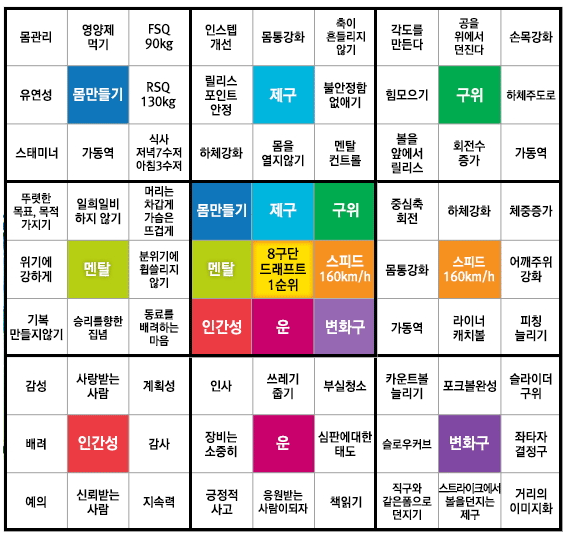
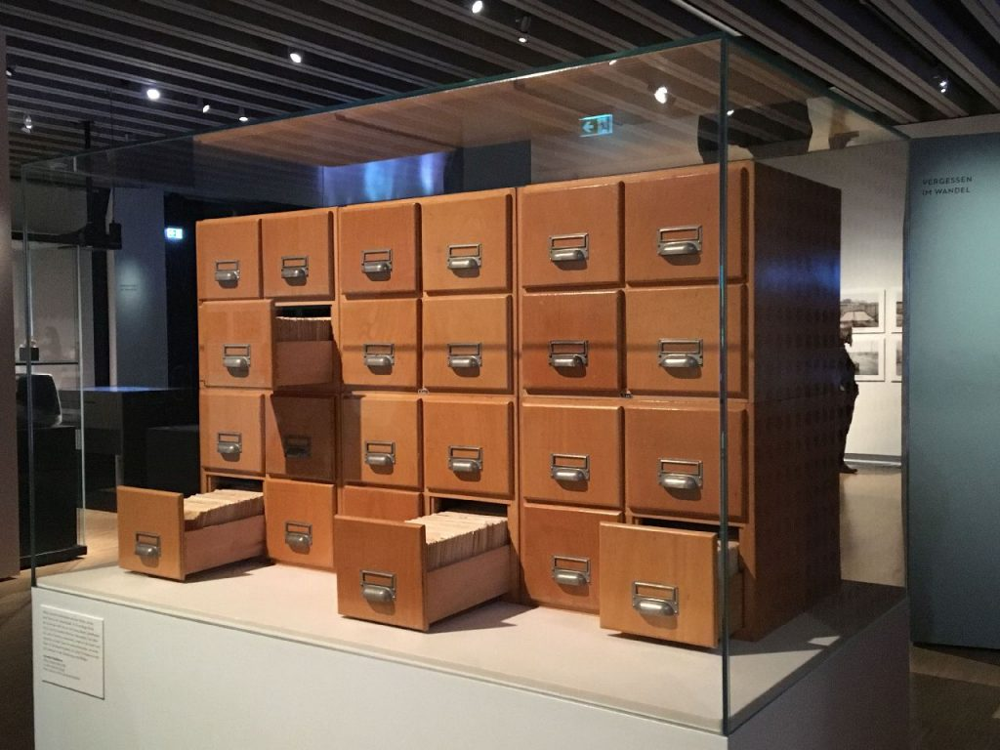

## Balance

균형을 잘 잡는 삶을 인생 철학으로 삼고 가면 되겠다

#### 처음할 때 확실히 봐두고 하면 일을 두번 안해도 된다 vs 처음에 완벽할 수 없으니 빠르게 한번 하고 다시 돌아보는 게 더 좋다

- 한번에 끝내는게 좋은 일이 있고 계속 보면서 살을 붙이는게 좋은 일이 있다
- 똑같은 일을 반복하면 안된다
  vs 같은 일을 반복하면 상기시킬 수 있다(책읽기)
- 작업전에 1분만 준비하던가 이전상황을 기억해내본다

#### 한번 허용하면 계속 반복된다 vs 한번의 예외는 있을 수 있다

- 다이어트할 때 잘 참다가 한 번 거하게 먹으면?

#### 쉬운단어

교육의 가치 vs 몰라도 괜찮아

#### 다른 사람의 말을 듣는 유연 vs 다른 사람의 말에 영향 받지 않는 강한 에고

- 나를 틀에 넣으려는 사람에 대한 반발
- 나에게 새로운 것을 보여주려는 사람에 대한 수용
- 자기 생각만 하는 독불장군
- 자기 생각으로 자유롭게 행동하는 집시
- 자기 생각이 없는 줏대 없는 사람
- 자기 생각보다 다른 사람의 의견을 듣는 깨어있는 사람
- 자신의 생각을 가지고 있지만 다른 사람의 의견에 휘둘리는 경우
- 휘둘림과 오픈마인드 사이

#### 줏대가 없는 것과 다른 사람의 조언을 받아들이는 것의 차이

#### open mind?

다른 사람의 말을 듣고 (상대가 그 분야의 거장이라면)
자신의 의견을 굽히면 그저 다른사람 따라하는 사람이 되고
자신의 의견을 내세우면 편협하고 자기중심적이고 고집이 센 마음이 좁은 사람이 된다
무엇이 옳은지 판단하는 능력을 키워야 한다
자신의 의견을 내세우는 것이 스스로 생각하고 표현하는 것이 될 수도 상대방의 의견을 받아들이는 것을 오픈마인드라고 할 수도 있다

[[Think#다른 의견을 듣는 것]]
[[Think#이상한 글을 안보는 것]]

#### 2in1이 좋을때가 있고 미니멀하게 하나의 기능만 집중되있는게 좋을 때가 있다

#### 써도써도 적응이 안되는 경우 vs 적응이 되는 경우

#### 모두가 쓰는 것에 대해 뻔한 것과 표준으로 퍼져있는 것

#### 형식을 안지킬 때 가치관의 차이

- 어 독특하네? vs 아니 왜 기본을 안지켜?

#### 반목 무관심?

#### 조잡함 vs 조화로움

중복은 싫은데 노트에서는 같은 내용이 여러 곳에 분포해야 리마인드가 된다

#### 공략법을 보는 것과 경험을 통해 하는 것에 대한 결과의 차이

- 레퍼런스를 따르는 쪽이 나쁜게 아니었다.
- 공략법이라 하면 수학 문제집에서 답지를 보고 안푸는 것을 생각했는데,
  수파리에서 수에 해당하는 것이 될 수 있겠다.
  답지를 보는 것은 답만 보고 어떻게 된 건지 생각을 안하는 것이 문제이고, 다음에
  조금 변형된 문제를 만났을 때 대응하지 못하는 문제가 있는데,
  공략법을 보는 것은 그 전반을 빠르게 이해하고 더 나은 방법을 찾게 해주는
  지름길이 될 수 있겠다.

#### simple vs neat

- If there all white, but you have that need yourself it’s white, it’s neat
- 심플함과 휑함의 차이는 어떻게 만들어 내는가
- 가득 찬 곳에서 필요한 것만 남기면 심플함. 아무것도 없는 곳에서 적게 두는 것은
  휑함

#### 확장 vs 개선

작게,제한적으로 만들고 확장하는 방법  
널널하게 만들고 개선하는 방법

#### 공개하는 것이 더 좋은결과가 나올까, 숨기는게 더 좋은결과가 나올까?

#### 섣불리 판단하지 않는 것과 상대방의 마음을 읽어주는 것의 사이

- 합리적 의심
- 상대방이 나의 고통을 알면 힘들까봐 내 고통을 숨기는 것

#### 익숙해지는 것과 지겨워지는 것

#### 적응 vs 능률 상승

- 노트북 마우스
  터치패드 불편?
  없는 것에 적응 vs 있으면 능률 상승
- 그림을 타블렛이 아닌 마우스로 그리는 것은 적응의 영역이 아니다. 사용하는 도구가 달라져서 새로 입문하는 것이다

#### 쓰다보면 좋아지겠지의 허와 실

#### 통제 vs 유도(?)

강력한 법과 처벌을 통해 사건이 일어나는 것을 막는 방법과
의식적으로 사회적 규범을 따르게 하는 방법에 대해
어느 방법으로 유도하는 것이 더 좋은 효과를 만들어 낼 수 있을까
아이에게 휴대폰 사용을 하게 하는 대신 부모가 모든 것을 감시하는 앱을 설치하는 방법과
휴대폰 사용은 무엇이든 할 수 있게 하고 안좋은 것에 대한 주의를 주고 자율적으로 맡기는 방법 중.
감시를 당하게 되면 악영향을 미칠 것이다
vs
너무 자유롭게 두면 정서적으로 악영향을 주는 매체에 노출되게 된다
통제에는 닿지 않는 영역이 있게 되고
교육을 통한(안좋은 경험을 통해서든) 깨달음에는 지속되는 행동이 생긴다
부정청탁방지법으로 ３만원 이상의 선물을 못하게 되었다
이 법이 있기 전에 사과박스로 대표되는 뇌물들이 있었다
부정청탁방지법이 생긴다고 해서 뇌물을 막기보다
뒤로 흐르는 돈을 공개적으로 쓰도록 하는 것이 좋을 수도 있겠다
뇌물은 어떻게든 들어간다고 생각되는데
뇌물을 안 주고 받는 사회문화가 되는 것이 좋겠지만 생각에서나 가능한 얘기인 것 같다
규칙을 강하게 하면 지키던 사람들은 더 강한 규칙을 따르게 되고
안지키던 사람은 어디라도 안지키려고 하는 경향이 있었다
라고 한 프로그래머가 코딩 프로세스를 얘기하면서 얘기하였다

#### 신입에게 페어 프로그래밍을 시켜야 한다 vs 시키면 안된다,

- 코드와 친숙해지는 시간이 단축될 것이다.
  맞춰가는 게 실력이다.
  잘 맞는 페어를 맞춰줄 수 있다
  페어프로그래밍이 그것을 할 수 있다.
- 시키면 안된다, 같이 하는 사람에 맞추려다 아무것도 못한다.
  기존에 아는 범위다 다르고 맞춰주는 것에도 한계가 있다. 시간 낭비다.
  회사 자원 낭비다
  교육과 적응기간이면 충분하다

#### 칭찬은 사람을 그에 맞는 행동을 하게 해준다

근데 우쭈쭈 해주면 버르장머리가 없어진다

#### 상충하는 가치

둘 중에 하나를 포기하고 하나라도 확실한 것을 선택하느냐
조금 양보하고 두 가치를 적당히 버무린 것을 선택하느냐

상황에 따라 다르겠다
양보한 가치가 두고두고 아쉬울 수도
두 가치가 적당히 괜찮은 조건인 것이 있을 수도

#### 스탭바이스탭이 적용되는 곳과 아닌 곳

전쟁 게임을 하다가 실제 총질한다? 비현실적
취미로 토토를 하다가 크게 건다?
바늘 도둑이 소 도둑된다?
일기 쓰다가 소설가된다?

#### 일단 시작하는 것 vs 가볍게 밑그림을 그리고 하는 것

두가지를 어떻게 동시에 할 수 있을까
일단 시작하는 것, 작은 것부터 시작하는 것, 5분 안에 할 수 있는 것으로 시작하는 것
vs
가볍게 밑그림을 그리고 하는 것. 전체적인 부분을 한 번 그리고 하는 것

#### 눈에 보이는 것이 주류를 대표하는 것 vs 눈에 안보이는 것이 주류인 것

주변에 일어나는 일이 주류인 것
주변에 일어나는 일이 특이 케이스인 것

#### 적극적으로 들이대는 사람을 싫어할 사람

귀찮게 하는 것 vs 잘 챙겨주는 것

#### 피고를 활자로만 보는 판사, 그러자 않기 위해 싸우는 판사가 있을 때

나를 활자로만 보지 말라고 하면?
나를 활자로 안보기 위해 노력해줘서 고맙다고 하면?

#### 창작의 자유, 표현의 자유 vs 독자와의 커뮤니케이션, Feedback의 범위

#### 문제를 회피하는것

문제를 일으키지 않고 넘기는 것
문제를 일으키고 모르는 척 하는 것
문제를 일으키고 잘 넘어가는 것

#### 상투적인 것과 의례 하던 것 vs 관성있는 것, 표준적인 것, 익숙한 것

매너와 과거의 관행의 차이

#### 창작물에서 느껴지는 사람과 만났을 때 느껴지는 사람이 다른 느낌이 있다

나만 알기 아까운 vs 나만 알고 싶은

---

## Life

#### 시어머니질

학교에 애를 보내면 부모님이 애가 걱정되서 선생님의 정보를 캐고 일일이 간섭하는 것을 보고 참 별로다 생각했는데
이상한 생각을 가진 초등학교 교사의 존재를 알게 되면 혹시나 하는 마음에 선생님의 정보를 확인하려고 할 것 같다는 생각이 든다.

- 방송이나 만화 등 피드백이 되는 컨텐츠에서 등장인물이 물의를 일으키거나,
  좋아하던 인물이 죽는 등 스토리가 충격적으로 느껴지면, 크게 여론이 형성되어
  제작자에게 영향이 가게 된다.
  피드백을 어디까지 받아들이고, 어떻게 받아들여야 할까.

#### 외계인은 존재할까?

내가 생각하던 것들의 대부분은 이미 다른 사람이 생각했던 것들이다
세상 곳곳에는 추악한 짓과 지구를 망치고 있는 행동들이 계속되고 있는데 우리는 일상생활을 할 때 그것에 개의치 않는다
심각한 문제라는 것을 알지만 그것에 신경을 많이 안쓰게 된다
외계인이 있다고 생각하는 이유는 우리의 존재가 있기에 다른 곳에도 없을 것이라고 말하는 것은 증명되지 않기 때문이다
이것은 설비에서 에러가 한번 발생하면 그것은 그 순간만 생기는 문제가 아니라 분명히 근본 원인이 있기 때문에 근본원인을 해결하지 않으면 그 에러는 계속 발생한다는 현상과 비슷한 것 같다
우주에 우리라는 생명체가 생기는 근본 원인이 있기에 이것이 지구에만 특별히 생겨나는 것이 아니라 우주 어딘가에는 또 이런 생명체를 만드는 일이 일어날 수 있는 것이다

#### 주 40시간 근무

생산성 높은 업무시간은 많게는 5시간 정도라고 현실적으로 생각할 수 있다
그렇다면 주당 40시간을 근무하도록 해도 원하는 생산량을 얻을 수 있다
같은 시간 일을 해도 더 성과가 좋은사람이 있을 수 있는데
이 사람을 일을 더 시키면 업무진행도는 오를 수 있겠지만 그 사람에게도 조듬씩 악영향을 미치게 된다
하지만 고용주 입장에서는 결과물이 더 잘나오면 몇시간 일을 하든 시켜먹으려고 할 것이다
그렇다면 사회적으로 임금이 높아져서 무한정 직원을 이용할 수 없게 하면 고용주 입장에서는 생산성을 높일 방법을 찾게 된다
실제로 구글 같은 직장을 보면 각 인원의 임금이 높기 때문에 잔업을 장려하지 않는다 오히려 하지 말라고 한다
그럼에도 직원들은 집중도 있게 근무를 하게 되면서 성과도 오르게 된다
반면 직원들의 임금이 낮고 근로시간이 긴 상황에서는 (여기서도 고용주는 생산성을 높일 방법을 늘 구상한다)
일의 효율이 떨어지게 된다
여기서 업무의 능숙도와 효율성이 크게 필요없이 시간에 따라 효율이 나오게 되는 일에 대해서도 생각해봐야 한다(청소업무,생산직)
이는 별개로 놔두고 고객에게 납품하는 제품을 만드는 업무를 중심으로 생각해보면
고객이 원하는 납기기한이 있을 것이고
이는 회사에서 생각하는 시간보다 촉박하게 설정될 것이다
그래서 일반적으로 근무했을 때 80%의 결과물이 나올 것으로 예측되면 20%를 위해서는 추가근무를 해야 하게 된다
여기서 80%가 만들어지게 되는 상황을 생각해보면 직원들은 분명 최선을 다해서 업무를 진행했을 것이다
하지만 20%를 더 완성해야 하며, 이는 추가근무를 하게 만든다
이렇게 보면 분명 임금이 올라도 납기시간을 맞추기 위해서는 반드시 초과근무를 하게 될 수 밖에 없기 때문에 임금은 큰 영향이 없다고 볼 수 있다
다시 조엘의 글을 생각해보면
'일반적인 직원들의 생산성 높은 근무 시간은 2시간 정도에 불과하다. 이는 초과근무를 하더라도 늘지 않는다. 그러므로 초과근무는 의미가 없다'
라는 얘기인 것 같다
다시 돌아와서 초과근무를 해서 100%를 달성한 직원들은 사실은 초과근무를 하지 않아도 달성할 수 있었다고 생각할 수 있는데,
이 상황에 대해 조금 더 생각이 필요하다...

#### 기본소득

기본소득을 생각할 때 걱정하는 부분이 일은 안하고 편하게 놀면서 국가에서 주는 돈만 받고 살아가는 사람들에게 내 세금이 들어가는 게 아깝다고 생각되는 부분이다
기본소득이 있음으로써 예술가들이 자신의 활동을 조금이라도 제약없이 펼칠 수 있게 되지 않을까
노동의 가치가 줄어드는 상황에서 사람이 미래를 준비하는 데 이용할 수 있는 것이 되지 않을까

#### 페미니즘

여성인권 신장에 동의하고 응원했었으나
그게 20 30대 남자에게 역차별로 돌아오게 된 반발감.
과도한 페미니즘 남발에 대한 반발감이 있다.

여자라서 당한 사회적 차별이 있다는 것을 알기에 페미니즘 운동을 응원했으나
오히려 나도 자랄때는 남자라서 차별을 받으며 자랐소
차별을 한 세대인 기성세대에 페미니즘이 영향력을 일으킬수록 청년세대 남자들이 피해를 받는 상황이 생기게 되어 응원만 할 수는 없고,
책이나 매체에서는 여자들이 그동안 너무 피해를 봤다며 과도하게 언급하면서 거부감이 든다

이는 정치적올바름이 과도하게 이루어지는 것에 대한 반발과도 결이 비슷한 것 같으며

공정성에 대한 요구인 것일 따름이지 않은가 싶다.

#### 게임의 중독성과 위험성

보드게임
닌텐도 게임류
젤다의 숨결
엔딩이 있는 플스류
온라인 게임
엔딩이 있다고 중독이 안생기지는 않는다
다른 게임을 계속 찾을 수도 있고 한 게임을 완전공략할 수도 있다
중독은 관리하기 나름인가
게임은 건전한 취미다
돈이 심하게 들지도 않고 집에서 할 수 있고 새로운 경험을 할 수 있고 성취감을 느낄 수 있고 기분전환이 가능하다
나는 중독되었었다
학교시간을 제외한 시간은 전부 컴퓨터를 하는 시간이었다
게임이 재미없으면 다른 게임을 계속 찾았고 인터넷에 돌아다니기도 했다
그러고보니 게임이 아니라 인터넷에 중독되었었나보다

#### 게임과 폭력성

성인물과 성폭력의 상관성
관련이 큰 것 같지만 상관관계가 인과관계를 의미하는 것은 아니라는 것의 예시인 것 같다
게임이 자체적으로 폭력성을 내포하고 있기 때문에 게임을 하면 폭력성이 높아진다고 생각할 수 있지만 대부분의 게임을 하는 사람이 실제로 폭력적인 것은 아니다.
영향을 미칠 수는 있지만 원인은 아니다.

#### 게임 공략

공략이라는게 있어서 처음하는 방식과 공략을 보고 하는 게임은 플레이가 전혀 달라진다
게임을 반복하면서 공략이 생기게 되는 건데
게임이라는게 반복적인 작업이 많은데
반복을 재밌게 할 수 있게 되기도 한다

- 참고: 풍훤, 임기응변,

#### 듀랑고는 과금정책을 줄이고 컨텐츠에 집중하는 이상향을 꿈꿨지만 유저들은

게임이 망한 후 재미없다고 한다. 서버문제와 노가다식의 게임진행방식이 문제가 있었고 리니지는 과금으로 욕먹지만 잘나가고 있다
온라인게임에서는 모두를 위한 평등한 게임은 모두를 만족시킬 수 없는 환상에 불과한 것일까
https://m.fmkorea.com/best/2991103061

#### 닌텐도 게임은 버그가 없나?

예전 콘솔게임은 업데이트도 안되는데 버그를 어떻게 잡았나?

- 버그가 없지 않다
- 하지만 이 버그를 이용해 게임 매니아들이 또 다른 컨텐츠로 이용한다.

#### 공과 과

누구나 과오가 있기 마련인데
공인에게 과의 책임을 언제까지 물려야 하는가
판단은 어차피 개인의 몫이지만 한번 밉보이면 사소하더라도 그 사람을 영영
안볼것처럼 하기도 하고 큰 잘못을 저질러도 잘 지낼 수도 있다. 꼬투리 하나 잡아서
그 사람을 매도하는 것도 보기 안좋고 그렇다고 잘못이 있는데 잘 활동하는게 눈에
띄면 괘씸하게 느껴질 때도 있다. 각자의 방식으로 잘못에 대한 자숙을 하고 나오는
연예인들에게는 자숙 이후의 활동은 관대하게 보는게 맞을까
청문회를 보면 일생이 한순간에 까발려지는데 과가 없는 사람은 찾기가 힘들다. 어느
선에서 신경을 쓰고 안쓸지 헷갈린다. 사람들을 기만하는 잘못을 저지른 사람은
실제로 법을 위반하지 않았지만 기분을 안좋게 하고, 선거법을 위반한 사람은 법을
위반했지만 기분이 나빠지지는 않는다.
친구 사이나 연인 사이에서도 마음에 안드는 부분이 상당히 생길 수 있는데
웬만해서는 관계가 이어져 나간다

#### 불편러와 불편함을 제기하는 것의 선

서비스 장애
굳이 안써도 되는 말이긴 함
서비스 고장이라고 해도 되고 이상 발생이라고 해도 되고
근데 기존에 통용되던 말이긴 함
문제를 문제삼고 문제를 제기하면 사람들이 기존에 잘 써오던 걸 왜 지적하냐고 한다
과한 문제제기라고 생각이 들 때가 있다
전후사정을 고려 안하고 단어에만 집중해서 괜히 그러는 거라고 생각이 들기도 한다
문맥을 안보고 너무 지엽적으로 해석한다고 할 수도 있다
불만을 제기하는 쪽에서 설득력을 가져야 얘기가 전개될 수 있겠다

#### 불편함과 검열

롤리타
아이유 뮤비 논란
베스킨라빈스 논란
기안84 복학왕
귀귀
방송에서 불편한 장면이 나오면 짜르는 경우

창작의 자유, 표현의 자유

사회적으로 비판받는 것이 창작물에 나올 때 그것이 사람들에게 은연 중에 영향을 미치기 때문에
또는 그 내용이 그것을 옹호하고 지지하는 것이라 생각하기 때문에 불편하게 느낀다
아무 의미도 없이 무의식적으로 그렸다고하면 더 욕을 먹는다

불편함을 느낀 사람들을 배려하는 차원에서 조심하려는 마음을 가질 수 있고 좋은 현상이지만 그 마음을 안가진다고 욕할 수는 없고,

불편한 장면을 안만들기 위해 창작물에 영향이 간다면 창작의 자유를 침해하고 다양성이 사라지고 새로운게 생겨날 수 없는 사회가 될 수 있다는 우려가 생기기는 한다.

불편함을 이야기하는 측도 이해가 된다. 장애인을 차별하는 것을 자랑스럽게 여기는 식의 장면은 표현이 안되는 것처럼 어떤 영역이 불편함을 느낀다는 것이 널리 퍼진다면 자연스럽게 배제된다는 것인데 과도기는 늘 힘든 것이기 때문에 새로운 불편함은 늘 저항을 받는다.

불편함을 불편하게 느끼는 사람도 자신에게 공감되는 불편함은 잘 받아들일 수도 있다

관점의 차이에 따른 영역이 되었는데
극단적으로 세상이 따분해지더라도 불편한 사람이 생겨서는 안된다와 창작을 위해서는 누군가는 불편해질 수 있다의 사이에서 창작자들의 고민과 고통이 있겠다 싶다

이와는 다른 얘기지만 소통과 참견이 비슷한 구도를 띄는 것 같다
전 정권에서 사람들이 정부에 얘기할 통로가 없다고 이번 정권에서 국민청원게시판이 생겼는데 수많은 청원이 올라오고 각각의 입맛에 다 맞추려다 보니 또 불만이 터져나온다

불통도 문제고, 모든 사람의 입맛을 다 맞추려는 것도 문제
문제라고 하기에는 표현이 이상한데 현실성이 없는 것을 쫒는 것도 문제가 있다. 정말 표현이 이상하다. 어렵다.

작은 이야기를 듣는 것은 중요한 일이지만 정말 어렵다.
판단은 누가 할 수 있는 것일까

변화하는 방향으로 나아가는 것은 언제나 환영하고 싶지만 불편함에서 시작해서 그 불편함을 없애는 변화보다는 기존의 것을 조금 다른 방향으로 바꾸는 변화를 더 많이 접했으면 좋겠다.

#### 범법을 저지른 후 사회의 대처, 사람을 속인 것에 대한 대처

일제 시대 친일파에 대한 사회의 대처
스티브 유 사례
신정환과 김구라
유영철과 사형수
중범죄
경범죄
속임수
도의적 잘못
기회주의
반역
친일파
실수
과거에는 그렇게 생각했는데 지금은 다르게 생각하는 경우
약물을 한 운동 선수가 사죄 후 다시 활동하는 것
운동선수의 약물
과거의 성추문
추축국
일본의 원폭 피해 호소
잘나갈때 무시하고 이제와서 미안하다고 하는 것
운동선수가 팬서비스 안하고 은퇴한 후 미안하다 하는 것
기업의 탈세, 갑질 후 이미지쇄신은 잘못을 인정하는 것인가

잘못을 인정하고 사과하는 것은 멋지다
사과하면 그만이라는 생각은 안된다

#### 교도소가 교화를 제대로 못한다

법을 어겨도 감옥에 잠깐 살다오면 끝난다
감옥 갔다오면 또 다시 범죄를 저지른다
범죄자들에 피해자들만 고통을 느낀다
법에서는 가중처벌이 있다

전과자는 처벌이 더 쌔게 한것을 보면 법 체계는 잘 되있는 거 같기도 하고

#### 인터넷 실명제

개인정보 유출
표현의 자유 침해
가입 시 일일이 인증해야 하는 번거로움
동명이인, 도용 문제
실명 내놓는 기자들 중에도 무분별한 쓰레기 기사를 내놓는 등 실명화의 실효성 없음
vs
악플의 책임
건전한 인터넷 문화

인터넷과 실제 세상은 구별되는 것인가
실제 세상에서는 익명화가 가능한가

포털사이트의 댓글창 폐지. 이것이 진정한 표현의 자유 침해가 아닌가?

#### 반일 불매 운동을 놓고

- 외부세력에 대항해야 하는데 국민의 분열이 문제다 또는 국가적인 파시즘이 아니냐

마찬가지로

- 화웨이가 세계시장에서 외면받게 될까
- 삼성이 주요소재를 구하지 못해 세계의 신뢰를 잃게 돼 외면받게 될까
  화웨이는 자체적인 보안문제에 더불어 미국의 정치적인 제재가 추가됨
  삼성은 외부적인 정치문제, 해결가능?
  소비자는 좋은 제품을 찾으려고 한다

#### 표현의 자유

기레기들이 사실 확인 없이 기사를 써대는 것은 문제.
그러나 기사를 쓸 때 제한을 가하게 된다면 언론 보도가 위축되어 알 권리를 잃게 된다는 것이 여기에도 적용이 된다

언론 통제는 어떤 방식으로든 안되는 것이다.
그러나 저 문제는 분명한 문제이므로 막 써대는 기사는 없도록 제한이 되었으면 하는데, 참 어렵다

#### 지금 목소리를 내지 않으면 당신이 필요할 때 아무도 목소리를 내주지 않는다는 이야기

당신의 의견에는 동의하지 않지만 당신이 이야기를 막는 사회는 있어서는 안된다는 이야기
예시로
민주화운동을 했던 사람들
표현의 자유를 위해 목숨을 바친 사람들

그리고 지금의 여러 사태에서도 쓰이는데, 합리적인가

#### 도서정가제 하는이유 반발하는 이유

하는이유
할인을 할 힘이 있는 대형유통사 때문에 지역서점이 망할 수 밖에 없다
가격할인 경쟁으로 이어지면 창작자가 피해를 보게 된다

반발하는 이유
시행 후 지역서점이 살아났느냐? 아니다
지금을 보면 전체적인 판매량은 감소하고 책 값은 상승했다
책을 많이 보지 않는 현실과 함께
책이 팔리지 않음으로써 인쇄를 적게 하고 그럼으로써 단가가 상승하게 되었다

자본주의 시장에서 지역서점이 경쟁력을 갖추지 못하면 도태되는 것인가
대기업의 경쟁력을 지역서점을 이길 수 없는 한계가 있는 것인가

대형·온라인 서점이 도서 매입가는 정가의 50~65% 수준이지만, 중·소형 서점은 이를 70~75%에 매입한다

작가들은 도서정가제를 응원하는 쪽

> “내 첫 번째 정체성은 작가가 아니라 독자다. 도서정가제 없는 세계를 겪어봤기에 당시로 돌아가는 게 무섭다”면서 “도서정가제가 없었던 때는 베스트셀러 순위에 느닷없이 그날 많이 할인된 책들이 올라가기도 하고 생태계가 완전히 붕괴됐다. 출판사는 신작을 내는 데 부담을 겪고 그렇게 다들 몸을 사리다 보니까 젊은 작가들, 뭔가 다른 것을 말하고 싶은 출판인들이 설 땅이 점점 좁아졌다”고 돌이켰다. “다 무너지고 있다고 생각될 때 도입된 게 도서정가제”라며 “그 제도를 만들어놓으니까 신기하게도 1인 출판, 모험적인 책들, 대안적 목소리들, 작가들, 서점들이 자발적으로 살아났다. 지금 정부는 시민의 자발성에 빚지고 있는데, 자라날 수 있는 씨앗이 좀 더 길게 자라도록 해야 한다”고 강조했다.
>
> > 도서정가제에 대한 한강 작가의 입장

#### 메시와 보드진. 구단의 영역에 대한 과도한 침범 vs 정당한 불만 표출

바르셀로나의 보드진은 몇년마다 투표를 통해 선출된다
지금 선출된 보드진은 결과를 안좋게 보여줬고 감독은 계속 교체되었다.
심지어 팀내 프랜차이즈 스타가 보드진에 불만을 품고 이적을 요청하기에 이르렀다
감독은 계속 바뀌고 선수단도 안정적으로 꾸리지 못한(아르투르를 피아니치와 스왑딜을 한 것에 팬들의 불만) 보드진이 현재 상태에 대한 책임을 왜 지지 않는 것일까
보드진의 삽질이 없었다면 메시라는 선수 한 명이 구단을 좌지우지하는 상황이 구단을 운영하는 보드진에게 영향을 끼칠 수 없다는 반론이 재기될 수도 있겠으나 지금까지 보드진은 과도한 보호막 안에 있었다는 생각이 훨씬 크다

#### 자기 자랑 vs 자기 PR

수치심

말 안하기의 장단점

천천히 시작하기의 장단점
시간이 없어서 단번에 하려고 하면 일이 잘 안된다
천천히 하나씩 시작하면 토끼와 거북이처럼 결과가 더 나아진다
관건은 처음 시작할 때 하는 양을 늘리는 것? 다시 한번에 하려는 것처럼 되버릴 수도 있다

몸을 사리는 것
말을 아껴서 다른 사람이 나에 대해 말하는 것을 막기
말을 해서 다른 사람이 내 이야기를 다른 사람에게 하는 것
나를 낮추었더니 다른 사람이 나를 깎아 내리는 경우
말을 해서 내가 다른 사람과 연결 되는 것

#### 차례차례 vs 덧칠

하나씩 끝내면 다음으로 넘어가는 방법보다 덧칠하는 방법이 좋다
근데 밑의 단계가 안되면 그 다음 단계로 못 가는 경우도 있다

#### 용두사미

처음에 크게 준비했다가 점점 뒤로 갈수록 정성이 떨어지는게 있고
처음에 조잡했다가(정성을 들였지만) 갈수록 다듬어지는게 있다

#### 우뇌형, 좌뇌형

https://see-wind.tistory.com/m/577

우뇌는 전체적인 그림을 보고
좌뇌는 세부적인 것을 본다는 의견

우뇌, 좌뇌의 구분이 꼭 맞지 않더라도 이렇게 명확하게 구분지어서 스위칭을
해야한다는 의견은 명료해서 받아들이기 좋은 것 같다

---

## 다양성, variety

if somewhere has many choices of the store, people want to go there.
if the store has many choices of contents, I want to go there.

#### 다양성이 중요한 이유

규칙과 충성심의 시대에서 자율과 능력, 다양성, 창의성의 시대로 변하고 있는 것 같다.

완벽한 이론은 없기에 다른 의견이 생기고, 그 의견으로 인해 기존의 이론도 개선된다.
다른 의견을 마음에 안든다고 배척하면 그 이론은 발전할 수 없고, 빈틈은 메워질 수 없다. 그래서 의견은 수용되어야 하고 그것이 자연스러워야 한다.
제약 없이 다른 의견을 제시할 수 있는 분위기가 더 좋은 아이디어를 만드는 것이다.

경직돼있는 회사에서는 생각도 갇힌다는 것의 반례이기 때문

#### 개인으로서 생계를 유지하는 것은 가능하다. 하지만 내가 하지 못하는 것을 할 수 있는 다른 사람과 공유를 한다면 더 나은, 더 편한 삶을 살 수 있다.

인간은 사회와 더불어 살면서 내가 굳이 요리, 과학, 생산을 하지 않더라도 그것의 혜택을 누릴 수 있다.
그래서 인간은 사회적으로 살게 되고, 사회적으로 살아 가는데 있어서 개개인은 모두 생각이 다르기 때문에 서로를 지킬 수 있는 규칙을 만들게 되었고, 이는 법 뿐만 아니라 관습, 도덕이라는 추상적인 가치가 나타났다.
그러나 모든 사람은 각자의 내면, 가치가 다르기 때문에 예외 상황이 생기게 되고, 각자의 인생에 비추어 세상을 바라보기도 하고 인간은 모든 정보를 그대로 기억할만큼 똑똑하지 않아서 자신에게 맞춰 효율적으로 기억하며, 때로는 직관적 사고를 하게 되어 비합리적인 선택을 하는 경우도 많다. 객관적으로 한 걸음 떨어져서 세상을 보는 것은 어려운 것이고, 꼭 그렇게 해야 하는 것도 아니다.
하지만 반 사회적 인간은 어떻게 대해야 할까

내로남불은 자연스럽다
현재의 감정에 휩쓸리면 머리로는 불륜은 나쁘다라고 생각하지만 마음은 이미 끌림에 넘어가있기 때문에 그 끌림을 떨쳐내기는 힘들다
현재의 감정보다 이성을 택하는 것은 매우 고통스러울 것이고 떨쳐내기에는 너무 매력적일 것이다
그렇기에 더욱 조심해야한다
지금 끌리는 것만 좇기보다 기존의 삶을 더 소중히 여기고 살면 좋겠다

## 권위의식을 가지고 있으면 내가 체면을 구기는 상황이 생기게 되면 이성적으로 판단 하지 못하고 시야가 좁아진다

잃을 것을 걱정하게 되면 내가 할 수 있는 종류가 제한된다.
나를 낮춰서 내가 어디로든 움직일 수 있게 하면 좋겠다

일본장교가 부하의 작전지적을 받아들이지 못해서 그 지적이 타당했음에도 그에 대한 대비를 하지 않아서 전투에서 지게 된다.

#### 권위, 소유욕

가진 것이 있으면 잃지 않기 위해 자유가 제한된다
정보를 가지고 싶은 것은 소유욕인가? 지적 호기심인가?
현실적으로 돈이 어느정도 있어야 생각할 자유가 생긴다
무소유가 진리가 아니라 적당히 가지는게 삶의 자유를 더 갖는 것이다
잃어도 되고, 나를 옭아매지 않는 정도로 가지면 되겠다

## 모르는 것을 들키지 않으려고 멍청해보일까봐 가만히 있는 것은

권위를 잃지 않으려고 생각의 폭을 제한하는 것과 마찬가지다

## 모르는 것을 알아야 더 많은 것을 알 수 있다.

경제학에서 고전주의에서는 세상을 확실성이 있는 것이라 봤는데 그 이후 만들어진 이론인 케인즈학파 등에서는 세상을 불확실성이 높고 복잡하다고 한다.
과거에는 다 안다고 생각했던 것들이 더 많은 것을 알고 난 다음에는 몰랐었음을 알게 된다.

#### 모으기보다 나누기

수집하고 아끼는 것도 좋지만 나눠주고 적게 가지는 것도 가치있다. 내 것을 아끼려고
하면 옹졸해진다. 베푸려고 하면 내가 커진다.

## think of my own that write in the note is just own me. it can be wrong.

so, I need to communicate with people and check my think.

[[Reference#쉬운 것부터 해야한다]]

## 한 사건을 보고 뒤에 일어날 일에 대해 염려하는 것

vs 딱 그 상황만 고려하는 것

다음에 비슷한 사건이 일어났을 때 이전의 상황에 비추어 보는 것
vs
각각의 상황을 새로운 시각으로 보는 것

한 사건을 보고 앞으로도 이런 일이 일어나면 어떻게 하냐고 초기에 싹을 잘라야 한다고 하는 상황이 있고

비슷한 상황이 나올 수 있지만 그 사건은 그 때 가서 다시 평가하면 되는 상황이 있다

법은 판례를 잘 참고한다
vs
각각의 상황은 여러 변수가 있어서 일반화 하면 안되는 경우

바늘도둑이 소도둑된다
vs
사람은 반면교사, 절치부심, 타산지석을 할 수 있다

구멍 뚫린 항아리에 물 담기
vs
점진적 개선

## 모르는 걸 모른다고 말하는 용기 vs 모른다고 하고 떠넘기는 것

모르는 걸 같이 알아가자고 항상 얘기할 수는 없을 것 같은데
물어봤을 때 떠넘기려는 것처럼 안느껴졌으면 좋겠다

## 분류를 하는 것이 좋은가 안하는 것이 좋은가

축구에서 공격수, 수비수, 미드필더를 나누었었고,
그 후 토탈사커가 유행하며 역할은 나눠져있지만 활동범위가 늘어났고
그 후 미드필더 안에서도 선수별로 세부적으로 역할을 나눴었다가,
그 역할마저 선수가 고정된 역할이 아니라 경기마다 역할을 왔다갔다 하기에 이른다

확장과 축소가 반복되고, 크게 보면 오히려 자연스럽게까지 보인다

## 언제봐도 좋은것과 보다 보면 질리는 것의 차이

## 치밀하게 짜여진 영화, 책

그렇지 않은 영화, 책
큰 흐름만 정해놓고 맞춰가며 찍기

## 효율과 욕심 사이에서 잘 서야겠다

소유하려고 하면 욕심이 생기고 묶이게 되고
시야가 좁아지고 속이 좁아진다

## 새로운 것이 일반화 되는 것

새로 나온 것 중에는 사라지는 것도 있고, 일반화가 되는 경우도 있다
일반화가 될 새 것을 기존 사람들이 저게 될리가 있나 이럴 때도 있고
사라지게 될 새 것을 기존 사람들이 저건 완전 최고야 이럴 때도 있다

## 전문화 고도화 vs 통합, 융합

세상이 복잡해짐으로써 전문화되고 고도화 된 분리가 필요한가?
분리는 자연스러운가?

분리 이후 융합하는 사이클이 자연스러운가
[[Think#문과 이과]]

#### 고도화

세분화돼서 한 분야에 집중할 수 있으면
그 분야에 대한 컨텍스트가 많이 쌓여서 고도화가 된다

## 간단 vs 복잡

한 눈에 보기 편하게 하는 것
주변을 필요한 것만 딱 놔두는 것
간단하게 요약하는 것
주변에 자주쓰는걸 놔둬서 바로 쓰는 것
어디에 뭐가 있는지 정리해놔서 바로 쓰는 것

복잡함은 현실에 존재하니까 복잡한 구조에 익숙해 지는 것
계층적 구조를 이해하는 것
깊은 단계를 생각하는 것
두 수 앞을 내다보는 것

물건의 개수를 줄여서 찾기 쉽게 하는 것
많은 개수 중에서 쉽게 찾는 것

자주 쓰는 것들은 접근 단계를 줄여야 한다
메뉴 - 선택 - 선택
이런식이면 안된다
주머니 안에 지갑 안에 뭔가를 넣으면 접근성이 떨어진다

#### 3단계 중첩

노트를 2단계 중첩으로 쓰고 소스코드 폴더 구조도 2단계로 하려고 했다.
근데 고 스탠다드 레이아웃이 3단계로 되있는 것을 보고 확장할 필요가 있겠다 싶다
생각의 깊이도 2단계로 제한하던 것을 3단계로 해야 더 깊은 생각이 되지 않을까 하는
걱정과 기대가 있고, 고려해봐야겠다.

#### 쉽게 하는 것

쉬운 것으로 현혹하는 우민정책과 쉽게 접근 가능하게 하는게 한끗차이같다

## 깊이 넓이

데브옵스는 개발팀들 간의 통합과 협업을 잘하자는 의미로 나왔다.
넓이를 넓히자는 것으로 받아들일 수 있는데 백엔드 엔지니어에게 운영도 하라고
맡기는 업무의 확장으로 느껴지면 거부감이 드는 것이 당연하다. 넓이를 넓히는
것도 힘들다는 것인데, 넓이와 깊이를 어느 정도로 조절해야 효과적일까

도구를 쓰기 위해서는 사용 방법을 알아야 한다
사용방법은 메뉴얼을 통해 순간 순간 필요한 것을 알아낼 수 있는 경우도 있지만

복잡한 도구는 전체적인 그림이 그려져야 하고 공부도 해야한다
복잡한 도구를 직관적으로 익히려면 어떻게 해야 할까

자료는 인터넷에 다 있으니까 누구나 전문가가 되기 쉽겠다 생각했는데,
프로그래밍 언어 하나도 전부 파악하기 힘든데 프로그래밍 분야를 문서 몇 개만 읽고 알기는 더 힘들다는걸 깨달았다
자료를 잘 정리하고 세부적으로 파고들면 되겠다 생각했는데 장고 프레임워크 하나조차 제대로 정리하려니 규모가 너무 커서 압도된다.
하물며 한 분야는 더욱 막막하지 않을까

깊은 지식, 깊은 이해는
복잡성이 아니라 명백함이다
복잡하게 마무리되는게 깊은 지식이 아니라 명료하고 직관적이게 마무리 되는 것이
깊은 지식이다

초보자적 단순함과 전문가의 단순함의 차이가 무엇일까

프로그래밍의 구루들조차 좋은 코드는 복잡한 코드가 아니라고 한다

전문적인 분야를 파는게 더 나은 능력과 결과가 만들어진다
관심도를 좁혀 그곳에만 집중할 수 있고, 넓은 곳을 모두 채우는 것보다 좁은 곳을 채우는 게 쉽다.
근데 넓은 분야를 파고 싶은 마음도 놓지 않고 관심을 가져야겠다

석사 박사영역에서는 아주 세부적인 분야를 깊게 공부한다
국과수는 각 장비 및 인력이 특정 전문가로 분리되어있다

폴리글랏 프로그래밍
누군가는 한 언어에 대해서도 제대로 모르면서 다른 언어를 얕게 안다고 별로라고 한다

세분화되어야 더 자세히 들여다 볼 수 있고 그 속에서 다시 넓게 연결된다
깊이가 없으면 넓어지지 않는다
어떤 사람도 세상의 모든 부분을 알 수 없다

데브옵스는 다시 개발자들이 서로 협업하고 통합하는 환경을 조성하려는 문화다

차근차근 해야하는게 있고
여러 단계를 왔다갔다해야 하는 경우가 있다

기능 개발은 커밋 시에 알아보기 쉽게하기 위해 한 기능씩 개발하고
전체 소프트웨어는 설계, 구현, 평가를 계속 왔다갔다 하며 해야 한다
예전에는 소프트웨어도 단계별로 하려고 했으나(워터풀) 짧은 주기로 전체를 반복하는(애자일) 방식이 더 나은 소프트웨어를 만들 수 있는 방법이 된 것 같다

## 적당히 가져야 한다. 무소유와 소유욕 사이

## 융통성과 기회주의, 철새, 이럴때는 이랬다가 저럴때는 저랬다가

## 온고지신과 꼰대

옛 것의 좋은 것을 잘 받아들이는 것과 옛 것에 생각이 갇혀 변화하지 못하는 것

[[About_Development#VS]]

## 일관성과 규율의 경계

## 과도한 우려

실제로 일어날 가능성은 적지만 일어날 수도 있는 것을 걱정하며 불안해 하는 것
조심하고 비상상황을 대비하는 것은 좋지만 불안 속에서 사는 것은 좋지 않다
그런데 주변에서는 자주 일어나는 일이라면 불안할 수 밖에 없다
불안을 없애려면 어떻게 해야 할까
과도한지 안 과도한지는 어떻게 판단할까

## 룰의 빈틈

룰의 빈틈을 파고드는 사람은 영리한 것인가 비겁한 것인가
편법을 쓰는 사람은 비겁하다고 하지만 그 사람은 아무런 책임을 물지 않는다
그래서 이용할 수 있는 것은 이용해야 한다는 생각들이 깔려있다
편법과 법이 허용하는 부분의 차이가 명확하지 않다

#### 조심스러운 생성 vs 무작정 생성 후 정리

이것 저것 따져보고 도입하는 것은 속도가 늦고 동력이 딸릴 수 있다.
무작정 생성 후 정리하는 것은 정리하는 리소스가 필요하다.
고르고 골라서 최소한의 것만 유지하려고 할 때도 있고, 일단 리소스를 모아두고
정리하는 방식을 선호할 때도 있다.

#### 정부가 무난하게 성적을 내면, 투명성을 요구하게 되고,

투명성은 다시 성적을 낮추고, 다시 숨긴채 일이나 잘하라고 한다

테러감시라는 명목하에 감시를 하게 된다

주요인물을 조사하면 그 관련된 사람을 조사하고 다시 또 관련된 사람을 조사하면 수가 엄청나다
그 사람들은 찾기 전에는 그냥 모래였지만 찾겠다는 의도가 생기면 검색망에 걸리게된다

#### 함축적으로 담는 것과, 구체적으로 뚜렷하게 표현하는 것

둘 다 가치있다

한자나 시처럼 함축적으로 담을 수 있는 것이 매력적일 때가 있고, 소설처럼 뚜렷한
그림이 그려지는 것이 매력적일 때도 있다

#### 글로벌 스탠다드와 자가구축

조선시대 때 상평통보를 안쓰고 중국화폐를 안 쓴 지혜
한글을 만든 세종대왕의 확신
갈라파고스화
일본의 독특한 pc와 휴대폰

휴대폰 충전 케이블이 usb c로 통일된 것
웹이 http 통신으로 계속 쓰이는 것

#### 자기 안에 갇혀있는 사람을 꺼내야 할 때가 있고

자기가 원하는 것을 자유롭게 해주게 해야할 때가 있는데

친구가 내가 봤을 때 이상해보이는 상황에 놓여있을 때
그냥 지켜봐줘야할 때와 얘기를 해줘야할 때를 잘 판단할 수 있을까

#### 훈련과 혹사의 차이는?

철은 사용하지 않으면 녹슨다
위장은 죽만 먹으면 약해진다
근육은 자극을 주어 강화시킬 수 있다
관절은 닳는다

#### 공개해야하는 정보가 있고 공개하지 말아야할 정보가 있다

대부분 공개하는 것이 좋지만
공군에서 있었던 성폭력 연관 사실을 다른 부대에서 알고 있는 문제처럼 공개되면 안되는 정보도 있다
학교 성적도 공개하다가 반발이 많았다

#### 스며들다가 절반을 넘기면 확 뒤집어버리기 조심

플랫폼의 독점
싸게 시작했다가 대체제가 없어서 못쓰는 경우
중국 공산화의 잠식?

#### 플랫폼 독점? 독점이 되나?

- 접근할 수 없는 장벽이 세워지는건가
- 하나에 익숙해지면 벗어나기 싫어하는 성질?
- 근데 혜택과 편의성에 따라서 사람들이 움직일 수 있을텐데
- 핫하다고 하면 넘어가는 성질도 있고

#### 독점시장

- 코카콜라 펩시
- 네이버웹툰 카카오웹툰 탑툰
- 카카오톡 라인
- 쿠팡 컬리

#### 급진파, 극단적 세력이 성공한 사례가 있나?

충격효과보다 역효과가 더 잘 발생할 것 같다.

있다.

- 시민혁명, 68항쟁

#### 건축과 애자일

건축에서 지형을 파악하고 환경을 파악하고 난 후에야 설계가 되는 방식이 떠오르는데
애자일하게 한다고 일단 뼈대를 만들어놓고 상황에 맞춰 변화를 주는 방식은 주먹구구의 느낌이 난다.

설계의 분산이라면, 초기설계는 길어질 수 있을 것 같은데

눈앞에 닥친것에 급급한 것과
눈앞에 닥친것에 집중하는 것은 차이가 있다

주먹구구와 애자일의 차이는?

#### 주먹구구와 점진적 개선의 차이

깊은 고민, 다시 돌아왔을 때 내 집, 계속 정리정돈

현상 처리 급급, 더 복잡하게 만든다,

#### 20년 동안 계속 한 일을 그만뒀다가 다시 할 때

#Balance
지겨워서 하기 싫은 경우가 있고
눈 감고 해도 잘하는 경우가 있다

훈련이 되는 경우와 계속 닳아서 못쓰게 되는 경우가 있다

#### 긍정

긍정의 주의할 점  
긍정이 낙관이 될 수 있음

자신에게 가혹해질 수 있음  
현실적으로 바라보지 못할 수 있음

20세기는 타인을 착취했다면  
21세기는 자기자신을 착취한다  
그래서 고갈시키고 우울증으로 자주 나타난다

빨간책방 2화 낙관에 대한 비관

#### 논리적으로 일일이 설명하기 vs 믿음을 주기

인간관계에서는
논리적으로 설명해야만 납득하는 것도 답답한 부분이 있고
그냥 다른 이유 있으니까 이렇게 해줘라고 하는 걸 듣는 것도 답답한 부분이 있다

다른 이유 있다고 말하면 그 이유를 설명하지 못하는 경우가 있지만, 그렇다고 안들어줄 것은 없다. 같이 어떻게 그렇게 생각하게 됐는지 천천히 찾아나가도 되고

이게 근데 업무에서는 뭔가 그런 이유가 있겠지 하고 넘어가면 문제가 생긴다
애매한 부분은 짚고 넘어가야하고 궁금한 부분을 해소해야 한다

#### 다음 단계로 가는 시기

현재 단계에서 버거운데 다음 단계를 가긴 힘들다
완전 숙달을 하고 다음 단계를 가면 늦다
적당한 숙련도에서 다음 단계로 가서 적당히 고생하면 빨리 는다

목표를 세우고, 중간 중간 평가지표를 세우고, 빠른 평가를 받아야 한다
