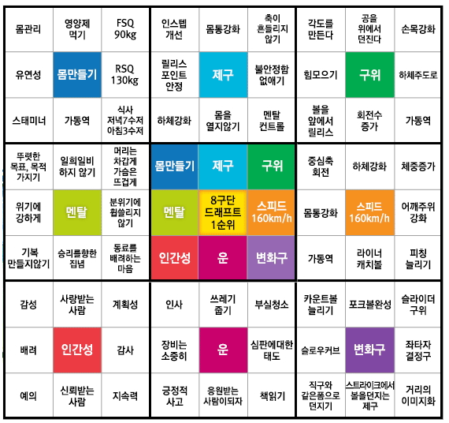

- https://shdkej.com
- https://blog.naver.com/shdkej
- [vlog](Video)

## Post
[[Digital_Content]]

[[Life_Tracking]]

[Decision Monitor Size](Decision_Monitor_Size.md)

[100k concurrent server](100k_concurrent_server.md)

[[Streaming_server]]

[[My_space]]

[[Note_Management]]

[EKS_terraform](EKS_with_terraform.md)

[[Spring_TestCode]]

## About
- 8 x 8, markdown 기준 1000줄 이하, 200자 1분 기준 30분 이하로 유지하면서 응축.
- 읽으면 머리에 그려지도록 가독성이 좋은 글을 지향
- 내가 알게 된 것들을 나의 언어로 작성하여 공유
- 모든 지식을 알 수 없음을 겸허히 받아들여야 한다...
- 거인의 어깨에 올라탄다.

## 번역시 고민 요소
원작자가 쓴 용어를 그대로 쓸 것인가, 편한 용어로 퉁 칠 것인가
- 영어에서는 같은 표현을 안쓰려고 하는 반면, 한국은 그렇지 않다
- 원작자가 다른 영단어도 있는데 굳이 그 단어를 썼다면, 그 단어를 그대로 써주는게 원작자의 의도를 더 살리는게 아닐까?

용어사전. 용어를 직역할 것인가, 비슷한 용어를 끌어올 것인가

의역을 통해 잘 읽히게 할 수 있지만 원작자의 전하는 바와 달라질 수 있다
의역을 하면 그 시대에만 한정되는 언어로 쓰여질 수 있다
그 때는 좋아보였지만 갈수록 빛을 잃는 문장이 될 수 있다

원문의 형태와 같게 하는게 좋을까? 긴 문장은 긴 문장으로 번역?
- 형태를 유지하되, 어투는 한국식으로 바꾸는게 좋겠다.

#### 번역체
인터넷에서 자동 번역된 것들이 많아서 제대로 독해가 안되는 경험을 많이 겪었기
때문에 자동 번역된 느낌이 드는 글들은 거부감이 확 든다.

#### 수파리의 관점에서 번역
번역할 때 파파고로 먼저 돌리고 내가 다시 다듬는게 그리 나쁜 것은 아닌 것 같다.

작성자가 작성한 글의 맛을 살리기 위해 문장의 길이는 최대한 맞추는 방향으로
해야겠다(쉼표, 마침표). 대신 번역투 느낌은 안나도록 최대한 신경써야 한다.

## Content
- share experience
- 1 page ~ 2 page
- easy
- review need Usage tip
- with cartoon or picture
[[Journal#Writing technique]]

#### 설명을 그림(표, 코드) 위에 놓을까, 밑에 놓을까

#### 뭔가를 설명하기 위해 추가적인 개념이 있을 경우
그 개념을 먼저 설명한 뒤에 원래 설명을 한다 vs
원래 설명을 하고 그 개념을 뒤에 붙인다

프로젝트를 직접 해봄으로써 새로운 개념을 알게 되는게 더 쉬운 것 같아서 원래
설명을 먼저하는 것이 더 이해하기 쉽지 않을까 싶다.

#### 읽고 싶은 제목
- 관심 있는 키워드
- 호기심 유발하는 제목
- 질문만으로 궁금증을 유발할 수 있는게 아니다. 궁금할만한 이야기를 하면 그것에 대해 궁금해하면서 궁금증이 생길 수 있다

#### read per minute
- 200 word per minute.

#### 블로그 글 아이디어
- My choose experience
- 기술 히스토리 search and writing bloging
- Experience sharing
- erp 하면서 고려했던 것들, 겼었던 것들 정리
- 홈페이지 구성요소에 대한 글 블로그 첫글 (블로그 아키텍처)
- tdd를 어떻게 공부해나갈지도 기록해야겠다
- 메모리의 지역성. 위치별 속도 차이 부터 시작해서 캐시, 메모리, 리스트 속도로 비교
- 내 개발 기준
- 배우고 있는 것들
- 배운 기술들을 쉽게 풀어내기 (유용한 기술을 쉽게 풀어내기)
    - 모나드 커링

#### favorite
desk setup
what i use
day tracking
home automation
minimal travel setup
what's in my bag
tech gadget
good application
note taking

#### 블로그
블로그를 리뷰를 보는 공간이 아닌
내 디지털 자산을 보관하는 공간으로, 나의 애장품을 큐레이션 하는 느낌으로
쓰고싶다
지금 갖고 있는 것
에센셜한 것들만 딱 올려놓기
영어로도 올리기
작성 시 가이드 보고 올리기

#### 블로그 글 쓸 때 요소
요약 설명 관련사항

#### 블로깅
개인적인 감상, 실용적인 정보를 담은 글
블로그 글이 찾아서 들어갈때는 서론을 굳이 안읽고싶다  
  
근데 그 주제에 처음 접할때는 서론이 필요하다

#### wiki blog 문제점
한 문서에 담고 있는 내용이 많아서 검색해서 들어올 때 원하지 않는 자료들을
봐야한다.

계속 수정된다는 것과 원하지 않는 내용이 포함될 수 있음을 알려줘야겠다.

노트 구조 소개
노트 리마인더를 주간 리포트 보내기
데이터베이스에 보내는 내용 저장하기
bold는 헤더에 쓰이고 있으니 진짜 볼드로 강조한 내용은 하루키의 책처럼 위에 점을
찍는게 좋겠다

#### 자료 정보 지식 지혜

#### 문서

- https://documentation.divio.com/

정보제공(정보공유)
알림(알아주면 감사)
요청(반드시)

뉴스기사(포스트)
에세이
문학

#### Item List
- program(develop)
- program(non-develop)
- tech gear
- clothes
- travel pack
- Home item

#### inspired
- by john grib for vimwiki to blog
- ohtani for mandarart table

## Video
- For just video that my log
- Use only the phone. No accessory. No Lighting.
- No edit photo.
- No footstep
- Speedy

- video sound volume different in same people play-list. If I make video, need check this

#### 확인할 것
- 눈에 본대로 표현
- 주제를 가지고
- 안정감 있게
- 프레임에 주제에 집중하되 프레임 바깥을 느낄 수 있으면 좋겠다 프레임에 갇히지 않았으면 좋겠다
- 아웃포커싱으로 주제를 나타내는 것 좋지만 다 나왔으면 좋겠다
- 인위적이지 않았으면 좋겠다. 원래 있는 것의 다른 시각으로 나타내면 좋지 새로운 것을 만들어내는 것은 조심해야겠다
- 필터를 안쓰고 싶다
    - 조명과 사진 필터는 확실히 효과가 있다
- 글은 중간 중간 사진을 배치, 영상도 중간 중간 B컷을 배치하고 화면 바뀌면 구도를 변경

## Drawing

#### 그림
그림을 그린다면 사실적, 정밀함 보다는  
내가 느끼는 그 물건에 대한 감정을 표현하고 싶다

## Cartoon
Font
One sentence one balloon
Serif San serif
One ballon is egg, fill word to like yellow part
Some cut has a different feel
Variable feel, if every cut as the same composition. It is boring

## Photograph
* 조리개 F
 - 낮을수록 구멍 큼 빛을 많이 받아들임, 어두울 때 밝게함
* 셔터스피드 s
 - 빛을 모을 시간, 느리게 하면 흔들림이 많이 들어간다
* 감도 ISO
 - 낮을수록 빛에 둔감하다? 밤에는 빛이 적어 고감도 사용

## Cinematic

## Video
- navigator
- subtitle
- floating current subject on left-top
- quickly
