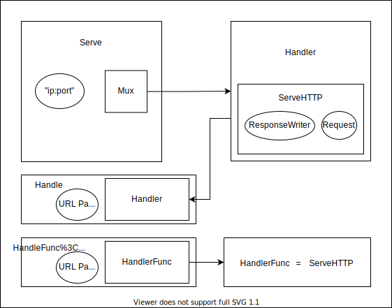

## 요약

코딩을 어떻게 하면 좋은 코드가 나올까? SOLID, DRY, YAGNI 등 많은 코딩, 디자인 가이드가 있다.

---

## SOLID

**Abstraction, One Behavior class, Encapsulation**

- S 하나의 클래스는 한 가지 일만, 변경하기 위한 이유는 하나만 갖고 있어야 한다.
- O 확장에는 열려있고, 변화에는 닫혀 있어야 한다
- L 하위 클래스는 기존 클래스와 치환되어도 동작 해야 한다
- I 인터페이스를 작게 하고, 클라이언트가 사용 안하는 함수는 공급도 안하게 한다.
- D 추상화에 의존해라. 구체적인 것 말고.

#### Single reason

변경하기 위한 이유는 버그 수정이나 리팩토링일 때가 아니라 디자인 설계 시의 얘기

#### DIP를 통해 외부 라이브러리 대신 임의의 객체를 만들어 테스트하기 용이해진다.

테스트 시에 외부 API의 기능을 테스트하는게 아니라 내 구현을 테스트한다.

## OOP

- **Encapsulation, Composition, Inheritance, Delegation, Polymorphism, Open recursion**
- same Input, should same output
- Encapsulation = Module?
  - Encapsulation is hide the value

#### 폴리모피즘

객체 생성 시 고정된 객체를 만드는 것이 아니라 기준만 만들고 실제 구현은 각
상황에 맞게 수정할 수 있게 하는 것

인터페이스나 추상클래스를 이용하여 상속해 여러 객체를 하나의 기준으로 만드는 것
그리고 이를 이용하여 오버라이딩 하여 각 객체에 맞게 재구현할 수 있는 것

하나의 객체를 다양한 방법으로 사용할 수 있게 하는 것

#### 상속, 위임(Composition)

상속

- 물건에서 인터넷용과 아닌 것을 구현할 때 물건의 속성은 공통으로 가지게 해서
  수정을 한 곳에서 하게 할 수 있다.
- 상속 받는 객체가 많아지면 그 중에 몇개만 같은 속성을 원할 때 상속이 깨지던가,
  중복된 구현을 각자 하던가 해야하는 상황이 오게 된다.
- 아키텍처에서 정책과 세부사항을 분리해야 한다고 하는 것처럼 상속도 이 부분을
  고민해야 한다.

상속 대신 위임을 이용하라고 하는데, Go에서 interface는 구성의 방식인가?

- 덕 타이핑이 위임인가?
  - 맞다고 할 수 있다.
  - https://mingrammer.com/translation-go-and-oop/#3-컴포지션-composition

위임으로 상속의 장점을 취하고 단점을 완화할 수 있는 것인가?

- 상속이 더 간단하게 구현되지만 구성으로도 똑같은 느낌을 낼 수 있다.
- 구성 방식으로 하면 처음부터 어떤 것을 고정하고 어떤 것은 변하게 할지 고민하지
  않아도 된다. 그래서 웬만하면 구성을 쓰라고 하는 것 같다.

#### coupling vs cohesion

내부에서의 변수들의 활용이 잘되면 응집도가 높다고 한다
클래스의 변수를 메소드가 여러개 잘 사용하면 응집도가 높다고 볼 수 있다
각 객체 간 연결이 느슨하게 되있으면 결합도가 낮다고 한다

## Functional Programming

불변성

## Coding Convention

회사의 컨벤션 룰을 따르자. lint도 설정하고

- python -- underscore
- golang -- camel
- `-` vs `_`
- `tab` vs `space`

## Clean Code

- Robert C. Martin
- https://gist.github.com/wojteklu/73c6914cc446146b8b533c0988cf8d29

- Meaningful naming

## TDD

- at least make test code.
- Test, Log(error handling), API

#### Why Test?

- code make concrete
- [The Art of Software Testing](https://drive.google.com/file/d/13r0fkQbcbd_2DG34l9Mm5VMRk8ewIImS/view?usp=sharing)

#### test

- boundary check

#### BDD, DDD

#### unit testing, system testing

- https://www.geeksforgeeks.org/difference-between-unit-testing-and-system-testing/
- unit testing
- single module base,
- system testing
- depends specific requirement, totally test

#### Refactoring

- 변화는 향상을 가져온다. 마치 책의 퇴고처럼
- 작가가 퇴고를 거듭하며 더 좋은 글이 되는 것처럼 리팩토링을 통해 더 나은 코드를 만들 수 있다
- 리팩토링을 두려워하지 말자

#### 유닛 테스트

유닛 테스트를 어노테이션을 만들어서 입력값만 지정해서 원하는 출력값이 나오는지
확인하면 테스트와 실제 코드가 같이 있게 되어 좋지 않을까?
결과의 멱등성을 유도하는 방향으로 함수를 작성하고.

```
@Test(input1:'1',input2:'2')
def add(a int, b int):
    return a + b
```

복잡한 로직이 필요하거나, 함수 실행 전에 선언해야하는 것들이 있으면 처리가
힘들겠다.

```
Square s = Square{}
s.SetLength(5)

class Square():
    len = ''
    @Test(what input can in here?)
    def SetLength(i int):
        len = i
```

테스트코드를 먼저 적고 테스트 코드만 통과할 정도의 함수만 작성하고 문제가 생기면
추가하는 방식으로 한다

- 주먹구구와 점진적 개선의 차이는 뭘까

#### 기능이 전반적으로 바뀌는 경우 a/b 테스트를 해야한다

블루 그린 배포를 하던지 해서 배포 방식을 상황에 맞게 설정해야겠다

#### Load vs Performance vs Stress test

Reliability, Stability, Response time, Scalability

Performance Test

- it includes Load test and Stress test
- 사용자가 원하는 조건이 있을 때 만족할 수 있는지 확인하기 위해 사용

Load Test

- how much can handle resource of cpu, memory
- verifies whether the application can handle the expected load.

Stress Test

- find the breaking point(maximum point)

> https://stackify.com/load-testing-vs-performance-testing-vs-stress-testing/

#### stage test

#### E2E test

- End to end test

#### Acceptance test

인수 테스트? (인수/인계할 때 그 인수?) 고객이 인수하는? 수락으로 해석해도 되겠다
측정할 수 있는 기준을 마련한다는 것

인수테스트를 기반으로 유닛테스트를 조정할 수 있겠다

기획 -> 기능 -> 스토리 -> 시나리오 -> 테스트

## Error Handling

- Exception File, Network

```
#whitelist?
def do_something:
 if do_something:
  return false

 return true

err = do_something
if err: generateError
```

- 엣지 케이스를 확인한다
- 정상적일 때가 아니라 최악의 상황을 생각한다

#### 에러 처리

예외로 볼것인가 에러로 볼것인가(회복 가능한가 아닌가)
호출자가 에러처리를 할 것인가, 유닛에서 에러처리를 할 것인가
유닛 함수는 리턴값을 항상 가지게 한다

하마님의 블로그 참고
https://hamait.tistory.com/1027?category=250996

포프님의 영상 다시 참조해본다

- caller 에서는 에러가 뜬 것만 확인하고 내부를 알려고 할 필요 없다

에러를 밑단에서 처리하면 프로그램이 뻗을지 말지를 호스트가 선택할 수 없다
에러를 호스트가 처리하면 밑단에서 스택이 잔뜩 쌓여서 호스트에 전달되어야 한다

에러 처리를 어떻게 할지 호스트가 결정해야한다?
밑에서 처리하고 로그만 남긴다?
문제가 생겼는데 에러만 남고 아무 이상이 없으면 문제
문제가 별게 아닌데 정지되도 문제

최대한 정지 없이 문제를 회복해서 진행시켜야 한다

#### 빠른 리턴 vs 리턴은 한 곳에서만

golang의 에러 처리 방식 vs 책 클린 코드에서 나온 리턴을 마지막에만 두자는 얘기

#### 에러 핸들링

리턴을 어떻게 관리해야하나

golang에서는 라이브러리들이 웬만하면 에러를 같이 리턴한다.
Fatal은 최종 사용자가 하는거다

에러의 종류

- 내부적으로 처리해야하는 에러 (file)
- 사용자가 처리할 에러 (network, temporary, null)

golang의 일반 error는 너무 단순해서 에러가 어디서 났는지 확인하기도 쉽지 않다.
어디서, 무슨 원인으로 났는지는 확인할 수 있어야겠다.

에러 처리를 한 곳으로 모아서 처리하는 방식

- errormessage(err)로 만들어서 에러 메시지를 띄우는 설비 프로그램 방식

## dash(-) vs underscore(\_)

dash

- 타이핑이 쉽다
- 일반인에게 익숙하다

underscore

- 파일 시스템에서 공백 대신 종종 사용된다
- 띄어쓰기와 비슷해보인다

둘 다 camelCase, PascalCase 보다 직관적이다
그럼에도 golang은 camel,Pascal을 쓰고
파이썬은 underscore가 특별한 예약어다.

#### space vs tab

- tab can line cleary
- space little more light

#### 코드에서 주렁주렁 달리는 것

context
log 설정
에러 처리

#### 클래스 기반 언어와 프로토타입 기반 언어

- 클래스 기반 언어: 객체를 정의하고 그것을 쓴다
- 프로토타입 기반 언어: 유사성을 확인해서 가장 유사성이 많은 것을 기준으로 삼는다
- 클래스 기반 언어: 한번 정의한 것은 그대로 사용된다
- 프로토타입 기반 언어: 문맥에 따라 의미가 달라질 수 있다

---

#### Language Design Principle

[C](Software#History)
[[Python#The Zen of Python]]
[[Golang#Philosophy]]

#### Internal Link

[[Architecture#Goal]]
[[Project#Project start]]
[[Think#개발의 목표]]
[[Information#비판 대신 진취적 개선에 에너지를 쏟는다.]]
[[Think#Safety programming]]
[[Think#가려움을 해결한 방법 1]]
[[Architecture#Check Point]]
[[Technology#Functional_Programming]]

## Reference

- https://en.wikipedia.org/wiki/SOLID
- https://en.wikipedia.org/wiki/Object-oriented_programming
- https://www.freecodecamp.org/news/object-oriented-programming-concepts-21bb035f7260/
- https://chodragon9.github.io/blog/easy-code/
- https://github.com/rwaldron/idiomatic.js/blob/master/translations/ko_KR/readme.md

---

# Python

summary : Beautiful, Explicit, Simple, Complex than complicated.

## The Zen of Python

- _Beautiful_ is better than ugly.
- _Explicit_ is better than implicit.
- _Simple_ is better than _complex_.
- _Complex_ is better than complicated.
- Special cases aren't special enough to break the rules.
- Although _practicality_ beats purity.

## Key Point

- what is an object, class
  - module is not class. module can't do inheritance
  - but module can contains class
- generators (how to use, when is useful), yield
- interpreter, dynamic type
- floor division?
- [GIL](Computer_Architecture#GIL is mutex for python to prevent use object by multi thread.)
- debugging
- wrapper
- what is python? What are the benefits of using python?
  - object
  - modules
  - threads
- How Python is interpreted
- How memory is managed in python
  - Python memory is managed by python private heap
- What are Python decorators?
- What is the difference between list and tuple?
- What is Dict and List comprehensions are?
- Why lambda forms in python does not have statements?
- Runtime return?
- What is a pass in Python
- What is docstring in Python?
- How are arguments passed by value or by reference
- How can you share global variables across modules

[[Software#pointer vs reference]]
[[Data_Structure#Python]]

#### compiler

CPython

- 기본적으로 python 설치 후 실행하면 이 컴파일러로 실행된다
- 파이썬은 C로 구현되기 때문에 C로 구현된 컴파일러로 제작되었다
- C언어로 작성된 컴파일러가 파이썬 코드를 읽어 바이트코드로 컴파일하여
  인터프리터로 실행한다
- 파이썬에서 C를 이용하는 라이브러리(e.g. NumPy)들이 있는데 이것들을 실행하는데는
  CPython을 써야 했었다.
- https://lgphone.tistory.com/m/128?category=913302

Cython이라는 C로 변환 후 컴파일하는 컴파일러도 있다.

PyPy

- python으로 구현된 컴파일러
- JIT (just in time)
  - 인터프리터의 단점을 보완하기 위해 나온 방식
  - 인터프리터 방식으로 실행하다가 (적절한 시점에) 네이티브 코드로 변경하여
    캐싱해 직접 실행
  - meta-tracing
  - https://j.mearie.org/post/5125952364/why-is-pypy-faster-than-cpython
- RPython
  - static python compiler
  - 파이썬의 동적인 부분을 없애 정적인 결과물로 만들어 속도 향상을 한다
  - 인터프리터를 만드는 컴파일러
- RPython이 만든 인터프리터를 이용해 실행함으로써 읽는 코드의 상태가 다르다.
  - 인터프리팅 자체의 속도가 빨라진다
- RPython + JIT로 속도 향상을 이루었다

#### 파이썬 self

super, self

- 인스턴스
  - `a = Test()`
    할 때 생기는 a
- 네임스페이스

  - 클래스 생성 시 파이썬 기본 함수 목록에 저장된다
    이것이 네임스페이스
    클래스 내부의 인자는 네임스페이스 안에 딕셔너리 형태로 저장됨
  - 인스턴스 생성시에도 네임스페이스에 저장된다
    ```py
    dir()
    #['Test', '__builtins__', '__doc__', '__loader__', …]
    ```

- self 는 해당 객체의 인스턴스를 가르킨다
- 주소값이 들어간다고 보면 될 것 같다

```py
class Test():
 def test():
  print("test1")
 def test2(self):
  print("test2")
 print(id(self))
 Test.test()
 a = Test()
 print(a.test())
 #self인자가 없다고 에러 발생
 print(a.test2())
 #test2
 #test2의 주소값 출력
 print(Test.test())
 #a.test()와 달리 에러 발생 안함
 #test1
```

#### Python concept with id() function.

Everything is an Object in Python

- Even function and class, id()

variable Assignment and Aliasing

- `hello = 'Hello world'`
- `world = hello`
- hello's id equal with world's id

`==` operator, `is` operator

- `==` compares the value
- `is` compares the identities(i.e. memory addresses)

integer caching

- -5 ~ 255 are caching

shallow and deep copies

- shallow copy make new object.
- deep copy make new object and if layer has a nested layer, recursively copy

a = 1000 을 해놓고 a+=1을 하면 a의 주소는 변한다
다시 a = 1000 을 하면 1000의 주소는 할당해제 되고 가비지컬랙터가 수거해가서
새로운 주소가 할당된다
할당되었다는 것은 메모리를 차지하고 있다는 것.
가비지 컬렉터가 수거해가나? 언제? del 명령어가 있다
-5 에서 256이 기본적으로 할당되어 있어서 아이디가 고정되는 것

#### shallow copy, deep copy

파이썬은 기본적으로 대입 연산 시 값이 아닌 레퍼런스를 참조한다.

- 그냥 대입하면 레퍼런스를 참조해버리는데, 참조를 원하지 않을 때 copy를 쓴다
- 배열형 객체가 아니라면 새로운 값 입력 시 객체가 변경되므로 copy를 쓸 일이 없다

deep copy와 shallow copy의 차이는 중첩된 배열처럼 중첩된 구조에서 차이를 보인다.

```py
import copy
a = [[1,2,3],[4,5,6]]
b = a
c = copy.copy(a)
d = copy.deepcopy(a)
id(a) # 0x0000
id(b) # 0x0000
id(c) # 0x0600 임의의 값. a와 다르다는 의미
id(d) # 0x0800 임의의 값. a와 다르다는 의미

a[0][0] = 0
print(a) # [ [0,2,3], [4,5,6] ]
print(b) # [ [0,2,3],[4,5,6] ]
print(c) # [ [0,2,3],[4,5,6] ] 중첩 된 곳을 참조해버렸다
print(d) # [ [1,2,3],[4,5,6] ]

a[0] = [1]
print(a) # [ [1],[4,5,6] ]
print(b) # [ [1],[4,5,6] ]
print(c) # [ [0,2,3],[4,5,6] ]
print(d) # [ [1,2,3],[4,5,6] ]
```

copy.copy() 는 [:]와 동일하다

is 는 객체를 확인하고, ==은 값을 확인한다

#### Built-in functions

- https://docs.python.org/3/library/functions.html
- abs max min pow sum round divmod
- all any filter map sorted zip
- enumerate range len
- chr hex ord oct
- id input isinstance open dir eval
- str tuple type list int

## Miscellaneous

#### 한글 사용

맨 위에 `#-*- coding:utf-8 -*-` 입력

#### requests

```py
import requests
data = {'id':'12','password':'12'}
URL = 'url'
res = requests.post(URL,data=data)
```

#### 파일 입출력

F = open('C:\test.txt')
F.read() - 전체 입력
F.readline() - 한 줄만 입력
F.readlines() - 반환값이 리스트
.split()

#### 정규식

```
import re
.compile
.sub(pattern,replace,string,count,flag) - 찾아바꾸기
.search
.match
.findall
.group
```

#### lambda python pandas parsing csv

- https://stackoverflow.com/questions/39303912/tfidfvectorizer-in-scikit-learn-valueerror-np-nan-is-an-invalid-document

#### reminder recommend python

- Filtering method
  - Demographic Filtering
  - Content Based Filtering
  - Collaborative Filtering- https://www.kaggle.com/ibtesama/getting-started-with-a-movie-recommendation-system
- ? find visualization system about csv file for weight manage
- upload lambda with pandas, scikit-learn
  - https://medium.com/@korniichuk/lambda-with-pandas-fd81aa2ff25e

#### 비동기 프로그래밍

- asyncio
  - get_event_loop() - asyncio 시작
  - loop.run_until_complete() - 이벤트 루프 시작
- 그린 스레드
- 스케쥴링을 하드웨어가 아닌 애플리케이션 코드가 대신한다.
- Gevent 는 그린스레드 + eventlet 이다
- 비동기 프로그래밍 = non-blocking i/o ?

#### python @classmethod @staticmethod

- classmethod has class argument
- staticmethod hasn't self. but can use statically

#### \*args, \*\*kwargs

- It is convention args is used to how many argument don’t you know
- Kwargs is used to how many argument don’t you know key:value data type as dictionary
- It is no need correct name it can use \*man, \*\*dkdke

#### 표준 라이브러리

파이썬 itertools Collection Counter Dequeue

#### numpy

- array

#### singleton in python

여러 상황에서 하나의 객체를 부를 때 동일한 객체를 부르기 위해 싱글턴패턴을 사용하는데 자바에서는 스태틱으로 정적할당을 해주는데 파이썬에서는 어떻게 하지?

- @staticmethod

싱글턴을 안쓰고 그냥 정적변수 또는 전역변수로 써도 같은 역할을 할 수 있지만 싱글턴은 더욱 확장 가능한 객체로 꾸밀 수 있다

#### if need initial python dependency using this

RUN pip3 install --no-cache-dir pandas sklearn requests
RUN pip3 freeze > requirments.txt

#### pickling and unpickling?

python 객체를 직렬화해서 파일에 저장하고 이용하는 것

- serialize해서 TCP 등으로 전송하기 좋다
- 여러 파일 간 공유하기 좋다
- 프로그램 상태를 저장해서 쓸 수 있다
- https://www.geeksforgeeks.org/understanding-python-pickling-example/
- http://t.ly/xAQL

#### json dumps, loads

dumps - python object -> json
loads - json -> python object

## Defects

what is the 3 worst defects python

- interpreter(and dynamic assignment), I like interpreter, but It has limit
- don't use python2 with 3 하위 호환성
- in web browser, nodejs is better

## WTF

https://github.com/satwikkansal/wtfpython

```py
a = 1
b = 1
# a address = 0x94ce80
# b address = 0x94ce80
```

파이썬에서 -5 부터 256까지는 객체로서 미리 할당되어있다

```py
a = []
b = []
# a address = 0x7feaaaea6540
# b address = 0x7feaaaea65c0
b = [1,2,3]
# b address = 0x7feaaaea65e0
d = []
# d address = 0x7feaaaea65c0
b.append([0,1,2,3,4,5,6,7,8,9])
# b address over d ???
```

## Reference

- [generator](https://realpython.com/introduction-to-python-generators/) -[yield](https://stackoverflow.com/questions/231767/what-does-the-yield-keyword-do/231855#231855)
- [한글 인코딩](https://redscreen.tistory.com/163)

---

# Golang

## Philosophy

- 패키지는 하나의 목적만을 달성합니다
- 에러는 명시적으로 처리합니다
- 빨리 반환하고 깊은 들여쓰기를 피합니다
- 동시성은 호출자에게 맡깁니다
- 고루틴 시작 전, 언제 멈출지 알아야 합니다
- 패키지 레벨 상태를 사용하지 않습니다
- 단순함은 중요합니다
- 패키지 API의 동작을 고정하기 위한 테스트를 작성합니다
- 느리다고 생각된다면, 벤치마크하여 이를 증명합니다
- 중용은 미덕입니다
- 유지보수성은 가치있습니다
- https://docs.python.org/3/library/functions.html

## Key point

- golang is concurrency friendly, I like it.
- garbage collection
- pointer vs reference
- interface
- goroutine

- defer - panic - recover : check source
- garbage collection

#### golang has no class

#### Specification

- new(File) and &File{} are equivalent

#### Auto Rebuild

- [CompileDaemon](https://github.com/githubnemo/CompileDaemon)
- using docker cmd, complicit port
- [gin](https://github.com/codegangsta/gin)
- Good Working

#### go folder management

- what is the better?
- folder separate
- only one folder

#### goroutine

if main function too short. it finish without running goroutine. so time.Sleep needed

#### go http

ServeHTTP와 핸들러에 대한 이해



mux = multiplexer

- 멀티플렉서는 패턴 처리를 여러개 한다는 의미다

Listen - (Handler - ServeHTTP) - Serve?

- mux = handler, 서버가 serve를 할 때 mux를 받는데, 안넣으면 디폴트 mux를 쓴다.
- mux는 ServeHTTP를 구현해야 한다.
- handler interface는 http 패키지에서 정의되있는 것을 보면 ServeHTTP를 갖는
  인터페이스다. 그래서 ServeHTTP만 가지고 있으면 핸들러로 쳐준다.

그러면 ServeHTTP는 어떤 동작을 해야 하는가

- mux라 함은 입력값을 받아서 응답을 해주는 것이다.
- URL을 받아 적합한 연결통로를 찾아서 넘겨준다.
- ServeHTTP의 역할이 mux의 역할
- 요청을 패턴이 일치하는 핸들러를 찾아서 전달해주는 것.

handler, handle, handleFunc, handlerFunc 차이 확인

- handler는 ServeHTTP를 구현하는 interface, response request 활용 가능
- handle은 패턴과 handler를 받아서 쓰는 handler의 wrapper 느낌
- handleFunc는 ServeHTTP를 구현한 객체들을 일일이 생성하는 것이
  불편해서 만들어졌다고 하는데, 잘 모르겠다
  - handleFunc는 두번째 인자로 받는 func을 ServeHTTP가 실행하도록 해놓은
    것 뿐이다. (이 func는 writer와 request를 인자로 가져야 하긴 한다)
  - ServeHTTP가 writer와 request를 가져야 하니까 헷갈렸다.
- handle과 handleFunc는 둘다 패턴과 핸들러를 받아 처리한다.
- handle은 handler를 받고, handleFunc는 일반함수를 handler로 wrapping 해준다.
- handleFunc이 패턴과 함수를 처리한다. http에서는 디폴트 mux에
  연결해준다.
- handlerFunc는 일반 함수를 handler 함수로 wrapping 해준다

```go
http.HandleFunc("/", func())
http.ListenAndServe(":8080", nil)

http.Handle("/", handler)
http.ListenAndServe(":8080", nil)
```

즉 요청을 받으면 ServeHTTP가 실행되고 그 뒤에 원하는 비즈니스 로직을 돌린다.

- gin 내부를 확인해봐도 ServeHTTP가 라우팅으로 연결해주고 있다.
- https://dejavuqa.tistory.com/314

## Library

#### graphql-go

gqlgen

Need update just 2 file

1. `resolver.go` -- implement function
   or `schema.resolvers.go`
2. `schema.graphqls` -- data structure setting

auto generate to gqlgen

- `model.go`
- `generated.go`

## [measure execution time in go](https://coderwall.com/p/cp5fya/measuring-execution-time-in-go)

#### golang

golang library, 실행파일, 서버

build
run
install - build 시 캐시
mod init <directory>

- go test 하면 모듈 업데이트 된다
- - go mod tidy 안쓰는 모듈 정리
    클론 한 패키지 처음 세팅 시 js에서는 npm install 해서 바로 셋팅된다
    go에서는 go mod tidy 하고, test ./... 해서 셋팅한다

package 명이 main 인 것은 빌드 시 실행파일로 생성된다
라이브러리는 폴더명과 같이 package 명을 입력해준다
실행파일에서도 라이브러리를 가져다 쓸텐데, 같은 프로젝트에서 만든 라이브러리라면
상대주소 말고 GOPATH/src 밑의 주소를 입력해준다

main 파일을 여러 개 만들고 싶어하는 사람들이 많아서 cmd라는 폴더 안에 폴더를 또
만들어서 여러 개의 실행파일을 만들게 레이아웃을 제안하고 있다

---

- redis
  - https://medium.com/@gilcrest_65433/basic-redis-examples-with-go-a3348a12878e
- mux handler <-> http handler what's different
- update nav css
- html render
  - static
  - template
  - setting static -> using link `style.css` -> `/style.css`
  - ! go module upgrade fail
  - blackfriday not match path
    - `gopkg.in/russross` -> `github.com/russross`
    - https://github.com/russross/blackfriday/issues/491
  - path.Join("app/index.html") not found
- ! cannot access app directory in docker
  - current directory is /src/app, and execute server using ../server.go
    Then, if i want use app-folder directory is ./ or absolute directory
- use struct in same directory other file
  - `go run a.go b.go` or `go run *.go` or `go install`-run binary

## wasm

`GOOS=js GOARCH=wasm go build -o main.wasm main.go`

- ! dial TCP: Protocol not available
  - WASM app don't allow HTTP
  - how to access Redis - server
- test -> upload mdfile -> show post
  - how to automation upload
- what's different between wasm and was
  - javascript to wasm language
- get file
  - https://github.com/mattn/golang-wasm-example/blob/master/main.go
  - render local path -> URL
- use for HTTP Get
  - use goroutine
  - https://github.com/golang/go/issues/26382
- which protocol use to render post? WASM or HTTP
- what is strength for WASM
  - use server language in browser
  - client-side rendering
- how to use wasm power
  - compiler
  - game
  - calculator
- tinygo
- ! Uncaught (in promise) TypeError: WebAssembly.instantiate(): Import #0 module="wasi_unstable" error: module is not an object or function
- TODO
- https://github.com/golang/go/wiki/WebAssembly

#### defer

defer should have know when close.
Object return something?
defer is so great idea
wow...
it can more light code
after error
go has good error handling method

- in python, try catch finally

calling g
printing g 0
printing g 1
printing g 2
printing g 3
panicking
//4
//defer in g 4
defer in g 3
defer in g 2
defer in g 1
defer in g 0
recovered in f
//returned normally from g
returned normally from f

#### golang context

context는 어떨때 사용하면 좋을까
DB풀 유지하는데는 사용 안하고
API 쓰는데는 사용하는 것 같은데...

- 보안 정보, 분석 정보, 데드라인, 취소 신호, 프로세스 경계 정보등을 가진다
- 대부분 함수 첫번째 인자로 전달
- 구조체에 넣지 말고 함수 인자로 전달
- 커스텀 타입으로 만들지말고 그냥 표준을 써라
- https://medium.com/@laeshiny/go-code-review-comments-%EC%A0%95%EB%A6%AC-47d05fdb49f6

## Defects

#### 고 모듈에서 버전관리가 별로다

시멘틱 버저닝을 지원하지 않고 패키지에 v2처럼 버저닝을 하기를 권장한다.
js에서는 package.json으로 자체 모듈 버저닝뿐 아니라 의존성 관리도 유연하게 할 수 있다.
그래서 시멘틱 버저닝과 체인지로그 관리도 쉽게 할 수 있는데, go는 안된다.

#### 패키지 관리

Golang을 예로 들면, 1.x 버전을 사용하고 있는데 2.x버전이 나오면 자동 업데이트를
하면 안되고 그렇다고 그냥 방치하거나 수시로 들어가서 확인하는 것도 번거롭다.
그렇다면 자신의 레파지토리에 있는 라이브러리들을 읽어서 업데이트 하라고 알림
같은게 오면 좋겠다. 아 그러면 CI 작업 시에 알려주면 되겠다.
npm에서는 패키지 설치할 때 알려줄 수 있다. 근데 이러면 설치랑 업데이트가 섞여서
알아보기 힘들지 않을까

Go에서 패키지 배포를 해봐야겠다
note-server/server와
note-server/data-store를 한 레파지토리에서 따로 임포트해서 쓸 수 있을까?
아니면 data-store를 가져오면 딴 것도 같이 가져와질까?

- 상위 레벨에서 깃 레파지토리를 가져온다. 버전도 함께.

고의 장점이 깃에만 올라가있으면 가져올 수 있다는 것이다.

#### go library

라이브러리를 각각 레포를 만들면 너무 번거롭지 않을까
json으로 리턴을 하고, json으로 입력을 받게 하고 싶다.
다른 형식이 필요하면 어댑터를 붙이면 될 것이고...

#### vs rust

## Reference

- [Go에서 DIP](https://simplear.tistory.com/24)
- [common mistakes in go](http://devs.cloudimmunity.com/gotchas-and-common-mistakes-in-go-golang/?ref=hackernoon.com)
- [Go Hacking.md](https://novemberde.github.io/golang/2021/04/05/Golang-HACKING.html)
- [ultimate-go](https://github.com/ultimate-go-korean/translation)
- [Golang과 Clean Architecture](https://blog.puppyloper.com/menus/Golang/articles/Golang%EA%B3%BC%20Clean%20Architecture)
- [Go error handling](https://dave.cheney.net/2016/04/27/dont-just-check-errors-handle-them-gracefully)
  - (번역) http://cloudrain21.com/golang-graceful-error-handling
- [Go Standard Layout](https://github.com/golang-standards/project-layout/blob/master/README_ko.md)
- http://www.dogfootlife.com/archives/452
- https://umi0410.github.io/blog/golang/go-mutex-semaphore/
