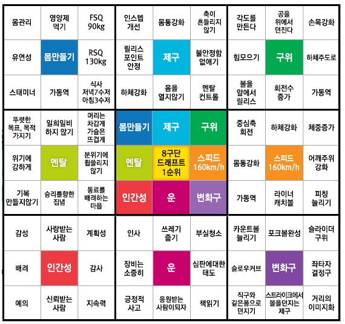

## 블로그 소개
- AI를 통해 얻은 컨텐츠를 절대 그대로 가져오지 않는다
- 한 문서에 10,000 단어 이상 넣지 않는다
- 하나의 문서는 명확한 흐름이 있어야 한다 한눈에 어떤 내용일지 그려져야 한다
- 만다라트 구조 안에서 문서를 제한한다
- 내가 스스로 계속 퇴고 할 수 있도록 한다

#### 내 블로그에 대한 설명이 필요하다
- 노트를 작성하면서 이전에 작성했던 것들을 까먹어서 적어놨던 걸 전혀 사용하지 못하거나, 뿔뿔이 흩어져있어서 찾기 어려웠던 점이 노트 관리의 어려운 점이었다.
- 전체적인 틀을 만다라트로 구성하고
	- 만다라트로 구성할 때 유의한 것은 나를 8개의 주제로 나누어야 한 것이다
- 그 안에서 주제별로 위키 데이터를 계속 쌓고
- 쌓인 데이터가 충분해지면 내용들을 정리해서 하나의 글로 만든다
- 하나의 주제는 여러 소주제를 가지고 있게 된다. 예를 들어 밸런스라는 주제의 위키가 있으면 그 아래에 여러 밸런스에 관한 데이터를 모아서 모인 데이터 중에서 관련 있는 것들을 하나의 글로 다시 작성한다.
- 이렇게 함으로써 나는 노트를 어느 주제에 넣을지 계속 머리 속에 그려넣을 수 있고 글을 다시 재검토 하면서 머리 속에 상기 시킬 수 있다.
- 그리고 이렇게 함으로써 바라는 점은 어떤 주제에 내가 관심이 있는지 만다라트로 머리속으로 그릴 수 있고, 각 주제에 대해 머리속에 그림이 그려지게 만드는 것이다.
- 야구선수 오타니의 만다라트 계획표를 보고 영감을 얻어 9x9의 표에 주제와 제목을 엄선하여 정리하는 방식으로 블로그를 운영하고 있습니다.
- 같이 일하고 싶은 개발자라는 목표를 바탕으로 8가지 필요한 조건들을 정했고, 다시 그 조건에 해당하는 제목들을 골라서 생활에서 겪은 것들을 모아서 정리하고 있습니다. 그 중 하나를 소개하자면 '다른 영역에 대해 알기' 라는 주제가 있는데, 이 주제에는 창작자에 대한 글이나 느낀 것을 모아 놓았습니다. 창작자들에게서 받은 영감을 모아서 저의 것으로 만들 수 있게 되길 바라고 있습니다.
- 제한을 적절히 하여 가지고 있는 자원을 최대한 활용하는 것이 효과적일 것이라 생각합니다. 블로그 포스트를 많이 쓰는 것보다 꼭 필요한 주제만 뽑아서 그 주제에 대해 정리하는 것이 더 저에게 맞는 것 같아서 고정 된 8가지 제목의 글을 업데이트 하는 식으로 노트를 적고 있습니다. 새로운 생각이 생겼을 때 새로운 글을 쓰기보다 기존의 글을 개선하는 것이 더 잘 남을 수 있을 것이라 생각했고, 이 한정된 주제로 깊이를 끌어내고 싶습니다.
- 하나의 글이 되면 독자 타깃, 문체가 정해져야 한다. 중구난방하거나 아무나 보라는 식의 글은 안 읽힌다. 조잡하지 않고 조화로워야 한다. 위키는 내 것이고, 블로그는 독자의 것이다.
- 꺼내보게 만들게 하고 싶어서 전체 주제를 잡아놓고 그것을 계속 디벨롭 시키도록 노트를 구성했다

## 요약

- 8 x 8, markdown 기준 1000줄 이하, 200자 1분 기준 30분 이하로 유지하면서 응축.
- 읽으면 머리에 그려지도록 가독성이 좋은 글을 지향
- 내가 알게 된 것들을 나의 언어로 작성하여 공유

## 주제 선정

- share experience
- 1 page ~ 2 page
- easy
- review need Usage tip
- with cartoon or picture
  [[Journal#Writing technique]]
- 선택지에서 어떤 선택을 했는지가 궁금할 것이다

#### Post

https://shdkej.com

- [[Digital_Content]]
- [[Life_Tracking]]
- [Decision Monitor Size](Decision_Monitor_Size.md)
- [100k concurrent server](100k_concurrent_server.md)
- [[Streaming_server]]
- [[My_space]]
- [[Note_Management]]
- [EKS_terraform](EKS_with_terraform.md)
- [[Spring_TestCode]]

#### AI 와 함께

- 하나의 그림으로 정리하고 그걸 설명
- [ ] 컨텐츠 만드는데 필요한 최소 설정 리스트업

#### 시리즈

- 밸런스 한 꼭지를 주제로
- 그 주제에 맞는 에피소드나 생각나는 걸 적으면 되지 않을까

#### 무엇을 쓸 것인가

- 다른 사람에게 도움이 되는 나의 경험
- 인터넷에 널린 이야기 말고 내가 겪은 이야기
- 나만 알고 있는 이야기가 아니라 공감할 수 있는 이야기

#### 뭔가를 설명하기 위해 추가적인 개념이 있을 경우

그 개념을 먼저 설명한 뒤에 원래 설명을 한다 vs
원래 설명을 하고 그 개념을 뒤에 붙인다

프로젝트를 직접 해봄으로써 새로운 개념을 알게 되는게 더 쉬운 것 같아서 원래
설명을 먼저하는 것이 더 이해하기 쉽지 않을까 싶다.

#### 읽고 싶은 제목

- 관심 있는 키워드
- 호기심 유발하는 제목
- 질문만으로 궁금증을 유발할 수 있는게 아니다. 궁금할만한 이야기를 하면 그것에 대해 궁금해하면서 궁금증이 생길 수 있다

#### 어떤 주제를 사람들에게 전할까
하나의 잡지를 쓴다고 생각하면
미니멀 테크 데스크 개발 자동화 효율화
환경에 나를 던져야 내가 움직인다

노트를 읽어서 어떤주제로 블로그 하면 될지 지피티에게 물어보기?

#### read per minute
- 200 word per minute.

#### 책 1권 - 200자 원고지 800-1000장

20만 글자
200 단어 1분
1단어 3-4자 > 애매한 기준
1분에 800자
10분에 8000
60분에 48000
4시간 분량

8 \* 8 64개의 목록
1개당 240/64=4분 남짓

#### 블로그 글 아이디어

- My choose experience
- 기술 히스토리 search and writing bloging
- Experience sharing
- erp 하면서 고려했던 것들, 겼었던 것들 정리
- 홈페이지 구성요소에 대한 글 블로그 첫글 (블로그 아키텍처)
- tdd를 어떻게 공부해나갈지도 기록해야겠다
- 메모리의 지역성. 위치별 속도 차이 부터 시작해서 캐시, 메모리, 리스트 속도로 비교
- 내 개발 기준
- 배우고 있는 것들
- 배운 기술들을 쉽게 풀어내기 (유용한 기술을 쉽게 풀어내기)
  - 모나드 커링

#### 유튜브 아이디어
- 디지털 라이프 : 아날로그 아이템 없이 디지털로 다 해결하려는 것을 담는다
- 21세기 관객 : 비슷하게 IOT 까지 확장하고 21세기에 살아서 좋다 싶은 것들을 담는다

#### favorite

desk setup
what i use
day tracking
home automation
minimal travel setup
what's in my bag
tech gadget
good application
note taking

#### Item List

- program(develop)
- program(non-develop)
- tech gear
- clothes
- travel pack
- Home item

#### 블로그

블로그를 리뷰를 보는 공간이 아닌
내 디지털 자산을 보관하는 공간으로, 나의 애장품을 큐레이션 하는 느낌으로
쓰고싶다
지금 갖고 있는 것
에센셜한 것들만 딱 올려놓기
영어로도 올리기
작성 시 가이드 보고 올리기

#### 블로깅

개인적인 감상, 실용적인 정보를 담은 글
블로그 글이 찾아서 들어갈때는 서론을 굳이 안읽고싶다

근데 그 주제에 처음 접할때는 서론이 필요하다

#### 여행 동선 지도에 표시하는법 
- https://www.tripline.net/, 
- earthtory.com, 
- https://www.google.com/maps/d/?hl=ko, 
- https://travelmap.net/

## 노하우

#### 단순한거에 집중해야한다

- https://mysetting.io/slides/tech-blog-survival-strategies-writing-in-the-google-era
- 중요하지 않은 것들은 쳐내야한다
- 글쓰기에 수많은 가이드와 정보가 있겠지만 중요한 것에만 집중한 것에 더해 불필요한 것은 의도적으로 쳐내는 느낌이 있다.

지양해야하는 글 = 추천할 가치가 없는 글들

- 완성되지 않은 문장들로 작성된 글
- 개인 노트를 그대로 공개한 글
- 직접 작성한 내용이 없는 글
- 설명보다 코드가 긴 글
- 링크만 모아놓은 글

딱 내 블로그 얘기같아서 뜨끔뜨끔
2000자 ~ 20000자

아직 좋은 글이 별로 없는 적당한 범위의 키워드를 정한다!

- 파이썬 > 키워드 > 파이썬 array 타입의 reverse 함수 사용법
- 파이썬 배열 관련 함수!

#### 블로그 글 쓸 때 요소

요약 설명 관련사항

#### wiki blog 문제점

한 문서에 담고 있는 내용이 많아서 검색해서 들어올 때 원하지 않는 자료들을
봐야한다.

계속 수정된다는 것과 원하지 않는 내용이 포함될 수 있음을 알려줘야겠다.

노트 구조 소개
노트 리마인더를 주간 리포트 보내기
데이터베이스에 보내는 내용 저장하기
bold는 헤더에 쓰이고 있으니 진짜 볼드로 강조한 내용은 하루키의 책처럼 위에 점을
찍는게 좋겠다

#### 자료 정보 지식 지혜

#### 문서

- https://documentation.divio.com/

정보제공(정보공유)
알림(알아주면 감사)
요청(반드시)

뉴스기사(포스트)
에세이
문학

#### inspired

- by john grib for vimwiki to blog
- ohtani for mandarart table

## 번역

#### 번역시 고민 요소

원작자가 쓴 용어를 그대로 쓸 것인가, 편한 용어로 퉁 칠 것인가

- 영어에서는 같은 표현을 안쓰려고 하는 반면, 한국은 그렇지 않다
- 원작자가 다른 영단어도 있는데 굳이 그 단어를 썼다면, 그 단어를 그대로 써주는게 원작자의 의도를 더 살리는게 아닐까?

용어사전. 용어를 직역할 것인가, 비슷한 용어를 끌어올 것인가

의역을 통해 잘 읽히게 할 수 있지만 원작자의 전하는 바와 달라질 수 있다
의역을 하면 그 시대에만 한정되는 언어로 쓰여질 수 있다
그 때는 좋아보였지만 갈수록 빛을 잃는 문장이 될 수 있다

원문의 형태와 같게 하는게 좋을까? 긴 문장은 긴 문장으로 번역?

- 형태를 유지하되, 어투는 한국식으로 바꾸는게 좋겠다.

#### 번역체

인터넷에서 자동 번역된 것들이 많아서 제대로 독해가 안되는 경험을 많이 겪었기
때문에 자동 번역된 느낌이 드는 글들은 거부감이 확 든다.

#### 수파리의 관점에서 번역

번역할 때 파파고로 먼저 돌리고 내가 다시 다듬는게 그리 나쁜 것은 아닌 것 같다.

작성자가 작성한 글의 맛을 살리기 위해 문장의 길이는 최대한 맞추는 방향으로
해야겠다(쉼표, 마침표). 대신 번역투 느낌은 안나도록 최대한 신경써야 한다.

## 영상

For just video that my log

- Use only the phone. No accessory. No Lighting.
- No edit photo.
- No footstep
- Speedy

- video sound volume different in same people play-list. If I make video, need check this
- 재치있는 구독요청 짤방 중간컷 넣으면 귀엽다

#### 확인할 것

- 눈에 본대로 표현
- 주제를 가지고
- 안정감 있게
- 프레임에 주제에 집중하되 프레임 바깥을 느낄 수 있으면 좋겠다 프레임에 갇히지 않았으면 좋겠다
- 아웃포커싱으로 주제를 나타내는 것 좋지만 다 나왔으면 좋겠다
- 인위적이지 않았으면 좋겠다. 원래 있는 것의 다른 시각으로 나타내면 좋지 새로운 것을 만들어내는 것은 조심해야겠다
- 필터를 안쓰고 싶다
  - 조명과 사진 필터는 확실히 효과가 있다
- 글은 중간 중간 사진을 배치, 영상도 중간 중간 B컷을 배치하고 화면 바뀌면 구도를 변경

#### 영상에 들어갈 구성요소

- navigator
- subtitle
- floating current subject on left-top
- quickly

#### Cinematic

#### 기본기
- 장면
- 컷
- 장면과 컷을 미리 글로 정의해놓고 컷에 필요한 b컷이나 인서트를 체크리스트로 관리한다
- 5초마다 컷 전환
- 줌
- 다른 각도 30도 이상

#### 미니멀 영상 제작 워크플로우
- 컷편집
- 자막 (영상보다 0.2초 늦게)
	- 와이드에는 맥락 자막
	- 영상 가이드 자막 (좌측 상단에 안내 자막) 넣어주고 싶음
- B컷 삽입, 효과자막 추가
	- 전경 사진 3~5초 후 라이브 영상
	- 와이드 -> 이동 -> 디테일
	- 장소를 들어가고 나가는 장면을 넣어주면 스토리라인이 잡힌다
- 배경음악, 효과음, 폰트 템플릿화
	- Pretendard / Noto Sans, 흰색, 그림자 약하게, 강조는 노랑
	- bgm 한곡, 볼륨 -30~35db
- 하루 10컷만 찍는다
- [ ] 조회수 잘나온 영상의 제목 뽑아서 벤치마킹
- https://www.remotion.dev/
	- 코드로 영상 만들어주는 서비스
- https://www.mapbox.com/
	- 웹용 지도 커스텀하기 좋은 서비스. 줌 및 영상에 쓰기 좋음

## 이미지

#### Drawing

그림을 그린다면 사실적, 정밀함 보다는
내가 느끼는 그 물건에 대한 감정을 표현하고 싶다

#### Cartoon

Font
One sentence one balloon
Serif San serif
One ballon is egg, fill word to like yellow part
Some cut has a different feel
Variable feel, if every cut as the same composition. It is boring

#### 설명을 그림(표, 코드) 위에 놓을까, 밑에 놓을까

글 쓸 때 사진은 위에 두고 **설명이 밑에** 오는게 좋겠다

#### Photograph 기본 요소

- 조리개 F
  - 낮을수록 구멍 큼 빛을 많이 받아들임, 어두울 때 밝게함
- 셔터스피드 s
  - 빛을 모을 시간, 느리게 하면 흔들림이 많이 들어간다
- 감도 ISO
  - 낮을수록 빛에 둔감하다? 밤에는 빛이 적어 고감도 사용

## 네이버 블로그

블로그
- 사진 10개에 주석다는 느낌으로 3-4줄
	- 모바일 기준으로
- 사진이 남으면 간단하게 글로 승화하기
- 하지않는 것
	- 구체적인 a-z 가이드 필요없음 그건 다른 블로그에 있을거임
- 하는것
	- 담백
	- 맞춤법
	- 문맥과 흐름
	- 전체적인 일관성

#### 체험단
- 블랙키위
- 리뷰노트

체험단 템플릿
- 가게 정면샷
- 가게 내부 분위기
- 메뉴
- 주차
- 특이사항
- 맛
- 데이트 기준 고려사항

#### 네이버 블로그 글
템플릿을 만들어서 거기에 채워넣게 해야 글이 잘 써진다 그치만 너무 템플릿화되면 볼 맛이 안난다 그래서 3가지 체크포인트를 통과해야하게 한다
- 일관성 가독성 나다움
	- 술술 읽히는가 그림이 그려지는가
	- 글이 혼란스럽지 않고 정돈되어 있는가
	- 나의 개성, 나의 시각으로 본 것인가

소재 이야기 독자
- 소재에 대한 관심
- 스토리라인
- 뭘 보고 싶어하는가
