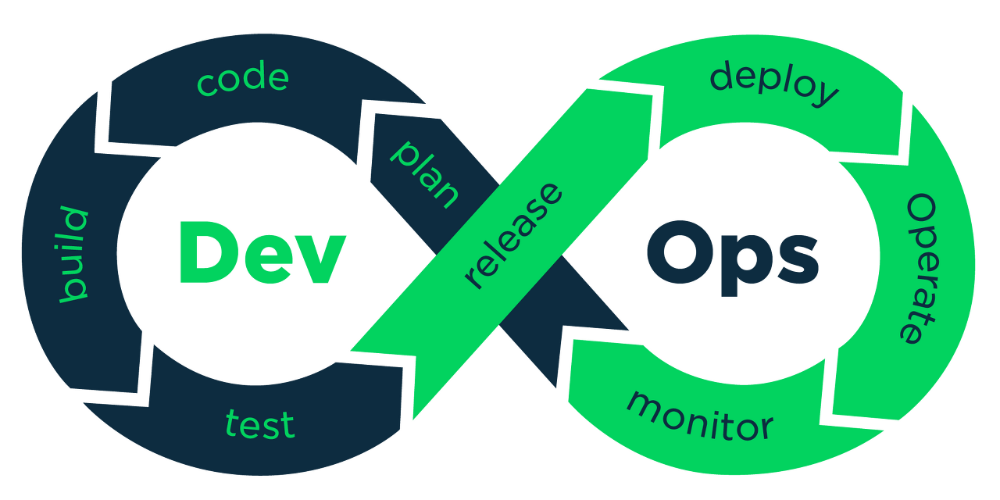

# DevOps

## 데브옵스의 목표는



> 개발자로 구성된 소규모 팀이 기능을 독립적으로 구현하고, 프로덕션과 유사한 환경에서 정확성을 검증하며, 코드를 프로덕션 환경으로 빠르고 안전하게 배포하는 것이다.
>
> - Devops Handbook (https://johngrib.github.io/wiki/devops/)

- [[Infra]] - Cloud
- [[Container]]
- Operating / Maintaining
- CI / CD
- Fail Tolerance / Chaos
- Monitoring / Observability
- Security
- SLA / SLO / SLI


## DevOps

what is benefit of devops

- makes team source useful.
- developer think only source version control system(git, etc)
- easy deploy, easy rollback, feedback

DevOps' goal is for a small team of developers to implement functions
independently, verify accuracy in a production-like environment, and distribute
code quickly and securely to the production environment.

DevOps gonna make fast to deploy
SRE gonna maintaining production to reliability

#### Devops goal
- Build automation
- Quickly release
- Test automation
- Feed back
- 그리고 문화로서 개발자가 직접 개발한 것을 직접 빌드할 수 있는 환경을 만들어준다

[[History#Devops came from agile 2009]]

#### 데브옵스는 린, 에자일의 연장선
- 예전에 제품 출시까지 오래 걸리고 회사 전체가 움직이던 것이 리스크가 있고 느려서 시대에 뒤처진다는 것에서 대응
- 개발과 운영을 분리된 것이 아니라 제품 출시에 있어서 같이 진행되어야 하는 것으로 보고 통합하는 문화
- 각 팀으로 분리하는 것이 아니라 같은 팀으로 묶여서 협업하는 문화
	- 개발자가 운영도 하는 업무의 확장으로 느끼지 않고, 제품 전반적인 관리를 참여하는 문화가 되도록 해야겠다
	- 사용자와 interaction을 늘리는 것인데, 현실적으로 개발자가 마케팅을 같이 하는 것은 무리가 있다. 개발과 마케팅의 간극을 줄이고, 응집력을 높이게 하는 것이 DevOps engineer의 역할일 것 같다.

DevOps is the union of people, process, and products to enable continuous delivery of value to your end users.
- Deployment frequency - faster time to market
- Lower change failure rate - faster lend time for changes
- Increase Revenue
- Faster Mean time to recover

#### 포지션으로서의 데브옵스
인프라, CI/CD 파이프라인을 구성 및 관리하고 개발을 편하게 하기 위한 도구들을 개발하고 관리하는 포지션
- 개발자들이 개발에만 집중하고 빠르고 편하게 개발할 수 있도록 돕는다
- 개발자들이 개발에만 집중하지만 고객과의 interaction은 가깝게 느낄 수 있도록 한다.

사람과 사람을 장벽 없이 연결 시키는 작업
- 제품 개발에 참여하는 인원들 간의 장애물을 낮추기 위해 노력

데브옵스는 다른 영역도 취미로 하는게 좋겠다. 다른 작업을 편하게 해주는게 대브옵스의 목표라고 생각
- 사용자에게 바로 영향이 가는 서버를 운영할 때 데브옵스는 어떻게 해야 할까
- 데브옵스는 포지션으로서 존재할 필요가 있는가?
- 데브옵스는 qa엔지니어와 가깝나 백엔드와 가깝나

#### 데브옵스의 필요성
작은 기업에서는 기획,개발,qa,데브옵스를 나누지 않을 것이고
규모가 커져야 qa엔지니어의 필요성을 느끼는 듯하다
서버가 코드화되면서 개발자가 서버를 관리하기 쉬워졌다
그래서 백엔드가 서버도 관리할 수 있게 되었는데 백엔드와 데브옵스를 분리할 필요가 있을까?
프론트가 nodejs와 함께 백엔드를 할 수 있게 되었는데 그런 풀스택 개발자는 엔터프라이즈에서도 먹히잖아?

규모가 커짐에 따라 세부적으로 역할을 나누는 것이 일반적이지만 데브옵스는 엔지니어의 역할 확장으로서 존재해도 되지 않을까? 프론트든 백엔드든 qa이든 서버가 어차피 코드화되어 있다면 같이 신경쓰는게 오히려 관리가 쉽지 않을까? 세분화되고 분리되면 고도화하기 좋긴 하겠다

개발과 운영의 통합은 종속성, 의존성이 아니라 조화다
각 마이크로 서비스도 데이터영역과 서비스 영역이 서로 의존하는게 아니라 조화를 이루게하면 되겠다

1. Plan
2. Develop + test
3. release
4. monitor + Lean

개발자로서 데브옵스라면 팀의 소스를 모두 풀링해서 서버에 올리는 것에 신경 쓸 것이고
문화로서 데브옵스라면 각 개발자가 서버에 쉽게 올릴 수 있도록 신경 쓸 것이다

동작은 어차피 서버에서 자동으로 하겠지만, 개발자가 서버에 어떻게 올릴지 설정을 하게 할지, 아니면 운영자가 설정을 할지의 선택요소가 남아있다

개발자가 피드백을 받으려면 개발자가 직접 설정해서 받는쪽이 나을 것 같다. 프로덕션에서 테스트도 해봐야할 것이고, 개발자가 설정하되, 파일 하나로 할 수 있고 쉽게 할 수 있도록 해야겠다


#### DevOps한 백엔드를 위한 개발환경구축 가이드

필요한 리소스

- github repository + github flow
- minikube + 주소를 secret에 입력
- cookiecutter
- 개발 폴더

얻게 되는 것

- CI/CD
- monitoring
- logging
- security
- image

cookiecutter

- ci/cd pipeline
- ansible script
- grafana prometheus
- fluentd
- traefik
- some yaml for kubernetes

좀 더 생각해볼 것

- CoC 를 위해 설정을 쉽게 할 방법
	- 사용자 스펙을 읽어서 없으면 서버 스펙을 사용한다.
	- 서버 스펙은 사용자가 건드리지 않게 한다.
	- nagios도 이렇게 되있었고, vim이나 zsh등 커맨드라인 툴들도 이렇게 되있다. odoo도 파일을 만들어서 오버라이드 되게 해놨지만 기존 코드를 바로 건드릴 수는 있었다.
- 내가 kustomize를 안쓰고 싶어하는 이유가 기존의 리소스를 활용하지 않고 독자적인 것으로 만들어져서 너무 국소적이고, 나만 쓰게 될 것 같고, 새로운 것을 외워야하는 느낌이 들어서인데, 회사용 툴을 만들게 되면 이런 느낌을 주지 않을까
- cookiecutter를 인프라용 레포지토리 템플릿으로 만들어서 쓰면 편하지 않을까
	- 프로젝트 생성 시마다 레포지토리를 만들 수도 있지만, 참조해서 쓸 수도 있어야 할 것 같다. 즉, cookiecutter를 쓰지 않더라도 한 번 구축해놓은 인프라를 다른 서비스를 개발할 때도 쓰도록 하는 것이 좋을 것이다.
	- 간단한 커맨드라인 툴을 만들어서 레포지토리의 버전을 읽어와서 적용하고 추가설정파일로 CoC가 되면 되겠다. 근데 이 커맨드라인 툴을 조심히 만들어야겠다.
- CI workflow로 툴을 실행시키고 설정파일이 따로 없으면 내 인프라 설정파일을 보도록?
- 각자 설정해야만 하는 것: 서버 주소
- 서비스 종류는 docker를 읽으면 되지 않을까
- 프론트엔드는 lerna, package.json 으로 create-app -> code -> ssg build -> deploy 프로세스가 잘 돼있다.
- 배포처(ex. netlify)에서 github 주소만 넣으면 끝이다.
- 개발 프로세스 전체 과정이 설정파일 하나로 파악되면 좋겠다.
- 기본 테스트 프로세스는 무조건 실행하도록 default로 돼있고, 추가로 원하는 테스트도 할 수 있도록 돼야한다.
- private github 대신 github 같은 것을 실행하도록 해서 주소도 자동으로 얻게하려면 -> 개발자 간 공유가 힘들긴 하겠다.
- 일단 코드로 시스템을 구성할 수 있으면 어떻게든 변환할 수 있다.
- 기능 플래그

#### process 그 다음을 생각해야겠다

- [ ] 개발자들의 퍼포먼스를 올리기 위해서 어떤 작업들이 필요할까
  - 이슈트래킹 서비스에 링크와 작업내용을 적고 github과 연동되어 github을 안들어가고 이슈트래킹 서비스에서 인터랙티브하게 동작되면 좋지 않을까
- [ ] 시각화를 어떻게 만들어서 업무에 도움이 되게 할 수 있을까

#### 이상적인 개발 프로세스

- 새로운 이커머스 시스템 요청이 들어왔다
- 기존의 라이브러리를 블럭처럼 추가해서 구현한다
- 약간의 업데이트가 필요해서 업데이트를 한다
- 이전의 소스에는 영향이 없다

#### 프론트와 백엔드의 협업은 어떻게 진행되지?

컨테이너로 각자 띄워서 하나? 그러면 백엔드가 업데이트되면 프론트는 언제 올리지?
클라이언트에서 graphql로 호출하는데,
데이터는 어디서 가져오나 - 테스트용 데이터를 고정해놓고 쓰나

- 그래서 CI가 나왔짜나
- 개발자가 docker compose를 다룰줄 알아야하겠다

#### 프론트엔드 서비스를 통합 포인트로 설정할 수 있나?

프론트엔드에서 마이크로서비스를 호출해서 인터랙티브할 수 있나?

네이버 검색 영역은 메인페이지와 분리되있지만 화면에는 같이 보인다. 이처럼
프론트엔드에서 호출할 수 있나?

#### 퀵 픽스와 롤백

퀵 픽스는 불합리한 것 같다
급하게 고쳐야한다면 다시 또 문제가 생길 수 있고
간단하게 고쳐진거라면 단계를 건너뛰고 올릴게 아니라 그냥 일반적인 플로우대로
진행하면 될거 같다
서버에 있는 걸 직접 고치는 것은 요즘에는 잘 안하니까...

큰 릴리즈를 했는데 에러가 발견되서 예전으로 되돌릴 수 없을때 퀵픽스를 하려고
하겠다
큰 릴리즈를 하고 처음에는 괜찮았다가 뒤늦게 문제가 발견되면 롤백보다는 빨리
조치를 하는게 낫겠다

#### 자주 쓰는 모듈을 이용해 프로젝트 진행 시 쓰게 되면

쓰면서 개선한 부분이 이전 프로젝트에 적용되야 할 수도 있고 안되야 할 수도 있다

- [ ] 전체 적용되도록 형태를 잡는다면 이전의 프로젝트에 적용하는 방법은?

#### 프로젝트 시작 시 꼭 필요한 것

모델 정의

모델 정의한 것을 서버리스로 배포.
그러면 각 모델의 연결은 어떻게?
람다로 한다면 제품 등록은 하나의 모델에 업데이트 하면 되는데, 불러올 때는 정보들이 묶여있는 상태로 불러야 호출 횟수를 줄일 수 있다.
근데 또 등록할 때 유저의 상태도 업데이트 하려면 등록도 두 개의 호출을 해야하긴 한다

#### server architecture to using some company service

특정 서비스에 종속되는 것을 조심하고 다양한 기술을 써봐야겠다
처음에는 특정기술에 의존하는 것이 영속성이 없어서 서버아키텍처에 포함하면 안되지
않을까 싶었지만 기술적으로 파악하고 사용하고 종속되지 않도록 해야겠다
앞으로도 새로운 기술을 계속 써야하기에 지금 있는 기술을 두루두루 다뤄봐야겠다
그러나 내 서버 아키텍처는 단순하고 가벼웠으면 좋겠는데 여러 기술을 사용하면
복잡해질 수 밖에 없는데 이를 계속 생각하고 있다

#### Serverless
데브옵스를 문화로써 받아들인다면. 모두 serverless로 만들어서 마이크로서비스화하는게 서버관리 리소스를 없앨 수 있고, 그럼에도 서버가 필요한 작업은 모놀리스하게 만든다. 중앙 집적 리소스 서버에서 모든 자원을 관리한다.

#### Migration to own devops pipeline

1. Check Github repository
2. Dockerization
3. Manual test
4. Make CI test pipeline
5. Make package
6. Make kubernetes environment
7. Deploy pipeline
8. Make feed back loop
9. Make everything to automation


#### Devops for machine learning

AI > ML > DL

Programming

- Algorithm + Data => Result

ML

- Result + Data => Algorithm
- Result + Data => Model
  Data => Predictions

Machine Leaning

- Prepare data -> Build and train -> Evaluate -> Prepare data

Planning

- Experimentation doesn't exclude planning
- Track work in the same tool as developers
- Provenance / Explainability

Source control

- Everything in source control
- canonical data sources
- ETL/ELT process in code
- Infrastructure as code

CI/CD

- Tests, linting, evaluation and scoring
- Training and experiment runs
- Artifact/model management
- Operationalization and deployment
- Commit - Triggered pipelines

Monitoring and Learning

- Retraining strategy
- Data triggers for CI/CD
- Don't forget performance
- Portability

Data - Preprocessing - Training - Test

How Training data work in production?

- Result is solid data?

How to add production data to training data?


## 아키텍처 레퍼런스

#### 기업들이 데브옵스 채용 후의 상황 변화된 사례나 데브옵스들의 경험담을 보고싶다

https://www.theteams.kr/teams/522/post/63940

- 데브옵스 채용이라기 보다는 문화를 바꾼 후 코드 관리에 집중함으로써 품질을
  높였다.

https://blog.kmong.com/크몽-모바일-데브옵스-960627d053cf?gi=c89f3ade7b36

- 경험보다는 어떤 것들을 하고 있는지 잘 정리돼있다.

https://www.bucketplace.co.kr/post/2020-07-23-오늘의-집사-서버-개발부터-운영까지-전부-다-맡겨-devops팀-리더-쟈니/

- 데브옵스 팀의 리더의 이야기

https://www.itworld.co.kr/news/155512

#### 아키텍처 모범 사례

> 서버 기반 아키텍처 모범 사례가 있습니다.(단일 장애 지점 제거, 배포 전 변경 사항 테스트, 중요한 데이터 암호화 등)
> - https://dc2348.tistory.com/6#:~:text=%EC%84%9C%EB%B2%84%20%EA%B8%B0%EB%B0%98%20%EC%95%84%ED%82%A4%ED%85%8D%EC%B2%98%20%EB%AA%A8%EB%B2%94%20%EC%82%AC%EB%A🙋‍♂️1%80%EA%B0%80%20%EC%9E%88%EC%8A%B5%EB%8B%88%EB%8B%A4.(%EB%8B%A8%EC%9D%BC%20%EC%9E%A5%EC%95%A0%20%EC%A7%80%EC%A0%90%20%EC%A0%9C%EA%B1%B0%2C%20%EB%B0%B0%ED%8F%AC%20%EC%A0%84%20%EB%B3%80%EA%B2%BD%20%EC%82%AC%ED%95%AD%20%ED%85%8C%EC%8A%A4%ED%8A%B8%2C%20%EC%A4%91%EC%9A%94%ED%95%9C%20%EB%8D%B0%EC%9D%B4%ED%84%B0%20%EC%95%94%ED%98%B8%ED%99%94%20%EB%93%B1)

- 단순한 동작을 여러겹으로 겹치면 깔끔하고 보기도 좋지 않을까?
- 유닉스의 파이프라인처럼 api를 파이프라이닝 해서 원하는 값을 만들어도 괜찮을까
	- 함수형 프로그래밍을 이용해서 파이프라이닝 형태로 만들어주는 api를 만들어서 api로 api를 불러서 파이프라이닝 하는 것.

#### 시퀀스

어두운 도서관 입구에서 시작해서
가장 중심인 곳은 가장 밝은 판테온 형태의 밝은 전시관이 있다

[[2022-05-01#빨강 - 핑크 - 보라]]

#### 패턴화

가드레일을 만들되 자유도를 느낄 수 있도록

- 젤다의전설
- 오픈형월드게임

#### 당근마켓 당근페이 인프라 구축 이야기

핀테크 기업으로서 보안 등 제약이 있는 상황에서 클라우드 서비스를 이용해야 했음

1. 로그인서비스를 어떻게 구성했는가
   - 계정 별로 환경 분리
   - 로그인 제한 -> 계정 별로 분리되어있지만 로그인은 대표계정에서 한다. cloudfnc와 동일하네
     - 로그인은 security라는 계정이고 이 계정은 로그인만을 위해서 사용하고, 이렇게 로그인하면 dev, sta, prod 계정에 접속이 가능하게 된다. 외부 접근권한이 있는 security가 탈취되어도 dev에 접근 못하게 되면 아무것도 할 수 없다는 식
   - 계정 탈취 시 여파 최소화
2. 서버 접근을 어떻게 할 것인가
   - teleport - ssh 접속 후 행동을 영상으로 녹화해서 보여준다
3. 애플리케이션 구성을 어떻게 할 것인가
   - kubernetes vs ec2
   - 쿠버네티스가 오버 엔지니어링이 아닐까 싶었지만
     같은 회사 다른 서비스에서 사용중이어서 조언을 얻을 수 있었고, 같은 팀의 팀원이 사용 경험이 있어서 충분히 도움을 받을 수 있는 환경이어서 사용하기로 했다
   - alb -> istio 변환 예정
4. 배포 파이프라인 구성을 어떻게 할 것인가
   - eks 에 맞는 도구를 찾으려고 했다
   - 툴에 대한 운영 경험이 있고 Github과 연계가 손쉽게 구성될 수 있는 기술 스택 선택
   - Github Actions, Argocd, Argocd pipeline
   - github 설치형을 n5.4xlarge 에 사용. 디스크 관리만 하면 무리없이 사용하기에 좋았음
5. 관측 시스템을 어떻게 구성할 것인가
   - 컨플라이언스 (보안) 문제로 SaaS 사용이 힘들었음 (Datadog, new relic 등)
   - ElasticStack, Prometheus, Grafana 로 직접 구축
   - FileBeat, Node Exporter 는 DaemonSet으로 올림
   - Prometheus Operator를 이용해 Prometheus를 구성함
   - AWS 리소스는 CloudWatch를 통해 모니터링
     - SNS -> AWS Chatbot을 통해 Slack 으로 발송. (이전에는 람다를 직접 구현했어야했음)
6. 성능 테스트를 어떻게 진행할 것인가
   - locust (kubernetes용인 klocust를 이용)
   - 테스트의 목적
     - 최대 성능을 측정하는 형태는 목적이 불분명
     - 10분 동안의 테스트를 통해 99퍼센타일 응답 시간이 100 ms 이내일 때의 최대 TPS를 구하려고 함 -> 99%가 진행됐을 때의 응답 시간이 100ms ?
     - 파드 하나당 400TPS 라는 수치를 얻게 됨
   - 테스트를 하면서 close_wait 소켓이 쌓이는 현상 발견. undertow를 netty로 변경

https://www.youtube.com/watch?v=8a2-b9X7Xno

#### 당근 채팅 시스템 아키텍처
큰 회사에서도 개발을 하는 인원은 적을 수 있고 최대한 매니지드 서비스를 이용하는 경향이 있다

dynamodb를 쓰면서 에러는 거의 안나서 안정적이었다
근데 쿼리를 잘 쓰기 어렵고 인덱스를 건 item만 가져올 수 있어서 인덱스를 잘 두어야하기 때문에 설계에 대해서 고민이 많이 필요함, Full scan은 안해야한다
채팅방 하나를 partition하나 정의
sort key는 message의 id로 설정

redis cluster로 stateless하게 웹소켓용으로 썼고 좋아보임


## 운영

#### 장애 대응
- 인식
- 보고
- 롤백
- 복구
- 피드백

#### Postmortem
대응 후 회고


#### SRE

To upgrade site reliability

1. Monitoring
   - Monitoring various content
   - Make automation
2. Performance check

Quick recovery scenario

- Check error 5xx, when error occurred rollback to prev version. And reporting
  error situation. Which are link, behavior, data, code line, build package,
  (commit source)

#### 서비스 사용자 수용량 확인

서비스가 빠른지 확인 방법 Throughput, Latency

- Throughput 시간당 처리량 TPS, RPS 등
  - 병목 발생한다
- Latency 응답 지연 시간
  - 모든 서비스 지연시간이 영향을 준다

부하발생시키기

#### 성과 측정과 개선
- DevOps 성과 지표
	- DORA Metrics
		- Deployment Frequency
		- Lead Time
		- MTTR
		- Change Failure Rate


# 빌드와 배포


## CI / CD 전체적인 흐름
개발
- Git Commit
- Git Push

개발자가 해야할 일
- 기능 개발
- 오류 수정
- 새로운 아키텍처 추가

CI
- 정적 분석
- 테스트 실행
- 패키징

CD
- 배포

ci/cd 선택요소
- pr or push
- 브랜치명
- 스킵
- 배포 형태

흐름
- 기능 브랜치 해서 푸시하면 ci 실행
- 머지하면 cd 실행
- 마스터에 푸시 막기

#### CI
여러 개발자들의 변경 사항이 하나의 공유 공간에 통합시키는 것이고 나아가서 빌드 및 테스트까지 자동으로 이루어지게 하는 작업

#### CD
공유 공간에 모인 작업 내용을 배포 하는 것. 실제 배포까지 한번에 자동화할 수도 있고, 배포는 시기와 상황에 맞춰 수동으로 할 수도 있다

#### CI 서버와 CD 서버를 나눌 필요가 있을까
CD는 배포된 내역을 관리하는 대시보드의 필요성이 있다

#### 제한
- 커밋 전 체크 1초
- 풀 리퀘스트 후 테스트 시간 10분
- 머지 후 배포 10초

#### 배포 파이프라인
IDE에서 이슈 확인 -> 작업 -> 테스트 -> 푸시 -> 알림 ->

알림이 가면 리뷰를 하고 -> 알림이 쌓이면 이전 알림을 못볼 수 있으니 이 점 체크 필요
알림 확인은 됐는데 모종의 이유로 배포는 연기해야 하면 이 상황을 다시 전달 -> 이벤트가 다시 전달되고 -> 다시 알림 온다 -> 

#### 배포 어려운점
- 배치잡이 돌고있을때 새로운 인스턴스가 뜨고 기존 인스턴스가 꺼지는 상황에서 배치잡이 돌고 있어도 강제로 꺼지게 된다

#### 쿼츠 무중단 배포 왜 안되는가
인스턴스 2개 떠있는 상태에서 새로운거 2개가 떴을 때 왜 중복 연동이 될 수 있을까
중복 연동 때문에 쿼츠를 끄고 했던가 미연동 때문에 쿼츠를 끄고 했던가
2개가 떠있는 상태에서 새로운게 떠도 기존게 돌릴 수 있어서 쿼츠의 꼬임 걱정은 안해도된다
새로운 인스턴스가 떴을 때 그 인스턴스에만 쿼츠가 가도록 하게 할 수 있을까? 이렇게 된다해도 새로운 인스턴스가 성공적으로 못떠서 꺼지면 다시 기존 인스턴스에서 쿼츠가 실행될 수 있을까
기존 인스턴스가 종료되기 전에 쿼츠 잡을 성공적으로 완료되면 꺼지게 할 수 없었다
그럼 새 인스턴스가 뜨자마자 쿼츠잡을 이어 받아야 하는데
이런 꼬임이 걱정되서 그냥 끄고 했다
그러면 끄는 거라도 자동으로 해도 될까. 배포 전에 api를 쏜다?
근데 이미 돌고 있는게 있는지 체크하는건 신경 써야 한다

CD 툴이 따로 필요한가? 어차피 스크립트로 배포는 할 수 있는데
argocd를 보면 배포된 것을 관리하는게 되야 가시성이 생겨서 필요한가
생명주기를 관리해주는 역할도 할 수 있을 듯, 켜고 끄고를 관리자 창에서 관리할 수도 있고

#### 배포 시 마스터 머지 안됐을 때 방지하기
https://sixmen.com/ko/tech/2022-08-28-1-prevent-deploy-invalid-branch/
- 회사에서는 마스터 머지된거만 배포하긴 한다
- 스테이지 배포 시에는 개인의 신경에 달려있긴 하다. 마스터 머지 안되서 안된적이 있긴 있음


## CI
- coding convention
- test
- code profiling
	* lint, coding convention check - static code analyse
		* security check(synk)
        * codefactor
        * codecov
        * 도커 이미지 보안 스캔하는 서비스 - docker bench for security
        * Find bugs or perform static analysis tool - pychecker, pylint
        * [semgrep](https://semgrep.dev/)
    * [size limit check](https://github.com/andresz1/size-limit-action)
	* check test. check coverage
- pull request with report
- pull request and code review
- build
- [version marking](Team_management#Conventional commits)

#### CI strategy
실패를 먼저 확인한다
- pull request를 보내고 테스트가 실패하는 것을 먼저 달게 하는 템플릿을 만든다

진행 결과를 코멘트해준다
- test
- 릴리즈 태그
- 변경된 파일(?)
- 배포 결과

#### CI cookbook
- 실패 시 메시지
    - `if: failure()`
- 스킵
    - commit이나 pr에 [ci skip] 또는 [skip ci]를 하면 자동 스킵
- 풀리퀘스트에 코멘트 달기
    - `uses: actions/github-script@0.3.0`
    - `script: github.issues.createComment()`
- 테스트 결과 코멘트 달기
    - coveralls 이용. coveralls bot을 레포에 초대해야한다. 잘 안붙는다
    - codecov 도 있다
    - `uses: romeovs/lcov-reporter-action@v0.2.16`  심플 커버리지 확인
- pull request, push 상황 체크
    - `on: ["push", "pull request"]`
- pull request 생성
    - `uses: repo-sync/pull-request@v2`
    - destination_branch, pr_title, pr_body 등 설정
- 변수 여러줄 저장하기
    ```
    go test -cover -v > output.txt
    body=$(cat output.txt)

    body="${body//'%'/'%25'}"
    body="${body//$'\n'/'%0A'}"
    body="${body//$'\r'/'%0D'}"

    echo "::set-output name=body::$body"
    ```
    - 파일에서 읽으려면 예약된 문자들을 입력해줘야 여러 줄로 인식이 됨
    ```
    echo ::set-output name=stdout::`go test -cover -v`
    ```
    - stdout을 바로 받으려면 이렇게만 해도 된다
- cache
    - actions/cache 이용
    - `if: steps.cache.outputs.cache-hit != 'true'` 로 체크
- terraform 구동
    - `uses: hashicorp/setup-terraform@v1`
    - terraform cloud 토큰 생성 후 이용 가능
- docker repository
    - github repository
    ```
    echo "${{ secrets.GITHUB_TOKEN }}" | docker login docker.pkg.github.com -u ${{ github.actor }} --password-stdin
    VERSION=$(echo "${{ github.ref }}" | sed -e 's,.*/\(.*\),\1,')
    docker push docker.pkg.github.com/${{ github.repository }}:$VERSION
    ```
    - dockerhub repository
    ```
    uses: docker/login-action@v1
    with:
        username:
        password:
    ```

- [github default context](https://docs.github.com/en/actions/reference/context-and-expression-syntax-for-github-actions#github-context)
- [awesome-actions](https://github.com/sdras/awesome-actions)

#### jenkins
수동 배포도 되는 것이 장점

코드 분리 가능 (github action, circle ci는 불가)

선언형과 groovy같은 스크립티드 문법 중 선택해서 쓸 수 있는데, 선언형으로 안되는
것들이 있어서 스크립티드를 써야하는 경우가 있다고 한다.

Configuration as code 플러그인을 설치하면 코드로 설정 관리 가능
- https://tech.kakao.com/2021/07/16/devops-for-msa/

#### pipeline
백엔드는 깃 폴더 내에서 작업하고
푸시하면 이미지가 만들어지고 파이프라인에 들어간다
디비나 다른 프로그램 사용이 필요할 때 바로바로 사용할 수 있어야 하고, 연결과 내부 확인이 바로 되어야 한다
개발과 테스트가 자유자재로 되어야 한다
개발을 하다가 테스트가 필요하면 바로 할 수 있어야 한다

프론트엔드도 깃 폴더 내에서 작업하고
백엔드의 데이터를 마음대로 가져올 수 있어야 한다
라이브러리 관리가 되어야 한다

커밋 전 확인할 것
- 커밋 시에 사전체크가 오래 걸리면 업무가 지연된다
커밋 후 확인할 것

직접 관리할 서버와 서비스를 이용하는 것은 어떻게 나눠야할까
젠킨스, 깃헙 액션

메인서버의 데이터를 바로 테스트용으로 카피할 수 있으면 좋겠다
그러려면 메인서버의 데이터 자체가 너무 비대해지면 안되겠다

세부설정을 할 수 있게 하되, 기본값은 실제 서버값으로 하면 테스트하기 좋지 않을까?
기본값으로 초기값을 하면 정확한 테스트가 안될 것 같다

테스트 서버의 자원을 로컬에서 할지 공용 풀에서 할지 선택하면 좋겠다

관리페이지 접속 -> 서비스 신청 -> 주소 할당

#### 커밋 시 동작 가능한 단위로 한다
한 동작마다? 한 단위마다?
처음 틀 만들 때는 빠른 개발을 위해 되는대로 작성해놓고 커밋만 따로 쪼개서 하고
싶은데 가능한가?

#### 기능에 문제 없는 것이 확인 된 단위로 커밋을 하고 싶다
기능에 문제가 있는지 없는지는 어떻게 확인할까
검사하기 좋은 아키텍처를 가지는 것도 중요하겠다
- 정적 테스트가 완료되면 문제 없다고 할 수 있게끔 해야겠다

CI를 커밋할 때 하는 것보다 PR을 할 때 하면 PR에 결과 표시해주면 한 곳에서 확인할 수 있어서 좋겠다

커밋할 때는 짧게 확인 가능한 위주로 테스트하고, PR에서 좀 더 진행하면 좋겠다

개발자들이 실제 작업하는 환경을 수시로 확인하는 작업이 필요하다

#### pr
pr마다 버전을 넣으면 금방 100을 넘을 것 같은데?
컨테이너 이미지 만들 때 버저닝 같이 하게 된다

#### meshkorea
젠킨스파일을 각 레파지토리에 추가해서 파일 하나로 CI/CD 작업을 연결한다
tag 기반으로 젠킨스에 훅을 보낸다
메뉴얼로 바로 배포하는 옵션도 있다
kubernetes 레포와 소스코드 레포를 분리했다
helm 의 values만 수정해서 관리할 수 있게 했다

#### workflow
운영쪽에서 개발코드를 지정할 수도 있고
개발코드쪽에서 운영쪽으로 푸시할 수도 있고

그러고보니 argocd를 실행하는 코드는 개발소스 레파지토리에 등록해서 써야하겠다
- 운영용 레파지토리에서 개발용쪽을 트리거 받는 방법도 있긴 하네
젠킨스파일처럼 파일 하나만 폴더에 추가해서
pr요청하면 그 파일이 서버에 훅을 보내서 특정 작업들을 실행하도록 한다

파일에는 세부 설정도 가능하지만 기능 on/off 정도만 해도 되도록 하면 좋지 않을까
argocd라고 적어놓으면 배포자동화가 되도록


코드 푸시하는 곳에서 이슈 리스트를 확인하고 코드를 내려받고, 푸시하면 리포트를
받아보게 되는 올인원 툴이 있으면 좋겠다
github action 추적도 되고

관리 쪽에서 개발소스를 컨텍해서 올리는게 더 안전성이 높지 않을까

#### 고언어 ci cd 파이프라인 모아서 깃헙에 저장
배포는 4가지 경우의 수 제공
로컬(앤서블), 클라우드(테라폼), 깃옵스,

테스트 및 릴리즈는 일반적인 경우 바로 받을 수 있도록

usercontent 링크로 바로 받아서 파일로 만들 수 있도록

이미지로 어떤 것들 제공해주는지 한 눈에 확인


#### 정적 소스 분석
lint check
test
secure check
size check

상황 처리
- push, pull request, 특정 branche만 받기

테스트 결과 이슈에 남기기

현업에서 필요한 복잡한 CI/CD 구성을 알고 싶다
aws에서 복잡한 구조를 지원하는 것을 어필하기 위해 소개하는 문서가 있을 것 같은데

터미널에서 푸시를 하면 깃헙 사이트에 들어가야 진행 상황을 알 수 있다
그래서 슬랙을 써서 하는 회사들이 있는데
터미널에서 바로 인터랙티브하게 할 수 없을까
- actions-cli

#### report
- 소스 코드 정보
    - 신규로 추가한 라인 수, 변경된 라인 수, 소스 코드 파일 개수, 커밋 개수 등
- 소스 코드 정적 분석 데이터
- 소스 코드 빌드 데이터
    - 작업별 빌드/테스트 시간
    - 빌드 성공/실패율, 빌드 로그
    - 빌드 테스트 리포트, 패키지(APK) 정보, 버전 정보
    - 빌드 옵션, 메모리 덤프 데이터
    - 빌드 태스크 의존성 정보
- 빌드 시스템 정보
    - 사용자 시스템 정보(CPU, 메모리)
    - CPU 사용량, 메모리 사용량, 디스크 사용량
    - 빌드 대기 시간, 빌드 장비 활용 시간
- 패키지 크기
- https://engineering.linecorp.com/ko/blog/build-a-continuous-cicd-environment-based-on-data/

#### workflow
개발 전 - 개발 중 - 개발 후 관리
- 개발 전
    처음 프로젝트 시작 시 필요한 파일
    깃헙 워크플로우
    도커 컴포즈 파일
    깃 훅
  - workflows, pre-commit, PULL-REQUEST 파일 불러오기
  - synk 등 github third party 허가 등록
  - 특정 언어 템플릿이나 미들웨어 서버 필요 시 불러오기?
  - security 정보 등록
- 개발 중
  - git-cz 등 개발편의용 도구
  - workflows 실행으로 테스트 자동

처음에는 infra repo에서 가져와서 서비스를 배포하는데
서비스별로 별도의 infra가 필요해지면 쉽게 변경 가능해야할까? 아니면 굳이
안바꾸는 것을 권장해야할까?

스테이지 서버에서 테스트 후 프로덕션 서버로 카나리 배포, 롤링 업데이트를 하게
될텐데 이 설정들은 infra repo에 고정적으로 있으면 되나?

ci/cd에서 하는 것이 배포 위치 지정(dev, prod 지정),

-----------------------------------------------------------------------

## CD
- hotfix
- integration each other
- how to test connection with each other services
- 스테이지 서버
- rolling deploy -- kubernetes support

#### imagine of erp CI/CD
local docker test
commit -> push -> deploy -> docker image update
- what if production has error?
- how to make fast hot-fix?
	* fixing with a test case

#### Feedback
* Measure Code, server(package), user experience to github issue
* Code static is reported in CI cycle.
* package is reported in CD cycle
* Error time, count, environment,

#### Code static analyze content
* Dead branch check (long time)
* Lint check
* Security check
* Dependency check
* Execute time check

#### deploy make easy
- one directory to push
- many program related
- update to be small
- test to be all
- quick rollback

#### 배포
argocd에서 쿠버네티스 템플릿을 가지고 있고,
코드 레포지토리에서는 이미지만 빌드하도록 하면 좋을까

#### infra와 source를 분리
쿠버네티스 테스트 레포지토리와 myspace 레포지토리를 분리하고
Myspace의 폴더가 곧 프로젝트 목록이 되도록 구성

1. Basic 폴더를 만들어서 이를 복사해서 쓰도록한다
2. Argocd에서 폴더를 등록한다
3. 배포 완료

인프라 코드도 개발자가 관리하도록 하기 위함.
개발 코드는 컨테이너 이미지 배포하기까지 자동

Prefix로 infra 서비스와 비즈니스 서비스 구분

argocd를 github action에서 실행한다면
소스코드와 인프라코드가 분리되있는데
소스코드 변경을 인프라가 어떻게 알아차릴 수 있지?

소스코드 변경 후 인프라를 다시 건드리면 안된다
인프라는 인프라대로 관리되고, 소프트웨어 업데이트는 소스코드에서 따로 처리되야 한다

인프라 변경 시 변경될 것은 쿠버네티스 셋팅, 서버 셋팅
소스 변경 시 변경될 것은 소프트웨어 버전, 세부 설정

둘 다 쿠버네티스 어플라이를 해야되는 건 같다.

인프라 생성 시 argocd 등록 되도록 하고, 그게 소스코드를 보도록 하면 될까?
1. 레포지토리 생성
2. 도커 빌드
3. 인프라 레포에서 폴더 생성
4. argocd 싱크 등록을 1 레포지토리로 등록
5. 레포지토리 업데이트
6. argocd 동작

#### deploy
서버의 kube config를 가져온다 - private key를 github secret에 등록시키고 scp를
이용한다
변경된 파일을 인식해서 apply 한다

1. 인프라에서 추가를 하면 서비스에 설정파일을 주입한다.
2. 서비스에서 간단한 파일이라도 추가해서 신호를 준다
- 관건은 서비스를 업데이트 했을 때 따로 설정 없이 인프라가 알아챌 수 있는지인데
- cron을 계속 한다? 무리...
    - argocd도 근데 레포지토리를 cron하는 방식 아닌가?
- argocd로 배포를 하면 처음 등록만 수동으로 해주면 된다.
- kubernetes를 워크플로우에서 동작하면 argocd 필요 없다
- argocd가 소스코드 변경을 보는게 아니라 yaml 파일을 보는거라...

지금은 일단 elasticsearch에 dockerfile 빌드할 때 synonym 파일을 집어넣었다
이러면 github과 연동이 안되어서 버전 업데이트 할 때 날아간다.
대응 방법을 생각해야 한다
쿠버네티스 로컬에서 볼륨을 만들어서 연결해도 github에 업데이트는 못한다
cron으로 파일을 파싱해야 할까. 매일 한번씩 카피해서 올려도 될듯

kubernetes 같은 네임스페이스에서 연결하는 방법은?
서비스로 클러스터 ip는 오픈
서비스 이름으로 인식은 한다.
그러면 서버에서 호스트 명을 서비스명과 맞춰줘야 한다.

#### argocd
terraform 으로 master ip 얻어서 argocd 마스터로 전달
인프라 레포에서는 생성만 하고, 싱크는 argocd가 github을 보면서 할 수 있나?

서비스 레포에서 푸시 -> 도커 이미지 변경 -> 인프라 레포에서 변경 인식
-> argocd sync
- 소스 레파지토리에서 인프라 레파지토리의 버전값을 변경하고 푸시하는 방식으로
사용하더라

- argocd에서 kubernetes.local로 접속하는게 어디?

#### 배포
스테이징 서버 없이 카나리로 테스트
실제환경에서 카나리 테스트

데이터에 문제 생길 것에 대비해서 업데이트 시 스냅샷을 찍어놓고 찍은 후 생긴
데이터를 따로 더할 수 있게한다
문제가 생기면 스냅샷으로 롤백하고 추가된 데이터를 더한다

스냅샷과 데이터복구가 잘 되는지 검증한다

#### canary release
카나리 배포를 할 때 프로덕션에 할 게 아니라 내부 서버로 카나리를 해놓으면
검사하기 더 수월할까?
프로덕션에서 테스트하는 것이 내부에서 보는 것과 차이가 없을까?
프로덕션에서의 환경을 봐야하기 때문에 프로덕션을 봐야할까?

#### 스테이징 대신 카나리로 직접 테스트
그러면 카나리 하다가 전체가 문제가 생기면 어떻게 하냐는 걱정 생긴다

격리를 잘 하고, 고가용성을 챙기고
데이터 변경으로 인한 영향이 없도록 해야한다


먼저 쿠버네티스, 깃헙을 이용해 개발하다가
팀이 따로 분리되어 전문화 되면 비로소 자체 시스템이 필요하지 않을까

처음에는 여러 역할이 한 팀에 있고, 이 팀들을 관리하는 팀이 있는 구조에서
팀을 관리하는 팀을 관리하는 팀이 필요해지는 시점 정도부터 세부적인 팀의 분리를 하던가, 상위팀이 하위 팀을 위한 툴을 개발하는 팀으로 역할을 하던가 하면 되지 않을까

#### 배포 자동화
- docker package
- maven package
- exe 파일로 package

- ansible로 로컬 배포
- terraform으로 클라우드 배포
- docker 패키징
- argocd

CD 로 로컬 서버에 배포하는 작업 보안 확인

#### 다른 버전을 사람들이 쓰면 문제가 생긴다
특히 db 처리에서 차이가 있으면 그렇겠다
롤링업데이트는 괜찮은게 맞나?
- 어댑터 패턴이라는 것이 있다
  점진적 업데이트 시 이전 버전의 데이터를 갖고 있다가 출력을 바꿔주는 식

카나리를 먼저 하고 롤링 업데이트를 하면 되지 않을까?
db 같은 업데이트는 카나리로 하는게 좋겠다

#### 모노레포에서 도커 빌드하기
yarn workspace, docker, jenkins

모노레포와 모놀리틱 아키텍처의 차이
- 모노레포는 각각의 단일 서비스가 한 프로젝트 내에서 각각 빌드 가능하다
- 모노레포 안의 디렉토리는 개별적인 서비스로 구동 가능해야한다.
- 모노레포는 의존 라이브러리를 루트에서 관리하되 링크를 걸어준다.

도커파일 하나에 환경변수를 받아서 각각의 서비스를 빌드하도록 할 수 있다.

한 프로젝트 안의 한 서비스를 보통 수정하게 되고, 푸시하면 변경된 서비스의
이미지가 업데이트 되어야 한다.
- lerna 에서는 지원하는 기능일까?
- workspace document는 없는건가?

도커 안에서 어차피 pakage.json을 읽어서 인스톨한다면 링크가 있던 없던 상관없지 않을까
- node module 대신 package.json만 넣는 이유
- 도커의 캐싱 시스템을 이용하는 것인데,
- package.json 파일이 바뀔 때만 npm install을 해줘서 바뀌지 않을 때 시간을 단축 시킨다

workspace 에서 루트에 모두 설치되고 각 서비스에 링크된다

워크스페이스로 참조하고 있는 다른 서비스가 package.json에는 있는데, 실제로
빌드할 때는 없어서 한 서비스 빌드할 때도 넣어줘야한다

-----------------------------------------------------------------------

## 시나리오
- 상황 1. 개인 프로젝트로 go web server를 구축하여 원격 서버에 배포
- 상황 2. 10인 개발팀이 개발은 compose로 진행하고 배포를 argocd로 배포
- 상황 3. 3명의 개발자가 terraform으로 인프라 관리 및 배포

- [ ] 배포와 릴리즈 분리

#### 상황 1
개인 프로젝트로 go web server를 구축하여 원격 서버에 배포

브랜치별 개발 - 푸시 - 정적 테스트 - 배포 - 릴리즈

릴리즈 된 것이 개발에 바로 피드백을 줘야 한다

테스트 실패

배포 실패

릴리즈 실패

릴리즈 시 특정 동작 문제 발생

이슈 보고

에러가 생각나서 긴급 수정

리소스 부족

외부 라이브러리 문제 발생


#### 상황 2
10인 개발팀이 개발은 compose로 진행하고 배포를 argocd로 배포

권한 관리 (개발팀이 경영팀에 마음대로 들여다 볼 필요 없음)

휴먼 에러 방지


#### 상황 3
3개의 실제서버를 구성해놓고
오토 스케일링 하도록 한다
업데이트시 롤링 업데이트를 기반으로 하는데
하나를 카나리로 설정한 다음 서버별 접속 링크를 제공해서 접속현황과 실제 테스트를 진행할 수 있게 한다

개발서버 - 실제서버
단계로 바로 갈 수 있게 하고
개발서버에서 각 파트가 다른파트에 영향을 최대한 안주도록 한다

깃 푸시하면 도커로 테스트하고 풀리퀘스트 머지를 하면 바로 실제서버로 가게하거나 배포 시기를 정해놓는다면 배포큐에 쌓아놓는다


#### edge case
로그 폭발
권한 남용
시스템 다운
네트워크 혼잡


#### reference
- https://blogs.oracle.com/developers/adventures-in-cicd-3-running-tests-publishing-test-reports
    - test, failure check,
- https://www.aaron-powell.com/posts/2020-03-23-approval-workflows-with-github-actions/
    - set version, create version file, approval workflows
- https://johnny-mh.github.io/post/standard-version-기반-서비스-배포프로세스
    - commitizen, standard-version, ci pr check, cdn 업로드(?)
    - frontend는 index.html만 배포하면 되겠다. 컨테이너보다 훨씬 가볍다
- https://shivanshs9.me/medium/do-github-acti on-like-a-pro-594bcb813b22
- https://ahnheejong.name/articles/web-developers-flutter-cicd-using-travis-ci/
- https://woowabros.github.io/experience/2018/06/26/bros-cicd.html
    - slack bot으로 배포 알림, 릴리즈 확인
- https://www.theteams.kr/teams/7242/post/70736
    - development, qa, deployment로 프로세스 구분
- https://www.slideshare.net/awskorea/cicd-aws-aws-aws-summit-seoul-2019
    - 소스 빌드 테스트 프로덕션으로 프로세스 구분
- https://roseline.oopy.io/dev/github-action-cahce
    - size-limit-check 해주는 js용 action이 있다
- https://velog.io/@hax0r/Node-프로덕트-퀄리티를-높이는-협업-방법-q29zo12w
    - commitlint, semantic release, husky 사용하자
- [Line](https://engineering.linecorp.com/ko/blog/line-ads-devops-culture/)
    - 기획, 코드, 빌드, 테스트, 릴리스, 배포, 운영, 모니터링
    - 기획 - confluence로 관리, kanban에 이슈 매칭, jira로 이슈 트래킹
    - 코드 - git-flow를 간소화해서 develop에 featrue를 붙여 개발 후 master에 병합
        - 코드리뷰 - 이슈트래커 번호, 1명의 승인 필요
    - 빌드, 테스트 - 언어별 기본 test, 요청 응답 테스트, 두 장비가 요청을 보내
      같은 결과를 보내는지 비교(api comparator)
        - PR 생성, 변경 시 단위 테스트
        - 상위 브런치에 머지했을 때 API 테스트
        - 특정 주기마다 테스트 반복
            - 단위 테스트 실패 시 머지 불가 조건
    - 릴리즈, 배포 - 위에서 검증 완료되었는지 한번 더 확인
        - kanban에서 confirm상태가 됐는지 확인하고 deploy로 상태 변경
        - 배포 전에 변경 공지를 등록하고 어떤 변경사항인지 관리자와 공유(메신저)
        - 배포 시작되면 전체 공유
        - 카나리로 배포, 1대에 배포 후 모니터링 되면 3분의 1부터 배포
            - 장애 발생 시 이전 상태로 재배포. PR revert, Tag 제거
- [banksalad](https://blog.banksalad.com/tech/become-an-organization-that-deploys-1000-times-a-day/)
    - pr 횟수를 모니터링, slack의 대화내용에서 파싱
    - git-flow를 간소화
    - gomplate
    - build - lint, test, docker image build
    - deploy용 bot을 만들어 사용
        - status, deploy, history 기능 지원
#### github이나 jenkins, travis에서 ci/cd 노하우를 공유할 것 같은데 찾아보자
- [travis ci blog](https://blog.travis-ci.com/)

## ETC


#### 이상적인 개발 환경

> 그러면 이번 장에서는 이런 현대의 서버 개발 환경이 어떻게 구성되는지를 살펴보기로 한다. 다음과 같은 시나리오를 생각해보자. "개발자가 아침에 출근해서 책상 앞에 앉아서 노트북을 켜고 **로그인을 한다.** IDE 도구인 이클립스를 실행하면 이슈 트랙킹 도구와 연결되어 **오늘 해야 할 일들이 자동으로 리스트 업 된다.** 개발자는 그중에서 하나의 태스크를 가져와서 내용을 확인한다. 해당 태스크의 상태를 진행 중(In Progress) 상태로 바꾸고, 소스 코드 관리 시스템에서 최신 소스 코드를 내려받는다. 로직을 구현하고, 코드를 검증하기 위해서 단위 테스트 코드를 작성하여 테스트까지 수행한 후 정상적으로 작동하는 것을 확인한 후에 다시 소스 코드 관리 시스템에 **코드를 반영 요청**을 한다. 반영 요청을 즉시, 자신의 **선배 개발자에게 통보**가 되고 선배 개발자는 해당 개발자가 변경한 코드의 내용을 형상관리 시스템에서 확인하고 시스템을 통해서 코드에 대한 **피드백을 적어 놓는다.** 코드 상에 문제가 없으면 코드 반영을 허가하고 변경 부분은 전체 소스 관리 시스템에 반영된다. 코드가 반영되면 중앙화된 자동 빌드 시스템에서 코드를 내려받아서 컴파일 및 **테스트 서버에 자동으로 배포**하고, 이미 정의된 테스트를 수행한다. 테스트가 끝나면 전체 소스 코드 줄 수 중에 어느 줄이 테스트가 되었는지, 전체 코드 중 테스트 된 줄 수의 비율 등을 자동으로 측정해서 **리포트를 생성**해 준다. 또한, 자동화된 규칙에 따라서 코드 상에 에러 처리가 안 된 부분이나 명명 규칙(Naming Rule)이 틀린 부분을 자동 검출하여 팀원에게 알려준다. 모든 빌드와 테스트가 끝나면 해당 코드는 **스테이징 (Staging) 환경으로 자동 배포**가 되 고, 변경 부분은 QA 팀에 의해서 테스트를 거친 후에, **매일 밤에 운영 시스템에 반영**된다.
> - (책) 조대협님
- 연계된 서비스의 배포는 어떻게 하고 QA를 진행하지? 자동으로는 안되고 배포 시마다 알려줘야 할 거 같은데
	- 기능이 하나의 서비스에서만 동작하는게 아니라 여러 서비스가 같이 배포되어야 원하는 동작이 되는 경우일때.

#### without stage server
I want to make only 2 stages environment
- development & production

what is problem
- staging server need exist?
- production safe
- production server has problem
- managing critical data
- real world simulation

if in kubernetes. staging server is not problem. just one more pods?

is it over-resource? CD pipeline can replace staging server?
- gitflow
- master, dev, release, stage, hotfix -- too much
- dev, test, stage, prod -- too much
- multi stage is require?

can parsing data from every node?


#### java build quickly

build 스테이지와 deploy 스테이지를 분리한다

build에 artifact 옵션을 주면 된다.
artifact에서 untracked 옵션은 git에 untracked 된 것들을 담을지 여부다.
근데 이걸 false로 하니까 새로 만든 폴더를 artifact로 못만든다. 빌드파일에 쓰고 싶으면 true로 해야 할 듯
파이프라인 탭에서 artifact를 직접 다운받을 수 있는데 이걸 다운 안받게 하는 방법은 딱히 없는 것 같다. 괜히 안만들고 싶은데..

빌드는 자동으로 하고 배포는 수동으로 할 때 artifact가 만료되어 버릴 수 있어서 전달이 안될 것 같은데? artifact expired_in 시간을 줄이고 시간 지난 뒤에 해보자
마지막으로 실행한 artifact는 시간이 지나도 지워지지 않는다.

paths 는 어떤 것을 artifact 할지 인데, ./ 하면 gitlab의 현재 위치의 것들을 모두
한다. 그래서 특정 위치를 잡아줄 수 있다

- dependencies는 특정한 빌드의 artifact를 받기 위해 필요하다
	- deploy에 dependencies 옵션을 주면 선택된 빌드의 빌드파일이 넘어간다
	- [https://docs.gitlab.com/ee/ci/yaml/index.html#dependencies](https://docs.gitlab.com/ee/ci/yaml/index.html#dependencies)

