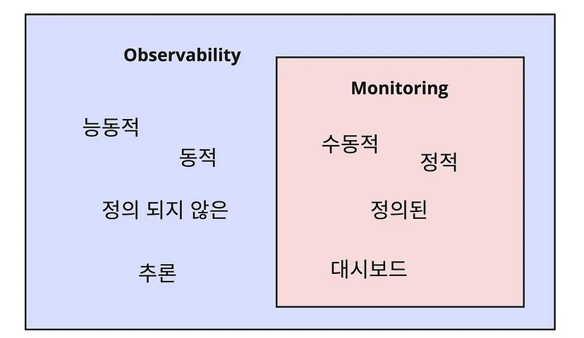

## Monitoring

#### 중요한 포인트
- urgent
- important

#### system
- 보안 (로그인 체크)
- load average
- error message
- memory
- disk
- network + time wait port
- https://www.mimul.com/blog/linux-server-operations/

#### 모니터링 지표
- 비즈니스 (마케팅, 퍼널)
    - 신규 유저 수
    - 이탈 유저 수
    - cta 클릭율
    - 주요 퍼널 drop off
    - 캠페인별 전환 지표
    - ctr
    - 세션 수 (마케팅 입장에서 서비스가 정상인지 확인하는 지표)
- 프로덕트
    - p95
    - p99
    - 오류율 (프론트)
    - LCP / FID
- 시스템
	- 메모리
	- cpu
	- auto scaling 관리
	- 네트워크 지연
	- 트래픽
	- 인스턴스별 헬스체크
	- 디스크
- 앱
	- api별 latency
	- 500 에러
	- 400 에러
	- Error log count
- 데이터 레이어
	- db slow query
	- queue
	- Cpu
	- Connection
	- Dlq

그 외 리포트 받아보면 좋을 내용
- 비정상 증분
- 비용 스파이크
- 반복 고객 불만 사항
- 빌드 실패
- 롤백 수
- 분석에 필요한 지표들 (매출)

체크해야할 것들
- 로그인 잘 되는가
- 결제 잘 되는가
- 서버가 정상인가
- a/b 테스트를 측정 가능한가
- 신규 유저와 이탈 유저 수
- cta 클릭률
- 서버가 얼마나 쓰이고 있는가
- 동시간대 비교, 전일 비교 가능할까

로그를 많이 남겨서 쿼리로 잘 검색되게 하는게 낫겠다 시스템 도구를 이용하자
퍼널 데이터도 클릭하우스로 모으고

이걸 하려면 기본적으로 loki, clickhouse를 써야하는데 무겁지 않을까. 공통으로 쓰다가 커지면 단독으로 빼면 되려나

#### web

- api response time
- 웹 요청량
- homepage health
- 접속자 로그
- 접속한 페이지
- 사람들이 어떤 메뉴를 많이 쓰는지 확인

#### 웹 성능 확인 지표

- DNS Lookup time
- tcp 연결 시간 (브라우저와 서버간 연결 시간)
- SSL 연결 시간
- 첫 번째 바이트 다운로드 시간
- 전체 다운로드 시간

#### 트래픽을 측정하는 방법?

- tps
- 접속자 수
- resource usage
- page view
- api count
- loading time
- response time

#### 메인 모니터링 판넬에서 보여져야 할 것들

- node 대수
- cpu, memory 사용량
	- cpu, memory, disk, network
- 응답량
- 처리 시간

#### monitoring

- application, framework, os, cloud 이 정도가 기본 관리 영역이겠다.
- 정상 상태를 추가해야한다. 범위를 정해서 이 정도면 정상인 범위로 놓고, 정상 범위 내를 계속 건드려서 카오스 테스팅 하고, 범위 벗어난 값은 다 알림 보내도록 해보면 좋겠다
- 알림은 정말 확인해야 하는 것과 일반적인 안내를 분리해야 하고 확실히 눈에 띄게 해야 한다

#### p95/p99
- 95% 이상의 반응속도를 가진 사용자의 지표
- p95가 300ms 면 95%의 사용자는 그 이하의 반응속도이고 5%의 유저는 더 느리다는 것. 평균값보다 실제 사용자 체감량에 대해 정확하다고 볼 수 있다
- p95를 300ms 미만으로 유지한다. 를 지표로 둘 수 있다
- 99는 조금만 튀어도 확 바뀔 수 있어서 민감해서 95를 평상시 기준값으로 볼 수 있다

#### etc

- 각 서비스 상태
- 노드 살아 있는지 체크
- 접속자 수
- 응답시간
- 처리시간
- DB 관련
- 접속한 어플리캐이션
- 부하율
- 알람
- docker up/total
- 트래픽 관리
- GCDN
- static code analysis
- lambda, ec2, s3, Dynamodb
- GCP

#### 서버를 오래 켜놓았을 때 생기는 문제점

아파치에서 동시작업을 위해
자식 프로세스를 생성하도록 하고, 부모 프로세스와 메모리를 일정 부분 공유하면서
메모리를 절약하는데,
공유되는 메모리의 양이 시간이 지날수록 적어져서 자식 프로세스를 재시작
해줘야한다고 한다

이처럼 시간이 지남에 따라 성능 저하를 일으키는게 있으면 확인해봐야겠다

그야말로 켜놓고만 있었는데 성능이 안좋아지는 원인 중 하나였다

리눅스에서 jiffies 라는 변수가 32비트라 500일 정도 지나면 오버플로우 될 수
있었는데 최신 커널은 64비트로 할당되어 최신 커널을 쓰면 넉넉해진다

쿠버네티스단, 리눅스단, 기타 서비스단에서 체크 필요
주로 데이터가 쌓이거나 메모리 사용량이 쌓일 때 문제가 생긴다

#### 모니터링 범주

프로파일링
로깅
트레이싱
메트릭
알림
디버깅
추세 파악(트렌딩)
플러밍

#### 문제 분석과 재발 방지

예측하지 말고 측정한다

#### 대규모 서버에서 겪는 문제

데이터
CPU
네트워크

데이터의 동기화
cpu 병목
네트워크 병목

load average를 확인하고
sar을 통해 cpu 문제인지 io문제인지 확인한다

#### 대용량 트래픽

WAS에서 문제가 생길 때 다중화로 해결이 힘든 이유

- 다른 WAS를 찾아야 한다.
- 로그인 정보를 전달해줘야 한다. (세션 클러스터링 필요)
  - 그에 따른 관리 지점 증가

데이터베이스 다중화 힘든 이유

- 동기화

#### 의사 결정 트리로 시스템 모니터링 하면 되려나

load average yes

- cpu bound
- io bound

load average no

- network
  근데 이러면 dfs로 전체탐색을 해야하겠네

#### Observability를 높이기 위해서는 어떻게 해야할까

이 문제가 발생했는지를 내가 설정하지 않아도 알 수 있으려면 바로 observability가 필요하다

- 피드백을 받기 위해
- 문제가 일어나기 전에 예측하기 위해?
- 분산 환경에서 모니터링이 한눈에 되어야 한다
- Metrics, Events, Logs, Traces 를 한눈에 확인한다
- 예측하지 못한 문제를 찾으려고 한다
- [제어이론](https://ko.wikipedia.org/wiki/제어이론)에서
  **관측 가능성(observability)**이란, 시스템의 **출력 변수(output variable)**를
  사용하여 **상태 변수(state variable)**에 대한 정보를 알아낼 수 있는지를
  나타내는 용어이다. 시스템의 출력 변수를 사용하여 특정 상태 변수에 대한 정보를
  알아낼 수 있을 때 그 상태 변수는 **관측 가능하다(observable)**고 하며,
  시스템의 모든 상태 변수가 관측 가능할 때 그 시스템은 관측 가능하다고 한다.
- 메트릭이란? 최적의 네트워크 경로 또는 측정 가능한 단위(평가지표)

서버를 가상화해서 사용 시 서버는 추상화가 되고 서버의 상태를 일일이 확인할 필요가 없다. 문제가 생기면 없애고 새로 만들면 되기 때문에.

근데 문제가 생겼는지 확인하려면 기준점이 있어야 하고, 기준이 설정되어 있지 않다면 문제가 발생했는지 알 수 없다

정상 상태를 정의하고, 비정상 상태로 만든 후 정상 상태로 돌리는 것을 통해
Observability를 높인다. 이것을 카오스 엔지니어링이라고 한다.

예측하는 것이 아니라 관찰할 수 있도록 만든 후 관찰 하는 것.

- Observability
- post mortem
- 무엇을 보여줄 수 있는가
- 무엇을 해결해야 하는가
- 어떤 문제가 생길 것 같은가

서비스 장애 시간
지표
SLO

SLO는 목표고 SLI는 지표다
지표가 있어야 그걸 기반으로 목표를 세운다

부팅시간 10초 이내는 합리적인 지표일까?
시스템이 고장났을 때 빨리 재시작 되는게 중요할 것 같은데 어차피 헬스체크 간격이 15초라면 부팅시간이 의미가 있을까. 헬스체크 간격을 그렇다고 너무 빠르게 할 필요 있을까?

Log Trace Metric
프로메테우스는 메트릭 전문
로키는 로그 전문
Tempo라는 트레이싱 전문도 생겼구나
트레이스는 네트웍 영역이고 다른 툴이 필요
SigNoz라는 오픈소스 툴이 있다
OpenTelemetry와 연계가 잘 되는 듯

#### reference

- https://andromedarabbit.net/무엇을-모니터링할-것인가/
  - AWS, Kubernetes 등에서의 모니터링 파라미터
- https://www.mimul.com/blog/linux-server-operations/
  - 리눅스 시스템 상태 확인 스크립트
- [CPU 지표](https://brunch.co.kr/@leedongins/75)
- [리눅스 60초 안에 상황 파악하기](https://luavis.me/server/linux-performance-analysis)

---

## Benchmark

#### 서버 성능별 벤치마크
[자바로 aws ec2에서 open files 테스트 하는 블로그](https://woowabros.github.io/experience/2018/04/17/linux-maxuserprocess-openfiles.html)를 봤고 거기서는 최소사양으로는 1000커넥션 정도밖에 서버가 받아들이지 못했다
이에 더해 1만 커넥션은 컴퓨터 성능이 어느정도 필요하고 10만은 얼마나 필요한지 확인해보자

minikube로 로드밸런싱 켜서 서버 cpu500/ram100으로 설정 시 ha 동작 확인
- 일단 도커에서 cpu 0.5 ram 500m 으로 줄이면 1만 접속 전에 뻗는다
- api 서버가 뻗어버린다...

라즈베리파이 동접 1000에서 에러 33%, 평균 응답 시간 30ms 정도 나왔다고 한다
- http://egloos.zum.com/javalove/v/869037

rmtp 서버 스트레스 테스트
- https://idchowto.com/?p=46410
- 2 core, 4GB memory로 2000 접속 정도

aws benchmark
- https://detechter.com/nginx-vs-apache-on-ec2-performance-comparison/

(책) aws 부하테스트 입문
c4.large 200클라이언트 평균 응답시간 0.026, 처리량 7000
- https://dev.classmethod.jp/cloud/apache-jmeter-master-slave-100mil-req-min

---

## Tool

## prometheus

- node-exporter
  - collect system metrics
- alert-manager

#### ELK vs TICK

- ELK -- log metrics
- TICK -- system metrics
- what is prometheus, loki,

#### grafana alert

monitoring 서버도 테스트 서버용과 프로덕션 서버용을 따로 두나?

alert를 만드려면 graph여야하고, $variable 로 되있는 템플릿을 쓸 수 없다.
alert를 만들고 싶은 graph를 복사해서 variable을 고치고 사용하면 된다.

sensu는 어떤 기능들을 제공해주고 있지?

grafana daily report

- enterprise 기능이었다. 오픈소스로 구현된 것도 있을 것이다

## TICK

- too heavy
- I want to find lightweight visualistic monitoring service
- go to prometheus

## Benchmark

1. 구글개발자도구 audits

[[Architecture]]
