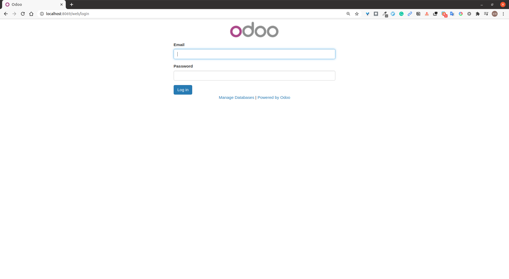
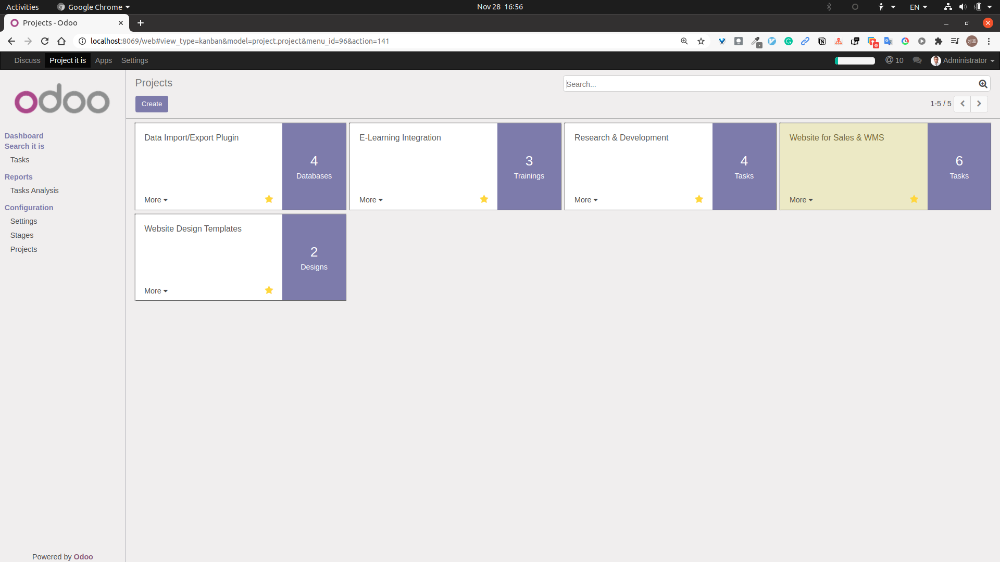
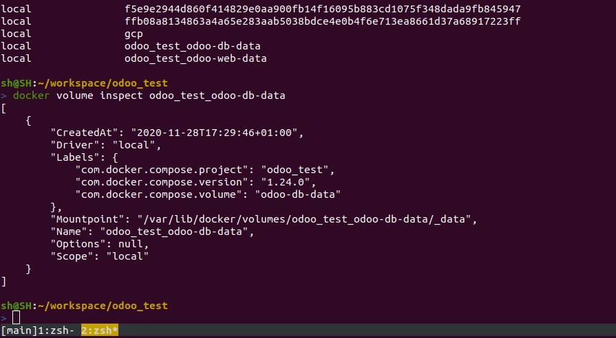

## 목표
회사의 내부 전산 작업화를 위해 ERP 서버를 구축해
데이터를 한 곳에 모으고, 추적하고, 관리하기

docker-compose.yml 파일 하나로 구성
- odoo -- postgresql -- nginx -- nagios 형태가 된다

## Step by Step
### Docker를 사용해서 어떤 환경에서도 쉽고 빠르게 서버를 관리
docker 에 대해서는 [subicura님의 블로그](https://subicura.com/2017/01/19/docker-guide-for-beginners-1.html)에 잘 정리되어 있어서 이것을 보면 바로
사용가능할 것 같다.

우분투 기준 설치 방법
```
apt install -y docker.io
usermod -aG docker $USER

curl -L https://github.com/docker/compose/releases/download/1.24.0/docker-compose-`uname -s`-`uname -m` -o /usr/bin/docker-compose
chmod 755 /usr/bin/docker-compose
chmod +x /usr/bin/docker-compose
```

오픈소스 ERP 프레임워크를 이용해서 필요한 것에만 집중하고 빠르게 개발
python 기반의 odoo 이용
javascript, c++, php 기반의 다른 프레임워크도 있었지만 파이썬을 써보고 싶고,
MVC 구조에 모듈로 잘 구성되어 있고 지원해주는 기능이 많아서 odoo 사용

docker 이미지도 제공되어 있어 바로 사용 가능

DB는 mysql, mssql, postgresql을 두고 봤을 때 postgresql이 docker에서 볼륨상태를
그대로 옮기기 좋다고 하여 사용.

`docker-compose.yml` 기본 뼈대
```
version: '3'
services:
  erp:
    image: odoo:10.0

  db:
    image: postgres:9.4
```

### docker compose 로 여러 서비스 같이 관리한다
포트, 아이디, 비밀번호 설정 등 추가적인 설정을 더해줬다

```
version: '3'
services:
  erp:
    image: odoo:10.0
    depens_on:
      - db # db 실행 후 erp 서버 실행하도록 설정
    ports:
      - "8069:8069"
    environment:
      - HOST=db
      - USER=odoo
      - PASSWORD=odoo
    volumes:
      - odoo-data:/var/lib/odoo
      - ./addons:/addions_external
    working_dir: /usr/lib/python2.7/dist-packages/odoo/addons

  db:
    image: postgres:9.4
    ports:
      - "5432:5432"
    environment:
      - POSTGRES_USER=odoo
      - POSTGRES_PASSWORD=odoo
    volumes:
      - db-data:/var/lib/postgresql/data

volumes: # 세미콜론(:) 뒤에 공백으로 해두면 docker에서 임의의 위치에 폴더를 잡는다
  odoo-data:
  db-data:
```

`docker-compose up` 을 해주면 odoo와 postgresql을 돌릴 수 있다.
브라우저를 띄워서 `localhost:8069` 입력하고 조금 기다리면 화면이 뜬다



여기까지만 해도 프로그램 자체는 띄울 수 있다
그런데 각 상황에 맞게 수정을 해줘야 하는데,
각 프로그램의 관리 파일을 찾아서 볼륨을 시켜주는 작업을 해야 한다.

### 수정하고 지웠다가 다시 실행해보기
처음 아이디와 비밀번호는 admin으로 입력하면 로그인이 된다.

`http://localhost:8069/web/database/manager` 에 접속하면 db를 새로 만들거나
수정할 수 있다

이제 odoo를 입맛대로 수정하기 위해서는 addons 폴더에 있는 내용을
addons_external 폴더로 이동 후에 수정하던지, 새로 만들어서 사용하면 된다

project 모듈로 한 번 테스트 해보자
바로 확인하기 위해 views 쪽을 수정해본다.


```
> docker exec -it --user root odoo_erp_1 /bin/bash

$ apt-get update && apt-get install -y vim # 문서 편집기 설치
$ mv project /addons_external
$ vi /etc/odoo/odoo.conf
  addons_path = /mnt,extra-addons,/usr/lib/python2.7/dist-packages/odoo/addons 뒤에 /addons_external 추가
  addons_path = /mnt,extra-addons,/usr/lib/python2.7/dist-packages/odoo/addons,/addons_external
$ exit

> vi /addons_external/project/views/project_views.xml
> docker restart odoo_erp_1
```



odoo 가 아니더라도 volumes를 이용해서 수정할 폴더를 따로 빼놓고 수정할 내용은
그곳에 넣는 방식으로 하면 수정된 내용을 바로 적용하기 좋았다

지운 후 재실행 했을 때 작업했던 것이 남아있는지 확인해보자
```
docker-compose down
docker-compose up
```
이렇게 하면 위에서 docker exec 이후 수정했던 부분은 초기화 되므로 이 작업을
자동화 해주어야 한다.
그래서 docker-compose.yml 파일 하나로만 구성 하려던 계획대로 되지는 않았다
대신 확장성이 높아졌다.

### docker-compose 확장 및 개선
Dockerfile 을 docker-compose.yml 이 있던 위치에 저장
```
FROM odoo:10.0
USER root
RUN apt-get update && apt-get update -y vim
RUN sed -i "/addons_path/ s/$/,\/addons_external/" /etc/odoo/odoo.conf
RUN rm -rf /usr/lib/python2.7/dist-packages/odoo/addons/project
```

다시 docker-compose.yml 수정
```
services:
  erp:
    image: odoo:10.0
```
->
```
services:
  erp:
    build: ./
```
다시 `docker-compose up` 을 해서 확인 가능하다

다른 컴퓨터로 옮기기 위해서는 볼륨했던 것을 찾아서 옮겨주면 된다
```
docker volume ls
docker volume inspect <odoo-erp-data>
```

```
docker-compose stop
sudo cp -r /var/lib/docker/volumes/odoo_test_odoo-erp-data/_data/ ./erp-data
sudo cp -r /var/lib/docker/volumes/odoo_test_odoo-db-data/_data/ ./db-data
```
기존 데이터를 가져오고

```
docker-compose up -d
docker-compose stop
sudo su
cp -r ./erp-data/_data/* /var/lib/docker/volumes/odoo_test_odoo-erp-data/_data
cp -r ./db-data/_data/* /var/lib/docker/volumes/odoo_test_odoo-db-data/_data
docker-compose start
```
다시 가져온 데이터를 원래 위치로 보내준다.
DB에서 추가 설정 필요 없이 바로 데이터 적용이 된다

이렇게 하면 5개의 파일 및 폴더로 ERP 서버를 구동하게 된다
```
# 폴더 트리
addons/ # 수정할 프로젝트 파일들
docker-compose.yml
Dockerfile
erp-data/ # web 내부 데이터들
db-data/ # db 내부 데이터들
```

### 간단한 모니터링을 위해 nagios를 이용했다
- Nagios - light weight, lots of modules, well documentation


위 작성된 내용에 추가
```
services:
...
  nagios4:
    build:
    volumes:
      - "/var/run/docker.sock:/var/run/docker.sock" # docker process 모니터링
    ports:
      - "8080:80"
```

### 추가로 SSL 설정
```
services:
...
  nginx:
    build:
    volumes:
    ports:
```

전체 소스는 [github](https://github.com/shdkej/odoo_gvm)에서 볼 수 있다

## 아쉬운 점
- CI/CD
- Test Code
- HAproxy
- ip setting automatic to vagrant
- repository split
- docker build to image
