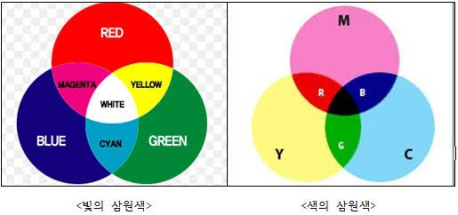

## basic
#### 접근성 챙기기
인터넷 상에서는 장애인과 비장애인의 경계가 없다 (커뮤니케이션에 있어서),
접근성 기능이 제한되어 있다면 아예 접근할 수가 없게 된다.
접근성은 최소기능이 아니라 필수기능이어야 한다.
벽이 아니라 다리가되고, 다리보다는 평평한 길이 되어야 한다.
- [W3C 접근성 검사기](https://jigsaw.w3.org/css-validator/)
- [WAVE 접근성 검사기](https://wave.webaim.org/)
- [네이버 접근성 센터](https://nuli.navercorp.com/education/disabilityType)
- [명암비 조합 파인더](https://app.contrast-finder.org/?lang=ko)
- [웹 접근성 가이드라인](http://web-accessibility.carnegiemuseums.org/code/navigation/)

#### 스크린리더가 네비게이션을 읽지 않도록 해야한다
#### 텍스트로 만든 링크 자체가 의미가 가지게 만들어야 한다
#### 컬러만으로 의미를 전달하려고 하면 색맹에게 불편하다
#### 글자마크(글자로 되어있는 메뉴) 가벼운 그림으로 표시하는게 국가 상관없이 이해할 수 있겠다
#### Typography
#### Should have make fail return button
#### 목록 창에서 페이징과 자동 로딩기능 필요

## Color
텔레비전 모니터나 조명 등에서, 다른 색의 불빛을 겹쳐 새로운 색을 만드는 가산혼합의 삼원색은, 통상 빨강·초록·파랑의 삼색이다.
그림물감 혼합, 칼라 인쇄로 색 잉크 감산혼합의 경우의 삼원색은, 시안, 마젠타·노랑이다.


가산혼합
- 빨강	`#FF0000`
- 초록	`#00FF00`
- 파랑	`#0000FF`

감산혼합
- 시안	`#00FFFF`
- 마젠타 `#FF00FF`
- 노랑	`#FFFF00`

## Font
굴림은 산세리프. 꽉 찬 글씨. 둥글둥글한 글씨
한글에서는 구리게 보인다
똑같은 자음의 크기가 글자마다 달라진다
가상의 동일한 사각형 안에 꽉꽉 채워 넣으려고 해서 글자 간격이 멀어진다
마이크로소프트가 기본글꼴로 지정했었다
기본글꼴이어서 너무 자주보는 것도 문제다.
2008년 이후 윈도우 기본글꼴이 맑은 고딕이 되었다.
복고 느낌, 가독성이 높다고 볼 수도 있다. 큼직큼직해서
- [What are those system fonts?](https://css-tricks.com/snippets/css/system-font-stack/)

## Darkmode
- Don't use a perfect black
- low 채도(Saturation), 명도(Brightness)
- text, background contrast ratio minimum 15.1:1
- depth, visual hierarchy
- `background: #000; color: #fff;`

## [[Video]]

## in WEB
#### what is good?
- round vs non-round
- shadow
- font-size

#### side toc convert size
15" full-size 1900 half-size 950
 content full-size 1170
  middle-size 750
  mobile-size 780

gitlab convert line 990
subicura convert line 1100
evan moon convert line 770

i want when 15" monitor half size view is ... index view is better?
--> toc size 20%, screen < 1200

#### anchor offset
```
:target::before {
 content: '';
 display: block;
 height:  180px;
 margin-top: -180px;
}
```
- https://stackoverflow.com/questions/10732690/offsetting-an-html-anchor-to-adjust-for-fixed-header

#### font-size
font-size 19 < x < 28
medium 21px mobile:18px
brunch
- line-height

#### 그림 속 색깔
무채색 속 하나의 유채색을 집어넣으면 색이 더 부각되고 멋져보인다

#### 웹페이지를 영화의 미장센처럼 꾸민다?
사진처럼 꾸민다?
인류가 가장 친숙한 2d 평면 시각체는 무엇?
2d가 좋을까 3d가 좋을까

시간, 공간적 특성을 담는다
그리드로 다양한 환경에 구애받지 않도록 한다

## Reference
- https://csslayout.io/patterns/
- [디자인 시스템을 구성하는 방법](https://medium.com/guleum/디자인-시스템을-구성하는-방법-beefa8214884)
- [디자인 시각적 요소들](https://brunch.co.kr/@shaun/40)
- [웹폰트](https://wit.nts-corp.com/2017/02/13/4258)
- [안전하게 따라 할 수 있는 비주얼 디자인 규칙들](https://news.hada.io/topic?id=8573)
