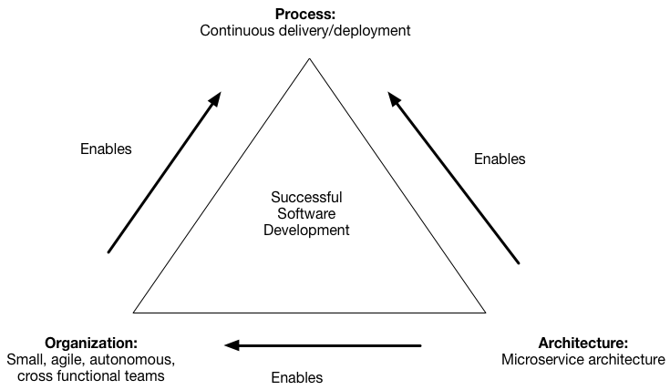

## 아키텍처 설계 목표

인프라 구축 및 배포를 쉽고 빠르게, 피드백을 잘 받아 점진적으로 발전하는 환경을 만들겠다.

**좋은 아키텍트는 세부사항에 대한 결정을 가능한 한 오랫동안 미룰 수 있는 방향으로 정책을 설계한다.** 
- 클린 아키텍처

#### 아키텍처 필수 고려사항

- 변하지 않을 것과 변할 것을 정해놓고 조정한다.
	- 변경하기 쉬운 환경이 되도록 설계한다
- 피드백 루프를 만든다
    - 어떤 항목을 봐야 이것이 잘 진행되는지를 확인 할 수 있어야 한다
    - 변화의 기록을 챙겨야 한다 (following changed thing)
- 백업 잘 해야 한다. 백업 전략을 세워야 한다
- 시스템 구성을 하나하나 검증하며 도입하기
- 재사용성
- 실패를 빨리 한다. 실패 상황을 고려한다.

#### 테크니컬 고려사항
- local loading file time > 0.4s
- external network time > 0.4s. - total 0.8s
- 배포용 이미지를 만든다.
	- 배포용 이미지는 항상 처음부터 새로 빌드돼야 한다. 덮고 덮는 방식은 불확실성을 증가시킨다.
- 도메인을 생각하자. 도메인이 디자인을 만든다.
- auto scaling
- auto recovery
- 고효율 저비용
- 덮는 방식인 프레임워크보다 붙이는 방식인 **어댑터 방식**이 좋다
- 내부적으로는 효율을 최대로 하되 사람들은 쫙빠진 것보다 넉넉한 것을 더 좋아하는 점을 생각한다
- User experience searchable website
- 서비스는 관리자가 관리하지말고 사용자가 관리할 수 있게 하면 좋겠다
- 기능을 제공해주지 말고 모듈로 만들 수 있게 하고 여러 개 선택할 수 있도록 한다
- 새로운 툴이 관리점은 줄이고, 편의기능은 늘릴 수 있으면 좋겠다.
- 복잡도는 낮추고 싶고 서비스는 많이 만들고 싶다
- SOLID - Open Closed Principle
	- 변화를 최소화 하기 위해 변화 예상가능한 부분을 설계시 나눠놓아야 한다는 원칙인데 그 기준선을 어떻게 설정하느냐가 중요할 것 같다
- [[Devops#server architecture to using some company service]]
- 피처 플래그 사용
	- 피처플래그는 aws parameter store를 사용해서 api로 관리해도 되겠다 람다로도 해도 되고 와우

## Check Point
프로젝트 전 한번씩 점검하기
- 수시 배포 vs 정기 배포
	- 결과를 빠르게 확인 가능
	- 에러 확률 증가 - 빠른 롤백으로 위험도 낮출 수 있음
	- vs
	- 너무 큰 배포 단위가 될 수 있음
	- 테스트 상태의 결과와 실제 결과가 다를 수 있음
	- 배포일자에 에러 집중
- 강제성을 얼만큼 할지, 자율성을 얼만큼 할지
- 업무가 가능한지 아닌지 판단할 방법
	- 업무를 받으면 어떻게 시작하면 좋을지? 관계가 어떻게 되있는지 알아야 하는데..
- 코드와 설정을 분리한다. divide code / config file
	- CoC 를 위해 설정을 쉽게 할 방법
		- 사용자 스펙을 읽어서 없으면 서버 스펙을 사용한다.
		- 서버 스펙은 사용자가 건드리지 않게 한다.
		- nagios도 이렇게 되있었고, vim이나 zsh등 커맨드라인 툴들도 이렇게 되있다. odoo도 파일을 만들어서 오버라이드 되게 해놨지만 기존 코드를 바로 건드릴 수는 있었다.
- 자주 변하는 것과 자주 변하지 않는 것 고려하기
	- 자주 변하지 않는 것은 신경 안써도 되도록 하기
- 계산 중심 구조(cpu) vs 데이터 중심 구조
- 디렉토리 단위를 기능별로 할지, 역할별로 할지
- 코드 분리 기준
	- 회사에서는 레이어별로 나눴다
	- 마이크로서비스에서는 기능별로 나눈다
- monorepo vs microrepo
- 깊이 vs 넓이
- 팀 구조에 따른다
	- 프로젝트별 팀 vs TF 팀 vs 역할별 팀 vs 기능별 팀
- 디렉토리를 중첩시켜 한 레포 안에 둘지
	- 디렉토리가 중첩되면 프로젝트를 분리 시켜 레포를 나눌지
- 회사의 소프트웨어를 자체적으로 구축한 것을 쓰느냐, 잘 가져다 쓰느냐
	- 나의 아키텍처를 너무 좋아하게 되면 다른 아키텍처를 거부하게 되거나 보기 힘들어지지 않을까
	- 내 아키텍처를 만들기보다 다른 사람들의 아키텍처를 받아들이는게 나을까
	- [[About_Development#쿠팡이 자체적으로 만든 서킷브레이커와 api gateway]]
- 하나의 툴과 종속성
	- 쿠버네티스의 기능을 모두 쓰는 것이 다른 도구를 줄일 수 있는 방법이다. 근데 그러면 쿠버네티스에 종속성이 심하게 걸린다
- 개발은 docker compose로 운영은 kubernetes로 하도록 사람들을 유도할 수 있을까? 나는 이렇게 작업하고 있는가?
	- [[Container#docker-compose를 이용해 이미지를 바로 배포하는 것과 Dockerfile을 쓰는 것]]

## 아키텍처

#### 일관성이 중요한 것 같다.
각 회사마다 저마다의 아키텍처가 있어서 개발자는 그 아키텍처를 파악해야한다.
그렇다면 한 부분을 알았을 때 다른 부분도 그와 비슷하거나 일관성이 잘 유지되어
있는 구조라면 쉽게 익힐 수 있다. 어떤 아키텍처인지는 그 다음 문제인 것 같다.
일단 일관성이 있으면 가독성이 올라가고, 이것이 소프트웨어를 좋게 만들어준다.

#### 중심만 남긴다
개발 로직, 중앙 문서 관리 서비스, 코드 저장소, 데이터 저장소

#### 인프라 개발자의 관점에서 3 요소
인프라 - 데이터 - 서비스

서비스 안에는 백엔드, 프론트, 디자인, 기타 등등이 또 따로 있을 것이다.
인프라에는 시큐리티, 로깅 등등이 있고,
모든 요소에 QA와 테스트가 있다.

#### 프로젝트 아키텍처
- 넷플릭스 모델 - 전체가 하나로 묶여있다
- 네이버 모델 - 각 역할별로 분리되있다
- 리디북스 모델 - 데이터가 묶여있다

#### 그동안의 아키텍처 모델
- 3 layer
- MVC - MVVC - MTV
- 네트워크 레이어
- 12 Factor app
- MSA
- DDD
- JAM stack
- [Clean Architecture](https://blog.cleancoder.com/uncle-bob/2012/08/13/the-clean-architecture.html)
- SOA

그리고
- 육각형 아키텍처
- DCI data, context, interface 제임스 코플리언
- BCE bounded control entity
- https://ahnheejong.name/articles/package-structure-with-the-principal-of-locality-in-mind/
- https://mingrammer.com/translation-structuring-applications-in-go/
- https://geminikim.medium.com/지속-성장-가능한-소프트웨어를-만들어가는-방법-97844c5dab63
- https://overthecode.io/the-meaning-and-limits-of-atomic-design-from-a-software-design-perspective/

#### SOA, MSA, DDD
service oriented architecture
- 중간에 enterprise service bus를 둬서 서비스 간 공유를 하려고 했으나, 당시
  시대상 팀 구조가 변화에 재빠르게 대응하지 못했고, MSA와 비슷한 목표를 가졌으나
  성공하지 못했다.
- MSA의 핵심은 통신 처리이고, 이 처리 흐름을 만들어내는 서비스 메시가 등장했다.
  마이크로 서비스는 서비스의 수가 많고, 이를 관리하는 방법이 필요하다

#### 좋은 아키텍처가 성공을 보장하지는 않지만 나쁘면 망한다

- 나쁘지 않게 하는 것은 되야한다
- 완벽보다는 안정
- DDD는 쉽게 설명가능한가? 복잡한 구조라도 쉽게 설명되면 된다. 쉽게설명되지 않으면 나쁘다
- 객체지향을 넘어 인간지향 인간중심
- 나쁘면 안된다는걸 생각하지만 안티패턴을 피하는 방어적 접근보다는 좋은걸 찾는 공격적 접근을 하고싶다
- 아키텍처가 시스템 구성을 다 정하는게 아니라 이해관계자와 먼저 요구사항을 정의하고 팀원들과 기술적 문제해결방법을 의논하고 패턴을 같이 찾고 정하게 되는 건가보다. 충섭팀장님의 쿰스를 이끄는게 아키텍처의 모습을 그대로 보여준거 같다 잘 기억해야할듯
- 푸시 개발했던게 프로젝트 진행하면서 중간에 반발이 생긴 사례인거 같다 푸시 개발 과정을 정리하는 것도 좋을듯. Nhn에 수많은 요청을 보낸것부터 새로운 api 개방을 요청하고 사용한 것까지

> 개발자에서 아키텍트로 - 마이클 킬링

#### 아키텍처

> 정책과 세부사항으로, 룰과 가이드를 구분.
> 아키텍처의 목표는 정책과 세부사항을 적절히 구분해 세부사항의 결정은 최대한 미룰 수 있게 하는 것
> - 클린 아키텍처

아키텍처 구축의 목표점은 없다
**좋은 기준점을 만들어서 그 기준점을 계속 개선해나가는 것이 최선**

큰 그림 > 작은 그림

선택과 집중, 유연하고 융합적인 환경 - 두 가치를 어떻게 잘 융합할 수 있을까
- 분산화 하는 것이 시대의 흐름
- 심플하게 유지. 0에서 10은 심플이 아니다. 100에서 10이 심플
- 제한이 필요하다

설정가능해야하고 플러그인 방식으로 동작

log data 나 db table 등을 초기에 설계해서 쭉 써야하는 것보다는 변경에 유연했으면 좋겠다
변경에는 근거가 필요하지만, 실제로 변경할때는 쉽게 할 수 있도록. 마이그레이션이 쉽지 않다
변경에 유연한 것들은 무엇이 있을까

관리요소가 많아지면 일관성이 깨지기 쉽다
코드가 많아지면 고쳐야하는 지점이 늘어난다

한 부분의 변화를 위해 다른 부분을 신경 쓰지 않아야 한다.
한 부분의 변화가 다른 부분에 영향을 주지 않아야 한다.

#### 코드레이아웃
- controller, Service, Domain, entity
- controller에서는 1단계 if와 명료한 함수들로만 이루어져있다
- service에는 간단한 유닛함수를 묶은 로직만 있다
- domain에는 간단한 유닛함수들만 있다
- entity는 리턴값과 등등을 감싸주는 래퍼를 가지고있다
- controller와 service 사이에 세세한 에러 처리 로직은 facade에 들어간다

#### 유지 보수가 잘 되게 하려면?
- 정확한 정책을 통해 역할을 분리, 위임한다

#### 자동화

자동화는 오류를 일으키기 쉽다
조심히 도입해야한다

메타적으로

흐름만 만들고 세부사항은 자동화해서 알아서 일하게 한다

service output이 feedback이 되도록

- 테스트 문서 자동화
- 모니터링 문서화
- api 문서화

업무자동화 한번에 왜 안되는가
- 새로운 업무환경을 이혀야 함
- 엑셀로 관리되는 데이터. 수기로 입력해야만 하는 데이터
- 아는 범위까지만 최적화 되고 놓친 부분이 있으면 거기가 꼬인다.
- 기존 시스템을 다 파악하기 힘들다. DB 테이블 명세와 메뉴얼 부족
- 보안적인 요소

#### 자동화의 문제점 (자동화보다는 일괄적용의 문제점 일 수 있겠다)

자동이 자동으로 잘 동작안하는 걸 자주 보고
스마트가 스마트하지 않았고
한번에가 한번에 되지 않았다
전체를 스크립트를 짜서 변환시키는 것도 항상 실패하는 것들이 나온다.

#### AI와 자동화
- 사람이 하면 누락이 생길 수 있다
- 스크립트로 하면 기계적으로 동작한다. 정해진 폼이 아니면 이상한걸 막 가져온다
- AI로 하면 결과가 매번 다르고 정확하지 않다

#### CSP
Communicating Sequential Processes
golang의 groutine의 동작 방식이자, 네트워크로 연결되있는 자원들이 서로 통신할 때 효과적인 모델.
마이크로서비스에서 수많은 서비스들 간의 연결과 복잡성을 관리하기 위한 hashicorp의 선택

#### 관련 백링크
- [[Standard]]
- [[Decision]]
- [[Reality#러셀과 화이트헤드]]

---

## 필요한 컴포넌트

최소 아키텍처를 먼저 준비해놓고 거기에 필요에 따라 하나씩 추가한다.
규모가 일정 범위 이상 커지면 다음 패러다임을 준비한다.

#### component
기본
- db
- backend: lambda
- frontend: nettlify/now/surge
- file: s3
- image: cloudinary
- con: ifttt
- 큐/캐시: redislabs
- design: figma
- domain
- dns
- MQ

추가
- 오토스케일링 2~8개 파드로 유지
- ingress - 내부 아이피 전달용
	- tls인증서, failover, 로깅, 모니터링
- 자동dns, ssl, 로드밸런싱: CloudFlare Proxy -> AWS L4 NLB
- cdn
- secret - kubeseal
- clickhouse - 분석데이터
- 모든 인프라 코드를 한 곳에 저장해놓고 끌어다쓰기?
- 오류 추적
- profiling - cProfile, snakeviz
- 서버 부하 분산 - haproxy and zookeeper
- 대기열
- 로드 밸런싱 후 헬스체크 해서 이상 발생시 자동 재실행 스크립트 실행
- 서버 증설 확장 용이
- 다운되도 대응 가능(failover)
- when would you use request/reply and publish/subscribe
	- 이벤트 드리븐 아키텍처

---

## Security

- how to manage ssh key?
  1. make every each computer
  2. keep other storage

[[Tool#서버 보안 설정]]

#### jwt, oauth, session

- token can make easy check current users count?

#### double check, error handling, logging, security

#### reference

- [암호화 이것만 알면 된다](https://www.slideshare.net/ssuser800974/ss-76664853)

#### SSH
ssh 접속 후 생기는 파일
- .known_hosts
- .authorized_keys
- authorized_keys에는 pub키가 들어간다. 서버측에.

SSH 와 TLS를 같은 원리로 생각했다.
- ssh에도 public_key와 private_key가 있지 않은가
- TLS에는 crt와 key가 있다,
- TLS = RSA + 대칭키
- HTTPS는 HTTP + TLS
- 해시 함수 MD5, SHA <-> 대칭키 AES, 공개키 RSA

#### SSL/TLS
- HTTP를 HTTPS로 만들어주는게 TLS 연동하는 거
- SSL은 처음 나왔을 때 이름. 현재는 TLS라고 불림
- SSL3.0 이 TLS1.0과 같음
- TLS 1.2가 2008년 버전이고 TLS1.3이 2018년에 나옴
- 빨라지고, 단순화되었다.
- nginx나 브라우저에서도 TLS1.3이 지원되어야 한다

#### RSA
RSA는 결과값을 가지고 있어도 원래의 값을 알 수 없는 소수의 소인수분해의 어려움을 통해 강력한 보안성을 가진다.
이게 TLS에서 어떻게 쓰이는거지?
비밀키가 원래의 값이고 공개키가 결과값인가?

#### 공개키, 대칭키
- 공개키는 비밀키를 공유하지 않아도 된다는 점에서의 장점이 있다.
- 대신 공개키를 가지고 있으면 누구나 정보를 볼 수 있다?
- 공개키로 암호화한 것은 대칭키가 없으면 볼 수 없다.
- 공개키 방식만으로는 서버에서 클라이언트에 안전하게 정보를 전달할 수 없다.
	- 대칭키가 해독을 해야하는데, 서버는 정보를 전달하는 쪽이니까.
- 공개키로 암호화 된 것을 복호화 할 수 있다. 그래서 공개키 방식은 파일의 안전을 보장해주지는 않는다. **하지만 그 파일의 신원을 확인해줄 수 있다.**

#### TLS

public 과 private.
- private 는 목적지. 한 곳에서만 가지고 있는다
- public 은 접속자. 모두가 자유롭게 갖는다

ci 이용 시나 push할 때 ssh permission을 확인하려는 목적인가?

- ci 툴에서 서버는 ci 서버가 되는 것인가? 클라이언트가 내가 되고?
	- ci 툴이 접속자고, github 저장소가 서버가 되어서, **서버에서 pub키를 가지고 접속자가 private key를 가진다**
	- 서버가 접속자고, 나는 목적지
- 클라우드 서비스에서는 노트북에서 생성한 ssh 를 cloud instance에 넘기고 내가 다시 public이 되어서 접근하는 것인가?
	- ec2에서 pem키를 받는 것은 ec2가 목적지고 내가 접속자
	- private는 미리 aws에 올려놓고 그것을 가져다 쓰도록 하면 좋겠다
	- aws 에서도 pub키를 서버에 보내고, 비밀키는 노트북에 둔다
- 포맷을 대비해서 ssh key를 파일로 갖고 있으려고 하는데 private key를 갖고 있어도 되나?
- 공개키를 서버에 등록해서 클라이언트가 비밀키를 가지고 있는다?
- authorized_keys에 공개 키를 복사해 넣으면, 접속하는 곳에서 비밀키를 물어본다
- .pem 파일은 뭐지 = 형태만 다른 private key와 같은 용도
- [[Archive#내가 오해한 SSH key]]

GPG - 개인용 메시지를 암호화하려고 할 때 쓴다

- 내 공개키는 마구 뿌린다
- 그러면 내 공개키를 이용해 만든 데이터는 내 비밀키로만 열 수 있다.
- 내 공개키를 갖고 있다고 내 정보에 접근할 수는 없나? 수신용인가?
- 주인장의 사이트에 공개키가 올려져 있어도 그것이 조작된 것일 수도 있다. 그래서 CA 업체에서 이를 검증한다.

- [x] SSH에서 pub키는 gpg키처럼 마구 공유해도 되는게 아니지 않나? pub키만 있으면 서버에 마음대로 접속할 수 있는데
  - pub키가 서버가 갖는 키고, 클라이언트는 private key를 갖는다.
  - 그래서 pub키가 많이 퍼지면 클라이언트는 많은 곳을 갈 수 있다.

비밀키도 어차피 키를 지켜야한다는 것은 하나의 비밀키를 공유하고 그것을 지키는 것과 똑같다. 근데 비밀키를 공유한 적이 있냐 없냐의 차이로 보안성의 차이가 있다.

- [ ] HTTPS도 공개키 방식처럼 암호화를 개인키로 하면 비밀키로 복호화를 해야하는 방식인가?
- 공개키는 누구나 가질 수 있다. 비밀키로 암호화 한 것을 공개키로 누구나 열 수 있다면 내용이 지켜지지는 않을 것 같다.
	- 그래서 End-2-End 암호화도 신경 써야 한다.
	 - HTTPS에서 인증서로 신원을 확인하고, 그 통신에서 확인한 랜덤값으로 다시 키를 만들어서 그 키로 데이터를 암호화한다.
	 - 클라이언트가 처음 접속할 때 보내준 공개키로 랜덤키를 암호화해서 서버에 주고, 그 키로 정보를 공유한다. 즉, 처음 만들었던 인증서는 신원확인용이다.
	 - 신원 확인은 제 3자가 한다. (CA 업체)
  - 즉, HTTPS는 공개키 방식과 대칭키(암호) 방식을 모두 쓴다.
  - https://bravenamme.github.io/2019/12/03/https-2/
- [ ] 비밀키를 서버가 갖고, 공개키는 아무나 갖는다. 근데 CI에서 비밀키를 가지는 것은 어떻게 생각해야하지? 브라우저에서는 서버가 비밀키를 갖는다.
  - 비밀키를 클라이언트가 갖는다. CI secret에 비밀키를 입력하면 builder에 접근할 수 있게 된다. pub키는 어떻게 등록했더라? 다시 동영상 봐야겠다.
    - pub키를 deploy key에 넣고 private key를 secret에 넣었다. github도 이렇게 되나? 되네

#### HTTPS

- [ ] 서버가 자신임을 증명해야 하는 이유는?
  - 클라이언트는 어차피 불량한 사이트에 들어가도 작업이 정상적으로 될텐데.
  - 중간에 길을 꺾어서 자신에게 결제하게 하는 것은 막을 수 있겠다.
  - 중간에 데이터 탈취를 못하게 하는 역할이 주 역할인가?
- [ ] HTTPS는 국가에서 막기 힘든 이유는?

#### OAuth

브라우저, 사용자, 서버, Oauth 제공자

서버는 브라우저에 Oauth를 표시한다
사용자는 브라우저에 Oauth 버튼을 누른다
브라우저는 서버에 사용자 정보를 주면서 신호를 준다
서버는 Oauth 제공자에게 사용자 정보를 준다
Oauth 제공자는 사용자에게 코드를 보낸다
사용자는 서버에 코드를 보낸다
서버는 Oauth 제공자에게 코드와 사용자 정보를 보낸다
Oauth 제공자는 확인 후 서버에 토큰을 준다

사용자 -> 서버 -> Oauth (사용자 정보)
사용자 <--------- Oauth (코드)
사용자 -> 서버 -> Oauth (사용자 정보 + 코드)
서버 <- Oauth (인증 후 토큰 제공)

서버가 바뀌어도 사용자는 자신이 원래 하던 일을 그대로 할 수 있나?

#### oauth2.0

- 로그인
- 토큰 획득
- 토큰 및 아이디로 내부 저장
- 토큰을 사용자 헤더에 갖도록 하기

토큰 확인
사용자 확인
요청 동작 실행

#### user 세션 관리

하나의 서버를 스케일 아웃해서 여러 대로 만들어놓으면 유저 정보가 어느 곳에는
있고, 어디에는 없는 상황이 벌어진다. 이를 해결하는 방법이 몇개 있는데.

sticky

- 유저가 처음 접속한 서버에 계속 접속하도록 유지하는 방법.
- 서버 과부하가 일어날 수 있다.
- 서버가 뻗으면 데이터를 잃기 때문에 단일 실패지점이 된다.

clustering

- 각 서버끼리 데이터를 공유해서 동기화하는 방식
- 데이터 동기화를 하는데 자원이 많이 소비될 수 있다.

따로 세션 서버를 두는 방식

- 접속 시 세션 서버에서 데이터를 불러와서 검증하는 방식
- 관리 지점이 증가한다.
- OAuth가 이를 대신해준다.
  - 대신 유저 정보를 따로 관리해서 이용할 수 있어야 한다. 서비스 개선을 위해.

https://chagokx2.tistory.com/93

#### reference
- [vault](https://www.slideshare.net/DoyoonKim30/20-vault-107929281)
- [jwt](https://lazyhoneyant.tistory.com/m/7)

---

## Micro Service Architecture

MSA 는 작은 규모에서는 과한 느낌이 있다
모놀리스로 쉽게 관리가 될 것을 MSA를 사용하면 관리포인트가 엄청 많아진다

- every node make end-point, http, grpc
	- need documentation
- flexible micro service. it can be split and compose
- logging and visualization
- 마이크로서비스에서 문제가 생긴 지점을 바로 확인할 방법은?

#### 마이크로 서비스

라이브러리를 쓰듯이 다른 서비스들을 사용하면 성능 상의 손해가 있다
마이크로아키텍처는 관리할 지점이 늘어나는 단점이 있지 않나

- 메시지 기반의 비동기 통신
- 사가 패턴 - 데이터 일관성 유지를 위해
- 도메인 주도 설계
- 이벤트 소싱 패턴

- API
- 서비스 메시
- 서비스 디스커버리
- 메시지 처리
- 서킷 브레이커

- API gateway, 서비스 메시, 서비스 디스커버리 차이는?
  - 서비스 메시 안에 서비스 디스커버리가 보통 내장되있다
  - api gateway는 외부에서의 접속, 서비스 메시는 내부의 네트워크 관리

왜 마이크로 서비스인가

- 마이크로 서비스를 위해서는 필연적으로 서비스 간 커뮤니케이션이 필요하고,
  비동기 통신과 동기 통신을 잘 구분해서 사용해야 한다.
  - 동기는 API를 이용해서, 비동기는 메시지 큐를 이용해서.
  - 각 서비스 간 데이터를 메시지 큐에 발행하고 구독하는 식으로 데이터 공유, 이벤트 처리가 가능하다.
- 마이크로 서비스를 일일이 관리하기 보다 서비스 디스커버리를 이용해서 자유롭게
  생성과 운영이 되게 해야겠다
- 단일고장점이 없도록 노드를 여러 개 두어 관리하는 것이 좋겠다.

- 큰 팀을 작은 팀으로 나누면 팀 간 대화에 장벽이 생기고, 안개가 생긴다. 다른
  팀의 영역에는 안들어가려고 하고, 그 쪽에서 일어난 일이 전달이 안될 때가
  많아진다. 어떻게 이 장벽을 없앨 수 있을까
- 핵가족에 이어 1인가구가 늘어남에 따라 대가족일 때는 자연스럽게 알 수 있던
  것들이 이제는 공부를 해야 알 수 있게 되었다.
- 수평적인 연결망이 만들어져서 정보공유를 할 수 있게 해야한다. 회사에서 팀장이
  있고 팀장회의를 하는 것과 비슷한 느낌이지만 수평적인 관계의 연결망으로.
  (현재의 커뮤니티가 이 역할을 하고 있는 것일까? Web 2.0)
- 어차피 한 사람이 모든 마이크로서비스를 관리할 수 없다? 그래서 모놀리스에서 서로 엮여있던 것을 마이크로화해서 편하게 관리할 수 있게 하는거지 마이크로서비스를 무한정 많이 만드는 것이 목적은 아닐 것이다. 한 사람이 다루는 서비스를 제한 해주는 것이 좋겠다.

#### 마이크로서비스

접근 포인트
- 단일 고장 지점을 없앤다
- 의존 영역을 분리한다
- 빠르고 가벼운 사이즈를 유지한다

이를 어렵게 하는 요소
- API endpoint가 많아져서 이를 일일이 관리하기 힘들어 API Gateway라는 것을 이용하려 하는데 이 API gateway가 단일 고장점이 되버린다
- 흩어져 있는 데이터 여러개를 합쳐서 사용해야 할 경우가 있다
- 처음에는 작은 사이즈지만 요구사항이 늘어남에 따라 사이즈는 필연적으로 커진다.

이에 대한 마이크로서비스의 대응방법
- sidecar 패턴으로 API gateway를 없애고 각 서비스에 연결점을 붙인다
- SAGA, CQRS
- 사이즈가 커지면 다시 분리한다.
- 미이크로서비스간 데이터 통합과 작업 일관성 유지를 위해 다른 서비스가 필요한데 이를 커밋과 적용으로 나누는 방식으로 할 수 있고 사가 패턴을 이용해 해결할 수도 있다

궁금
- 쿠버네티스의 구조처럼 마이크로서비스를 구현하면 되지 않을까
- 데이터를 다 분리해놓고 중앙에 모아서 처리하다가 요청이 자주 오간다 싶으면 연결하는 길을 추가?

한 마이크로서비스의 단위를 로직 - 데이터베이스 - 사이드카로 놓고 사용
이 마이크로서비스를 관리하는 툴을 생각해본다

중앙에 데이터들이 하나로 묶인다
한 마이크로서비스에 요청이 오면 그 응답으로 메시지를 보낸다
메시지는 중앙, 관리자에게 전달되고, 관리자는 피드백으로 중앙에는 업데이트로 이용된다

kubernetes로 여러개의 서비스로 쪼개면 microservice인가?
micro로 서비스를 만들면 microservice인가?
monolith와 구분되는 microservice의 특징은 각 서비스가 개별 데이터베이스를 갖는 것인데, micro는 어떤 구성 방식인가

유저 정보 유지해서 계속 불러오는 효율적인 방법은?

모놀리스에서 함수호출을 이벤트 드리븐이 대체했을 때 고속처리가 가능한가? 배민은 되긴 하나보다

- 같은 네트워크에 있다면 rpc로 서비스가 나눠져 있으면 rpc로 데이터를 취합해 api gateway가 모은 데이터를 리턴해주면 된다

쿠버네티스에서는 RBAC가 어느 순간에 동작하는거지?

마이크로서비스의 library를 한곳에 모아서 보여주고 쉽게 호출해 쓸 수 있도록 해야한다. 어떻게?

#### 마이크로서비스
마이크로서비스는 내 생활방식과 다르다
마이크로서비스화도 무한정 많이 할게 아니라 탈출지점을 만드는게 좋겠다. 한 팀이 감당할 서비스를 생각해서

분산 데이터
분산 서비스
분산 환경을 컨트롤하는 게 필요하다

복잡성도 분산 환경에서 있고 분산이 곧 개별적인 인간 세상과 닮은 소프트웨어의 구조

마이크로서비스의 경계설정
데이터 쿼리 트랜잭션
데이터 모아서 처리하기

마이크로서비스는 데이터가 뿔뿔이 흩어져있다고 느낄 수 있다
신경써야할 요소가 많아진다고 볼 수 있다
넷플릭스는 이것을 어떻게 관리하지?

모놀리스로 개발하다보면 기존에 것에 계속 추가해야하고 수정해야한다.
새로운 기능이 필요하면 기존 구조를 건드려야 할 수도 있다
이것을 막기 위해 마이크로서비스를 쓰지만
관리포인트는 줄일 수 있어야 한다.

#### 서비스메시

규칙기반의 부하분산으로 배포(테스트에 배포)와 릴리즈(프로덕션에 배포)를 분리하기 좋다고 한다

텔레메트리 관리
- 네트워크 트래픽 관련 지표 수집 및 추적

#### CQRS

- 쿼리와 커맨드를 분리했다.
- 쿼리는 CRUD의 Read의 개념이고
- 커맨드는 나머지 CUD의 개념이다.
- Read를 조합해서 나머지 명령을 하는 경우가 많고, Read 작업이 다른 작업과 사용되는 빈도에도 차이가 있기도 하다.
- 마이크로 서비스에서 특히 다른 DB에서 가져올 때 조합하기 위해 이렇게 분리하면 좋을 것 같다
- 이 개념에서는 애초에 모델, 서비스 자체에서 쿼리와 커맨드를 분리해서 다른 서비스로 만들라고 한다

구성요소
- 사가
- 애그리거트
- 쿼리
- api

#### event driven architecture

- in micro service, each service need send some event.
- if not implement event, can parse some data?
- http server <- event producer -> queue
  DB
  lambda
- lambda can assign http or sqs. how to get data?

#### microservice experience

- [배민](https://www.youtube.com/watch?v=BnS6343GTkY)
	- 결제 장애 시 결제만 장애나는 환경을 원했다.
	- 모놀리스 서버 테이블이 700개... >> 분리 후에도 한 서비스에 테이블이 많이 있을 것
	- 이벤트 기반으로 하니 훨씬 효율이 증가했다.
- [11번가](https://www.youtube.com/watch?v=J-VP0WFEQsY)
	- Spring cloud 이용

#### junk food

넷플릭스가 마이크로서비스를 하면서 느꼈던 개발의 주요 문제점
- dependency
	- circuit breaker 로 의존성 있는 서버가 죽는 것에 대응
- Scale
	- EVCache
- Variance
- Change

#### architecture process organization

출처: https://kihoonkim.github.io/2018/03/25/Microservices%20Architecture/first-msa-retro/

#### When many people come to site. how to keep working server

1. allow maximum people, others redirect to queue.
2. scale out

#### 섀시

에러 체크, 로깅, 헬스체크, 회로 차단 등 마이크로서비스에 필요한 것들을 만들어놓은 것을 이용하자는 마이크로서비스 섀시라는 개념이 이미 있었다
go-kit, micro 참고

- 외부화(엔드포인트 적용)
- 헬스체크
- 모니터링 지표 뽑기
- 서비스 디스커버리
- 회로 차단
- 분산 추적
- 로깅(액션 기록)
- 보안
  이 기능들을 메인로직에 적을 필요없이 섀시를 적용시키면 자동으로 기능이 수행된다

그리고 서비스 메시는 섀시의 진화 형태가 될 것인데, 현재는 일부 기능만 구현하고 있고, 아직 완전 대체제는 아니다
istio, linkerd

istio에서 분산 추적을 하려면 app: deployname 을 라벨링 해줘야 한다

#### 마이크로서비스에서 두 서비스에서 불러온 데이터를 어떻게 합칠까

두 서비스면 그냥 호출하는데서 부르면 되겠지만
rdbms에서 하던 조인처럼 자유자재로 하기에는 성능이 안나온다

CQRS의 쿼리를 이 상황에 쓰던가
아니면 쿼리를 모아서 rdbms로 모으는 추가적인 리소스를 이용해서 해결?

