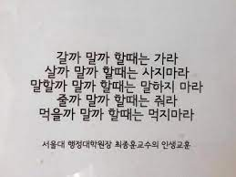

## 선택, 고민

## 요약
- 선택지를 3개로 줄인다
- 선택이 힘들면 조건을 늘린다
- 트레이드 오프는 있을 수 밖에 없다. 그것을 염두에 둔다
- 제약은 없을수록 좋다
- 범용적일수록 좋다
- 사람 중심의 디자인. 사람이 쓰기 편한 것.
- 최악은 피한다

## 선택과 집중
#### 전체를 아우르기 - 선택과 집중

#### 나에게 역할을 부여해서 그것에 충실하는게 도움되지 않을까
- 나의 롤을 어떻게 설정해야할까
	- 리더
	- 근데 모두를 신경쓸 순 없다
- 선택과 집중
	- 타이거팀
- 세상을 장악하고 사람들을 휘어잡는 능력을 가진 나를 상상한다
- 세상 별거없고 사람들 모두 힘든 순간을 열심히 이겨내며 살아가는 동료들인데 소극적으로 세상을 대할 필요 없다 전체를 아우르는 태도를 갖고 있자
	- 선택과 집중을 하면서도 전체를 아우르려면 어떻게 해야할까
	- 타이거팀 고민과도 같은 고민이다. 좋다
	- 이게 tf나 스쿼드팀과 비슷한 의미로 쓰이기도 하는거 같은데 내가 생각한 의미는 좀 다르고 tf는 잘 동작하지 않는다고 생각했다. 디벨로퍼 릴레이션십 역할이나 데브옵스가 개발자와 긴밀하게 소통하는 역할 같은 것을 생각한다.
	- 테크 에반젤리스트 디벨로퍼 어드보게이트 advocate
	- 나는 근데 외향적인걸 좋아하는 성향이 아니고 섬세하지 않아서 에반젤리스트적인 것과는 거리가 좀 있다
	- 전달을 하면서도 소수의 사람과 연결되는 방법이 있을까 한번은 소수지만 모여서 전체를 아우르는.. 그냥 모든 걸 다 가지려는 욕심일까

#### 선택과 집중
궁금한 분야에 관련된 책이 한국에 딱 한권만 있다면 아마도 그 책에 의존해서 깊이 팔 것이다
근데 요즘엔 너무 많은 책이 있어서 한권도 제대로 안보게된다
어떻게 하면 선택과 집중을 잘 할 수 있을까

더 좋은 신박템이 없을까 하고 계속 상점을 뒤진다
이걸 정보에도 이런식으로 접근하면 좋을텐데

## 결정

#### 종류
- 여러 개 중에 고르는데 사고 나면 바꾸기 싫을 때. e.g. [[#Notebook]]
- 여러 개 중에 고르는데 여러 개를 써보고 판단. e.g. [[#Note]]
- 진행 방향을 고르기 (선택지가 추상적). e.g.
- 할지 안할지 둘 중 하나를 고르기. e.g. [[#연금저축 할지 말지]]

#### check point make reduce only 8 point.

#### 선택지는 3 + 1 (소 중 대 + 옵션)
- 이 개수가 합리적인 선택을 할 수 있고 과하지 않은 것 같다. 신경을 적게 써도 되는 부분은 하나로 줄이고, 신경 쓸 부분을 3개로 하고 3개에 대해서 다시 3개의 분류로 나눠서 생각하면 구조화되어 쉽게 컨트롤 가능할 것 같다
- 백개보다 3개. 3개보다 1개
- 모든 일을 단 하나의 시각으로 보자고 하는 게 아니라, 중요한 것에 집중하기 위해 주변을 정리하자는 취지다

#### 선택지는 3개로 줄이고 조건은 최대한 늘려서 고르기
중요 키포인트도 3개 정도의 최소요건을 만들어 놓되 특징들을 필터로 많이 두면 선택지가 좁혀진다. 선택이 어려우면 (조건이 다 2개씩 만족한다던지) 조건을 많이 모아서 비교. 경험해보면서 필터링을 더 늘릴 수도 있다

- 조건을 8개만 만들어놓되, 후보군들도 다 적어놔야겠다
- 살까 말까 고민하는게 있다면 목표를 설정하고 달성했을때 보상으로 사기?
- 여러개를 띄워놓고 하나를 골라서 쭉 파다가 안 좋으면 다른 걸로 옮겨가기
- 외부요인에 영향을 안받게 하기 vs 가지고 있는 개수를 줄이기
    - 노트북스탠드를 쓸지, 책 같은 걸로 그냥 거치할지

#### 최악의 선택은 피한다
항상 최선의 선택을 할 수는 없지만 최악의 선택은 피해야 하지 않을까
선택지를 여러 개 만들어 놓아야 선택에 휘둘리지 않을까

최악의 상황을 가정해서 그것을 피하게 하는 식으로 일할때도 생각하는 걸 보는 것 같다

#### 서비스를 사용할 때 3개 정도의 서비스를 써보면서 비교하면 좋겠다
어느 한 환경에 종속적이게 되면 편협해지고, 더 나은 기술에 대한 정보도 얻지 못하고 시야가 좁아진다. 여러 방식으로 복잡하게 만들어진 프로세스를 단순화하는 작업은 계속 하되, 하나의 기술에만 종속되어서는 안되고, 새로운 방식을 계속 찾아나가야 한다. 계속해서 더 나은 길을 찾아야 한다. 윈도우만 사용하거나 리눅스만 사용하는 것이 아니라, 하나에 집중하더라도 다른 영역을 확인해야 한다. 실제로 사용해보면 더 경험치가 쌓일 것이다. 하나를 쓸 때 간결하게 해놓으면 다른걸 시도하기도 편하지 않을까

#### 정착과 탐험
한 제품에 정착하더라도 새로운 것을 경험해볼 필요가 있다. 정착 후 탐험을 어떻게 하면 좋을까

#### 하지말아야할까 고민하는 것보다 어떻게 하면 될지를 고민하는게 낫지 않을까
됐을 때 일어날 일을 걱정해서 안하는 것보다 어떻게 더 잘해줄까를 고민하자

#### 선택할 때 고려하는 것
나중에 써먹을 수 있을지
- 어떤 경험이든 다 도움이 된다고 생각했지만, 그럼에도 선택에는 다른 결과가 따른다
- MFC는 그 때만 쓰고 말 것이라 차라리 그 시간에 다른 언어를 썼다면 더 많은 배움이 있었을 수도 있다. 선택하기 전에는 고민하고, 선택 후에는 후회하지 않아야 한다는 말이 맞는 것 같다.

#### 비서 문제
https://johngrib.github.io/wiki/secretary-problem/
37%는 지나보내고 그 다음 지원자부터 이전 지원자들과 비교하여 선택.
최선을 뽑을 때 보다는 상위그룹 내에서 뽑기 원할 때 쓰기 좋겠다.

#### 잠정 수락 알고리즘
남여 4쌍이 서로의 짝을 찾을 때, 남자가 자신의 선호대로 선택하면 여자가 잠정적으로 받아들였다가 다른 사람이 더 마음에 들면 바꿀 수 있는 식으로 하면 성공하는 짝이 많이 나온다. 일단 선택해놓고 그것과 비교한다는 것이 귀류법과 비슷한 느낌이다. 이런식으로 경제학에서도 쓰였다고 한다

#### 다음 혁신을 위해 총알을 아껴둔다
- 폴더블 노트북이 상용화될 때까지 기다린다 vs
- 지금 작업의 효율이 늘 수 있다면 지금 투자하는 것이 더 좋다
- 작업의 효율이 는다면 투자를 아낄 필요는 없다. 하지만 실제적 효율이 늘지 않는다면 아껴둬도 괜찮겠다

#### 결정 미루기
**과학은 절대적인 진리를 찾는게 아니라 안된다는걸 증명하지 못한 것을 잠시 기준으로 삼는 학문. 그래서 반대의견과 문제제기에 열려있다.**

기업이 자신의 이익을 위해 학계와 미디어를 이용할 수 있다

cia의 집단 내부를 와해시키는 방법 중 하나를 보면 결정된 내용에 의문을 제기해 다시 토론하게 하라는 전술이 있었다

구글은 바텀업의 문화로 오랜기간 문화가 조성되어 지금도 이런 문화을 유지하려 하고, 그래서 새로운 관계자가 팀에 합류하면 다시 밑에서부터 의논을 하는 경우가 있다고 한다

결정, 결단이 필요한 순간이 있다.
아키텍처에서 결정의 순간을 미룰 수 있는 구조가 좋은 구조라고 하는데 결정의 순간은 찾아온다.
아키텍처는 결정을 되돌릴 수 있게 해볼 수는 있겠다

과학적 발전에서는 이렇게 발전을 막으려는 방해세력을 막고 앞으로 나가는 결단이 잘 되나?
결정을 미루는 것이 도태가 되지 않으려면 어떻게 해야할까
결정을 미루지 않을 수 있을까. 서두를 필요는 없지만.

#### 베스킨라빈스 31
베스킨라빈스는 정말로 매장에 32가지의 맛만 놔두는 것 같다.
20개의 메인 플레이버가 있고 시즌별 메뉴를 계속 바꿔가며 두는 방식에
한달에 1개씩 새로운 메뉴를 만들어서 테스트한다.
굉장히 마음에 든다.

#### 소유욕은 있는데 소프트웨어는 쌓아두고 싶지 않고 필요한 것만 딱 있으면 좋겠다

#### what I need
- Just do famous thing
- I consider fast, light, multiple using way, sync, price,
- 하나를 교체하려고 할때 다른 것에 영향이 없는 것 (범용적인 것)
- 기능이 빠릿빠릿하고 강력한 것
    - 일렉트론은 범용적이지만 느리고 리소스를 많이 잡아먹어서 별로다

#### vim 반플러그인파
vim의 반플러그인파가 있는데 이들은 플러그인 없이 기존에 있는 기능만 쓰는 것을 좋아하는 것이다.
그리고 기존에 있는 것들로 대부분의 플러그인의 역할을 할 수 있다는 것도 보여준다. vim 자체의 기능을 더 잘 사용하자는 취지지, 기능을 제한적으로 조금만 쓰려고 하는 것은 아니다.

#### 여러 서비스를 쓰는 것보다 하나의 서비스에서 모든 것을 처리하는 것을 좋아하면서 애플은 하나에 다 제공해주는데 안가려고 한다
- 왜 그럴까
	- everybody use a mac
	- appleholic
	- dictator
- [[Think#서울은 애플 같다]]
- 하지만 결국 매끄럽게 써지는게 마음에 들어서 다 애플로 넘어감

#### 삼성 언팩행사
갤럭시 디바이스끼리 동기화 기능을 강화하고 윈도우와도 제휴하여 동기화가 잘되게 했다
이것은 원래 애플 기기끼리 제공하던 기능인데 이것이 애플의 최대강점이었고 삼성은 이를 따라하는 느낌이다

## 효율

1시간 할 것을 30분 만에 하는 것
2단계 걸칠 것을 1단계로 줄이는 것
2명이 필요한 것을 1명이 할 수 있게 하는 것
2개가 필요한 것을 1개로 줄이는 것
1000원이 필요한 것을 500원으로 줄이는 것
신경을 안써도 필요할 때 알게해주는 것
2번할 것을 1번에 하는 것

줄이는 대신 사이드 이펙트가 없는 것
본질을 위해 껍데기를 정리

편해지는 것을 찾는 것 vs 불편을 감수하는 것

#### 효율화의 안좋은 사례
닭을 사육할 때 효율화를 늘리기 위해 닭을 괴롭게 한다

#### 모든 효율 최적화를 이룬 나는 무엇을 원할까
사고싶은것을 다 사다보면 공간이 필요해진다
시간을 아낀다고 도구를 이용해도 아껴진 시간이 항상 효율적으로 쓰이기 힘들다

성능을 늘리는데 집중하는 작업이 끝나고 나면 비용최적화 하는 작업에 들어가고 안정화 작업이 된다

#### 삶의 질 증진
개발을 위해 개발자가 작업하는데 필요한 도구를 개발하는 것이
내가 데일리트래킹, 효율화를 원하는 이유
새로 나오는 기술들이 계속 생기는데 그것을 계속 습득하기 위해
받아들일 준비를 해놓는 것

데일리 트래킹을 통해 하루를 측정하고
하루의 효율을 높임을 통해 삶의 질을 높이려고 한다
하지만 어떤 작업의 시간을 줄인다고 해서 남은 시간을 효율적으로 쓸 수 있는
것은 아니다.

#### 고려 요소 관리
최소 기준만 충족하면 된다면 기준을 딱 제한해서 그것에만 집중하면 되겠지만
현실의 문제는 고려 해야 될 요소가 계속해서 늘어난다
계속해서 늘어가는 고려요소를 어떻게 관리할 수 있을까

#### 스위스 군용 나이프
잘 만든 칼에 비하면 스위스 군용 나이프는 형편 없지만 칼을 긴급할 때 외에는
사용하지 않고, 긴급할 때 필요한 만큼의 성능이 된다면 칼을 갖고 다니는 것보다
들고 다니기도 쉬워 편하다

#### 돈을 더 내면 더 가치 있는 물건이 나오는 것
노트북은 성능과 이동성이 양립할 수 없다. 천만원을 줘도 1kg의 17인치 풀성능의
노트북을 살 수가 없다
집은 비쌀수록 좋은가? 더 좋은 소재를 쓰고, 좋은 위치에 있을 수는 있다
소프트웨어에서도 상충하는 가치들이 있다.
가벼우면서 많은 기능을 넣고, 안정성이 높을 수는 없다
많은 기능은 필연적으로 안정성을 떨어뜨린다.
#trade-off #balance #think 

---

## 어떤 것을 사면서 고민

#### 물건을 살 때 고려사항
- 몸이 편해야 한다
- 허리를 안숙이게 해주는 제품을 고른다
	- 바닥걸레질은 무릎이 고통받으니 마대걸레를 사야한다
- 물건은 건강이 우선이고, 이동성은 그 다음, 디자인도 중요
- 쌓으면 안좋음
- 땅에 닿고있으면 안좋음
- 다루기 편해야 한다
- 자주 쓰는 것일수록 쓰고싶어져야 한다
- 가볍거나 예쁘거나
- 불편한 기능이 있으면 안 쓰는게 낫다
	- 쓰면서 계속 불편한 것이 걸려서 새로운 것을 원하게 될 것이다. 사용성이 중요하다.

#### 내가 갖고 있는 물건중에 꼭 필요하지 않지만 갖고 있는 것은 어떤 영향력으로 나에게 필요해지게 되었는가

#### 아주 갖고 싶어서 샀는데 사고 보니 별로였던 것이 있나
- ipad - 아직 좋다
- notebook - 좋다. 빠지는 구석이 없다
- 옷 - 한 번 마음에 들면 계속 좋다
- thinkpad bluetooth keyboard - 너무 마음에 든다
- earbud - 아주 좋다
- 에어컨 - 필수

## 2 in 1
두개의 도구를 써서 하던 것을 하나만 써서 할 수 있게 만들면 희열이 느껴진다
- 휴대폰에 삼성페이가 들어가서 지갑이 필요없어진 경우
- 충전기 하나로 모든 기기를 충전할 수 있는 경우
- 충전기에 선이 있는 타입은 변동성이 적은데, USB A를 꼽을 수 있게 되있는 충전기는 분리되어서 다른 것을 끼울 수 있는 장점이 있다.
- Charge is better to change separate cable, But notebook is not good to change separate. Why?
- 큰 판때기가 있으면 뭔가 적을 수 있게 해두면 공간 사용이 된다. 이런 것을 원한다
    - 책상이 높이가 조절 된다든지
    - 책상이 접히는 것, 서랍이 딸려있는 것, 높이 조절
- 파우치에도 거치대도 되는 걸 사면 기능의 손실 없이 하나를 알차게 사용할 수 있다
- 가방에 이것 저것 주머니를 만드는 것은 좋다
- 키보드 usb unifying, 블루투스 둘 다 지원하는 것은 좋다
- 케이블 usb c, micro usb 같이 있는 것은 좋다
- 무선이어폰 무선충전 여부
- 보조배터리 무선충전 여부
- 스마트폰: best example
- 노트북: desktop + monitor + keyboard + touchpad + stand
- 태블릿: desktop + monitor
- cable: usb c + hdmi + LAN
- charger: multi port charger, (notebook + smartphone)
- backpack: lots of pack, usb port, notebook pouch, quick acccess pocket,
- clothes: office, daily, training
- lotion: skin, essence
- hotspot + router(화웨이 E5885). 라우터(랜선꼽아서 와이파이 켜주기) + 유심 네트워크 + 보조 배터리(6000)
- 2인1이 좋은것도 있지만 안쓰는 것이 없는게 좋은 것 같다
	- 노트북을 세워만 놓고 키보드를 안쓰면 키보드가 놀고있는게 아깝다

#### trade off
적은 기능을 하는 것이 안정성이 높다
usb 허브는 그 자체로도 안정성이 낮고 발열도 있다고 한다
근데 요즘에 m.2소켓이 있는 허브도 나오고 있다
기능은 많아지지만 안정성이 걱정된다

- usb 충전기에 포트가 여러개 있는 것은 좋다
    - 근데 무선충전이나 보조배터리 기능을 추가하면 불안하다
- 2 in 1 노트북을 태블릿으로 쓰기에는 너무 무겁고 신경 쓰일 것 같다
    - 두꺼움
    - 무거움
    - 모니터 흔들거림
- 올인원은 좋은데 집은 원룸이면 별로다
- 쇼파와 침대 - 매일 폈다 접었다 하는 건 비효율적
- 보조배터리에 케이블 일체형이면
  케이블이 약한 부분인데 케이블이 고장나면 멀쩡한 보조배터리를 교체해야 한다

#### 하나에 집중하는 것
한 기능만 딱 가지고 있는 것에 요새는 끌린다
스마트폰 대신 메모장, 책, 전화기, 시계 따로 따로 집중해서 기능하는 것

#### one tool vs many tools
- focusing only one tool is good to deep usage.
- the other hands, there's some special specification. I just want to know.
- using other tools, that's good to know there's specification.
- Don’t use one thing, have a multiple experience and comparison

#### tradeoff
선택에는 그것이 가져오는 좋은 효과와 안좋은 효과가 있는데 그걸 고려하지 않고 선택하면 안좋은 효과가 나오면 마음이 흔들리게 되는데 선택 전 안좋은 효과를 염두에 두고 선택을 하면 안좋은 점을 커버할 생각을 할 수 있다

## Notebook
- size
- weight
- upgradable

+ 논글레어 패널
+ IPS 패널
+ 고해상도
+ Wifi module
+ Bluetooth module
+ Port
+ 발열 배터리 드라이버 호환
+ 4k 재생이 되야한다

#### 노트북 vs 태블릿 | notebook vs tablet
- 하나의 뭉치로 묶여있는 것 vs 원할때 떨어뜨려 놓을 수 있지만 같이 쓰려고 하면 주렁주렁 달고 가야 하는
  것(허브,키보드), 꺼내 쓸 때 여러개를 꺼내야 한다.
- 노트북을 포터블용에 집중할 것인가
	- 메인으로 쓰는 것을 위해 포터블을 조금 양보할 것인가 포터블로 쓰는 것은 미래에 모니터를 메인으로 둔다는 것이고, 메인으로 쓴다는 것은 들고 작업할 때는 조금 다루기 힘든 것을 받아들인다는 것. 근데 넣고 꺼낼 때, 들고 작업할 때(회의하러 가져갈 때, 컨퍼런스에서 볼 때, 도서관 갈 때, 차 안에서) 노트북이 크면 불편한가?
- 프로그램을 돌리기에는 노트북이 승
- 가볍게 들고다니기는 태블릿이 승
- I gotta buy both.
- *two machine has different role.*
- tablet isn't fit for programming
- [[Decision_Monitor_Size]]

#### 노트북
- NVMe SSD
- 360도 모니터
- 메모리 확장 슬롯
- 14인치 이하
- 1kg ~1.09
- 최근 3년 이내

#### 노트북 비교
맥북프로
- 2023 14인치 1.6
- 2022 13인치 m2 1.4
- 2021 14인치 m2 1.6
- 2020 13인치 m1 1.4

맥북에어
- 2022 13.6 m2 1.24
- 2020 13.3 m1 1.29
- 2019 13.3 intel 1.24
- 2015 11 1.08

thinkpad x1 carbon 180도
- 2022 G10 1.12
- 2021 G09 1.14
- 2020 G08 1.09

thinkpad x1 yoga

#### phone
1. 무게
2. 카메라
3. 편의성(삼성페이)

아이폰 5 사이즈의 장점
- 손에 착 들어와서 아이링이 필요없다
- 가볍다
- low battery
  small screen is problem

갤럭시노트 필요한가
- 펜 꺼내서 쓰는 경우
- 펜 쓴 것을 노트로 옮겨야 함
- 삼성노트를 백업해야 함
- 크다

#### 아이폰 vs 안드로이드
아이폰으로 바꿀까? 연결성이 스무스한게 탐난다

근데 애플쪽은 폼팩터가 한정적이라 애플이 만드는데로 따라가야하는 점이 아쉽다.
대신 만들어진 제품 내에서는 굉장히 좋은 사용성 경험을 준다.
아이패드가 맥북처럼 사용되어지거나, 360도 폼팩터가 되면 몰라도 아직 안되는 것은
분명 있다.

폐쇄적인 대신 성능을 확실히 한 것 vs 자유로운 대신 무난한 제품

경제성까지 고려하면 안드로이드 쪽이 더 선택폭이 많아서 좋긴 하다.

## Note
[[Journal#How to write Journal]]

## 물건
#### 경량 패딩
- 아크테릭스 300g - 60만원
- Rab 277g - 60만원
- 몽벨 플리즈마 1000 다운자켓 - 50만원 안예쁨
- 케일 - 43만원 안예쁨
- 노스페이스 서밋 히트라인 - 20만원
- 노스페이스 마티에 다운자켓 - 
- 유니클로 다운패딩

#### 키보드
- bluetooth / unifying
- + touchpad
    - thinkpad bluetooth keyboard 2
    - 모키보 터치패드 키보드

#### 키보드는 안쓸 때도 있고 쓸 때도 있을거니까 사는게 낫겠다
없으면 제한이 가해지고 불편함이 온다
제한을 거는 것을 언제는 받아들이고 언제는 놓아야할까

#### 마우스
- bluetooth / unifying
    - logitech m590, bluetooth change easy,
    - logitech m720, low sound, bluetooth change easy,

#### 충전
- lightweight. under 200g
- over 45w
- no noise
- usb c and a

#### Notebook charger
- 무선충전
- 고속충전
- 갤럭시워치
- 세워지는 단독 무선충전기를 사느냐
- 보조배터리와 무선충전기 같이 되있는 것을 사느냐

#### 케이블
- usb a, usb c, lan, hdmi, composing
- 멀티충전케이블
- 미니케이블
- 고속충전케이블

#### 빔 프로젝터
- 화질에 영향 - 명암비 해상도 HDR
- 밝기 - 안시 1500 이상이면 ok (적당히 어두울 때 사용할것임)
- 소음, 크기

#### 가방
- usb 단자
- 여행용
    - 방수
    - 노트북 부분
    - 가로로 열리는 방식
	- 짐 들어가려면 30L는 되야함
- 손잡이
- 가방끈
- 가방끈 주머니
- 등받이
- 등판 주머니
- 자체 무게

사용처
- 여행
- 일상
- 포멀한 여행

무게 기준
- **몽벨 버사라이트 20L 200g**  - 몽벨로 샀음
- 마지언타이틀 롬팩 260g
- 로우로우 20l 610g 10만원
- 샘소 약간 너무 딱딱한 느낌
- 코스 남녀공용 엔듀로라이트 백팩 18L 630g
- 아크테릭스 헬리오드 15l 200g
- 파타고니아 24l 420g

#### toothbrush
- turning version
- sonic care version
  - I choose this.

#### 신용카드
- 신용카드 비교 - 카드고릴라
- 적립
- 전월실적
- 교통
- 통신
- 쇼핑

#### earphone
1. 노이즈캔슬링
2. 크기
3. 음질
4. 편의성
5. 내구도

노이즈 캔슬링 멀미 생길 수 있음. 무조건 잘되는 것을 찾을 필요는 없을 듯

#### 펜
까렌디쉬
쥬스업
연필(블랙윙?)
미도리
파커

#### 볼펜
- 클립형
- 멀티컬러
- 가벼움
- 감촉

## 팁
#### 옷
- 내구성
- 활용성
- 좋은 가죽제품
- 좋은 면제품
    - 바버자켓
    - Scheck
    - 밝은 베이지 옷
    - 검은 맨투맨
- 다크 아카데미아에 채도 낮은 걸로 포근한 느낌을 선호
- 빤딱빤딱한 쌔거 느낌

뭐가 묻거나 손상을 입어도 상관없이 편한 옷
소중해서 잘 관리하는 옷
소중하게 아끼는 마음도 중요하고
다른사람에 의해 얼룩이 생겨도 편하게 넘어갈 수 있는 것도 중요한데
옷을 아끼는 것은 싫다
적당한 옷을 소중히 다루면 되겠다
손상되도 사람을 원망하지 않으면서 관리하면 좋아지는 옷

지금 가지고 있는 옷 중에 부족한 부분이 있다.
겨울에는 더 좋은 코트를 장만하고 싶고, 바버자켓을 사고싶고
봄,가을에는 트렌치코트, 자켓이 있으면 좋겠다

계절별, 종류별, 상황별 요구사항이 추가되었다.

#### 해상도
고해상도로 브라우저를 써도 그 안의 내용은 잘 안보여서 확대를 해야 한다.
약간 이상한 얘기같아 보이지만, 툴바나 쓸데없는 것들이 작아지는 효과가 있어서 좋다.

화면이 크면 멀리서 화면을 봐도 되고, 자세를 마음대로 해도 된다는 장점이 있다.

#### 폼클렌징
알갱이 있으면 눈에 들어감

#### desk
책상 높이 65 ~ 70

#### 가구
- E0 등급으로 하면 좋다 (친환경)
- IKEA Billy 책장 괜찮은 것 같다
- Desk with cabinet - IKEA alex drawer
- trolly that height size - for standing work
- 한쪽벽은 책으로 가득
- 방 한쪽면을 하고싶은것들 적어놓기 (뭘로?)
- 주방에는 걸이를 많게(3M으로 붙여도 될 듯)
- 현관문에 걸이 장착, 가방 걸기
- 화장실 문에 걸이 장착, 수건 수납
- 수온계 사서 샤워기호스에 연결
- 의자는 몸 사이즈에 맞게 지금 샀던거보다는 작은것으로
- 모니터에서 전원충전 뽑을 수 있는 모니터 나중에 살 수 있으면 좋을 듯 - 맥북 충전을 모니터로 할 수 있음
- 책상은 모션데스크에 앞뒤폭이 커야 모니터가 눈에서 좀 멀어질 수 있다

#### 생활팁
플라스틱 HDPE

#### 신발 냄세
구연산 뿌리고 신문 넣고 하루 말리기

#### 빈 캐리어 활용법
소모품 보관 트레이

#### 옷 쇼핑몰
- https://postarchivefaction.com/ko/collections/all?page=1
- https://etcseoul.com/product/list.html

#### 노트
아날로그 노트의 장점
- 기억하기 좋을 것 같아서
- 다시보기 좋을 것 같아서

#### 향수세트
- 딥디크 향수 세트 디스커버리 세트
- 조말론
- 바이레도
- 르라보
- 크리드
- 마르지엘라

#### 로션
- 비오템옴므  - 별로임, 얼굴이 트고, 냄세가 올드하고, 얼굴에 작은 알갱이가 나는거 같음
- 이니스프리 포레스트 - 좋음, 피부가 부드러워진듯?
- ck 모이스처

-----------------------------------------------------------------------

## HOME

- 집 기본 조건
	- 수압
	- 온수
	- 통풍
	- 풍경
	- 이 4가지는 어떻게 할 수가 없다 그래서 중요함
- 추가조건
	* 벌레 X 여름에 확인
	* 소음
	* Metro, bus
	* internet speed
	* 주변에 도서관, 공원, 운동시설, 마트
	* 담배냄세 - 문 열어도 담배냄세 안나는 아파트
	* 빨래 말릴 공간 따로. 방은 하나라도.
	* 양쪽 창문 환기
	- 온도조절
	- 남향의 창문큰집
- [checklist](http://t.ly/5ogq)

> - 곰팡이생겨서 리모델링했다→ 그방에 절대 들어가면안됨 리모델링해도 또생김
> - 집만보고 주변을 안보고옴→ 주변에 가게나 술집있으면 밤에 노래를쳐틈, 공사하는곳이 있나 살펴봐야함(소음)
> - 집볼때 벽지에 얼룩져있으면 200% 결로생기는집 벽지에 누런 물쏟은자국이있다 하면 피해제발!!!!!!
> - 집볼때 창틀에 벌레가 있나 없나 확인하기→ 벌레시체가 있으면 바로 그집은 손절해야함.+ 주방싱크대아래 공간거기도 벌레가죽어있다? 그집은 벌레가 계속나오는집임
> - 집구경갔는데 작은개미시체가있다→ 집주인이 괜찮다고 자기는 방역한다고 해도 무조건 도망가기 안도망간다? 계약기간내내 개미시체나 치우면서 살아야함
> - 엘리베이터 탈 때, 공고문에 이 아파트의 단점이 써져 있습니다. "층간소음, 금연등, 지상주차장에 매연등"
> - 꼭 지하주차장에 들릅니다. 거기서 보게 되는 것 중에 통로에 이중주차 된 것을 보면 주차난을 짐작할 수 있습니다.
>     - 유튜브 댓글 펌

#### 공간분리

분류1
- 재택
- 작업 (스탠딩, 싯다운)
- 취침
- 식사

재택 환경과 개인 작업환경을 분리하고 싶다
iot 연결되는 색 조절되는 조명. 간접등처럼
작은방이라도 조명으로 분위기를 바꿔 볼 수 있다 -> 조명 구매함
러그로 공간 분리?
러그 + 조명으로 최소한의 감성만이라도 채우면 좋겠다

잠, 식사, 개인작업, 재택업무
4가지를 한 공간에서 다 해결하려고 하니 2개의 방을 원했다
근데 원룸에서도 할 수 있도록 구상을 해볼 수 있겠다
잠과 개인작업은 공존할 수 없다
식사와 개인작업은 가능하다
개인작업과 재택업무는 가능하지만 분리하는게 좋겠다

#### 환경 분리
- 오락용 환경과 업무 환경과 공부 환경을 분리하고 싶다
- 아이패드로 유튜브나 웹서핑을 하고 노트북으로는 그런것들을 일절 안하게 하고

## 집 구하기

#### 이사 히스토리
24/07/07
전세 1억 7천 관리비 3만원

22/07/08
8일 후불 20 + 6

21/08/01 입주
1일 선불 40만원 + 7만원

집 옮기면 할 일
- 전입신고
- 휴대폰 루틴 장소 설정
- 카카오맵 집 설정
- 네이버 배송지 수정
- 코몰 배송지 수정

#### 버팀목 전세대출
80% 이내, 최대 7천만원
8000 집이면 6400 대출, 1600 본인 부담
9000 집이면 7000 대출, 2000 본인 부담
이자 6400 * 2.1 = 130만원 한달 10만원 남짓

- 대출 확인
- 집 확인
- 계약
- 대출

#### 2021
- [중기청 전세대출 후기](https://m.blog.naver.com/keobee/222085754938)
- [서울 집구하기 꿀팁](https://m.fmkorea.com/best/3766221113)
- [전세계약과정](https://myhappy30s.tistory.com/6)
- [마이홈-주택 거래 방법](https://m.myhome.go.kr/hws/portal/bbs/selectHouseTransType1View.do#guide=2_1)
- https://www.suwonoffice.com/post/법인소유-부동산-임대차-계약할-때-주의할-점
- [임대차 계약 체결 방법](http://www.himchanlaw.com/20/369071)

서울 첫 집 구하기
- 갓 나온 매물을 노리자
- 1억 대출 원룸 vs 1000 40원룸
- 1억시 2퍼센트 200만원 월 16만원
	- 1년 200, 480
- 대출 대기, 즉시 입주
- 출퇴근 대중교통
	- 불광 응암 새절 미성동 낙성대
	- 경기도 복정
	- 사당, 낙성대
	- 회기역 경의중앙역
	- 성수
	- 낙성대
	- 수유
	- 천호
	- 신림
	- 군자
	- 장승배기역  동작도서관
	- 구로역 구로도서관
	- 송파구 삼전동, 구로구, 동대문구
	- 경기도 성남
	- 수진역
	- 태평역
- 조건
	- 풀옵션
	- 카뱅 대출 1억
	- 반지하x
	- 분리형 이상, 넓은 원룸 또는 분리형
	- 역 10분 (강남 삼성역 출퇴근 환승 1번 이내)
- 추가조건
	- 세탁기, 냉장고
	- 한달 내 입주
- 1000 40 7 낙성대
	- 10분거리
	- 채광 없음
	- 화장실 큼
	- 화장실 창문 없음
	- 분리형
	- 방 작음
	- 1층
	- 벌레유입?
	- 습하지 않을까
	- 보증금을 지킬 수 있느냐
		- 소액임차인(2천) 먼저보호됨. 경매가 등기에 올라오기 전이라면.
	- 계약을 지킬 수 있느냐
		- 법인임대인
- 후기
	- 괜찮았다
	- 낙성대 위치도 나쁘지 않고 법인임대인이라 별 소통없이 지나갔다
	- 습하지 않았다
	- 2호선이 아닌 곳을 가기 위해 이사

#### 2022 집구하기
- 이번 집 구하는 조건
	- 원래 고층에 바깥이 잘 보이는 조건을 꿈꿨으나, 과감히 포기한다
	- 샤시가 좋은 집이어야 한다
	- 군자쪽 위치이고 7~10평에 반지하만 아니라면 좋겠다
	- 가격은 2천에 30까지. 대출로 한다면 1억 2천에 10만원
	- 06/18 위치나 가격 중 하나는 포기해야 한다...
		- 6/18 위치와 가격 모두 만족하는 집을 찾을 수 있었다. 바깥도 보이기도 한다. 만족
- 가계약했다
	- 2년 괜찮을까
	- 6평 활용 어케 잘할까
	- 상봉 풋살팀
	- 용산 40분
	- 강남 40분
	- 중랑천까지 걸으면 20분
- 후기
	- 괜찮았다
	- 바닥이 좀 거칠었지만 지낼만했다
	- 원룸을 벗어나기 위해 이사

#### 2024 집구하기
- 조건
	- 밖이 보이는가
	- 방이 있는가
	- 화장실이 넓은가
	- 이중샷시
	- 벌레나 곰팡이만 없었으면
- 물어볼거
	- 대출
	- 입주일 7월 8일
- 첫집은 크기가 좀 작지않을까 - 작긴 한데 괜찮음 컨디션 좋음 퀸침대는 힘들듯 옵션있음
	- 송정 1억 3천 공간이 크다 장판이 낡음 무옵션 밖이 건물뷰
- 두번째는 남향 장점 말고 다른 장점 있을까 방은 괜찮음 근데 전체적 노후화 작은방은 트인뷰
- 세번째는 너무 낡지 않으면 괜찮을거 같은데
	- 샷시가 좀 구식이긴 함 서향북향창 건물뷰
	- 세번째 집을 선택한 듯 싶다
- 이사 후 산 것들 338
	- 침대 50
	- 선풍기 10
	- 책장 15
	- 냉장고 15
	- 세탁기 15
	- 조명 4 + 1
	- 전구 6
	- 의자 8
	- 러그 커튼 10
	- 헹거 5
	- 전자렌지 6
	- 드라이기 8
	- 다이소 10
	- 책상 책장 스툴
	- 에어컨 70