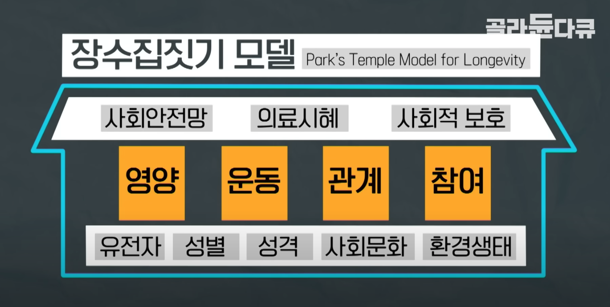

## Health 건강 위생

[[Food]]

#### 손 소독제와 휴대폰 소독, 스크린 닦기
알코올
에탄올
살균, 향균
손 세정제를 바른 후 핸드크림으로 보습을 해주는 것이 좋다
손 소독제는 오염보다는 세균을 없애는 목적이다.
음식을 먹기 전에 잘 안말리면 에탄올을 섭취하는게 되어서 위험할 수 있다
스크린은 극세사 천으로만

블루라이트 차단은 효과가 있다고 보기 힘든 것 같다.

#### 폴리에스터 옷이 신체에 미치는 영향

- 천연섬유 - 면, 모, 레이온
- 합성섬유 - 석유를 가공해 플라스틱이 된 것을 이용한 것
- 흡습성이 안좋다고 한다. 피부가 숨을 못쉰다는 것
- 땀 흡수를 잘 못한다고 한다
- 그러면 폴리에스터는 왜 운동할 때 입지? 빠른 흡수와 배출을 한다고 하는데?
- 내구도가 좋다고 한다. 땀이 빨리 마른다고 한다
- http://www.newstof.com/news/articleView.html?idxno=1640
- 면이 몸에 알레르기는 덜 일으킨다고 한다. 안좋은 폴리에스터 옷은 미세 플라스틱을 많이 떨어뜨린다고 한다
- 울이 냄세에 좋다고 한다 땀 흡수도 잘한다고 한다
- 폴리프로필렌이라는 비슷한 소재는 부드럽고, 통기성이 좋다고 한다

#### 일반 내시경 비수면 힘들다
목구멍에서 계속 느껴지고 목이 아프다
며칠동안 목이 아프다

건강검진 3시간 걸렸다

---

## base workout
- push up
- pull up
- squat
- dips
- plank
- bicycle crunch

## method
- warm-up 5 time
- keep going when you don't do again

## Stretching

[https://m.blog.naver.com/jss0163/220633824750](https://m.blog.naver.com/jss0163/220633824750)
목에 담 걸렸을 때 푸는 법

## 관절

#### 손목
같은 문제를 겪을 직업들
- 피아니스트
- 만화가

분리형 키보드, 인체공학 키보드
- https://www.youtube.com/watch?v=cOmEzt9n-mw

#### 오른쪽 시프트키를 안쓰는 방법을 찾아봐야겠다. 방향키도 쓰지말고
:, ㅆ, insert 모드에서 방향키를 컨트롤 hjkl로 맵핑해야겠다.
; -> :
[ 스니펫으로 {}
9 스니펫으로 ()

## 헬스

상체근력
골반유연성 부족

식단
110g단백질
탄수화물도
일단 최소 4끼
아침에 계란 2 3개
점심 후 참치김밥 등 단백질 든 김밥

1일 하체

개구리자세
한다리 뒤로 하고 한다리 양반다리로 스트레칭
양반다리로 스트레칭
스쿼트
런지
레그레이즈
다리 벌리는 운동
폼롤러로 풀어주기
유산소 15분

고관절
견착
스쿼트

목 숙이면 튀어나온 뼈 위에 얹고 어깨를 뒤로 접어 날개뼈를 모은다 생각하면 날개뼈위에 바가 걸린다
걸어놓으면 상체는 힘을 받을게 없고 하체에만 신경쓸 수 있다
하체만으로 운동하기 위함이다
고관절을 뒤로 빼면 허리를 굳이 안펴도 되는데 현재 고관절을 전혀 느낄 수 없어서 스트레칭 필요하다

2일 등

폼롤러로 등과 겨드랑이 밑 풀어주기
외회전으로 팔꿈치 붙이고 손 직각으로 움직이기
어깨뼈 상후하전 움직이면서 풀기
골반 후방경사하고 앉아서 노 땡기기(견갑골 모으고 넓히기 신경쓰기)
턱걸이(팔에 힘들어가는게 아님)
팔앞으로 뻗었다가 벌리기(견갑골 신경쓰기를 위해)

3일 가슴

외회전 팔꿈치 붙이고
대각선 벤치프레스 - 자세 안나오고 빈바도 못들겠음
벤치프레스 - 마찬가지
팔굽혀펴기(팔꿈치 바깥으로)
내로우 푸시업(팔 좁혀서)
레그레이즈(다리를 드는게 아니라 복부를 접는 느낌)
사이드 크런치(명치가 배꼽에 닿듯이 접는다)

6일 등 이두
등 - 팔 들기 (날개뼈옆에 등이 자극받는 느낌)
이두 덤벨1 (허리 숙이고 팔꿈치를 등으로 땡긴다)
덤벨2 (어깨를 살짝 위로 앞으로 움직여서 이두를 일자로 만들고 이두를 이용해 땡기고 마지막에 살짝 팔꿈치 들면서 쥐어짜기)
덤벨3 (벤치에 팔 붙이고 명치 살짝 윗부분 기대고 이두만 움직여서 이두 아랫부분 자극)

8일 등
벤치에 앉아서 가슴펴고 팔꿈치를 등 뒤로 보내며 한손으로 당기기 (허리 돌리지 말고 등 접히는 느낌으로)
데드리프트 (전방경사 만들고 상체전체를 숙이는 느낌으로 천천히 내려갔다가 엉덩이를 앞으로 확 앞으로 보내면서 일어나기. 이 때 팔을 허벅지 옆으로 붙이는 넓이 정도로 두고 가슴 쭉펴고 팔꿈치를 등뒤로 확 접은 상태 유지하면서 내려갔다 올라오기)

#### 데드리프트
- 바벨이 발 중앙에 오도록 선다
- ==척추중립== - 목 등 허리 엉덩이 일직선으로
- 숙이기 전 광배와 복부와 엉덩이 긴장시키기
- 들기 전 정강이를 바벨에 갖다 대면 엉덩이의 높이가 적당해짐
- 가슴을 편다
- 든다. 바벨은 몸에 잔뜩 붙여야 한다. 엉덩이는 낮추지 않는다

## 러닝
운동시 심박수 체크

중강도 60% 5일
고강도 70% 3일이 적당

중강도 142
고강도 155

주당 천칼로리면 심폐지구력을 건강히 기루기 좋은 수준

하루 30분 꼴 주 5일

10키로 1시간 600페이스 목표

#### 테니스

포핸드
그립법
백스윙으로 준비자세 아직 수직으로 시작하는건 안하고 면이 바닥을 보게 하고 손목을 완전히 젖혀서 준비하고
스윙할때는 몸에 가깝게 붙이고 공에 임팩트 맞출때 손목을 편다는 느낌이고 그 후 팔로우 스윙은 와이퍼 움직이듯이 한다고 생각하면 손목도 자동으로 펴지는 듯
치면서 뒷발 저절로 들리고 골반 돌리고 다 돌리면 반대손은 라켓 목을 잡아주기

수직으로 시작하는 자세는 팔꿈치는 살짝 굽히고 몸을 일직선으로 하고

손 힘은 50프로 정도만 주다가 임팩트할때 쎄게 잡기

#### 스트레칭 원리
돌리는 스트레칭 괜찮은가

준비운동 후 스트레칭?

몸의 가동범위를 늘리는 정적 스트레칭
근육을 준비시키는 동적 스트레칭
프로 선수들은 정적 스트레칭을 해서 몸의 가동범위를 늘리는게 오히려 운동능력을 떨어뜨리는 경우도 있다고 하나, 일반인 수준에서는 부상 방지를 위해 필요한 부분인 것 같다

기상 직후 운동해도 괜찮을까

- [ ] 20분 낮잠을 잘 때 20분짜리 명상코스 들으면서 하면 딱 맞겠다

#### 베이스
타브 보는 법
지판 연습

기타 치는법
지판 위치가 다른가?

왼손 오른손 어떤걸 해야할까

## Football
#### Liverpool

#### 축구
효율적인 축구
성공률이 높은 축구
짧은 패스
정확한 패스
이길 수 있는 경기
안정적인 수비
좁은 라인,선수 간격
상대 대응 전략
공 1,2,3
미 3.2
수 3,4
포백일 때 미드필드의 움직임
스리백일 때의 움직임

## 발성
#### 발성법
압력이 중요
숨연습
릴트립연습
연구개발성

숨연습
숨 다 뱉고 10초 버티고 숨 쭉 마시고 10초 버티고 스 하면서 숨 뱉고 10초 버티고 다시 마시고 10초
이런식으로 10회씩 아침 점심 저녁 30회

릴트립 비행기 부르면서 몸으로 소리낸다는 느낌으로

입앞으로 말하는게 아니라 입안에서 말한다는 느낌

뱉으면서 말하는건지 안에 가둔다는 느낌으로 말하는건지 미궁
복식호흡할때 마시면서 하는건지 몰겠음

말할때 목 안아프게 말하는 방법
호흡을 마실 때 배를 당기나 미나 -> 마실때 미는게 맞는거 같은데 볼록해지게
근데 말할때는 수축하도록 힘을 줘야한다??

호흡은 배로 마시고 압력을 줄때는 배를 당긴다는 느낌으로 해서 횡경막이 올라가는 느낌

#### 진짜 목소리
몸의 어디서 나오는 목소리가 내가 가장 편하게 낼 수 있는 진짜 목소리일까
그냥 목이 안아프면 상관없는걸까

#### 발성법
- 배를 민다 -> 사방으로 압력을 준다
	- 뱉을수록 쪼그라든다~
- 머리를 울린다 (공명)
- 성대 접지력을 강화한다
- 전신을 이완시킨다