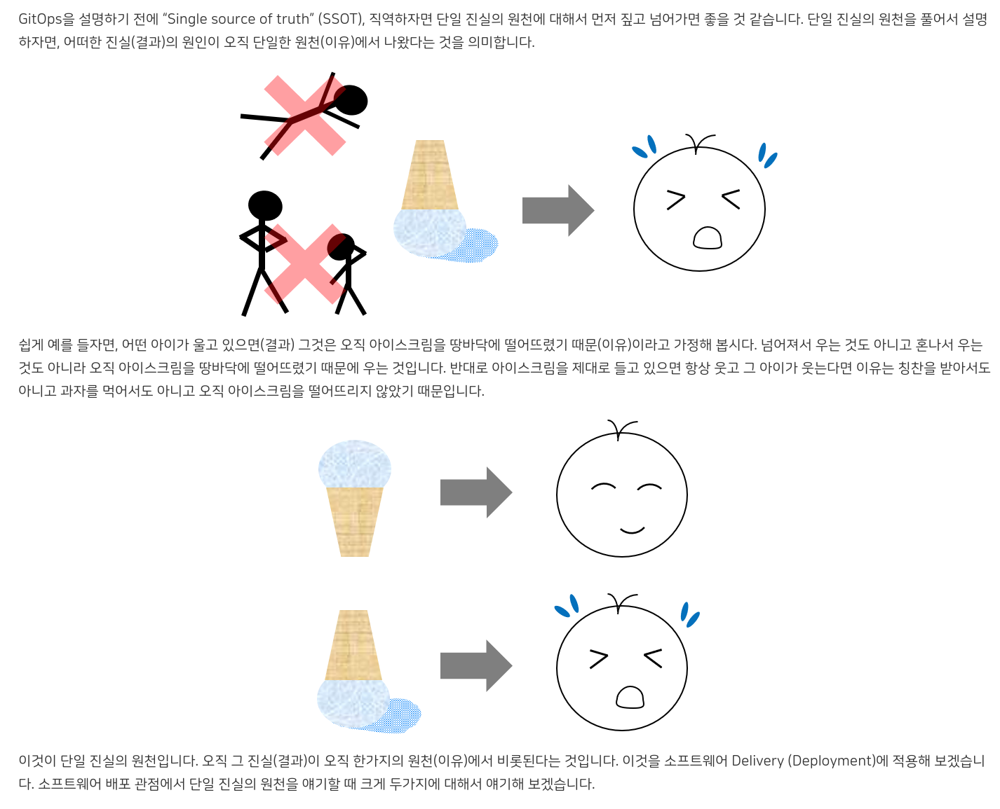

## 어떻게 학습을 할 것인가

- 자료를 모은다.
- 정리한다.
- 시작점을 잘 선택한다.
- 반대 의견을 잘 듣는다.

#### 왜 자료를 모으나?
깊은 지식과 무언가를 결정하기 위해. 견문을 넓히면 기분이 좋다. 재밌게 기술을 익힐 수 있다.

- 이 글에서는 자료를 모으는 것에 대한 내용에 대해 주로 다룬다.
- 자료를 모은다는 것이 연구와도 비슷한 결이라 연구, 정보에 대한 내용도 다룬다.
- 정리에 대한 내용은 다른 주제로 분리한다. 자료 조사와 공부가 분리 된 주제가 아닌 것 같다.

#### 자료 수집 전에 전략 설정을 하라?

#### Keyword

search, information, decision, deconstruct

History, Background, Trade-off, Revision, behind story

study, analyze, seize, perspective

## 자료 모으기

1. 시작점을 찾는다 (내부에 들어가기 전에 내 생각을 먼저 확인한다)
2. 단어를 모은다 (측정 가능한 기준을 세워서 범위를 잡는다)
3. 정보를 쌓는다 (인용이 많이 된 것들은 좋은 글일 확률이 높은 것 같다)
4. 정리한다
5. 검증한다

#### 키워드 잘 뽑는 방법

- 배경지식
- 내가 원하는 문장 분해
- 대학생이라는 큰 범위부터 재학생, 복학생이라는 작은 범위로 체계적으로 검색

#### 신중한 시작보다 변화에 대응하기 쉽게하는 쪽으로 해보자

단순한게 지속가능성이 좋다. 시작점 체계 흥미

#### 처음 접근할 때

- 목표, 핵심 키워드, 레퍼런스를 기준으로 찾아보면 금방 전체 그림이 파악이 되지 않을까

> Practice something, firstly, Deconstruct skill set

#### 'What i need to know' is meta core knowledge

Maybe everything is in the past

- History
- Reference
- What is similar

#### 자료를 모으는 것은 아무렇게나 되지만, 정리할 때는 개인의 색깔이 드러나게 된다

기준이 세워지거나, 편향적이거나, 무질서하지만 의도가 느껴지거나,

예술에서는 개인의 색깔을 찾는 것이 이것이 되겠고
연구에서는 자신의 연구의 특색이 이것이 되겠다

정리하면서 색깔이 안드러나는 것도 문제일 수 있겠다. 무색무취의 그저그런 작품이 된다는 것이니까

공산주의의 통제 속에 정권 비판 서적이 설 자리가 없어지는 것도 정리할 때
안좋아지는 방향으로 가는 사례가 되겠다.

#### 자료와 기초 지식의 부족, 어설픈 사유 능력과 시간의 부족
수학사에 관한 책을 찾는데 오래걸린 이유를 이렇게 꼽으셨다
> 내게 다가온 수학의 시간들 - 장우석 #book

#### 생각 후 레퍼런스 확인
- 목적을 정한 후 레퍼런스 확인
- 레퍼런스를 확인하지 않는 것은 과거의 유산을 이용하지 못하는 한계가 있다
- 발상의 전환, 과거에 메이는 것을 방지하기 위해 고정관념을 가지지 않기 위해 사전정보 없이 고민 후에 레퍼런스를 확인한다
- 과거 회고 작업을 한 것을 바탕으로 다음 작업을 하면 좋겠다.
- 이전 작업을 쌓아서 현재를 만들어야 한다
- 과거의 작업을 계승할 필요는 없지만 그 기반 위에서 작업.
- 여러 공통된 비슷한 작업을 찾을 수 있는 것이 후대 작업자에게는 큰 힘이 된다.

#### 레퍼런스를 참고한다
- 업계 분위기 파악
- 기존의 컨텐츠에 물들어버린다?
- 수학문제의 답을 보는 것과 다른 점
- 그 업계에 담겨져 있음으로써 나오는 컨텐츠
- 그 업계를 전혀 모르기 때문에 나오는 컨텐츠

#### 새로운 영역에서 알아볼 때 이 3가지 범위를 확인하면 큰 그림이 잡히지 않을까

- 기존의 전통
- 다수의 의견
- 개인의 판단
  > 열 두 발자국 중 #book

#### 새 기술 도입하고 싶은 경우 조사하는 것들

#collection

- 문제 되었던 사례
- 바랐던 모습
- 바뀐 모습

#### 정보를 잘 찾기 위해 어떻게 작성할 것인가

#collection

- 정보 입력이 편리한가
- 나중에 찾아볼 때 효율적으로 찾을 수 있는가

#### 정보 습득을 어떤 방식으로 할 것인가

#collection

- 검색에 의한 접근
- 도서관에서처럼 분류되있는 것을 전체적으로 훑어보면서 찾는 방법
- 전문가를 찾아서 그 사람의 서적을 찾아보고, 기회가 닿으면 직접 만난다.

#### 하나를 하기 전에 잠시 전체적으로 훑어본다. 어떻게 훑으면 잘 훑을 수 있는가

노트에 적기? 걱정되는 부분 확인?

#### 처음 접한 개념을 일반화하지 못하는 것은

그 개념에 내가 모르는 뭔가가 있는지 없는지 모르기 때문이고 그것을 알기 위해서 그
세부 구현을 파악해야 한다.

#### 알아가는 방법

- 가진 것을 잘 이용하는 법 -> 반복
- 모르는 것을 아는 것 -> 질문을 잘하는 방법
- 수많은 것 중 원하는 것을 찾는 법 -> 데이터 통계

#### 노트앱을 찾고 있을 때 데본씽크는 모르고 있었다
어떤 앱을 찾을 때 사람들의 입에 오르내리는 것들을 다 써보고 싶었는데 쉽게
찾아지는 앱도 있는 반면 잘 안 찾아지는(하지만 잘 사용되고 있는) 앱들이 있다. 늘
그런 것들을 찾기 위해 시간을 더 쓰고 있었고 기한 없이 찾기만 하고 있었다.
게다가 개발자들이 소소하게 만드는 앱들도 있다보니 지금 쓰는 것보다 더 좋은 게
있을 것 같다는 마음이 계속 들어 또 시간을 하릴없이 쓰게 된다

---

## 학문 분야에서의 자료 모으는 법

#### 연구법

가설을 세우고 검증한다

#### 논문 찾는 법

논문 리뷰는 관련 논문들을 모아서 정리한 것이라 큰 흐름을 읽기 좋다
논문을 작성 하기 위해 이전에 비슷한 내용의 연구가 있는지를 찾아본다
문헌연구라고 한다. 이전 연구가 있으면 내 연구는 어떤 개선점이 있는지 알 수도 있다
또 비슷하지 않더라도 관련 분야 연구를 찾아보고 나의 작업을 더 단단하게 할 수 있다

구글 스칼라, RISS에서 검색

- 키워드를 나열하여 원하는 자료가 있는지 확인
- 인용횟수, 작성일자 참고

관련 있을 것 같은 사람을 기준으로 찾을 수도 있다

키워드로 다른 키워드를 얻는다 -> 자주 보이는 키워드, 사람이 있다
-> 사람을 검색해서 다른 소스를 찾는다 -> 새로운 키워드 -> 확장

논문 저널 구독

impact factor?

팀 버너스 리가 생각한 연구자료 공유가 이런 논문검색사이트였던걸까
다른 방식이 있을까
연구자료는 파일로 있을 수도 있는데 이것도 공유하려 하지 않았을까
그러면 각 연구실의 컴퓨터에 자료를 올려놓고 접근하는 방식으로 했을까
그러면 자유롭게 정보를 찾는게 아니라 특정 연구실을 염두에 두고 찾아야 하는 벽이
있다

논문 정리용 노트 프로그램 Roam Research

한국 연구진이 미국 연구진과 인터넷으로 자료교환이 가능하긴 하게 됐다

#### 논문 찾는 법

#scrap

"논문 업데이트에 하루에 1시간 이상 쓰신다면, RSS리더를 쓰시면 많은 수의 저널을
쉽게 관리할 수 있습니다. 일일이 들어가는 방법은 10-20개 이내일 때는 가능하겠지만
100개 넘어가면 매우 힘이 들죠. 웹 기반으로는 Feedly, Theoldreader같은 것 많이
쓰는데, Reeder같은 앱을 써서 웹서비스에 연결해서 쓰는 게 손에 착 붙습니다.

bioRxiv와 pubmed나 google scholar에 키워드 알림이나 저자 알림 설정을 해 두는
것도 좋습니다. 의외의 저널에 나오는 경우가 있어서 빠지지 않고 볼 때 도움이
됩니다. f1000 같은 사이트도 그런 걸 좀 제공해주긴 하는데, 유료 구독 없으면 좀
불편합니다.

Latest news류의 알림을 여러 군데서 받으시면 본인 연구분야 외의 트렌드를 파악할
수 있어서 큰 흐름을 파악하기 좋습니다. 저널의 뉴스 말고도 블로그로 운영되는 곳이
많이 있으니까 한 번 찾아보세요. 블로그들은 앞에서 말씀드린 RSS리더로 같이 읽을
수 있습니다.

말씀하신대로 관련 분야 유명인들의 트위터를 구독하는 것이 인터넷을 통해 얻을 수
있는 소식 중에선 가장 빠릅니다. 주요 몇 명만 가지고 시작해도 리트윗과 댓글들을
보면 금세 다른 사람들로 확장하실 수 있습니다."

> > https://m.ibric.org/miniboard/read.php?Board=isori&id=103071#:~:text=논문%20업데이트에%20하루에,확장하실%20수%20있습니다%2E

#### 체계적 문헌고찰

#scrap

기존의 문헌을 검토해 명확한 질문을 만들어내는 것

- 명백하고, 반복 가능하며, 최소한의 바이어스를 가진 방법론을 사용
- 연구질문에 관련된 근거를 검색, 식별, 선정, 평가, 종합한다.
- 출판되지 않은 문헌도 포함하는데, 최신이며, 출판의 편향성이 적기 때문이다.

유형
- 질적 고찰
- 양적 고찰
- 메타분석

연구계획서 작성(protocol)

- [PRISMA](http://www.prisma-statement.org/Translations/Translations) 지침을 따른다.
- 주요 목표, 방법론, 결과에 대해 정의

출처: https://www.editage.co.kr/insights/a-young-researchers-guide-to-a-systematic-review#

(protocol을 맞춰놓고 통신하는 정보통신의 방식이 생각난다.)

#### 한 번에 많은 정보가 들어오면 감당하기 힘들다. 외울 수도 없고.

정보가 많아지면 좋은데 그것을 어떻게 해야 잘 익히고 활용할 수 있을까

- 과거의 정보를 이용하여 새로운 이론이나 학문을 증진시킬 방법
  - 논문을 통한 이론 개선
  - 학회
- 방대한 연구자료들을 인터넷으로 공유해서 정보를 취합하는 것은 힘들다.
  그리고 원하는 정보만 얻어내는 것은 더 힘들다.
  단순 검색이 아닌 연관 자료를 찾는 것. 분석기가 필요하다.
  - 컴퓨터가 막 개발되기 시작하던 때에 연구자들은 컴퓨터로 뭔가를 해보기를
    원했을텐데 어떻게 데이터를 가공할지 막막했을 것 같은데,
    지금은 어떻게 하고 있을까

#### 정보 공유

서로 어떤 일을 하는지 몰라서 같은 연구가 여러 곳에서 이루어지는 경우가 더러
있다.
정보가 공유가 되었으면 더 나은 연구가 되었을 수도 있었을텐데 아쉽다
메인스트림에만 데이터가 몰리는게 아니라 주변에서 정보가 돌아다닐 때도 있는데
그런 정보들이 잘 공유가 되려면 어떻게 해야 할까
모두가 메인스트림에 접근하면 양이 많아져서 보석이 숨겨질 수도 있다

근데 사람들은 모두 생각이 다르기 때문에 같은 것을 연구하더라도 조금씩 다른
부분을 볼 수 있다. 애초에 겹치지 않도록 뭔가를 한다는 것은 말이 안되고, 서로
보완하고 힘을 싣는 것이 될 수 있다.

#### 과학자

박사 연구실에서 연구할 때는 어떻게 사람들 간 정보의 비대칭을 해결하지?
소프트웨어 개발도 누구나 할 수 있는 메뉴얼에 따른 일보다 연구실에서 연구하는
과학자들처럼 해도 되지 않을까?

#### 논문 규격

#### 연구

대학원생이고 지도교수에게 자신의 연구를 이야기 할 때
지도교수는 큰 방향과 흐름, 그동안의 경험을 통해 전체적인 부분을 조율해주지만
나의 연구에만 신경 쓰지 않을 뿐더러 세부적인 부분은 모를 수 있는데
직접 연구하는 내가 '어떤 동기와 가설을 가지고 어떤 실험을 통해 할 것인지' 논리를 가지고
지도교수님에게 이야기하면 좋은 조언을 받을 수 있지 않을까
진행 후에도 다시 가설, 실험, 연구, 지도교수님의 조언을 받으며 계속 반복해서 진행가능
동기, 가설, 계획, 연구

연구실에서는 사수에게 실험테크닉을 배운다고 한다
실험테크닉.
실험 -> 연구결과 == 개발 프로세스 -> 소프트웨어?
개발 프로세스 테크닉도 알려주면 좋겠다
코드를 받고, 테스트하고, 풀리퀘하고, 배포하는 것
메뉴얼로 만들고, 빠르고 효율적으로 하는 것도 알려주면 좋겠다

#### 연구

이론적 조망, 연구방법론을 통해 근거확보와 엄밀한 방식 탐구

학술지에 등재되기 위해 거치는 검증을 통해 그 학술지의 권위가 생긴다.

SSCI, KCI

#### 실험의 결과가 과학적 사실로 받아들여지려면

- 누가 실험해도 같은 결론 - 객관성
- 반복해도 같은 결과 - 신뢰성
- 측정하고자 하는 것을 제대로 측정했는가 - 타당성
- 그 결과를 일반화 할 수 있는가 - 표준화(비교가능성)

자연과학적 방법론이 객관성을 띄고 이 객관성으로 사회를 설명할 수 있다고
생각했고, 심리학도 인간의 심리를 객관화할 수 있다고 생각했지만 20세기 후반,
하이젠베르크나 아인슈타인 시대에 이미 객관성보다는 상호 주관성이 더 사회를 잘
설명할 수 있다고 생각하게 되었다.

#### 지식 검증

- 전문가
- 여러명
- 반대의견 확인

#### 논문 작성 순서
> - 나는 이런 문제를 풀거야 (abstract> - 사실 이 문제는 이런 동기에서 연구가 시작된건데 (introduction)
> - 관련해서 이런저런 접근들이 있었지 (related works)
> - 난 이런 새로운 방식으로 접근해보려고 하는데 (method)
> - 정말 이게 잘 먹히는지 실험도 해봤어 (experiment)
> - 이를 통해 이런 사실도 알아냈지만 한계점도 있지 (discussion)
> - 마지막으로 귀찮은 너를 위해 요약 (conclusion)
> - 출처: <[http://gradschoolstory.net/terry/readingpapers/](http://gradschoolstory.net/terry/readingpapers/)>

#### 레포트 작성 시 (1)자료조사, (2)기존제품과 비교

#### 논문을 쓰는 건 기존 연구에 새로운 논의를 덧붙이는 것
레포트는 기존 연구를 정리한 것

## 기타 자료 모으는 법

#### 집단지성 이용법

키워드를 잘 적어서 관심 레이더에 잘 포착되게 한다
관심 있을만한 사람들이 있는 곳을 찾아간다
ex)community, football-fmkorea

- 실시간으로 정보공유를 받고 싶은 것이 있을 때

#### 집단지성

ImageNet이라는 이미지 인식 관련 머신러닝 대회를 열어서 서로의 기술을 더 낫게
만들어졌는지 확인하고 다른 사람들도 확인할 수 있다.

- 경쟁과 열린 공간을 이용한 좋은 방식

#### 커뮤니티 장점

#collection

- 댓글로 티키타카가 되어 부족한 정보가 메꿔진다

#### 잘 정리된 글을 잘 이용하는 방법

정리된 글을 보면 나는 뭔가 빈틈이 있을 것 같아서 개운하지 않게 느낀다.
하지만 정리된 글은 상당한 가치가 있는 글이다.
하나의 좋은 시작점이 될 수도 있고, 그 자체로 충분할 수도 있다

- 시작점으로 사용하는 방법
- 여러 번 읽어서 틀을 잡는다
- 의문이 드는 지점을 찾는다
- 개선시켜본다
- 문제점을 찾는다
- 반박한다

#### 정보 찾을 때 쓰기 좋은 검색어

#collection

- awesome
- 101
- step by step
- ultimate
- advanced
- first 1000

#### 사람들이 최근 검색하는 것을 찾을 수 있는 곳

#collection

- [google trends](https://trends.google.com/trends/?geo=KR)
- [keywords everywhere](https://keywordseverywhere.com/)
- [pinterest](https://www.pinterest.co.kr/ideas/food-and-drink/918530398158/)

## 공부

#### 쉬운 것부터 해야한다

잘하는 사람의 플레이를 보면 그것을 따라할 수 있고, 실력의 상승으로 이어진다
자신의 수준보다 높은 것만 보는 것이 못따라가면 실력 상승은 없고 지쳐서 하기
싫어진다.
그러나 수준 높은 것을 아예 안보면 더 나아지는 것 없이 갇히게 된다.

쉬운 것부터 해야한다
vs
큰 물에서 놀아야 한다

한단계 높은 것을 두드려보고 안되면 단계를 낮춰서 한다
한번씩 높은 단계를 시도해본다

똑같이 취미로 요리를 3년 한다고 했을 때
어떤 시도를 해봤느냐에 따라 실력이 달라진다

괜히 무리하게 높은 단계를 흉내만 내다가 소화를 못한다
vs
높은 단계를 따라하면서 체득이 되어 실력이 상승한다

#### 작고 쉬운것부터 해야하는 이유

학습곡선이 가파르면 시간이 더 오래 걸린다

http://m.egloos.zum.com/agile/v/1762301

#### 어려운 책을 여러 번 반복해서 읽다보면 조금씩 모르던게 보인다

철학 요약서를 읽으면 그 요약서의 저자의 생각을 처음에 받아들이게 돼서 그 생각에
갇힐 수 있다고 주의를 주는 사람들이 있다. 그래서 원전을 먼저 읽으라고 하지만,
접근하기 쉽지 않다. 쉬운것부터 시작하되 비판하면서 읽도록 해야겠다.

철학 학부생도 읽기 힘든 원서를 문외한이 읽기 힘드니
2차 저작물 중 좋은 것을 보는게 낫다는 이야기도 있다

#### 반복을 통한 암기

언어를 배우는 것도 계속 반복이다.

언어를 배우는 것 처럼 노트를 반복해서 인지하면 될까

- 잘 가르치는 사람은 좋은 방법을 많이 참고해서 그 기반 위에서 가르치는 사람인 것
  같다.

#### 기술 공부

기술이 어떻게 나오게 되었는지에 대한 역사를 알면 그 기술에 대해 이해력이 높아지고 기억이 잘 된다

- 링크드리스트

기술의 단점을 확인하고 대체 기술을 확인한다

- json

내가 안쓰는 기술이라도 그 기술의 큰 특징은 알아두면 좋겠다

- 스프링, 안드로이드, 프론트엔드 프레임워크

#### 공부법

공부법 : 본다 정리한다 생각한다 다시 본다

지식습득을 변증법적으로 하는 것이 좋겠다

알고리즘 공부나 수능 공부는 레퍼런스를 모으는 식으로 하기보다 해결하기 위한 노력이 필요하다
재미만으로 해결할 수 없고, 오래 생각해야 한다
어떤 알고리즘을 써야할지에 대한 것은 레퍼런스를 모으는 접근법으로 할 수 있겠다

일단 뽑고, 연결된 것들을 찾아 나간다
요새는 관련 커뮤니티에 들어가서 입문용으로 추천을 받아서 거기서 시작하는 방법도
있다

#### 안다고 생각해도 알기 힘들다

https://m.fmkorea.com/best/3797889470

- 기억에 의존해서 대기업 로고 그리기 실험

#### 모르는 것을 모른다는 것을 아는 것

제목을 딱 읽으면 아 궁금하다. 어떻게 저런 생각을 했지 하는게 있다.
그것에 대해 구체적으로 궁금해본적은 없지만 보는 순간 궁금해진다.
존재조차 모르지만 알게 되면 일리가 있게 느껴지는게 있다.

#### 모르는 내용을 알때까지 공부한다

말은 쉽지만 안다는 게 쉽게 설명 가능해야 하고 주변지식도 파악해야 한다라고 하면 굉장한 노력이 필요하다

#### 경험의 뿔

Dale이란 과학자가 제시한 경험의 뿔이라는 것이 있다.

#### 임기응변

#book
#standard

> 의도가 원하는 결과를 맺는 경우는 생각보다 많지 않다
> 임기응변은 규범에 맞추어 자신을 제대로 세울 수 있는 경지를 완수한 사람에게나 가능한, 최후의 경지 - 공자
> 이사야 벌린은 철학적 일원론이 초래할 정치적 파국을 경계하기 위해서 융통성 있는 정치적 판단을 강조했다
>
> - 우리가 간신히 희망할 수 있는 것(김영민)

쉽게 설명한 글이라는 것도 그 전반적인 지식을 다 알고 나서 그것을 쉽게 설명해야 좋은 정리가 되는 것이지
쉬운 부분만 조금씩 익혀서 정리한다고 정리가 되는 것이 아닌 것 같다

메뉴얼을 따르는 것도 메뉴얼에 대한 숙지가 되있는 상태에서 자유도를 더해 더 생산적이 될 수 있겠다.
메뉴얼을 꼭 지켜야하는 억제장치로 쓰는게 아니라 (족쇄가 아니라), 같은 것을 공유하는 지식의 공유장소로 활용하도록 하는 것이 좋겠다
메뉴얼을 운운하면서 다른 작업을 막는 것이 아니라 더 나은 메뉴얼을 만들기 위해 마음껏 변경할 수 있도록 하고,
그 변경이 단순히 누군가의 의견이 좋아보이면 따라가는게 아니라 메뉴얼을 숙지한 상태에서 한발 더 나아가는 것이 되어야 한다

#### 경험이 많아지면 이론적으로 배웠던 것들의 빈틈을 알게되고 그것을 이용하는 여유가 생긴다

#### 측정가능한 목표

- '이번 시험에서 80점 이상을 맞아야해'는 정량적이지만 와닿지 않는다
- 숫자에는 의미가 없어서 직관성이 떨어진다 숫자는 비교가 되기 때문에 직관성이 높다
- 정량적 데이터는 축적되면 정보가 되는데 정성적 데이터는 축적되면 과거의 정보가 희미해진다
- 정량적 데이터는 회사 발전에 도움이 되겠다. 어떻게 정성적 데이터를 관리해야할까 - 연결
- 정량적으로 한다고 단순 수치를 적는건 의미없다. 와닿는 숫자여야 한다

#### 좋은 배를 만드는 방법

작은 배를 오래 타다보면 고칠 곳이 생기고 부족한 부분이 보이고 결국에는 그 부분을
고려한 새로운 배를 만들게 된다 새 배를 만드는 두 부류가 있겠다. 배를 타면서
직접 느꼈던 것을 토대로 배를 만드는 사람, 이론적인 지식을 쌓아서 배를 만드는 사람

좋은 배를 만드려면 두가지가 다 되면 좋겠다.
그러려면 배를 좋아해서 배를 계속 사용하다가 이론적인 부분도 채우는 사람이 좋은
배를 만들 수 있겠다.

> 배를 만들고 싶다면, 사람들을 시켜 나무를 모으고
> 역할을 나누고 명령을 내리면서 북을 칠 것이 아니라,
> 거대하고 끝없는 바다를 갈망하게 만들어라.
>
> - 생텍쥐베리

#### Knowledge is in books. and Wisdom in nature.

#### 연결도를 보여주는 클라우드 트리를 보여주는 서비스를 이용

좋은 논문을 찾는 방법, 처음 그 분야에 접근할 때 사용하는 방법 중에 인용 횟수와
피인용 횟수를 보는 것이 있다. 이것처럼 처음 그 분야에 전반적으로 알아볼 때 많이
참조된 것을 찾는 것이 유용할 것이다.

그래서 연결도를 보여주는 클라우드 트리를 보여주는 서비스를 이용하면 좋겠다.
분야명을 입력하면 참조가 많이 된 것이 한 눈에 들어오는 식으로.

#### 깊게 생각하기

- 왜 이렇게 구성했는지 생각하기
- 배경 파악하기
- 나라면 어떻게 했을지 생각하기
- 트레이드 오프 생각하기
- 계속 개선할 부분을 찾기
- 하나 하나에 집중하고 한개에서 여러개로 생각을 뻗치기
- 리스트화해서 빼먹지 않기
- 내가 좋아하는 분야에서라면 더더욱 하나의 문제에 깊이 고찰하고 사유하기
- 부족한 부분을 계속 찾으면서 연습한다
- 하나하나에 최선을 다하기
- 전략은 세워놓되 외부의 변화를 지속적으로 확인하고 받아들여야 한다

#### 문제 해결법, 선택법, 공부법

절대적인 것은 없다.
안풀리는 것에 억지로 매달릴 필요는 없으나 집중해서 파고들어 길을 찾아야 한다
어떤 복잡한 문제라도 잘게 쪼개어 풀 수 있다. 복잡한 것을 단순하게 만드는 것
아주 쉽게 설명이 되야 정말 잘 이해한 것이다
심플하지만 다양해야한다
어떤 변화가 이루어질때 변화의 안좋은 점을 확인하고 염두에 두면 그 안좋은 점도 커버할 수 있는 결과를 낼 수 있다
주먹구구보다 전체적인 그림을 그리기
나의 기준을 세워놓되, 외부에는 열려있기

[[About_Development#기술 공부]]

#### 정보의 발견

만약 독일을 가게 된다면 그곳에서의 정보를 얻기 위해 한인회에 접근하게 될 것이다.
그러면 한인회는 그 지역에 온 한인들의 정보를 쉽게 모을 수 있고, 독일의 한인에
대해 문의를 하려면 한인회에 물어보면 금방 전체적인 정보를 알 수 있을 것이다.

## 질문

질문을 할 때 왜 물어보는지 말하고 물어보면 더 원하는 대답을 얻을 수 있지 않을까

- [ ] 김창준님이 질문하는 방식이 효과적인 것 같은데 다시 찾아봐야겠다.

#### 질문을 할 때

틀린것을 지적하고 따지려고 하면 안되고
더 나은 것을 위해 나아가는 방향으로 가기 위해 질문을 한다
시너지를 일으키도록

#### 안드로이드 매크로 영역에 사람들이 많이 쓰는 명령어들이 있을텐데

어떻게 찾아야 할까

- 이 글을 이용해 찾는다

#### 지금 내가 경계해야 할 것

아는 것과 모르는 것을 구분하고
아는 것을 안다고 그냥 넘어가면 안되고 정말 아는 것인지 확인해야 한다
모르는 것은 당장 알지 못하더라도 조금씩 익혀가야 한다

#### 알고 싶은 추상적인 것을 찾을 키워드

OCP 를 잘 적용하는 노하우에 대해 알고 싶었다
OCP 잘 지키는 법
OCP 이렇게 하면 신경 안써도 된다

aws를 로컬에서 제대로 확인(테스트)하는 방법

#### XY 법칙

https://hut.mearie.org/xy-problem/

#### 엘리코딩에서 신입사원이 이렇게 질문했을 때 좋았다라고 한 것

#collection

#### 원인을 어디서 찾아야할까 어디까지 찾아야할까

아이스크림을 떨어뜨린 아이의 이야기
5whys

#### 잘못의 원인을 바로 직전의 상황으로 판단하는 것

아이가 아이스크림을 떨어뜨린 이유를 그 이전의 상황에서 찾으려고 하지 말아라는 예제였는데
히로시마 원폭 피해자가 원폭 개발자에게 사과를 요구하는 상황은
일본이 전쟁을 일으키고 선제공격을 했기 때문이라 원폭 피해자에게 사과하는 것이 아니라 일본이 사과해야 하는 상황이라고 생각이 든다.
전후과정이 명확하기 때문일까? 인과관계가 명확하기 때문일까

#### 단일 진실의 원천 SSOT

https://coffeewhale.com/kubernetes/gitops/argocd/2020/02/10/gitops-argocd/

한동안 찾던 건데 여기 있었다

이건 정보통신쪽에서 복붙 대신 참조를 하자는 의미로 쓰이는 것 같다
이 글에서는 배포 방식을 단일화해서 충돌을 막고자 이 의미를 이용했다

문서관리영역에서 사용할때는 위키를 이용하는것처럼 자료를 한 곳에 모아두고 등록/수정하게 하는 것을 말한다. 데이터를 한 곳에 모아두고 거기를 기반으로 작업해야한다고 하는 방법론

> 단일 진실 공급원(SSOT)이란 모든 비즈니스 데이터를 하나의 공간에 저장하는 것을 말합니다
>
> - https://experience.dropbox.com/ko-kr/resources/source-of-truth

#### 모르는 것을 볼 때

"이럴 때는 억지로 두 번, 세 번 읽는 것보다 약간의 배경지식을 살짝 안 뒤에 다시 읽는 게 효과적이다"
https://namu.wiki/w/%EB%AF%B8%ED%95%99%20%EC%98%A4%EB%94%94%EC%84%B8%EC%9D%B4

#### 기억

https://blog.storyg.co/%ED%95%99%EC%8A%B5%EB%B2%95/%EB%91%90%EB%87%8C/%EB%91%90%EB%87%8C%EA%B3%BC%ED%95%99/2018/02/20/what-make-memory

#### 생각의 구멍

새로운걸 배우다가 어느정도 알게되면 더 이상 배울게 있을까 싶을 때가 있다. 혼자 공부할 때는 이 벽을 깨기 어렵다고 생각했는데 회사에서 일을 하다보니 매일 배울게 생긴다. 근데 이제는 배우는 것의 범위가 일정하지 않아서 구멍이 생기는 것 같은 느낌이 든다.

한번씩 다른분야에서는 어떻게 이 구멍을 채울까 궁금해지는데 의료분야에서나 응급상황이 발생할 때 대처에 구멍이 있으면 일정한 서비스를 해줄 수 없을 것 같은데 의료분야는 이론적으로 공부하는 양이 많긴 하지만
암묵지가 아직 이론화되지 않은게 있을거라는 걱정이 있다. 암묵지를 잘 공유하는 방법이 있을까.

간호사들은 매일 교대때마다 인수인계를 하면서 자신이 아는 정보를 다음교대인원이 알 수 있도록 인수인계를 어떻게 할지 고민한다고 한다.

인간의 지식에도 구멍이 있다고 생각되는데, 원소단위까지 알게 된 인간의 탐구가 양자까지 도달한 것도 이미 놀랍지만 만약 물질로 설명 안되는 식의 아예 생각지 못한 것이 발견되어 인간의 사고를 뒤집을 수 있고 지금은 단지 부재를 알지 못하는게 아닐까 하는 생각을 하곤 한다.

오펜하이머를 보고 실험을 통해 이론이 발견하지 못한 것을 발견을 통해 먼저 찾을 수 있다는 것을 다시 떠올렸다.

- 인수인계
- 지식
- 전달
- 생각
- 이론과 실험

#### 하나의 정보를 알아볼 때 꼼꼼하게 근저의 정보를 알고 싶다.
#Reference #todo #Collection
큰 그림을 그려서 더 넓게 정보를 이해하고 싶다.
전혀 모르는 분야의 정보를 얻을 때 어떻게 찾으면 좋을까

예를 들어 직급 호봉 체계에서 군필 남자들이 2호봉을 추가로 받는 것을 1호봉으로 바꿔야 되지 않겠냐는 의견을 들었을 때
회사 내규 확인, 왜 2호봉이 추가되는지, 노동법, 중기청 등 소속 기업 관리 관청
확인, 다른 회사 내규 확인

다른 나라는 어떻게 하는지, 직급 호봉 제도에 대한 이해, 회사 사람들의 의견, 여론

관련 키워드 : 군대, 호봉, 인사
