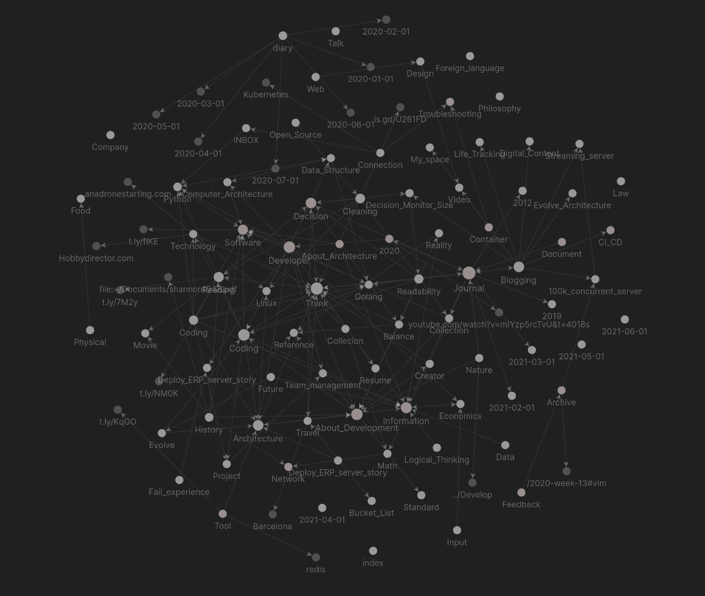

## 2023
 * [February](diary/2021-02-01)
 * [March](diary/2021-03-01)

- [2022](diary/2022)
- [2021](diary/2021)
- [2020](diary/2020)
- [2019](diary/2019)
- [2012](diary/2012)



## Writing technique
1. 적, 의, 것, 성 빼기 (적의것들)
2. 하고 있다, 할 수 있다 안 쓰기
3. 관한, 대한 안쓰기 (에 대해 대한)
4. 있는 있어서
5. 수동 능동
6. 수식하는 표현이 어느 명사를 수식하는지 불분명하면 읽기 쉽지 않다


#### Content
1. 쉬운글
2. 짧은문장
3. 결론먼저
4. 경험(정성적)으로 기억에 남게 할수있다
5. 서론을 먼저 나눠 쓴다
    - 서론에는 본문의 핵심내용을 미리 안내한다.
    - 서론은 간단 명료하게 쓴다
    - 본문은 가독성이 중요하다
6. 유머가 있어야 한다
7. 비유로 설명하는 것은 좋은 방법
8. 글에 호기심을 담으면 흡입력이 강해진다
    - 호기심, 궁금증이 글을 읽는 원동력이 된다
    - 위키의 정보글은 호기심을 던지고 설명하는 방식으로 작성

- 첫줄에 한줄요약으로 그림을 그릴 수 있도록, 연상을 할 수 있도록 작성
    그 뒤에 질문과 설명 적기
+ 짧게 쓰지 말고 길게 쓰고 필요없는 부분을 지우는 방식으로 쓰자
+ 간결했으면 좋겠다
+ 일관된 폼
+ 하나의 글 타이틀 안에 정반합을 모두 고려하도록 하고싶다.
+ 컨텐츠를 스토리로
+ 그리고 컨텐츠를 다른 곳에서도 다시 쉽게 사용할 수 있어야 한다
+ 글은 웬만하면 사진과 함께 사진안에 글자를 넣어서 읽기 좋고 보기 좋게 쓰는게 좋겠다
    - 그림이 중요한게 아니라 내용이 중요하다 그런데 이미지가 같이 있으면 보기 수월하고 내용 전달도 쉬워진다. - (횡설수설 다이어리 참고)
- speak with emotion is good to click with someone - emotion and experience
- 읽다가 막히지 않고, 따라가다 보면 원하는 목적지에 편하게 도달하는 글이 좋은 글
  내가 아는 것을 남들도 알거라고 생각하고 적으면 안된다.
- 큰 그림에서 작은 그림으로

[[Think#점진적]]
[[Think#제한을 둠으로써 새로운 것을 만들어 낼 수 있다]]
[[Blogging#읽고 싶은 제목]]
[[Information#모든 진정한 이론은 오직 구체적인 현실속에서만 명료화되고 발전되어야 한다]]
[[Collection#스토리 없는 단순 나열은 아무리 핵심만 담겨있다고 해도 쓸모가 없다]]


#### 내가 노트에 바라는 것
전체를 보는 방법을 알고 싶다
전체를 그림처럼 갖고 있으면 세부는 필요할 때 꺼내 쓸 수 있다

실패에 대한 경험을 적어두어도 같은 실수를 반복한다
그 실수를 기억 못하기 때문에

추적을 위해 이슈라인을 만들어서 변경사항 추적

#### 노트
메모를 남기는 건 쉽다
근데 어떻게 남겨야 찾기 쉽고
후루룩 봤을 때 원하는 걸 찾을 수 있을까  
매일마다 쓴 것들을 나중에 한번에 돌아보는건 결코 쉽지 않다  
찾지 못하면 둘러봐야하는데 둘러보면 있어도 지나칠 수 있다

#### 40분 발표
40분 발표라면 전체를 구조화해서 10분마다 재밌는 포인트를 배치한다든지 체계적으로
만들 수 있다. 전체를 한 눈에 만들 수 있다.
근데 WTF python 번역하려고 했던 것처럼 작은 것들이 너무 많으면 작은 것을 한 두개
하다가 너무 많이 남아서 지쳐버리게된다.

글도 읽는 시간을 고려해서 중간 중간 포인트를 넣을 수 있겠다

#### 지금의 노트 기준
- 점진적으로 내용을 추가하고, 그 후 정리한다.
    - 작은 사례들을 모으다보면 큰 흐름을 잡을 수 있다.
- 너무 많은 양은 전체를 파악할 수 없다
    - 링크를 걸려면 나눠야 한다
        - vimwiki에서는 링크가 나열되있어도 내용을 보려면 들어갔다 나왔다해야한다.
    - 여러 계층으로 돼있으면 파악하기 힘들다
- 하나의 주제에 관련된 내용이 집적되고 강화되고 보완돼야 한다.
    - 연관된 정보가 이어져 있어야 한다.
+ 노트는 재사용되야 한다.
+ 나의 언어로 쓰여야 한다.

#### 위키 지침
- 위키처럼 내용을 쌓는다
- 복붙하지 않는다.
- 내용이 길어지면 정리한다

#### 글 쓸 때 체크리스트
- 전체 분량
- 목차
- 맞춤법
- 첨부자료

#### 아마존에서 배운 5가지 글쓰기와 소통 방식 :: Channy's Blog
"문장은 “주어-목적어-동사” 구조로 실행하는 주체와 행동을 명확히 쓴다. (예:
수동태 금지)
영어로 30단어 이하, 불필요한 구절을 안 쓴다. (예: due to the fact that ->
because)
약어는 처음에는 풀어 쓴다. (예: NDA -> Non Disclosure Agreement (NDA)…)
모호한 ‘형용사’ 대신 데이터를 넣는다. (예: 대부분 AWS 고객 -> 한국 AWS 계정의
86%)
모호한 ‘부사’ 대신 데이터를 넣는다. (예: 매출이 상당히 증가했다 -> 매출이 40%
증가했다)"
 http://channy.creation.net/blog/1620#:~:text=%EB%AC%B8%EC%9E%A5%EC%9D%80%20%E2%80%9C%EC%A3%BC%EC%96%B4%2D%EB%AA%A9%EC%A0%81%EC%96%B4,%EB%A7%A4%EC%B6%9C%EC%9D%B4%2040%25%20%EC%A6%9D%EA%B0%80%ED%96%88%EB%8B%A4)

#### 무엇을 쓸 것인가
- 다른 사람에게 도움이 되는 나의 [[경험]]
- 인터넷에 널린 이야기 말고 내가 겪은 이야기
- 나만 알고 있는 이야기가 아니라 공감할 수 있는 이야기

#### Keep specific note to yearly archive
1. want to know behind or side background, similar thing
2. base thing that you already know is take to new keyword
- specific note: etc) golang library, sql query, test tool usage
- I want to write to note my everything. but main note is keep small size.

일자별 노트에 적고 태그를 그 부분만 달아놓으면 그 부분만 태그된 목록에 들어가고
태그에서 글을 작성해도 일자별 노트에 작성되게 만들면 좀 더 접근성이 높아지지
않을까? 데이터는 두배가 되지만.
 - 데이터가 두배가 안되게 글을 공유하도록 구성하면 좋겠다
이렇게 생각하는 이유가, 노트를 따로 정리하지 않으면 놓치는 부분들이 많다.
특히 다운로드된 문서나 사진은 첨부가 힘든데, 그냥 일자별노트에 자동으로 올라가게 해두면 태그만 다는 작업만 하면 되니까 좋을 것 같다.

노트 추천 봇 고랭으로
Text to one category
To easy find and connect think

telegram message 1 day 1 time 5 article
subject + content
make index file

#### tdd에 대한 얘기가 나오면 tdd가 잘 정리된 링크를 뽑아놓은 것을 딱 전달한다
- 그 개수는 3개를 넘지 않아서 바로 공유를 할 수 있다
- 그러면 비슷한 수준의 이야기가 진행될 수 있고 내 머리속에도 그 내용이 정리될 수 있다

#### 글
처음 그 분야에 접하는 사람은 원리나 본질을 보기보다
흥미로운, 실제적인 경험을 먼저 보고 싶을 것 같다.
원리는 그 분야를 좀 더 알고나서 궁금해지지 않을까

#### 글마다 예제를 다는 것은 좋은데 예제가 좁은 범위만을 다룬다는 한계도 있다

호기심과 몰입을 위한 도입부, 머리말이 사족이 될 수 있다
바로 본론만 딱 보고 싶은데 쓸데없다고 느낄 수 있다

날짜로 정리되어있는 기록은 시간이 지나면 예전의 기록은 찾아볼 엄두가 안난다.
그 날의 특별한 아이디가 있으면 좀 더 나을까?

기록을 찾아볼 때 날짜별로 되어있으면 찾을 엄두가 안나고 지쳐버린다.
잘 정리된 책이라면 같은 분량이라도 보기 쉬울 것 같다.


개발 책 중에 101 레시피 북은 별로 안좋아했는데, 사례의 나열이라 읽는데 기억에
안남고 국부적이라 그랬다. 심리학 책도 너무 많은 사례의 나열이라 머리속에
안남아서 별로 안좋아했다.

#### 쓸데없는 수식
'분량이 정해진 글쓰기에서 분량을 채우기 위해서 미사여구를 넣는 느낌' 을 피하자
https://crmerry.tistory.com/56?category=1022504

#### 앱을 따로 써서 예쁘게 한장 요약되도록 해서 사진으로 기록을 남겨도 좋겠다
독서노트, 영화기록

["앱이 통계를 예쁘게 내는 건 좋은데 그림 송출하면서 자꾸 잘라먹는다. 앱은 iReadItNow HD )"](https://cojette.github.io/bookreview2020/#:~:text=%EC%95%B1%EC%9D%B4%20%ED%86%B5%EA%B3%84%EB%A5%BC%20%EC%98%88%EC%81%98%EA%B2%8C%20%EB%82%B4%EB%8A%94%20%EA%B1%B4%20%EC%A2%8B%EC%9D%80%EB%8D%B0%20%EA%B7%B8%EB%A6%BC%20%EC%86%A1%EC%B6%9C%ED%95%98%EB%A9%B4%EC%84%9C%20%EC%9E%90%EA%BE%B8%20%EC%9E%98%EB%9D%BC%EB%A8%B9%EB%8A%94%EB%8B%A4.%20%EC%95%B1%EC%9D%80%20iReadItNow%20HD%20)

#### 자료 수집 전에 전략 설정을 하라?

#### 모든 노트에 tag를 달아놓고 untagged 리스트를 볼 수 있으면 좋겠다

#### 처음에 어떤 기능이 좋다고 생각해도
나중에 그것에 대해 반박하는 게 생기고 그러면 왜 좋았는지에 대해 다시
생각해봐야 하는 상황이 생기기에 좋았던 점을 기록해놓아야 한다

#### 이미지
이미지가 한 눈에 많은 정보를 줄 수는 있지만,
너무 많은 정보가 있으면 이미지에서 어떤 정보를 봐야할지 모르게된다.
페이지를 나눠놓으면 필요한 내용만 바로 찾아볼 수 있다

#### 노트 색인
노트에 색인을 따로 만들어서 관리하는 방식이 있었다.


## Note Category
- software, programming language, web, technology, new language
- which category is to remove?
- development, developer
- programming, programming language.

during write note
- tag is useful. but how to register all of them, annoying
- data tag, emotion tag, rating tag
- content tag, ex) [[Golang]] tutorial clear
https://www.youtube.com/watch?v=iwLbRqbkT38&t=85s
good tag example
`[[go]]` - `[[go/example]]` - `[[go/example/bbd]]`
like this can has directory
in being tagged file need tag root (each other has tag)
- no no, search tag, then can see when write tag
- tag is itself useful, tag write useful
- link, tag is different
- book, movie has rating, emotion,
- take a picture. with location

한 아키텍처 별로 레벨로 나눈다
- 천재는 좋은 스승이 되기 힘들다
- 단계를 차근차근 밟아서 오른 사람이 좋은 스승이 될 수 있을 것 같다
초급 - 중급 - 고급
으로 한 아키텍처라도 나눌 수 있음

#### 문서를 항상 최신상태로 유지하기
메모리 구조가 다른 언어가 있다면 그것을 일일이 적기보다 내가 쓰는 언어는 이런게
있고 이 언어들은 구조가 똑같다. 이런 식으로 적을 것 같은데, 그러면 내가 쓰는
언어가 추가 될 때마다 그 내용을 확인하고 수정해줘야 한다. 어떻게 하면 새로운
언어를 배우는 것과 내용 수정을 연결 시킬 수 있을까.
언어를 배우게 되면 거쳐야되는 문서를 확인해서 그 문서에 흔적을 남겨놓기?
- [ ] 업데이트 되는 내용을 어떻게 항상 최신상태로 유지할 것인가!?

#### 하나의 시스템 안에 쉽게 넣고 뺄 수 있도록 하면 좋겠다
봤던 인터넷 페이지, 작성한 파일, 소스코드를 단축키 하나로 노트에 집어넣고,
나중에 호출할 때도 쉽게 호출해서 내용을 불러올 수 있도록 하는 시스템이 있으면
좋겠다.
검색과 호출하는 것이 효율적으로 동작해야한다.

하나의 문서에 내용이 쭉 있고, 그걸 태그해서 태그 분류된 대로 보는 방식은 전체를
볼 수 없고, 놓치는 문서들이 많을 것 같다는 걱정이 있다.

#### think with information.
- my wiki is my knowledge.
- if economics document is there. think about economics is go to think category or
 economics category?
- I want to write my language in wiki. not copy&paste word.
- think category is need? or mix in category?

시간순으로 작성하고 주간별, 월별로 다시 정리하도록 할까
시간순,빈도순,주제로 태그 여러개 달기
날짜별로 적어놓고 분류가 되도록 할까
vs
분류별로 적어놓고
vs
주간노트 작성 후 주제별로 파편화 시키기

#### 노트 구조 변경 v0.1
[[Journal]] [[Blogging]] [[Input]] [[Logical_thinking]] [[Readability]]
[[Life_Tracking]] [[Development]] [[About_Architecture]]
인덱스는 인덱스로 놔두고
데일리노트에 인덱스의 키워드를 추가해서 인덱스로 검색해서 내용이 뜨도록?
이러면 각 노트에 정리하기보다 노트마다 태그를 달아서 더 자유로워 질 수 있을 것
같다. 대신 구조화된 내용은 보기 힘들어지는데, 이건 일정 이상의 크기가 되면
아웃풋을 post로 만들어내는 식으로 보완할 수 있긴 할 것 같다.
웹에서는 자동으로 인덱스마다 글이 보여지도록 하면 될 것 같긴 한데, 순서가
문제다. 순서를 헤더에 맞게 뽑아내면 될 것 같기도 하다.
키워드에 따른 사전 구축도 돼야겠다
- 일단 기존의 것들을 수정하기보다 현재의 노트에 태그를 달면서 어떤지 보자
- 태그를 많이 다는게 좋을까 엄선해서 다는게 좋을까 -> 일단 많이 다는걸로.
- :tag: 로 할까 [[tag]] 로 할까... [[tag]]가 문서목록을 띄워주는 이점이 있다.
    - daiay 폴더에서는 한단계 옮겨져야해서 바로 검색이 안되는 부분이 있다.

제텔카스텐 방식이 좋은 것 같다
아 이 방식이 기술인간님의 방식과 같은 것이다... 태그에 별5개 적고 하는 식으로
확장 가능하다

journal에서 이 노트가 검색이 되려면?
- 검색이 잘 안되네

#### note title
**keyword** or **goal**?

keyward
- Software, Company

goal
- write [[Journal]] once on day

goal, 목표를 어느 노트에 넣을지

#### 마감 기간이 있는 것을 따로 모아서 링크를 걸어서 별개의 글로 만든다
여행계획, 개발 프로젝트, 책

#### 목표를 decision 노트에 넣는다
decision 노트의 조건들을 단순화 시키는게 좋을까
아니면 고민의 흔적을 모두 남기는게 좋을까
decision은 모두 남기고 그것을 cleaning에 정리하는게 맞을까

결론은 목표를 decision 노트에 넣는걸로

[[Reference#목표를 decision 노트에 넣는다]]

#### category
data 파일에 redis 사용법 같은 것을 data 관리에 대한 생각과 같이 넣는 것이 나을까
아니면 생각은 생각대로 분리하는 것이 나을까
strong base에는 정보 위주로 담고 deep knowledge에는 생각도 포함해서 담자

#### 노트를 주제에 따라 문서를 만들고, 유형에 따라 태그를 달자
주제는 균형, 미니멀, 점진적발전이 될 수 있고,
유형은 정보, 모음집, 책 발췌 등이 될 수 있겠다.

한 주제가 너무 커지면 분리를 생각해야한다.
100개의 메모에 한 주제의 글을 작성하는 일본인의 사례처럼

근데 생각 문서를 보면 너무 사부작 거려서 한 주제에 넣기가 좀 그렇다.
주제에 관련 된 글은 정보 위주로 구성해야할까?

한 주제에 대한 생각은 따로 빼놓아야겠다.

근데 밸런스에 대한 글은 거의 내 생각으로 구성된 것이고, 웹에 대한 것은 정보로
구성된 것에 생각이 약간 첨부되는 식으로 될 것 같다

- [ ] 웹에서 가져온 내용에 대한 태그를 무엇으로 해야할까
  - webpage? scrap? bookmark?
- [ ] 출처를 알 수 없는 인용구는 어떻게 표시할까

#### category abstraction
think, history, decision, technology is big abstraction
coding, computer-architecture is small abstraction
python, golang is not abstraction

I need update each note page everytime. so big abstraction category gonna be
disturb. so then I need make category to small size

but, I have many same word like trade-off, history, minimal
I want to see this word at once.

one category(key priority) to make link page.
compose link that related keyword.

- 한 페이지에 같은 업무이면 같이 모으기 vs 페이지를 나눠서 적기
 한 페이지에 모으면 한 페이지만 보면 되게 된다


## Todo-list
Todolist for Each job
When before making video, see todolist and do first.
And when coding in pomodoro app, see todolist and do first
When coding a use golang, do todolist.

todo앱으로 관리할까
- 매일매일 쌓이게 된다
- 나중에 할 일과 분리가 필요하다

todo <-> note how to flow

#### 투두를 보고싶게 만들어야 한다
노트의 연결도 의도하지 말고 자연스럽게 발생하도록 해야한다

#### to-do-list
auto create todo list when write todo?
if done write a weekly note, remove that in a todo list
todo organize main-todo menu automatically
how to manage bookmark
make todo.txt parsing and done button
> to-do-list - start but not finished. Does it need a different list?
> I have done-list. it is managed at week. done-list have category
> to-do-list has a duration, 1hour, 1day, 1week, 1month, 1year
> Pomodoro - to-do-list - shell - title-bar - kanban

#### todo
todo를 한 파일에 모을 필요 없이 - [ ] 키워드를 앞에 달아놓고 검색해서 확인하고
추가내용 적고 정리하면 생각나는대로 투두를 만들고 접근할 수 있다
- 문제점은 투두의 우선순위가 명확하지 않고, 여기저기 섞이고, 너무 많아지는 것.
- 검색을 보기 편하게 만들어야겠다.

ag '\- \[ \]' 또는 ag '^- \[ \]'

#### todo list 관리가 안된다!
포모도로에서 투두리스트를 따로 관리해볼까
그러려면 포모도로가 제공해주는 투두리스트의 기능이 따라줘야한다.
그런 포모도로 타이머가 있을까...

적는 형식도 뭔가 개선이 필요하다
- 진짜 해야할 리스트와
- 진행하면서 생긴 궁금증
- 궁금했는데 잘못 안 것
- 나중에 다시 써먹을 수 있는 문제 해결법

히스토리 라인이 잘 보이면 좋겠다.


## Bookmark
3 X 3
- inbox read remind
- inbox -- inbox, pending
- read -- good(keep), re-read, source
- remind -- comment, need some situation, subscribe

just want keep for someday find
- after want view
    1. timeline in bookmark
    2. save document and someday want view
    3. inbox
- save local? browser? keep note? pocket?
- 북마크는 아이패드 읽기파일로 저장 -> X
- 링크 구해서 한번에 읽기파일로 저장 -> X
- 블로그 subject 분리 -> X
- 트러블슈팅은 일주일마다 공유 -> X
- 웹사이트는 킵에 저장 후 mhtml로 변환 -> X
- 인박스도 원드라이브로? -> X
- 크롬 모바일 앱으로 관리 -> X
  - Notion, chrome bookmark --> only chrome bookmark

클립은 북마크의 Inbox 개념이다
그렇다면 읽고 난 후에는 어떻게 관리할까
남겨놔야 하면 해당 카테고리에 넣을까

읽고 난 후에 이해한게 있고 이해 못한게 있다
보긴 봤는데 나중에 다시 봐야겠다
코멘트를 단게 있다
나중에 참고가 필요하다
나중에 특정 상황에서 필요하다
다음에 다시 상기시키고 싶다
출처로서 필요하다
계속 보고 싶다
awesome post

remind 중요도가 차이가 있다
그냥 보여도 되고 안보여도 되는게 있고
꼭 다시 봤으면 좋겠는 것도 있고
보이면 더 좋겠다 싶은 것도 있다.
다시 보기할 문서들이 있다 - 다시 볼 문서를 어떻게 정하면 좋을지

1. 웹에서 좋은 글을 찾는다
2. 인박스에 넣는다
3. 정리한다
4. 다시 본다

//inbox는 keep에 저장 후 내용을 정리해서 keep에 남긴다
//북마크로 남아있을 필요는 없다

Top mentioned books on stackoverflow.com
깨진 사이트들이 너무 많다.

#### 북마크
정보가 있는 글은 노트에 정리하고
글로써 좋은 글은 저장하고
애매한 것은 아카이브에 넣는다
북마크에 남기는 것은 system, inbox, blog, archive만 남게된다

- md file doesn't import image in file. only can link.
- I want to separate by tag in md file.

#### 북마크
북마크를 어떻게 관리하면 좋을까  
크롬에만 해놓기에는 휴대폰으로는 크롬이 안좋아서 접근이 안된다

#### 북마크
인터넷 사이트로 계속 들어가서 이용해야 하는 사이트가 있고,
자료로서 보관할 수 있는 사이트가 있다.
문서파일을 좀 더 자주 들여다 보기 위해서는 자료로 보관되는 북마크는 문서파일에 넣고, 문서파일 쪽을 쉽게 볼 수 있도록 해야겠다

툴 레퍼런스가 있는 사이트도 따로 있다

#### 문서와 북마크
문서는 공유하면 안되는 것도 있다(학교, 회사자료)
그러면 노트에 넣으면 공개되지 않도록 관리해야 한다
사진 중에도 출처를 모르는 사진은 함부로 쓸 수 없다

노트에 담아서 검색을 한 곳에 하고 싶다

#### 북마크
구글 드라이브
북마크
사진
- 이 세개를 노션, 원노트에 모은다?
노트

검색에 걸려야하고 한번씩 들여다보고 리마인드 되야한다

검색은 일원화가 되었고, albert에서 파일검색과 북마크 검색이 된다

카테고리화가 필요한데
북마크에 여러 폴더 두는것보다 노션에서 카테고리를 입력해서 정리하는게 더 보는데
좋을까?

웬만한 자료는 다 인터넷에서 얻으므로 인터넷 자료를 관리하는 것은 굉장히 중요하다

페이지가 날라가서 못보는 일을 없애야하고

북마크는 링크만 가지고 있어서 가볍지만
못보게 되는 페이지가 있다

못보게 되는 페이지를 보는 방법은 이전 링크 아카이브한 곳에서 찾거나
포켓, 노션에 저장하거나,
문서화 하는 방법 등이 있는데

포켓에 저장하면 검색할 때 포함 시킬 수 있을까?

- [ ] 막힌 사이트 포켓에서 확인할 수 있는지 확인
    - 포켓에서 어떤건 링크로 연결되고 어떤건 포켓 안에서 볼 수 있다. 뭐가 다르지

읽은 글 중에는
아 이런게 있구나 싶은게있고
영감을 주는게 있고
나중에 필요할때 읽어보고싶은게 있고
두고두고 보고싶은게 있다

#### 북마크 유의어
클립
스크랩

#### link
이전의 글들은 사라진 글들이 많다. 블로그 호스팅 서비스가 사라지기도 할 것이고,
관리를 안해서 사라질 수도 있겠다.
github pages를 쓰고 있지만 백업으로 하나 더 구축해놔야 하려나...
직접 구축하는게 제일 불안정할 것이고
클라우드에 스태틱으로 올려놓는 방법이 있을 것이고,
github pages도 있다.
지금 현재로서는 github이 충분히 안정적인데...


## Template

#### template 1
* 템플릿 제작
    - 검색 기록
        - 무엇을 찾는가
        - 키워드
    - 하루 회고
        - 무엇이 궁금했는가
        - 오늘 무엇을 배웠는가
        - 내일 무엇을 할 것인가
    - 업무 일지
        - 질문
        - 선택
        - 할일
    - 프로젝트 진행 중 모아둘 제목
        - 선택의 순간
        - 질문
        - 어쩔 수 없이 한 선택

#### template 2
- 내용
- 분야
- 키워드
- 생각의 확장
- 관련있는 메모
- 추가로 조사할 내용
- 의견 / 반대되는 의견
- 질문 / 해답
- 주장 / 반대되는 주장

## WIKI

위키형식이 나에게 딱 맞는 방식인 것 같다.
- 위키는 점진적 발전 형식의 문서화가 가능하다. Evolving 이 좋다.

note 4개는 뎁스에 신경쓰고 4개는 넓이에 신경쓰도록 구성

위키의 단어 나열형식을 현실의 어떤문제 해결을 위해 나온개념인지를 적어놓자

느낀것들은 한달씩 모으기
연말 회고용으로 쓸 수 있겠다

자료가 괜찮게 느껴졌으면 최대한 정보를 남기고 나중에 정리를 하도록 하자
데이터를 많이 쌓아놓고 정리하는 것이
나중에 다시 찾아보는 것보다 편할 것 같다

몇 가지 중 하나를 제시할 때는 다른 것들은 뭐가 있는지 문서 안에 첨부해야 좋겠다

#### 위키 이것저것 조금씩 하는 것
한번에 집중해서 하지 않아서 흐지부지 될 수 있다?
퀄리티가 떨어진다?

위키피디아는 괜찮은 것 같은데 그래도 전문성이 떨어질 수 있는 위험요소는 있다.
- 워낙 많은 사람들이 접근하니까 내용이 계속 업데이트가 되서 가능한 것 같다.

#### note
맨 위에 나무위키처럼 분류를 띄워주면 좋겠다

#### Note Tag
- during watch sub-tag, can see root tag
- make tag relation tree
- if I went to Rome. Rome tag is related to Italy, travel
- travel -> Italy -> Rome
- when I see the Rome log. can see Italy and travel, plus day tag

#### 위키
지금 노트 방식이 노트를 여러 개 만드는 방식과의 차이점과 공통점

파일로 만들게 되면 문서의 제목을 링크로 가리켜서 내용을 볼 수 없다

태그는 계속 추가될 수 있어야겠다.
- 아 근데, 나는 태그를 64개로 제한할텐데 그러면 태그가 이미 다 달려있게 되지
  않을까

일단 책, 정보, 생각 같은 메타적인 것들을 태그를 달아서 본문에 합치고, 문서
자체는 없애면 좋을 것 같다.
- 어디에도 속하기 애매한 것들은 어떻게 할까...
- 여러 군데에 속해야 하는 것들은 어떻게 할까...

문서 자체는 한 공간에 있는데, 인덱스 파일과 키워드 파일을 만들어서 관리하도록?

#### 위키노트에서 참조한 곳이 있는데
원본이 수정되면 참조는 허공을 가리킨다
위아래로 쭉 나열되있는 노트는 약간 부족하다
뭔가 효율적인 구조가 필요한데...
마인드맵, 표, 3단 노트

#### 위키를 분리해야할까
각 노트를 쪼개서 링크를 여러 개로 만들면 여러 문서에 연결 시키기 편해진다.
대신 문제는 링크가 산발적으로 생기고, 일일이 들어가봐야 하고, 존재를 잊어버릴 수
있다.

#### 노트 쪼개기
노트를 잘게 쪼개야 리마인드 할 때 다루기 좋겠다.
날짜 확인할 방법 등등

쪼개면 한 곳에서 확인할 수 없고, 여기 저기 왔다갔다 해야 한다.

쪼개놓고 오래된 글을 다시 리마인드해주면 좋겠는데, 너무 많이 쪼개면 리마인드
되는 글들이 많아져서 무시하게 될 것 같다.

#### 편집가능성
노트 대신 카드

카드로 글을 써서 작게 유지하는 것 까지는 좋다

근데 그 카드들을 어떻게 잘 엮고 활용할 수 있을까?

객관성이 사회의 설명방법이 아닌 지금의 세상에서 과학은 편집 가능성이 높아야 좋은 정보가 된다
이 편집 가능성은 프로그램 구조에서 모듈화를 잘 만들어 확장성을 높이려는 시도와 일치한다
프로그래밍의 발전방향이 과학의 발전방향과 나란히 가고 있구나 싶다


노트의 수량을 내가 파악할 수 있는 정도로 한정하고 거기서 살을 붙이는 방식으로 운용해왔지만,

양을 무수히 늘리는 대신 이를 쉽게 관리하는 시스템이 더 나을 수 있겠다는 생각이 든다

라이프 트래킹도 데이터를 많이 받아서 이를 확인할 수 있는 시스템을 구축해야겠다

제텔카스텐은 작은 메모를 잘 엮어서 하나의 흐름을 만드는 방법인데,
이는 메모를 어떤 내용에든 붙일 수 있어야 하는데, 그렇다면 하나의 크기가 작아야 한다.
이 작은 메모는 하나의 흐름에 연결 될 뿐, 이를 일일이 관리할 필요는 없다.

적은 문서로 커버하려고 하니 하나의 문서가 너무 커지는 문제가 발생했고, 또 하나의 문서가 다른 곳에 연결되었으면 좋겠는데 잘 연결되지 않았다. 모아보기가 힘들었다.

하나의 문서가 다른 곳에 잘 연결되야 하는 부분은 지금의 위키에서 컨트롤하기가 쉽지 않았다.
너무 커지는 문제는 그 내용을 내가 다듬으면서 내용을 엑기스만 남기면 될 줄 알았는데, 이렇게 하면 잘려나간 내용이 너무 아깝게 되고, 내용 정리도 쉽지 않다.

제텔카스텐에서는 작은 메모들은 그대로 두고, 이를 정리한 하나의 잘 작성된 글이 만들어지게 되는데, 이 방식이 마음에 든다.
정리용 메모와 잘 작성된 글을 분리하는 것. 이게 마음에 드는 포인트였다.

메모에 타임라인, 언태그된 글 모아보기, 할 일 모아보기를 위키에서 일단 만들어보고 싶다.

#### 지금 노트 방식의 문제점
- 계속 수정하는 방식이다보니 지금 깔끔하게 정리하지 않고 미루게 된다.
- 카테고리가 무수히 늘어나면 어느 카테고리가 있는지 모르고 중복되는 것을
  막으려고 개수를 제한했는데, 문서는 제한됐지만 주제는 많이 나뉘어있어서 같은
  문제가 있다.

#### 작은 메모 100개가 모이면 글을 쓰는 일본저자의 글이 기억난다
그것처럼 한 주제에 100개의 작은 메모가 모이면 한번씩 정리하면 파편화가 줄어들 수 있겠다

근데 작은 메모를 한 주제별로 어떻게 모으지?
태그가 된 개수를 알 수 있으면 좋겠다

#### 노트 태그
아무대나 적는다
태그를 단다
태그에서 확인할 수 있다.
태그에서 수정하면 원래 글과 함께 바뀐다

파일, 이미지 첨부

태그, 링크
링크를 만들어서 그것이 어디서 호출됐는지 확인하는게 백링크의 핵심인데, 지금은
백링크가 효율적으로 쓰이고 있지 않다.
그리고 백링크 자체가 보기 편하지는 않다.


## vimwiki
- vimwiki write two space bar after sentence being a new line
- category: #### split: -
- link
- todo
- today journal
- plain text and `:`

in front of trouble note, write `!`

#### archiving
2020년의 나와 2021년의 나는 다르지만 2020년의 내 나름의 생각도 있다. 시간이
지나면서 생각은 바뀌지만 그 때의 생각도 의미가 있다.
그래서 wiki를 년도별로 브랜치를 따로 따서 아카이빙 해놔야겠다.

```
git checkout -b 2020 <commit>
git commit and push
```

#### wiki
커밋 할 때 맞춤법 검사하기?
- `hanspell <file>`

#### 국어 맞춤법 검사 해주는 프로그램
- https://github.com/lqez/awesome-hangul/blob/main/README.md
- https://github.com/datanada/Awesome-Korean-NLP

#### tag
vimwiki에서 :tag: 를 이용하면 태그가 된다
두개짜리 헤더에 태그를 달아보자

#### image
keep on desktop browser
이미지를 데스크탑 브라우저용 킵 확장프로그램을 이용하면 이미지와 주소가 같이
저장된다. 쓸만한 이미지를 킵에 저장 후에 노트로 옮겨야겠다

#### vimtodo
- [ ] TODO 리스트 바로 뜨도록
- [ ] TOC 목차 옆에 뜨도록
- [ ] 일기 한 번에 모아 보도록


## Reference
- [번역체-나무위키](https://namu.wiki/w/%EB%B2%88%EC%97%AD%EC%B2%B4%20%EB%AC%B8%EC%9E%A5/%EC%98%81%EC%96%B4#s-2.10)

---

## ETC


#### 경험과 돌아볼 것, 그리고 성장한 것을 남겨두면 좋을 것 같다
그 날의 경험을 통해 다음 날 더 성장하는 것을 잘 남겨두고 싶다.

회사에 처음으로 코드를 수정하는거라 최대한 안전하게 하고 싶어서 기존 코드를
그대로 따랐는데, 너무 그대로 따랐다. 리팩토링할 여지가 충분히 있었는데, 미뤘다.
처음 온 개발자가 만든 코드든, 베테랑이 만든 코드든 운영에는 똑같이 돌아간다.
그러니 코드에 처음이니까 괜찮겠지는 없다.
그리고 코드 하나를 수정하는데에도 이유가 있어야 하고, 그 분기를 하게 되면 그것에
대한 내용도 파악하고 있어야 한다. 한 부분을 변경하더라도 다른 부분이 영향을
받는지 신경을 계속 써야한다. 내가 맡은 부분만 신경쓰려고 하고, 주변 사이드
이펙트는 없겠지 하고 넘어가려고 했는데, 더 주의를 기울여야겠다.

1. 처음이라고 안일하게 넘어가지 않기
2. 수정하는 전반에 파악하고 수정하기
3. 퍼포먼스 높이기
4. 미리 처리할 수 있는 건 처리하기

하고 싶은게 많아지면 다 할 수가 없다.
1번은 처음일 때 다시 상기하도록 하고, 2번을 신경쓰도록 해봐야겠다.

#### more
//당장 정리안되는 것들 보관해놓고 알람 설정하기

- 대시보드에 정리할까
- 미완료된 글은 따로 또 모여서 볼 수 있도록 할 수 있으면 좋겠다
- 독서노트는 일주일에 한개라도 다시 볼 수 있으면 좋겠고
- 미완성된 독서노트는 바로 적을 수 있게 띄워주면 좋겠다
- 노트에 남아있는 할 일은 당장 할 수 있는 것도 있고 아닌 것도 있고 하기 싫은 것도 있을텐데 나눠져야겠다
- 필요한 것이 생길 때 바로 찾고 싶다
- 생각나지 않아도 눈에 띄여서 떠올려 줬으면 좋겠다
- 흩어진 정보가 잘 모여서 보여졌으면 좋겠다. 흩트리지 않는 방법은 무엇일까
- 카테고리로 정렬할 내용이 있고, 일자별로 정렬할 내용이 있다
- 영감이 될만한 내용을 모아놓고 틈틈이 그것을 봤으면 좋겠다
- 내용 추가가 필요하면 태그 남겨놓기
- 정보의 다양한 사용용도
- 변화의 기록을 남기게 된다
- 노트를 수정하면 수정한 부분이 로그로 남게 하고 싶다 - git
- 태그를 대시보드에 쭉 나열해 놓는다면 오히려 안보게 될 것이다
- 흩트려 놓으면 알아보기 힘들다
- 나중에 꺼내 볼 글이 있고 수시로 보면 좋을 글이 있다
- 검색해서 찾아볼 글은 인터넷에 검색하면 그만인데 태그 달아논 것을 나중에 볼까?
- 매일 확인하면서 기억해둘 내용, 한달에 한번정도 상기시키면서 필요한 내용,
  어쩌다 그 주제가 생각날때 꺼내볼 정보
- 분류는 굉장히 많아질 수 있으니 최소한 처음 접근할때는 3가지 이내로 나누고 그 후에 원하는 것이 필요할때 찾을 수 있도록 세부적으로 나누는 것 또한 필요하다(태그)
- 이 글은 빈도수를 어떻게 설정해야 하나
- 블로그 글을 쓰려고 할 때 보면 되나
- guide 로 카테고리를 만들어서 그곳에 정리할까
- 가이드는 작성을 편하기 위한 포장도로를 까는 것이고 꼭 지킬 필요는 없다
- 입력은하나로, 출력은 여러 개
- 업무를 하면서 노트를 적고, 배운 것들을 적는 것, 생각나는 것을 적는 것 각각 방식이 다르다


- keep finding new function and upgrade

- [ ] i want to set workflow through one click
- [ ] how to set workflow efficiently
    - what is workflow?
- [ ] Is it need divide to-do with develop and daily?

check pomodoro script -> manage pomodoro log
before pomodoro -> need check what todo

* duration
    - 자주 다시 볼 글
    - 미완료된 글

* category
간단한 글은 킵노트
원페이지로 간단하게
1. 이렇게 하자 - 한페이지로 정리 -> decision check list
2. 읽을거리(북마크)
- 파일로 변경하여 드라이브에 저장

1. trouble shooting & share information
2. journal
3. some list
4. todo
 - trello(kanban)?
5. 인박스
6. 분류 박스
7. 생각할 거리, 생각, 짧게 생각 모아놓은 리스트가 있다
8. 정보

생각 정리
꿀팁 정리
클립 정리
작업 기록
독서노트
정리된 글
일정
메모
프로젝트 관리
공부하면서 얻은 정보
나중에 한번씩 보면 좋을만한 것들

인박스 -> 분류 -> 리스트업 -> 작성
리스트업 된 것 중에 글을 쓴다
글을 쓰고 리스트업해도 상관없음
블로그 글은 리스트업으로도 볼 수 있으면 됨
목차 누르면 내용 펼쳐지고
왼쪽에 바로가기 만들어서 목차로 바로 돌아오거나 이전 동작으로 바로 돌아갈 수 있도록
구글 검색 시 찾는 항목이 나오도록

* frequency
1. 다시 보기할 문서들이 있다 - 다시 볼 문서를 어떻게 정하면 좋을지
2. 잠깐 생각이 떠오르거나 궁금한 것들이 있다.
3. 오늘 할 일 관리를 어떻게 할지
- 다시 바로 확인할 내용, 언젠가 확인할 내용, 완료, 진행중,

- structure
    1. 요약
    2. 큰 그림부터 작은 그림으로
    3. 사례
    4. 반례
    5. 정리
    6. 참고

#### 오늘 할일이 바탕화면에 리스트업 되있어야 한다
바탕화면에서 표시해줄 수 있으면 좋겠다
- 원노트 빠른노트의 페이지 수
- 삼성녹음 신규 개수
- inbox개수

#### 아침에 메일이 쌓여있으면 얼른 다 읽고 치워버리고 싶다  
이렇게 현재 집중할 문서가 아니라 남아있는 문서들을 처리할 생각에 현재에 집중하지 못하는 것이 있었다  
  
쌓여있는 것을 처리하는것에 신경쓰지말고 지금 보고 있는 것에 집중하려면 어떻게 해야할까  
  
눈에 안보이게 치워놓고 리마인드 걸어놓기?  
눈에 보여도 신경 안쓰기?  

#### 날짜 기준으로 노트를 작성한다
- 근데 난 실시간 뉴스를 알고 싶다
- 실시간 뉴스를 나의 파이프라인에서 받아야 한다
- 내 지식을 늘리려면 내가 뭘 원하는지 알아야 한다
- 지금은 많은 생각이 머리에 막혀있다

#### 서울비님처럼 교사는 계층형 구조가 정말 유용하겠다
가령 1학년 - 수학 - 중간고사 의 계층이 완전히 성립한다.
내년에 중간고사에 대한 정보를 얻을 때도 가져오기 쉬울 것 같다.
이렇게 반복되는 이벤트가 있다면 그 이벤트가 발생했을 때 리마인드가 된다.

#### 5년 노트
데일리 다이어리인데 한 날짜에 5년의 내용을 적을 수 있어서 5년뒤에는 5년전 내용을 같이 볼 수 있다

#### 업무 노트
위 아래로 분리해서 위에는 큰 리스트만 적어놓고 밑에 새 문서 만들어서 상세한 업무 내용 쓰기
