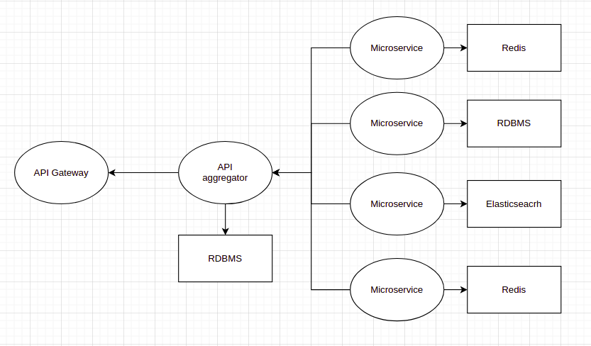

## 확장성

50 유저를 상대로 운영하고 있지만 10만 유저를 상대할때도 문제가 생기지 않게
염두에 두고 수정한다. 하지만 임시방편으로 해결할 때도 있다.
그런 임시방편을 잘 리스트화해서 처리를 잘 해야겠다

단일고장점이 없는 아키텍처라면
새로운 기술을 도입하는 것이 쉽게 될 수 있겠다

hdd로 구축된 서버에서 한대만 ssd로 교체해서 상황을 지켜보고, 문제가 있어도 다른
서버에서 커버할 수 있다면 문제점 파악하는데에 도움이 되겠다

소프트웨어 자체의 에러가 전체에 영향을 미치지 못하도록 하면 다른 것으로 교체하면
그만이라서 관리하기 쉽겠다

3대의 서버를 켜놓고 1대씩 리부팅을 해도 나머지 2대가 있어서 괜찮다면 오래 켜놔서
생기는 문제를 막을 수 있듯이
일부러 1대씩 계속 재부팅되도록 하고, 상태저장이 필요 없도록 하면 os의 문제에서
조금은 자유로워지지 않을까
재부팅하면 캐시가 다시 쌓여야하는 부분은 확인해봐야겠다

3대의 서버를 한 묶음으로 추가 자원이 필요하면 이 묶음이 여러개가 되도록 하면
확장성 문제도 해결되지 않을까?
쿠버네티스에서는 이를 지원해준다

쿠버네티스는 고가용성, 확장성, 배포를 바로 할 수 있게 해줘서 좋다
서버는 필연적으로 고가용성과 확장성과 배포가 필요하다
추가로 모니터링, 로깅도 세트다

#### portable, universal

새로운 기술이나 지식을 얻었을 때 우리의 업무에 바로 적용할 수 있는 자유로움

회사의 상황에 맞추기보다 표준에 맞추는 방향

데이터베이스를 커스터마이징하기보다 어댑터를 이용해 원본은 잘 지켜나가서 새로운
것이 생겼을 때 바로 도입할 수 있는 환경

#### 관리 편한 인프라
- 기본 매커니즘이 단순하고 간결하고 명확한
- 요즘 플러그인 방식
- 간단한 형태를 유지하면서 변화에 유연한 서비스

#### 변하는 것과 변하지 않는 것 :vs:collection:

변하지 않는 것은 없지만 빠르게 변하는 것과 천천히 변하는 것은 나눠져 있다
아키텍처를 구성할 때 천천히 변하는 것을 잘 분리하여 빨리 변하는 것에 더 집중하고
천천히 변하는 것은 잘 유지할 수 있도록 하면 좋겠다

아이폰의 뒷면

#### 소프트웨어는 언제까지 확장되는게 좋을까

무한정 소프트웨어가 비대해지면 관리도 힘들고, 또 그렇게 커질 필요도 없다
네이버에서는 검색 기능은 다른 기능과 분리되어 있고, 팀도 따로 분리되어 있다.
회사 팀 구조도 개발팀을 다른 팀과 분리하는 경우도 있고,
기능별로 개발,디자인,기획을 같은 팀에 구성하는 경우도 있을텐데,
어떤 경우에 어떤 구성이 좋을까

#### 확장 -> 모듈

각 서비스가 많은 트래픽을 감당할 수 있어야 하고,
분산 처리 시스템처럼, 묶였을 때 트래픽 처리가 선형적으로 증가 되야 한다

쉽게 교체할 수 있는 모듈의 형태로 구성되야 한다. 하지만 쉽게 교체할 수 있다는
것이 진리는 아니다.

기능별로 팀이 구성되 있을 때 그 팀에 오래 있던 사람이 나가고 새로운 사람이
들어오면 새로운 사람이 대체하려면 아주 힘들다. 애초에 대체는 안되고 다른 역할이
되겠지만.
메뉴얼이 쌓여있어도 기존 작업을 100% 알 수 없다.
기능별로 집중했기 때문에 깊고 많은 내용이 섞여있고, 그래서 기능적으로
성숙해졌지만 새로운 사람에게는 따라가야 할 길이 멀어진다.
이게 경험의 차이라고 불리워지는 것인 것 같다.
기능별 팀에서의 문제가 아니라 인간세상의 문제였다.

기능의 깊이가 어느정도 깊어지면 다시 분리해야 한다.
근데 사람의 수는 한정적이어서 분리가 안된다

## 모듈

#### module

부피가 아주 커지면 모듈화로 분리하는게 좋다

작은 모듈은 무수히 많이 만들게 허용한다
그 모듈들은 하나의 추상적인 객체가 된다

- 스테이지 서버를 없애는 것

#### 이 세상 모든 것은 연결되어있다

소프트웨어에서도 **종속성**이 없을 수 없다
**의존성**이 항상 필요하다

효율적인 구성으로 족쇄가 되지ㄹ 않아야 한다

그리고 모든 연결은 상호간 약속이 되있어야 소통이 원활해진다
HTTP 프로토콜, ITU 주파수 대역 등의 규약은 제약이 아니라 통신을 원활하게 하기
위한 약속이고, 이를 통해 효과적으로 통신할 수 있게 된다

그룹을 대표하는 대표를 뽑아서 소통하는 것이 인류의 해답 - 간접 민주주의
그룹의 대표가 그룹을 정말로 잘 이해해야 한다. 그것이 현실의 문제점

#### why module is worth

모듈을 안쓰면

- 작은 수정에 많은 업데이트 시간이 걸린다
- 동시에 여러 작업을 하기 어렵다

#### 작은 것으로 쪼개어도 해결되지 않는 문제

세계를 개인의 합이라고 생각할 수 있는데
개인을 안다고 세계를 다 알 수는 없다
개인이 모여 그룹이 되고 그룹이 모여 더 큰 그룹이 되면
개인의 행동양식과는 다른 결과가 나올 수 있다

경제학에서 개인의 경제행위를 연구하는 것만으로는 시장을 다 알 수 없어 거시경제라는 개념이 나왔다
기업은 개인의 판단과 다른 판단을 할 수 있다

작은 단위를 합쳐 크게 만들면 또 다른 변화가 만들어진다

카오스 이론, 복잡계

#### 모듈

집에 살 때 한 부분이 고장났다고 집 전체를 바꿀 수 없는 것처럼 각 부분이 잘 분리되야한다
집에 있는 가구들이나, 집 자체에 결함이 생기면 전체를 고치기보다 부품만 교체하기를 원한다.
라즈베리파이가 100대 있으면, 각 역할별로 나눠져 있어도, 고쳐야하는 요소가 많아져서 번거롭다.

#### 프로젝트를 모듈로 구성

모듈은 한 팀의 인원정도만 사용
기존 데이터 이용 필요시 CQRS를 응용해서 데이터쿼리용 저장소를 이용

도메인의 스펙을 분석해서 적용하는 작업이 계속 될 수 있어야 한다

각 프로젝트마다 모듈로 구성
모듈의 개수는 팀원의 수 정도
기존의 데이터가 필요하면 어떻게 가져오나
CQRS를 응용해서 공통 데이터 저장소를 따로 둔다

람다로 함수들을 만들어서 gcp와 aws에 이중화하고
로컬 서버에서 로드밸런서로 비용안들게 호출하도록 할 수 있을까
호출횟수를 모니터링해서 로드밸런서가 확인하도록

각 세부 폴더에
도메인로직, 데이터, 유닛, api, 외부 함수, 통신 로직를 넣으면
mvc 패턴에서 구현하는 것을 모두 구현할 수 있나?

#### 레고형 아키텍처 :module:

레거시를 계속 쓰려고
모듈화의 좋은 방법이라 생각
응답과 결과의 형태를 통일해서 쉽게 교체가 가능할 것 같다
처음에 완벽한 형태를 짜는 것이 불가능하기 때문에 변화하기 쉬운 형태로 짜놓는다.
공통된 방식을 쓰면 변경이 쉽지 않을까.

#### 데이터 확장 모듈

아이디를 같이 쓰고 추가 데이터를 붙여서 호출할 수 있도록 하면 마이크로서비스에서
데이터형식을 좀 더 자유롭게 쓸 수 있지 않을까

블록들을 모아서 전체를 구성하는 것이 좋다
재사용성이 늘고, 확인할 지점이 적절한 양이다. 작은 문제부터 접근하기 좋다.
근데 블록들이 다 제각각이면 챙겨야하는 지점이 늘어난다.
가져온 블록의 내부가 복잡하면 조치하기 힘들다. 간단한 것들로 많이 붙이면 겉잡을
수 없이 커져서 오히려 하나 하나 확인할 수 없다

점진적으로 변화할 수 있는 데이터 저장소가 있으면, 일단 저장해놓고 점점 살을 붙여
나중에 잘 써먹을 수 있다

지역성의 원리로 캐싱을 하면 이전 작업과 거리가 있는 작업을 하게 되면 캐싱을 새로
해야한다. 이 점을 보완하고 싶다

#### 기능을 잘게 쪼개면 전체를 조망하기 쉬워지지 않을까 :module:

기능이 커지면 분리하는 방식은
새로 접근하는 사람이 기능을 파악하는데는 도움이 될 수 있지만 하나를 파악해도
파악하지 못한 나머지 기능들이 많아서 너무 많아 질리거나 본질에 접근 못한다는
느낌을 받을 수 있겠다.
'그건 내 잔상이다' 의 반복 같은 느낌

#### 포터블은 꼭 필요한 가치인가?

- 모듈화를 하면 포터블한 코드
- 유연성이 확보돼있다

---

## 분산

1인가구, 마이크로 서비스 아키텍처, 블록체인의 탈중앙화가 닮은 것 같다

- 탈중앙화
- 분산화
- 민주주의
- 분산 서비스
- 고가용성
- 마이크로서비스
- 조직 구조도?

확장은 필연적으로 복잡성을 만든다

[[Technology#분산 대 탈중앙화]]

#### 이동통신 시스템이 분산 처리 시스템에서 잘 돌아가고 있는 사례인 것 같다

데이터베이스의 레플리카 기능과 샤딩
일라스틱서치
하둡

#### Multi Processing

분산 시스템의 고민과 비슷한 고민이 멀티 프로세스를 사용하려는 시도에도 있겠다.

MPI라는 인터페이스가 있다.

- https://operatingsystems.tistory.com/entry/High-Performance-Computing-MPI
- http://hpcschool.kr/usc/wp-content/uploads/sites/10/2014/04/MPI.pdf

Apache의 MPM

#### 분산 개발 환경의 해결책으로 ci가 나왔다

분산 서비스간의 통합도 ci 같이 할 수 있을까

일단 데이터를 통합하는 서비스를 이용한다던가

#### 계층적인 것과 분산된 것

중첩
폴더 안에 폴더를 두는 구조는 유용하지만 복잡해져서 별로 안좋은 것 같다
그래서 프로젝트 사이즈도 폴더 중첩이 없는 정도로 나누고 싶은데
그러다보면 작은 덩어리가 많아져서 어디에 무엇이 있는지 모를 수 있겠다
그래서 정돈이 필요한데, 이 정돈을 어떻게 할 수 있을까

트리 구조의 깊이가 깊어지는 것과 넓이가 넓어지는 것은 비슷한 복잡도인가?

넓이가 넓어져서 관리가 힘들 상황을 생각해보면, 놀이터가 넓으면 선생님이 주변에
있는 아이가 아니면 어떤 일이 벌어지는지 알 수 없다

복잡성을 염두에 두고 미리 뼈대를 만들어 놓는 것보다, 작게 분리하는 것이 복잡성을
컨트롤 할 더 나은 방법 같다.
자바의 폴더구조가 처음부터 중첩된 폴더를 미리 만들어 놓는 방식인데, 이런 부분이
거슬린다. 폴더 안에 폴더가 들어가면서 깊어지면 컨트롤이 어려워질 것 같다.

- 근데 go standard layout 에서 cmd 폴더 안에 메인 함수들을 폴더로 구성하게 하는
  것을 추천해서 자바와 비슷한 구조를 베스트 프렉티스로 했다. 복잡한 서비스에서는
  중첩이 최선인가. 3단 중첩은 필요한가

[[About_Development#module]]

#### 마이크로서비스의 해법을 다른 분산 시스템에서 얻고자 한다

전체를 퉁쳐서 하나로 규정하려는게 아니라 기존의 문제점들을 확인하고 어떤 해법들이 있었는지 정보를 얻기 위해서

#### 라즈베리파이

라즈베리파이를 여러 대 두면 라즈베리파이가 하나씩 고장날 때마다 고쳐야 한다는 의미도 된다. 데스크탑 하나만 쓰면 전체가 한번에 관리된다. 물론 라즈베리파이 쪽이 싸게 처리되지만, 100대가 있을 때 매번 고치기는 힘들 것 같다. 대신 라즈베리파이 하나가 고장나도 시스템은 그대로 유지될 수 있다는 장점이 있다.

#### 아키텍처 노하우

- 변하는 것과 변하지 않을 것을 구분하기 위한 나열
- 시나리오 전개
- 완성본을 상상
- 적재적소

#### 알림 시스템 설계

가상 면접 사례로 배우는 대규모 시스템 설계 기초
- 인사이트

10장 알림 시스템 설계

kums의 설계와 매우 유사하게 구성되어있다
신기하다

#### 개발 시작부터 확장의 반복

1. 가장 간단한 실행을 위한 설계
2. 폴더 만들기
   - note
3. 구현해야 하는 것 적고 결과값 적기
   - note/main_test.go
4. 테스트 통과시키기
   - note
     - main.go
     - main_test.go
5. 기능 추가를 위해 설계
6. 파일 추가
7. 반복

그러다가 어느 시점이 되면 아래 정도의 복잡성이 생긴다

note
- logic1
	- main.go
	- data.go
	- adapter.go
- logic2
- api
	- http.go
	- grpc.go
- lib

이런 구조에서 더 복잡성이 필요해지면 분리하기 좋다는 신호다.
그래서 저 코드 구조가 반복되면 확장이 된다.
인프라는 저 구조를 쉽게 컨트롤하도록 구성된다.

인프라 - 서비스 - 데이터의 구조로 한 인프라가 구성되고
이것이 다시 프렉탈로 반복된다

#### A/S, after service

a/s can announce to me that what I missed, and what can I grow.
a/s is just doing the same work. not to be known.
sometimes when before the same work. it is good to evolve knowledge. but cannot control what I want.
it makes me spent time a lot. and annoying.
a/s is need

#### Design First is Good

But, Don't be loose. Quick Response. small thing first

#### 3개의 의견

서로를 견제하며, 지원하고, 공유하는 구조가 좋은 가치를 만들기에
좋은 구조인 것 같다
쿠버네티스를 이렇게 사용할 수 있을까

#### 외부 라이브러리 분리

외부 라이브러리를 분리하려고 하는데, 그러면 폴더 구조가 어떻게 되는거지

```
- cmd
- lib1
- ilb2
- logic1
- logic2
```

이런 식으로 되는 건가

```
- cmd
- logic1
	- lib1
	- lib2
- logic2
	- lib1
	- lib2
```

이것보다는 나은 것 같은데 위의 구조에서 라이브러리와 메인 로직의 구분이 안된다

```
- cmd
- logic1
```

일단 내 로직이 메인이다
cmd에서는 이를 한 눈에 보기 좋게 한다
여기서 이제 라이브러리가 들어간다

```
- cmd
- logic1
	- db_logic
- db
```

이렇게 하면 메인에서 구현에 필요한 것을 db에서 받아서 실행하도록 해야한다

외부 라이브러리가 여러 개 중에 하나를 선택할 수도 있다

```
- cmd
- logic1
	- db_logic
- db
	- redis
	- RDBMS
```

이렇게 하려면 db를 다시 추상화해야한다

...

```
- db
	- redis/
	- RDBMS/
	- db.go
```

근데 이렇게 하면 외부 라이브러리를 구현하는 작업이 다시 되야 되서 별로다

클라이언트 프로그램은 마이크로서비스일 필요 없을 거 같다?

어차피 외부 라이브러리가 이상이 생겨 못쓰게 되면
새로운 라이브러리에 맞게 구현해야한다

그러면 외부 라이브러리 분리는 한 곳에서만 수정하도록 모으는 역할인가?
그렇다면 외부라이브러리 안에 내부 구현을 호출하도록 해도 되겠다.
내 코드에서 외부라이브러리를 호출하던 것을
외부 라이브러리 구현 코드에서 내 코드를 호출하는 것으로
왜냐하면 http를 쓰려다 보니 내 구현에서 http동작을 호출하는 것이 과한 추상화
같았고, 구현하기도 매끄럽지 않았다

메인로직을 서버에서 호출해서 쓰는지
메인로직에서 서버로직을 호출해서 쓰는지 잘 결정해야한다

http 서버가 grpc 클라이언트도 해야한다

#### micro crud

service - crud-service - extension

crud : api <- logic <- library

crud를 해주는 엔드포인트만 나와있고, 내부는 감춰진다
엔드포인트가 정해져있으면, 나머지끼리 통신하는데 이용한다
logic이 api안에 포함되고, logic은 api를 몰라도되고, 외부 라이브러리를 통한
구현도 로직을 모르게 한다. 일방통행

crud 모델을 일반화해서 범용적으로 쓸 수 있도록 하고, extension을 붙여 확장한다
ID, Name, Date, Content, Tag 로 구성하고, Content에 다시 내용을 구겨넣는다.
필요한 곳에서 알아서 쓴다?

#### 마이크로서비스도 인터페이스를 만족하도록 구성하는 것이 좋겠다

우리 회사의 api는 다른 기능이라도 같은 방식으로 동작합니다 라고 알려주면
사용자가 다른 서비스에도 쉽게 접근할 수 있겠다

스테이징 서버 테스트 시 본 서버의 데이터를 그대로 가져오면 너무 사이즈가
커지니까 필요에 따라 기간을 정해서 가져올 수 있도록 구현하면 좋을 것 같다

#### business logic

비즈니스 로직의 함수는 추상적이면 좋겠지만 세부 구현도 비즈니스 로직에 들어가야
한다. 외부 라이브러리에 비즈니스 로직이 안들어가기 때문에.
함수 구현은 추상적으로 하고 test code로 세부를 테스트하면 될까?
세부 구현은 어디서 해야하지?
인터페이스에 추상이 남아있고, 구현은 세부적으로 하면 될까

#### input, logic, output의 구조 (레고 모델)

go-kit, gRPC도 이런 구조로 구성하려고 했다. 이 방법이 먹히는 것 같다.
openfaas도 request, response 구조

레고모듈이 완벽한건 아니지만 괜찮은 모델이다

부족한 부분

- 유기적인 얽힘이 되면 좋겠다

api gateway에서 이걸 처리하고
로직은 json만 대응하도록
로직에서는 내가 필요한 데이터가 있는지 확인하는 발리데이션을 해서 로직 수행

- json으로 입력받아 json으로 출력
- http response로 출력

json으로 필터링 해서 결과값 보내주는 어댑터(플러그인) 만들어서 쓰면 좋겠네

grpc로 이걸 하면 proto 파일에 모델, 함수 적고, 구현파일을 만들면 이런 형태가
만들어 질거 같다.
여기에 grpc gateway를 써서 http로 받을 수 있게 하고, documentation 되는지 확인

api는 연결부위 설계를 잘 해야겠다. input값, output값

- 메인로직을 만들고 컨테이너화해서 배포하면, 사이드카가 api routing해주고,
  데이터 보관하도록 만들고 싶다. 메인로직의 input과 output만 잘 유도하면 될 것
  같은데, fastapi와 python 머신러닝 api화 해주는 서비스가 있던데 확인해봐야겠다.

#### 유한 상태 기계 state machine

input -> output 으로 가는 구조인데
수학적 안정성을 가진 구조

if - else 로 관리하기 힘든 상태관리를 안정적으로 할 수 있게 해준다

오토마타 = 유한 상태 기계

input output 구조가 수학적으로 안정성을 가질 수 있다는 것이다.

#### library

모든 코드를 라이브러리화 하면 각 라이브러리를 호출하는 어댑터를 만들게 되고 너무
비대해진다.
그렇다고 어댑팅 안하면 라이브러리 수정 시 여기 저기서 바꿔야 된다.
그렇다고 라이브러리를 일관된 형태로 유지하자면 그것도 쉽지 않다

```
lib1
- file

source1
- main
- lib1-adapter

source2
- main
- source1-adapter
- lib1-adapter
```

이런 구조가, 라이브러리 변경 시

```
lib1
- file-v2 // 변경

source1
- main
- lib1-adapter // 변경

source2
- main
- source1-adapter
- lib1-adapter // 변경
```

수정이 전체에 영향을 미치면 안된다.

#### 라이브러리를 api 처럼 호출하기

모놀리스에서 다른 모듈 간 데이터 불러올 때 임포트 해서 함수로 호출한다
마이크로서비스에서 api로 호출하는게 일반적이겠지만
임포트 라이브러리를 만들어서 직접 api에 접근하는게 아니라 라이브러리를 통해서 접근하게 하면 전환이 쉬울 것 같다

Product
Purchase

Purchase
Import product
Product = product.getName
Purchase.product = Product

근데 내부 서비스는 외부와 격리되있고
조합해서 호출하는건 별개의 서비스에서 했으면 좋겠다
그러면 호출은 어디서 하지?

메인 함수에 어떤 api 사용하는지 나타내는 방식으로 해서
서버에 올릴 때 메인 함수의 api 응답 시간을 확인만 하면 되도록 하면 좋겠다
프로젝트 메인이 아니라 라이브러리 메인을 체크해야겠다

| api | -- | business logic | -- | data crud
| business logic2 |
| 3 |
| 4 |
| 5 |

이렇게 구성 돼있다면 data crud는 공통 로직으로 쓰는 역할(share library)
비즈니스 로직에서는 api로 crud를 제어한다.
aggregation api를 따로 만든다
data crud는 index단위로 같은 로직으로 여러개를 만든다
grpc로 만들어서 쓴다
컴퓨팅 로직은 서버리스로 배포해서 api로 쓴다
인프라 코드가 각 비즈니스로직을 접근할 수 있도록 사이드카를 장착한다

데이터베이스 crud 서비스로 레포지토리를 모을까?
호출할 때는 어떻게 구분하지?

데이터 불러오는 곳도 각 서비스마다 구현을 해야하는데, db 종류에 상관없이
받아들이는 부분도 있어야하는데.. 그러면 데이터베이스 쪽만 2단계가 되서 마음에
안든다



#### 아키텍처를 만들면서 구체적인 예제를 적으면서 해본다 :행동:

예제가 있어서 내용이 길어지는 부분은 트레이드오프...

#### 한 아키텍처에 너무 많은 것을 넣으려고 하다가 이도저도 아니게 되겠다

처음에 집중할 목표를 잡고 작게 작게 처리해 나가야 하겠다 :행동:

개인이 제작하는 프로그램에는 규모의 한계가 있다
프로토타입 수준의 프로그램이 제작될 따름인데 개인 프로젝트의 의미는 무엇일까?
스스로 기술 발전을 할 수 있다. 기술 발전을 해서 무엇을 하나. 기술 협력을 통해
기술 발전에 기여한다.
회사가 아닌 다른 기술 발전 기여 통로를 만들어야겠다

작은 양의 코드를 수정하는데도 정리가 안되어 무엇을 건드려야 할지 막막해지는
순간이 있었다. 작은 크기로 함수들을 쪼개놓았는데 그 함수들이 여러개가 되다 보니
길을 잃은 것 같다. 어떻게 길을 찾아야 할까

#### 레고식 아키텍처

```go
type Lego struct {
    Name string
    ID string
}

type Request struct {
    content string
}

func Attach(r Request) Lego {
    result := Lego{}
    return result
}
```

입력, 로직, 출력 형태로 함수들(또는 api endpoint)을 제작하면 모듈로 쓰기 좋을 것 같다

일관된 형태를 갖고 있어서 레고처럼 갖다 붙이기 좋을 것 같다

입력과 출력을 모두 json형태로 받으면 유연하게 데이터를 받고 쓸 수 있을 것 같다

이런 형태로 이미 구현되어 있는 것이 gRPC인 것 같다.

언어에도 유연하고, 형태도 명확해서 gRPC 기반으로 개발을 하고, 변형하면 좋을 것 같다

REST로 변경해주는 api도 있다.

gRPC를 이용하되, gRPC에 묶이지 않아야 한다.

```go
// feature.proto
package feature

service Feature {
	rpc GetFeature(Request) returns( Feature) {}
	rpc RecordRoute(stream Request) returns (RouteSummary) {}
}

message Request {
    string content = 1;
}

message Feature {
    int32 id = 1;
    string name = 2;
}

// server.go
import (
    "net"
    "log"
    "context"

    "google.golang.org/grpc"
    pb "github.com/example/feature"
)

type server struct {
    pb.UnimplementedFeatureServer
}

func (s *server) GetFeature(ctx context.Context, request *pb.Request) (*pb.Feature, error) {
    return &pb.Featrure{id: 1, name: "sam"}, nil
}

func main() {
    lis, err := net.Listen("tcp", ":9000")
    s := grpc.NewServer()
    pb.RegisterFeatureServer(s, &server{})
    if err := s.Serve(lis); err != nil {
        log.Fatalf("faield to serve: %v", err)
    }
}

```

```
protoc --
```

이것이 요청을 받아 출력을 해주는 gRPC의 뼈대다.

이것을 매 프로젝트마다 만드는 것은 다소 귀찮은 부분이 있다.

조금 간소화해서 Feature와 메인 로직만 구현하면 되도록 할 필요가 있다.

go의 마이크로서비스 섀시인 micro와 go-kit에서 이를 구현해놨다. ㅋ

awesome grpc에 정보가 모여 있다.

이걸 모델과 로직을 입력해서 결과는 /feature 호출하면 feature를 리턴해주는 api 역할을 해야한다.

필터 역할 하는 api라면

{name:"sam", age:"10"}, {name:"kim", age:"15"} 이라는 값을 입력으로 넣으면

정렬해서 정렬된 값을 리턴해주는 api가 만들어져야 한다
