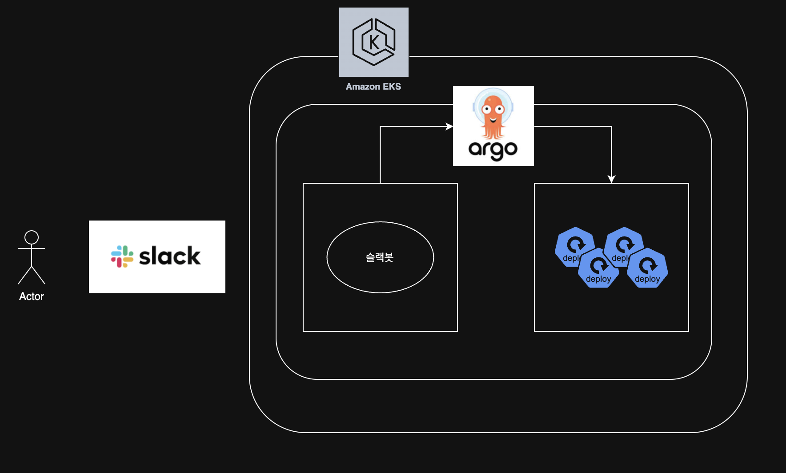
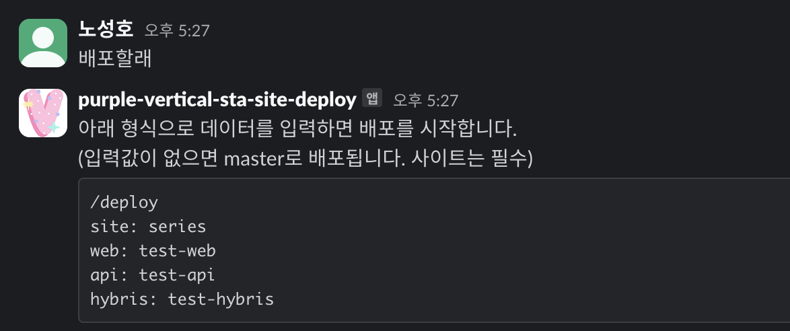
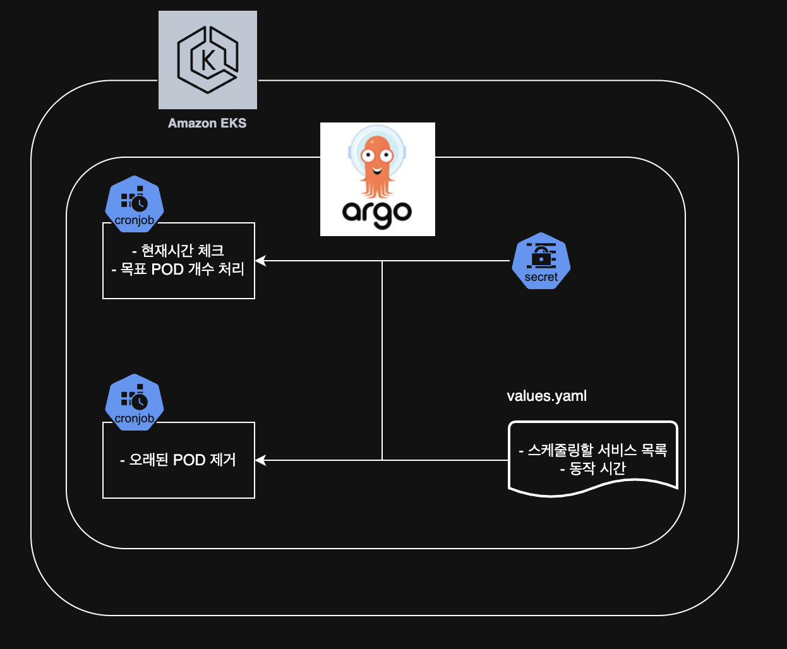

## 인프라

### 운영 및 인프라 관리 업무

- Terraform, Kubernetes Helm 기반 IaC 인프라 구축/배포
- ArgoCD 기반 GitOps 운영
- AWS 클라우드 인프라 구성/운영 관리
- Linux BASH, Python, Node 활용 자동화 관리

### 버티컬 사이트 배포 관리

- **업무 요약**: 신규 버티컬 사이트 추가 시 Route53, CloudFront, Kubernetes 및 ArgoCD 배포 파이프라인 설정
- **배경**
  - 메인몰 외에 브랜드별로 자체 사이트를 원하는 경우가 있습니다
- **작업**
  - ArgoCD를 통해 CD 시스템 구성, GitLab에 설정 파일 관리
  - 설정 파일에서 빌드된 브랜치명을 넣어 배포
  - Helm 차트 세팅으로 ArgoCD 배포본 -> Route53 Ingress 세팅
  - 신규 사이트 추가 시 소스 분기, Route53 도메인 추가, ArgoCD 설정 파일 생성 및 새로운 Kubernetes 배포 생성
- **결과**
  - 신규 버티컬 사이트 IaC로 관리할 수 있는 설정파일 추가
  - Helm 차트 기반의 ArgoCD 배포 및 Route53 Ingress 설정

### 배포봇 개발

### 배포봇 개발

- **업무 요약**: Slack을 통해 한 곳에서 배포할 수 있도록 하는 봇 개발
- **배경**
  - 테스트 배포 시 gitlab의 argocd 설정파일에 브랜치명을 넣어 배포하였음
  - 버티컬 사이트 운영에 필요한 레포지토리가 3개인데 각각의 배포가 필요한 상황
  - 그리고 사이트별로 고정된 테스트서버 1대만 띄워져 있어서 여러명이 동시 테스트하기 어려웠음
- **작업**
  - Slack 커맨드를 처리하는 Node.js 서버 구현
  - 사용자의 배포 요청을 받아 ArgoCD API 호출
  - Slack 봇을 Kubernetes Helm 차트로 패키징
  - 운영중인 ArgoCD 배포환경에 배포하여 통합 운영
- **결과**
  - Slack을 통해 한 곳에서 배포 할 수 있도록 하고, 스테이지용 배포도 제한 없이 인원별로 배포할 수 있게함
  - 작업과정 및 사용방법에 대한 문서 작성 및 개발팀에 공유하여 활성화
  - 다중 스테이지 환경을 자유롭게 배포 가능하도록 변경
  - 운영 중인 ArgoCD 환경에 통합하여 추가적인 권한 관리 필요 없음

### 국가 또는 디바이스 유형 헤더별 콘텐츠 개인화

- **업무 요약**: cloudfront functions의 비용을 계산하고 처리
- **배경**
  - 사이트 접속 시 한국에서 접속하는지 체크해서 특정 사이트로 리다이렉트 시켜주는 동작이 필요했습니다. 이를 구현하는 다양한 방식이 있는데 Cloudfront Functions를 활용 가능한지 점검하고 이에 따른 비용 분석을 수행하여 제안했습니다.
- **비용 계산**
  - 요청당 비용이 들어서 꽤 넉넉한 용량만큼 프리티어로 사용 가능했고 (1TB 전송량/월, 1000만건 요청/월, 함수 200만건/월)
  - 하지만 우리의 트래픽은 대략 시간당 60만 정도에 사용용량이 월 20TB 정도였고 이 자체로만 월 700만원 정도 비용이 예상되는 수치입니다
  - 여기서 functions의 비용은 100만건 호출당 $0.1 정도이고 한달에 4만원 정도의 비용이 나오게 됩니다. 즉 function 하나 추가하는데 월 4만원 정도의 비용이 들게 됩니다.
  - (주의 : 해당 처리량은 운영중인 특정 한 사이트의 대략적인 수치이자 예시일 뿐 실제 환경은 다를 수 있음을 안내드립니다)
- **결과**
  - 이는 서버 사양을 어떻게 관리하느냐에 따라 트레이드오프를 고려하여 cloudfront를 이미 사용하고 있다면 충분히 합리적으로 고려해볼만한 서비스인 것 같습니다.
  - 결과적으로는 해당 기능이 불필요하게 되어 사용하지는 않았지만 cloudfront의 비용과 가능성에 대해 깊게 알게되어 의미있는 경험이었습니다.

### 전사 EKS 버전 업그레이드

- **업무요약**: EKS 버전 일괄 업그레이드
- **배경**
  - 1.20 버전을 사용하고 있었는데 관리 종료 기간이 다가왔고 최신 버전은 1.27버전인 상황이라 한 단계씩 버전업 해야하는 쿠버네티스 특성상 시간이 많이 소요될 것으로 예상되어 최신버전으로 신규로 생성하여 최신버전을 사용하게 하려했고 EKS 상의 문제와 내부 서비스들의 문제들을 마주하게 됨
- **주요 이슈 및 해결 방법**
  - AWS CNI 등 확장 프로그램 생성 중 Timeout 발생
    - 확장 프로그램 버전 업그레이드 및 재설치 진행
  - Ingress 생성 시 LoadBalancer 이름 32글자 제한
  - ArgoCD에서 Kubernetes Namespace를 바꿀 때 ingress가 안지워지면 새로운 ingress가 생성되지 않음
    - Service나 Deployment도 안지워지고 새로운게 뜸
    - 수동으로 재생성 필요 확인
  - Route53 연결 후 인증서 문제로 400 에러 발생
    - ACM 인증서 확인 및 재발급
    - 올바른 Route53 설정 적용 후 DNS 전파 완료 확인
  - ArgoCD 실행 불가 문제
    - ArgoCD 버전 최신화 및 기존 설정 마이그레이션
  - 인바운드 확인
    - 파드 내부에 여러 컨테이너 있는 경우, RDS, 캐시 주소가 여러개인 경우 체크하여 VPC CNI 설정 및 보안 그룹 수정
  - S3 정책 바뀌면서 필요한 설정값 추가됨
    - 필요 설정값 추가 및 정책 수정 후 정상 접근 가능하도록 조치
- **결과**
  - EKS 1.20 -> 1.27 버전 업그레이드 완료 및 운영 안정화
  - 업그레이드 과정에서 발생한 주요 문제 해결 및 재발 방지를 위한 문서화
  - 실제 버전 업그레이드 작업 시에 일어날 수 있는 다양한 문제를 함께 해결하며 EKS에 대한 적응 및 숙련도를 향상시키고 문제 해결을 빠르게 하여 업그레이드 작업을 완료하였습니다.

### 반복 작업 스크립트화

- **배경**
  - 업무 중 반복적으로 수행해야 하는 수작업을 자동화하여 업무 효율성을 높이고 작업 시간을 단축하고자 했습니다. 특히, 매주 수행해야 하는 데이터 변환 작업과 수동으로 처리하던 API 요청을 자동화하는 것이 목표였습니다.
- **주요 작업**
  - 매주 반복해서 엑셀에 있는 양식을 html로 변경해야 하는 작업이 있었고 엑셀 양식은 정해진 틀이 없이 눈으로 파악해야 했습니다. 그래서 이 엑셀을 받으면 csv에 데이터를 정리하고 csv의 내용을 기반으로 html을 만들어주는 스크립트 개발
  - 배송처리 과정에서 오류가 발생해 배송관련 외부시스템에 연동이 제대로 안되는 경우 수동으로 외부시스템 API에 다양한 요청을 해서 배송상태를 변경해주는 작업이었는데 주문번호를 입력하여 API 처리를 한번에 하도록 스크립트 개발
  - 반복적인 작업을 줄이기 위해 가능한 모든 작업을 자동화할 수 있도록 지속 개선하고자 합니다
- **결과**
  - 엑셀 데이터 변환 작업 시간 1/10로 단축하여 업무 생산성 향상
  - 수작업 API 요청 자동화로 배송 오류 복구 시간 대폭 감소
  - 반복 작업 자동화로 팀 전체 업무 부담 감소 및 효율 개선

### 야간 파드 스케줄러

- **배경**
  - 야간 시간에 운영상 필요하지 않은 앱들을 종료시키고 오전에 다시 실행시키는 스케줄러 개발
- **사용한 리소스**
  - argocd, kubernetes cronjob, secret
- **결과**
  - 전체 애플리케이션 150개중 80개 비가동 여부 확인 후 중지 작업 실행
  - 야간에 가동되는 인스턴스를 줄이며 비용 20% 절감

### TraceID 추적 모니터링 화면 구축

- **배경**
  - Grafana, Loki로 TraceID별로 조회할 수 있는 화면 구축
  - 백엔드개발자와 연계하여 TraceID를 로그에 추가하여 이를 조회할 수 있게 대시보드 화면 구축

## 개발

### 쇼핑 컨텐츠 알림 기능 개발

- 코오롱몰의 이벤트, 기획전 같은 컨텐츠를 고객에게 전달하는 작업
- 기존 주문 및 컨텐츠 데이터를 가지고 있는 서버를 람다로 크롤링 후 키네시스로 전달하도록 람다 구축 및 개발
- Serverless framework 를 이용하여 람다 및 키네시스 배포

#### 개요

기획전, 타임딜, 출고/배송, 재입고 에 대한 내용을 사용자에게 알림해주는 기능

- 사용자가 관심브랜드 등록한 브랜드에서 기획전, 타임딜이 새로 나오면 알림을 보내준다
- 구매한 상품의 출고나 배송 상태가 되면 알림을 보내준다
- 재입고 알림 등록한 상품이 재입고가 되면 알림을 보내준다

#### 동작

데이터 조회용 람다와 알림 생성 람다로 크게 이루어져있다

**데이터 조회용 람다**

- kop에서 데이터를 5분마다 조회해서 알림 데이터 형식으로 변환해서 키네시스로 전송한다
- 기획전/타임딜 용
  **알림 생성 람다**
- 키네시스에 데이터가 들어오면 읽어서 쇼핑알림 하수라에 데이터를 적재한다
- 여기를 거쳐서 알림 데이터가 생성된다

**공통**

- 수정 되었을 경우를 고려하여 고객별 알림 데이터가 있으면(userNotification 테이블) 삭제 후 재생성
- 알림 표시되는 기간 30일

#### 설계 고려사항

- 멱등성
  - 중복 데이터를 생성하지 않는다
  - 필요하면 다시 돌리면 해결될 수 있다. (데이터를 지우고 다시 넣기 / 시간은 오래 걸리겠지만?)
- 확장성
  - 알림 데이터가 생성되면 테이블 저장뿐 아니라 푸시 알림이나 SMS, 카카오톡등으로 확장할 수 있게
  - 다양한 알림 타입을 수용할 수 있게
- 성능
  - pull과 push - pull은 쉽지만 느리고 push는 어렵지만 빠르다
  - pull은 select 쿼리를 잘 짜서 필요한 데이터를 조회하는거고 push는 특정 데이터 생성할 때 알림 데이터를 사용자별로 추가로 생성하는 것
  - 현재 상품 연동 / 5분배치 (6분간 수정사항 반영) + 풀 인덱싱

### 쇼핑몰솔루션에 있는 사이트를 사내 시스템으로 마이그레이션

- 쇼핑몰솔루션(아임웹)에 있는 사이트 cms에 데이터(컨텐츠, 게시판 데이터 및 파일자료) 마이그레이션
- 게시판 기능 개발 및 DB 마이그레이션 (nodejs, graphql, hasura)
- 웹 취약점 검사 대응

### 소셜 로그인 개발

- 기존 CRM 시스템을 통해 관리되던 회원 관리 로직에 맞춰 카카오 및 애플 로그인 개발
  - java spring
- 정보보안 가이드 준수 및 서비스 유지관리 작업
  - 관리자 계정 관리
  - 접속 이력 관리
  - 웹 서비스 취약점 대응
  - 정보보안 감사 대응
  - 시스템 개발 배포 이력관리
  - 주기적 백업 및 장애 복구 대응

### 버티컬 사이트 개발

- 버티컬 사이트 개발 - 사이트에 필요한 기능, 고객 대상 이벤트 관련 기능 개발

### 메시지 발송 서비스 신규 개발
