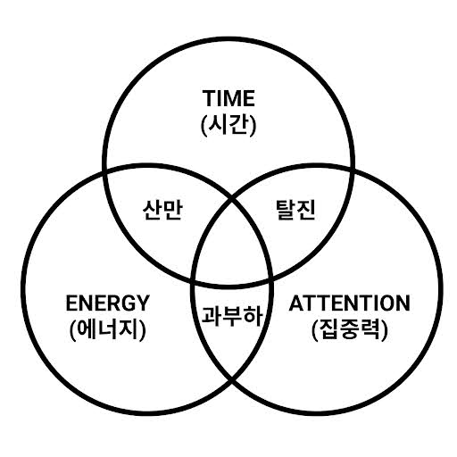

## Life Tracking

행동을 데이터화해서 기록을 남기는 방법 알아보기

## 왜 나는 내 하루를 맨날 까먹을까

하루를 눈으로 보고싶다
- 시스템적 흐름 vs 쉴땐 그냥 자유롭게
- 하루 하루가 의미있고 소중하다는 것을 마음에 둔다. 메멘토모리

## 그래서 뭘 남기기로 했는가

#### quantified self
이런게 있었다
생각하던 데일리 트래킹을 이미 하고 있는 사람들이 있었다
- https://quantifiedself.com/show-and-tell/

#### 류비셰프의 시간 관리법
https://johngrib.github.io/wiki/book-lyubishev/

#### 관리할 포인트를 줄인다
- I want to reduce item that i should have manage something.

#### manage point
- [ ] file, music, source-file
- [X] photo
- [ ] note
- [X] calendar
- [X] reminder
- [X] todo(pomodoro)
- [ ] log(internet)
- [ ] bookmark
- [ ] coding
- [ ] 유튜브
- [ ] 업무노트
- [ ] gpt 질문 목록

- [ ] movie
- [ ] book
- [ ] place, map - google timeline
- [X] money
- [ ] health
- [ ] sleep
- [ ] food
- [ ] walk

- [ ] 클로드
- [ ] 오픈클로
- computer
	- mail
	- docker
	- system resource
	- github

> note specification
> constant
> planning
> archive
> update
> list

> make link each file

todo 등록하면 자동 리마인더
집에 오면 리마인더

## 반대로, 안 남기기로 한 것

#### 측정 제외 항목
- water
- read article
- watch tv

## 기록은 어디에 쌓을까

#### 처리 방법
- note, file, photo -> cloud
- pomodoro -> todo -> note -> cloud
- pdf를 관리하는 것은 플렉슬로 하면 될까
- 저장한 웹페이지 관리 어떻게 하지 -> drive
- 보관을 무슨 기준으로 하지?
- 모두 보관해놓으면 눈에 안띄어서 까먹지 않을까?
- 보관하지 않을 기준은?
- shortcut setting
- news, post, e-book viewer composing

뭘 먹었는지 기록하기에는 사진을 찍는게 제일 간편할 것 같은데
사진으로 하루를 요약하면 한눈에 보기 힘들지 않을까?

현재 구글포토 애플드라이브 크롬북마크 포켓 각앱의 좋아요 노트에 나눠져있는데 노션에 모아보자
왜냐하면 여러 sns와 웹에서 공유가 쉽고 db로 필터와 정렬이 잘돼서

- 구글포토
- 구글드라이브 - 로컬위키폴더, 로컬워킹스페이스
	- 휴대폰폴더
- 구글캘린더
- 지메일
- 깃헙

> every file organize
> - file - onedrive
> - *image - clutter*
> - *photo - google photo*
> - text note - onedrive
> - *todolist - app*
> - *bookmark - google*

사진, 파일, 문서, 북마크
하나의 소스에서 모든 것을 관리하고 싶은데
노션에서 구글드라이브도 되고, 사진도 되고, 텍스트도 되고, 달력도 된다
근데 노트를 연동하거나 블로그 포스트로 바로 올리는 것은 안된다
북마크를 크롬에서 바로 검색할 수는 없다

카테고리를 줄이려니까 또 따로 뺐으면 좋겠는 카테고리가 걸린다
정보탭으로만 구성하려고 했는데, 음식정보, 생활정보, 집정보는 따로 모아서 보고싶어진다

#### daily tracking
누적데이터를 리스트에 적고 옆에 그 날 추가된 것을 표시하는 식으로 해야
추세가 확인되어서 좋을 것 같다
일별로 할까 주별로 할까
데이터 모으는 것은 일별로 하고 주별로 보여주게 하면 좋을까
일단 데이터를 모아야 한다

sleep
- 자고 일어나면 데이터 생성된다
- 수면 완료를 누르면 메시지를 보낸다 (캘린더에 쓴다)
- 메시지를 읽어서 csv에 쓴다
- csv를 읽어서 정리한다
- primenap을 이용해 월말에 csv를 내보내고 화면 캡처를 한다
- csv를 읽어 보고서에 등록한다
- 내 수면 사이클 주기는?

## 모은 기록을 어떻게 읽어야 의미가 생길까

- 최종 파이프라인
	- 목표설정 -> 제한을 두고
		- 에너지 레벨을 확인해서 오늘 할 수 있는 양을 정한다
	- 하루 측정 -> 모으고 측정하고
		- 하루의 활동 로그를 수집하고 모은다
		- 무엇을 했는지 측정하는 것보다 어떤 고민 끝에 무엇을 결정했는지(Context)를 남긴다
	- 결과 확인 -> 정리하고
		- AI에게 질문하라 하고 대답하면서 정리 강화
		- 100 -> 10을 남긴다
	- 쓰레드로 정리 -> 아웃풋
		- 회고로 쓰레드 초안 생성
		- 노트에도 정리
	- 다음날에 적용 -> 피드백 루프
		- 데일리 피드백 시스템 강화

- 분류
	- 시간
	- 장소
	- 분야
	- 온라인/오프라인
	- 의사결정의 성격
		- 전략적, 운영적, 반응적
	- 상호작용의 방향
		- 입력 / 처리/ 출력
	- 시간도 장소도 복합적일 수 있다
- 하루 분류
	- 성과를 내는 시간 / 나를 유지하는 시간 / 여유 있는 시간
	- 성과 시간
		- 투입한 시간 대비 진척 확인
		- 전체 업무 중 핵심 가치를 만든 20%는 무엇이었나
		- 20% 시간 동안 업무 외에 다른 것을 한게 있나
	- 나의 시간
		- 내 에너지가 충분히 회복 되었는가
		- 내 몸과 정신이 너무 복잡하지는 않은가
	- 여유 시간
		- 의도한 휴식이었나 흘려보낸 시간이었나
		- 활동 사이 사이에 버려진 전환 비용이 얼마나 발생했는가
- 오늘 배운 것만 내일로 보내고 나머지는 오늘의 영역에 둔다
	- 배운 것을 쓰레드에 올리는 것까지 되면 최고의 마무리일 거 같은데, 아니면 아침에.
- 오프라인에서의 경험을 노트에 남겨야 하겠다
	- 그리고 노트를 보고 데일리 피드백 시스템이 돌아야겠다
	- 캘린더에 기록하고 캘린더를 읽게 하면 어떨까
	- 잠은 얼마나 잤고 컴퓨터는 얼마나 했고 유튜브는 얼마나 봤는지, 책은 얼마나 읽었고 돈은 얼마나 썼는지, 어디를 갔는지
	- 오늘 찍은 사진
	- 노트에 좀 남겨놓아야겠다. 잠, 책, 돈
- 계속 축적되고 강화되어야할 능력
	- 편집능력
	- 기록능력
	- 메타인지 및 질문능력
	- 점진적 개선 감각
- 결과
	- 삶의 해상도가 높아진다
	- 제한된 환경에서의 삶의 풍요
	- 우아한 질서
- 주간 요약
	- 결정의 후속 판단
		- 그 날의 결정이 뒤에 봤을 때 어땠는지 평가하면서 축적이 된다
	- 점을 모아 선으로
- 월간 요약
- 연간 회고

## 귀찮아서 멈추지 않게 만드는 자동화

phone
- DriveSync, FolderSync 앱을 이용해서 구글드라이브와 연동

오픈클로 자동화

## 기록을 내일의 행동으로 만드는 한 줄 규칙

#### 헤드라인

'완료'가 아니라 '의사결정의 맥락'을 적어보세요. 차이를 비교해 보세요.
- 완료 중심: 결제 버튼 위치를 변경함
- 의사결정 맥락 중심: 영업팀은 상단 배치를 원했으나, 데이터팀은 하단을 주장함. 내가 A/B 테스트를 제안해 3일간 데이터를 모았고, 그 근거로 하단 배치를 관철시킴

나중에 당신을 증명해 주는 것은 '버튼을 바꿨다'는 사실이 아니라, **'갈등 상황에서 데이터 기반으로 의사결정을 조율했다'는 맥락**입니다. 이것이 진짜 성과입니다.

매주 금요일 퇴근 5분 전, 이번 주 업무에 **'신문 기사 헤드라인'** 을 붙여보세요. 상세한 내용은 필요 없습니다. 딱 한 줄이면 됩니다.

예시
- (11월 1주차 헤드라인) 영업팀의 무리한 일정 요구, '기술 부채 리스트'로 방어
- (11월 2주차 헤드라인) 결제 이탈률 10% 감소를 위해, 개발팀과 '3단계 가설'을 수립
- (11월 3주차 헤드라인) 디자인 시안 전면 수정 위기, '우선순위 쳐내기'로 오픈 일정 사수

실전
- 12월 3주차 헤드라인 
	- 코드리뷰나 배포봇이 완성도가 떨어진다고 느껴져 만든 것들 고도화를 시도함

#### 하루 한줄 요약
- 컴퓨터 한 시간
- 움직인 시간
- 장소, 컨디션, 날씨, 사진
    - 20/12/11: 🛌 9.0 💻 6.1 📱 3.1 🥢 2600 🦶 6900 📚 160 🎞️ 1 💵 40,000 🚀 +26
    - 20/12/10: 🛌 9.0 💻 6.1 📱 3.1 🥢 2600 🦶 6900 📚 160 🎞️ 1 💵 40,000 🚀 +26
+ 읽은 책 이름, 영화 제목, 먹은 음식, 작업 내용
+ 이건 노션에 넣고 그래프 만들면 보기 좋겠다
- 캘린더에 기록되면 -> 스프레드시트 또는 노션에 쓰기

#### 캘린더에 넣고 싶은 항목
- 갔던 장소
- 검색 기록
- 일기
- health
- 이벤트
- todo, reminder

## 한 달 해보니 실제로 달라진 것

