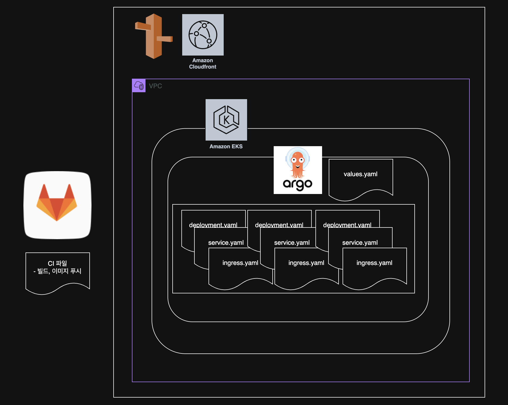
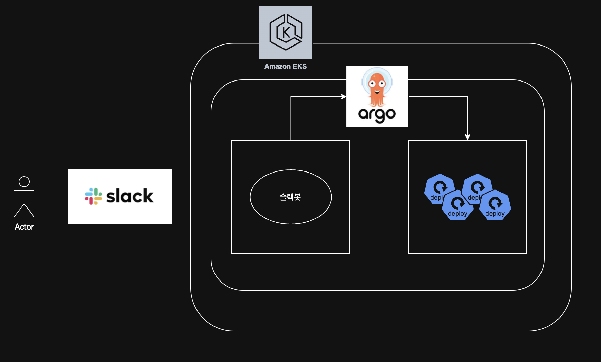
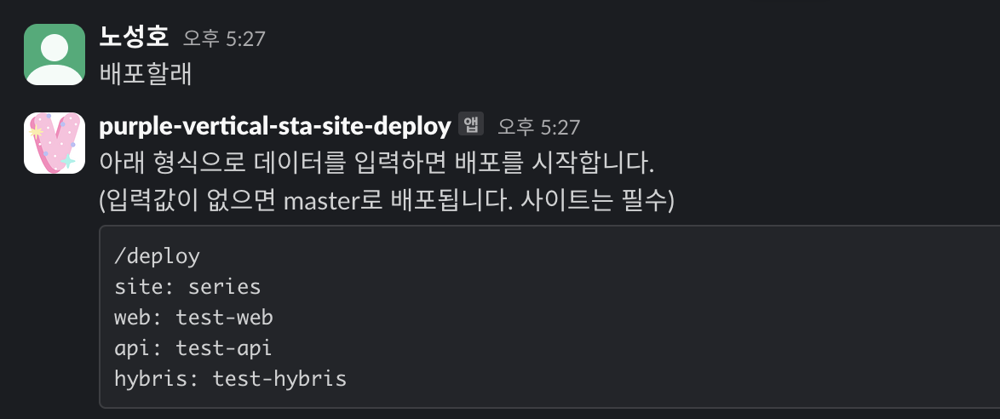
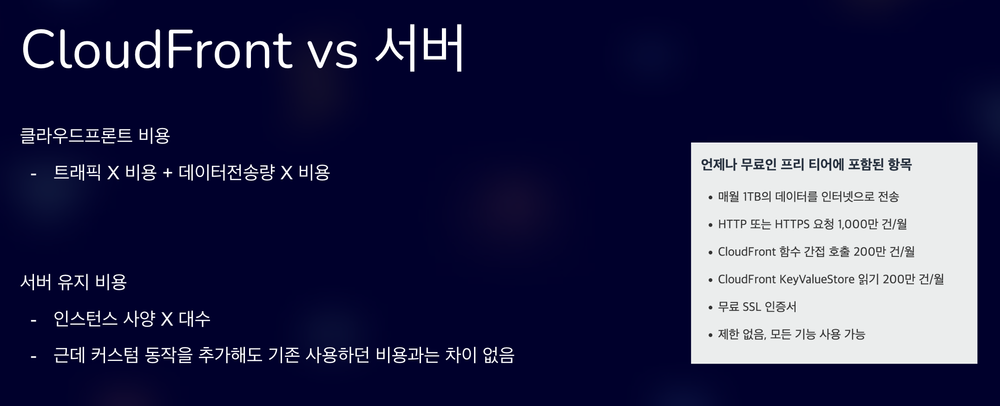
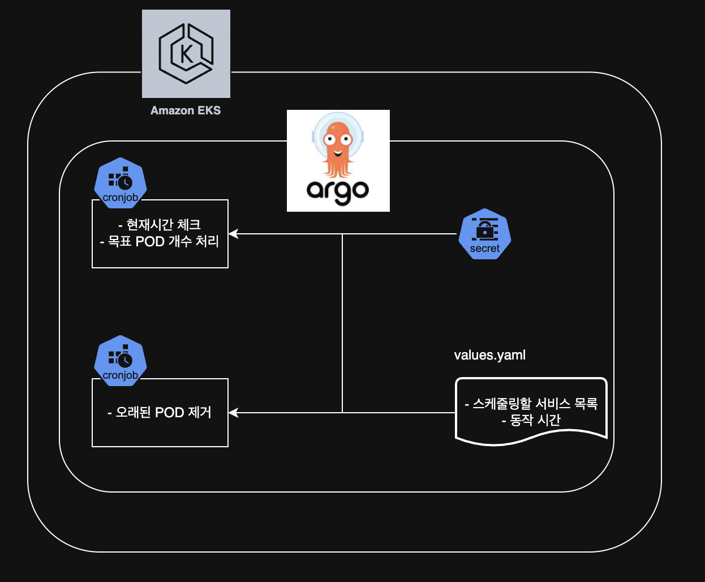
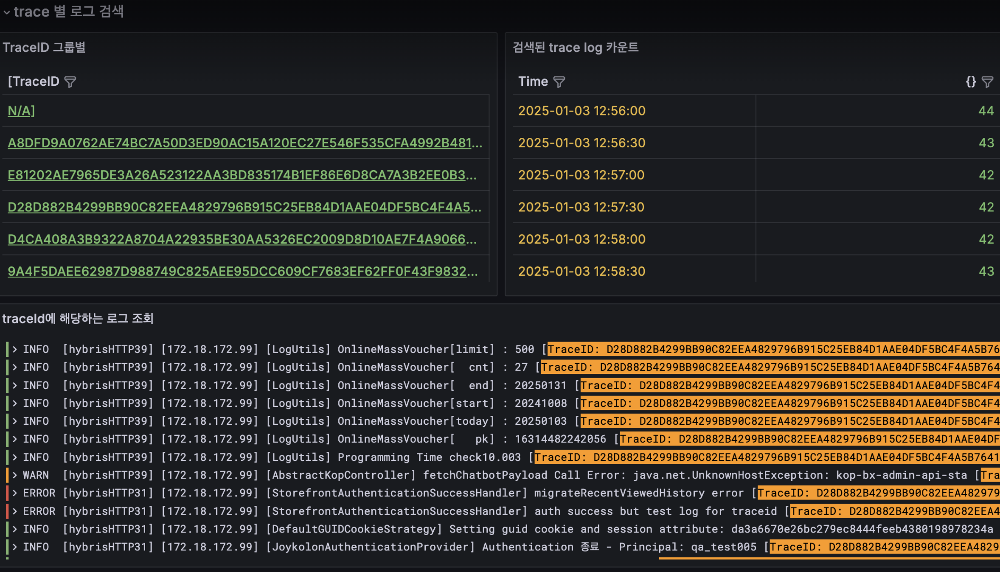

# Experience

## 인프라

#### 버티컬 사이트 배포 관리

- **업무 요약**: 신규 버티컬 사이트 추가 시 Route53, CloudFront, Kubernetes 설정 및 ArgoCD를 통한 배포 파이프라인 설정
- **배경**
  - 메인몰 외에 브랜드별로 자체 사이트를 원하는 경우가 있습니다
- **작업**
  - ArgoCD를 통해 CD 시스템 구성, GitLab에 설정 파일 관리
  - 설정 파일에서 빌드된 브랜치명을 넣어 배포
  - 신규 사이트 추가 시 소스 분기, Route53 도메인 추가, ArgoCD 설정 파일 생성 및 새로운 Kubernetes 배포 생성
- **결과**
  - 신규 버티컬 사이트 IaC로 관리
- **개선 필요한 사항**
  - 신규 버티컬 사이트 추가 작업은 사이트별로 설정파일이 생기게 돼고 사이트별 분기 코드가 생겨서 여러 설정을 건드려야 하는데 이걸 한 곳에서만 수정하면 되도록 하면 좋을 것 같습니다

#### 배포봇 개발

- **업무 요약**: Slack을 통해 한 곳에서 배포할 수 있도록 하는 봇 개발
- **왜 필요하게 되었나**
  - 테스트 배포 시 gitlab의 argocd 설정파일에 브랜치명을 넣어 배포를 하고 있었는램
  - 버티컬 사이트 운영에 필요한 레포지토리가 3개인데 각각 다른 태그의 배포가 필요한 상황
  - 그리고 사이트별로 고정된 테스트서버 1대만 띄워져 있어서 여러명이 동시 테스트하기 어려웠음
- **작업**
  - 채팅에 따른 응답을 하는 nodejs 서버를 만들고
  - 응답은 argocd api를 호출하도록
  - 이걸 kubernetes helm 차트로 감싸서
  - 운영중인 argocd 배포환경에 배포
- **개선사항**
  - slack을 통해 한 곳에서 배포 할 수 있도록 하고, 스테이지용 배포도 제한 없이 인원별로 배포할 수 있게함
  - 작업과정 및 사용방법에 대한 문서 작성하여 공유
- **어떤 아키텍처로 구성되어 있나요**
  - nodejs로 슬랙 커맨드에 따른 응답을 argocd api 실행으로 하도록 했고 argocd에 배포되어있는 동일한 환경에 배포봇도 배포되게 해서 접근 및 관리를 모두 할 수 있도록 했습니다
  - 같은 argocd 환경에 배포를 해놓아서 따로 권한 관리나 연결을 신경 쓰지 않아도 되는 점이 간편해서 좋았습니다

#### 국가 또는 디바이스 유형 헤더별 콘텐츠 개인화

- **업무 요약**: cloudfront functions의 비용을 계산하고 처리
- **배경**
  - 사이트 접속 시 한국에서 접속하는지 체크해서 특정 사이트로 리다이렉트 시켜주는 동작이 필요했고 이를 구현하는 다양한 방식이 있는데 cloudfront로 가능한지 점검하고 이에 따른 비용이 얼마나 드는지 계산하여 제안했고 결과적으로는 해당 기능이 불필요하게 되어 사용하지는 않았지만 cloudfront의 비용과가능성에 대해 깊게 알게 되었습니다
- 비용 계산
  - 요청당 비용이 들어서 꽤 넉넉한 용량만큼 프리티어로 사용 가능했고 (1TB 전송량/월, 1000만건 요청/월, 함수 200만건/월)
  - 하지만 우리의 트래픽은 대략 시간당 60만 정도에 사용용량이 월 20TB 정도였고 이 자체로만 월 700만원 정도 비용이 예상되는 수치입니다
  - 여기서 functions의 비용은 100만건 호출당 $0.1 정도이고 한달에 4만원 정도의 비용이 나오게 됩니다. 즉 function 하나 추가하는데 월 4만원 정도의 비용이 들게 되고 이는 서버 사양을 어떻게 관리하느냐에 따라 트레이드오프를 고려하여 cloudfront를 이미 사용하고 있다면 충분히 합리적으로 비교해볼만한 서비스인 것 같습니다.
  - (주의 : 해당 처리량은 운영중인 특정 한 사이트의 대략적인 수치이자 예시일 뿐 실제 환경은 다를 수 있음을 안내드립니다)

#### 전사 EKS 버전 업그레이드

- **업무요약**: EKS의 버전 단계별 업그레이드
- **배경**
  - 1.20 버전을 사용하고 있었는데 관리 종료 기간이 다가왔고 최신 버전은 1.27버전인 상황이라 한 단계씩 버전업 해야하는 쿠버네티스 특성상 시간이 많이 소요될 것으로 예상되어 관계자들이 모두 붙어 최신버전으로 신규로 생성하여 최신버전을 사용하게 하려했고 EKS 상의 문제와 내부 서비스들의 문제들을 몇 개 마주하게 됨
- **어떤 어려움이 있었나요?**
  - aws cni 등 확장 프로그램 생성 중 timeout 발생 -> 버전 업그레이드
  - ingress 생성 시 lb 이름 32글자 제한
  - argocd에서 kubernetes namespace를 바꿀 때 ingress가 안지워지면 새로운 ingress가 안뜬다. 자동으로 안됨. service나 deployment도 안지워지고 새로운게 뜸
  - route53 연결 해줬는데 인증서가 없는 주소로 연결되서 400 에러남
  - argocd 실행 안됨 -> argocd 버전 업그레이드
  - 인바운드 확인 -> 파드 내부에 여러 컨테이너 있는 경우, RDS, 캐시 주소가 여러개인 경우
  - aws cni에서 ip 할당 안되는 이슈
  - s3 정책 바뀌면서 필요한 설정값 추가됨

#### 반복 작업 스크립트화

- **어떤 작업인가요?**
  - 매주 반복해서 엑셀에 있는 양식을 html로 변경해야 하는 작업이 있었고 엑셀 양식은 정해진 틀이 없이 눈으로 파악해야 했습니다. 그래서 이 엑셀을 받으면 csv에 데이터를 정리하고 csv의 내용을 기반으로 html을 만들어주는 스크립트를 만들어서 작업시간을 단축했습니다
  - 그리고 배송처리 과정에서 오류가 발생해 배송관련 외부시스템에 연동이 제대로 안되는 경우 수동으로 외부시스템 api에 다양한 요청을 해서 배송상태를 변경해주는 작업이었는데 주문번호만 입력하면 api 처리를 한번에 하도록 만들어서 작업시간을 단축했습니다
  - 그 외에도 반복작업이 필요하다면 웬만하면 자동화 할 수 있다고 생각하고 개발할 수 있습니다

#### 야간 파드 스케줄러

- **배경**
  - 야간 시간에 운영상 필요하지 않은 앱들을 종료시키고 오전에 다시 실행시키는 스케줄러를 만들어 비용 절감
- **사용한 리소스**
  - argo cronjob, secret

#### TraceID 추적 모니터링 화면 구축

- grafana, loki를 이용하여 백엔드개발자와 연계하여 TraceID를 로그에 추가하여 TraceID별로 조회할 수 있는 화면 구축
  

## 개발

#### 쇼핑 컨텐츠 알림 기능 개발

- 코오롱몰의 이벤트, 기획전 같은 컨텐츠를 고객에게 전달하는 작업
- 기존 주문 및 컨텐츠 데이터를 가지고 있는 서버를 람다로 크롤링 후 키네시스로 전달하도록 람다 구축 및 개발
- Serverless framework 를 이용하여 람다 및 키네시스 배포

###### 개요

기획전, 타임딜, 출고/배송, 재입고 에 대한 내용을 사용자에게 알림해주는 기능

- 사용자가 관심브랜드 등록한 브랜드에서 기획전, 타임딜이 새로 나오면 알림을 보내준다
- 구매한 상품의 출고나 배송 상태가 되면 알림을 보내준다
- 재입고 알림 등록한 상품이 재입고가 되면 알림을 보내준다

코오롱몰 및 버티컬 사이트 → 마이페이지 (모바일에서만 확인 가능)

###### 동작

데이터 조회용 람다와 알림 생성 람다로 크게 이루어져있다

**데이터 조회용 람다**

- kop에서 데이터를 5분마다 조회해서 알림 데이터 형식으로 변환해서 키네시스로 전송한다
- 기획전/타임딜 용
  **알림 생성 람다**
- 키네시스에 데이터가 들어오면 읽어서 쇼핑알림 하수라에 데이터를 적재한다
- 여기를 거쳐서 알림 데이터가 생성된다

**공통**

- 수정 되었을 경우를 고려하여 고객별 알림 데이터가 있으면(userNotification 테이블) 삭제 후 재생성
- 알림 표시되는 기간 30일

###### 설계 고려사항

- 멱등성
  - 중복 데이터를 생성하지 않는다
  - 필요하면 다시 돌리면 해결될 수 있다. (데이터를 지우고 다시 넣기 / 시간은 오래 걸리겠지만?)
- 확장성
  - 알림 데이터가 생성되면 테이블 저장뿐 아니라 푸시 알림이나 SMS, 카카오톡등으로 확장할 수 있게
  - 다양한 알림 타입을 수용할 수 있게
- 성능
  - pull과 push - pull은 쉽지만 느리고 push는 어렵지만 빠르다
  - pull은 select 쿼리를 잘 짜서 필요한 데이터를 조회하는거고 push는 특정 데이터 생성할 때 알림 데이터를 사용자별로 추가로 생성하는 것
  - 현재 상품 연동 / 5분배치 (6분간 수정사항 반영) + 풀 인덱싱

#### 쇼핑몰솔루션에 있는 사이트를 사내 시스템으로 마이그레이션

- 쇼핑몰솔루션(아임웹)에 있는 사이트 cms에 데이터 마이그레이션 후 nextjs에 화면 개발

#### 소셜 로그인 개발

- 기존 CRM 시스템을 통해 관리되던 회원 관리 로직에 맞춰 카카오 및 애플 로그인 개발
- 정보보안 관리

#### 버티컬 사이트 개발

- 버티컬 사이트 개발 - 사이트에 필요한 기능, 고객 대상 이벤트 관련 기능 개발
